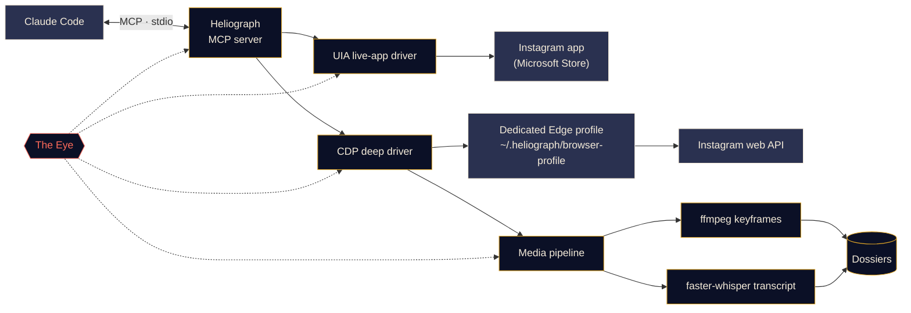

<p align="center">
  
</p>

<p align="center">
  <a href="#quick-start"></a>
  <a href="LICENSE"></a>
  <a href="#platform-support"></a>
  <a href="#mcp-tools"></a>
  <a href="CONTRIBUTING.md#tests"></a>
</p>

<p align="center">
  <b>English</b> ·
  <a href="docs/i18n/README.es.md">Español</a> ·
  <a href="docs/i18n/README.fr.md">Français</a> ·
  <a href="docs/i18n/README.de.md">Deutsch</a> ·
  <a href="docs/i18n/README.pt-BR.md">Português (BR)</a> ·
  <a href="docs/i18n/README.it.md">Italiano</a> ·
  <a href="docs/i18n/README.ru.md">Русский</a> ·
  <a href="docs/i18n/README.tr.md">Türkçe</a> ·
  <a href="docs/i18n/README.ar.md">العربية</a> ·
  <a href="docs/i18n/README.hi.md">हिन्दी</a> ·
  <a href="docs/i18n/README.zh-CN.md">简体中文</a> ·
  <a href="docs/i18n/README.ja.md">日本語</a> ·
  <a href="docs/i18n/README.ko.md">한국어</a>
</p>

---

**Heliograph** links Claude (through [Claude Code](https://docs.anthropic.com/en/docs/claude-code) and an MCP server) to **your own Instagram, on your own device**. Claude can read what you see, work through your saved collections, and turn reels into structured, searchable dossiers — all locally, with you in control of every write action.

> **Why "Heliograph"?** The first photograph ever made was a *heliograph* (Niépce, 1820s). A heliograph is also a signalling device that flashes sunlight across distance with a mirror. A camera and a bridge — which is exactly what this project is.

> [!NOTE]
> **Status: v0.1.0 — early, but working.** Setup, the CLI, the MCP server (41 tools), both drivers and the dossier pipeline are shipped. Reads have been verified live on a real account on Windows 11 (who-am-I, collections, collection posts, search, app badges, status). **Write actions** (like, save, follow, comment, DM…) are implemented and dry-run tested, but **not yet verified against a live account**.

## What it does

- **Lets Claude see and use Instagram the way you do** — in the real installed app, with your real session.
- **Pulls structured data** (saved collections, reel metadata, captions, DMs, media) through a separate, dedicated browser profile you log into once.
- **Turns reels into dossiers** — video, keyframes, a contact sheet, a timestamped transcript and metadata in one folder Claude can read *and look at*.
- **Watches itself** — *the Eye* records every tool call, driver action and subprocess locally, so failures are explainable, by you or by Claude.

## Features

<table>
  <tr>
    <td width="33%" valign="top">
      <h3>Live-app driver</h3>
      Drives the installed Microsoft Store Instagram app through Windows UI Automation: read the screen, navigate, scroll, screenshot, and click or type (with your confirmation). No login step at all.<br><br><sub><b>Available · Windows</b></sub>
    </td>
    <td width="33%" valign="top">
      <h3>Deep driver</h3>
      A dedicated Edge/Chrome profile driven over the Chrome DevTools Protocol, reading Instagram's own web API from inside the page for clean JSON, video URLs and bulk work.<br><br><sub><b>Available</b></sub>
    </td>
    <td width="33%" valign="top">
      <h3>Reel dossiers</h3>
      ffmpeg scene-change keyframes with perceptual de-duplication, a contact sheet and a faster-whisper transcript, bundled into a Markdown dossier per reel.<br><br><sub><b>Available</b></sub>
    </td>
  </tr>
  <tr>
    <td width="33%" valign="top">
      <h3>MCP server</h3>
      41 tools that auto-register with Claude Code via <code>.mcp.json</code> when you open the folder, plus two project skills.<br><br><sub><b>Available</b></sub>
    </td>
    <td width="33%" valign="top">
      <h3>The Eye</h3>
      Local-first tracing: spans, trace IDs, redaction, failure screenshots and DOM snapshots, a live terminal view and reports Claude can read.<br><br><sub><b>Available</b></sub>
    </td>
    <td width="33%" valign="top">
      <h3>Safety rails</h3>
      Write actions dry-run unless confirmed, everything is rate-limited, URLs and downloads are allow-listed, and no password ever passes through Heliograph.<br><br><sub><b>Available · writes not yet live-verified</b></sub>
    </td>
  </tr>
</table>

## Quick start

**You need:** Python 3.11+ (3.12 recommended), [ffmpeg](https://ffmpeg.org/), Microsoft Edge or Google Chrome, [Claude Code](https://docs.anthropic.com/en/docs/claude-code) and, for the live-app driver on Windows, the Instagram app from the Microsoft Store. The setup script installs [uv](https://docs.astral.sh/uv/) for you if it is missing (after asking).

```bash
# 1. Clone
git clone https://github.com/DeanT-04/instagram-bridge-with-claude.git heliograph
cd heliograph

# 2. Run the one-command setup
./scripts/setup.ps1        # Windows (PowerShell)
./scripts/setup.sh         # macOS / Linux

# 3. Sign in to Instagram once, yourself, in Heliograph's own browser window
uv run heliograph login

# 4. Open Claude Code in the folder
claude
```

Claude Code picks up the Heliograph MCP server from `.mcp.json` and asks you to approve it the first time. Setup is safe to re-run; add `--yes` to skip prompts or `--with-whisper` to pre-download the speech model (~500 MB). If anything looks off, run `uv run heliograph doctor`.

## Using it with Claude

Just talk to Claude in the project folder. For example:

- *"Extract every strategy from my 'Trading strats' collection."* — runs the `extract-trading-strategies` skill end to end.
- *"What's new in my DMs and notifications? Summarise, don't reply."*
- *"Open the Instagram app, go to Reels and tell me what's on screen."*
- *"Find the last five posts from @some_creator and draft a comment on the newest one."* — Claude shows you a dry run first; nothing is posted until you say yes.

`CLAUDE.md` gives Claude its operating manual (safety rules, tool families, troubleshooting), and the [`instagram-control`](.claude/skills/instagram-control/SKILL.md) skill teaches it which tool to reach for.

## How it works



<details>
<summary><b>Why two drivers?</b></summary>

<br>

The Microsoft Store Instagram app is an Edge web app running in your normal Edge profile. Recent Edge versions refuse to open a DevTools port on the default profile, so the installed app **cannot** be automated through DevTools. It **is**, however, fully readable and drivable through Windows UI Automation.

| Driver | Target | Strength | Used for |
|---|---|---|---|
| `uia` | The installed Store app window | Your real app and session, zero login | Navigating, reading what's on screen, screenshots, confirmed clicks |
| `cdp` | A dedicated Edge/Chrome profile launched as an app window, DevTools bound to `127.0.0.1` | Structured JSON from Instagram's web API, video URLs, network capture | Saved collections, feeds, DMs, reel metadata, downloads, bulk extraction |

See [docs/ARCHITECTURE.md](docs/ARCHITECTURE.md) for the full design.

</details>

<a id="platform-support"></a>
<details>
<summary><b>Platform support</b></summary>

<br>

| | Windows 10/11 | macOS | Linux |
|---|---|---|---|
| Setup script | Verified | Available (untested) | Available (untested) |
| Deep driver (CDP) & MCP server | Verified | Available (untested) | Available (untested) |
| Media pipeline & dossiers | Available | Available (untested) | Available (untested) |
| The Eye | Available | Available | Available |
| Live-app driver (`app_*` tools) | Verified | Planned | Not applicable |

</details>

<a id="mcp-tools"></a>
## MCP tools

41 tools in seven families. Listing tools take `limit` and `cursor`; pass `next_cursor` back to page on.

<details open>
<summary><b>Tool reference</b></summary>

<br>

| Family | Tool | What it does |
|---|---|---|
| **Status** | `heliograph_status` | Health: OS, Store app, browsers, ffmpeg, login state |
| | `heliograph_setup_check` | What you still need to do before every tool works |
| **Read** | `ig_whoami` | The account logged in to Heliograph's browser profile |
| | `ig_get_user` | Public profile of an account by username |
| | `ig_user_posts` | An account's recent posts and reels |
| | `ig_get_media` | Full details of one post/reel, including caption and media URLs |
| | `ig_comments` | Top-level comments on a post/reel |
| | `ig_search` | Top search: users, hashtags and places |
| | `ig_timeline` | Your home feed |
| | `ig_reels_feed` | The Reels discovery feed |
| | `ig_explore` | Posts from the Explore grid |
| | `ig_inbox` | DM threads with the latest message preview |
| | `ig_thread` | Messages in one DM thread |
| | `ig_activity` | Recent notifications: likes, follows, comments, mentions |
| **Collections** | `ig_list_collections` | Your saved collections |
| | `ig_collection_posts` | Posts in one collection, by name or id |
| | `ig_saved_posts` | All saved posts, newest first |
| **Extract** | `ig_extract_media` | Build (or reuse) a dossier for one post/reel |
| | `ig_extract_collection` | Build dossiers for a collection, in batches |
| | `ig_read_dossier` | Read a dossier's Markdown, transcript and metadata |
| | `ig_view_frames` | Return the contact sheet or keyframes as images Claude can see |
| **Live app** *(Windows)* | `app_open` | Attach to the Instagram app window |
| | `app_snapshot` | Text outline of what's on screen (accessibility tree) |
| | `app_screenshot` | Screenshot of the app window, even when it's behind others |
| | `app_navigate` | Open a section: home, search, explore, reels, messages… |
| | `app_click` | Click an element by ref or name (writes need your confirmation) |
| | `app_scroll` | Scroll by screens (one reel per page in the Reels viewer) |
| | `app_type` | Type into a field (submitting needs your confirmation) |
| | `app_visible_posts` | Posts/reels currently on screen, with their buttons |
| | `app_badges` | Unread counts for messages and notifications |
| **Write** *(confirm-gated)* | `ig_like` / `ig_unlike` | Like or unlike a post/reel |
| | `ig_save` / `ig_unsave` | Save or unsave, optionally in a collection |
| | `ig_follow` / `ig_unfollow` | Follow or unfollow an account |
| | `ig_comment` | Post a comment with the exact text you approved |
| | `ig_send_dm` | Send a DM to a user or an existing thread |
| **Eye** | `eye_report` | Health summary: error rate, slow and failing operations |
| | `eye_trace` | Every step of one tool call, with tracebacks and artifacts |
| | `eye_recent` | The latest events, optionally errors only |

</details>

## Trading reel extraction

A showcase workflow: you save trading reels into an Instagram collection, and Claude turns them into notes you can actually study.

1. You ask Claude: *"Extract every strategy from my 'Trading strats' collection."*
2. Heliograph lists the collection through the deep driver and downloads each reel from Instagram's CDN.
3. The media pipeline pulls scene-change keyframes (charts, setups, annotations), a contact sheet and a timestamped transcript.
4. Claude reads each dossier, **looks at the frames** with `ig_view_frames`, and writes one note per reel — entry rules, exits, risk management, indicator settings, and the claims it could not verify — plus an index.

```text
~/.heliograph/dossiers/<creator>/<code>/
├── meta.json          # author, caption, date, URL, metrics
├── caption.md
├── video.mp4          # or images/NN.jpg for photo posts
├── transcript.json    # timestamped segments + language
├── transcript.md
├── frames/*.jpg       # de-duplicated keyframes (+ frames.json)
├── contact_sheet.jpg  # every keyframe on one image
└── dossier.md         # everything above, stitched for Claude
```

Notes are written to `strategies/` in the project folder, which is git-ignored because it's personal data. You can also build dossiers without Claude: `uv run heliograph extract --collection "Trading strats"`.

> [!CAUTION]
> Heliograph organises what creators say; it does not judge whether they are right. Nothing it produces is financial advice.

## The Eye

*The Eye* is Heliograph's built-in, local-first observability. No external service is needed.

- Every MCP tool call, driver action, HTTP request and ffmpeg/whisper subprocess is recorded as a **span** with a shared `trace_id`, so a single request from Claude can be followed end to end.
- Events go to `~/.heliograph/eye/events.jsonl` (rotating) with an SQLite index for querying.
- **Secrets are redacted before writing** — cookies, `sessionid`, `csrftoken`, auth headers and token-like strings.
- When a UI or browser step fails, a screenshot plus an accessibility/DOM snapshot is saved and linked to the event.
- Every tool error returns a **hint** and a **trace id**; Claude can call `eye_trace` on it to see exactly what went wrong.
- `heliograph eye` shows a live, colour-coded tail with rolling health: error rate, p95 latency, top failing operations. `heliograph eye report` summarises recent errors.
- Optional export to Langfuse when `LANGFUSE_PUBLIC_KEY` / `LANGFUSE_SECRET_KEY` are set (off by default).

## Security & privacy

- **One-time manual login.** You sign in to the dedicated browser profile yourself, once (`heliograph login`). Heliograph never types, stores or logs a password.
- **The live-app driver needs no login** — it uses the Instagram app you are already signed into.
- **Write actions dry-run by default.** Like, follow, comment, DM, save and their reverses return a description of what *would* happen; they only act when called again with `confirm=true`, after you said yes in chat. The same goes for clicking action buttons or submitting text in the live app.
- **Rate limits with jitter** on writes *and* reads, to keep usage human-paced.
- **Local-only data.** Dossiers, logs and the browser profile stay under `~/.heliograph` on your machine, with private file permissions. The DevTools port binds to `127.0.0.1` on a random free port.
- **Strict allow-lists** — only Instagram URLs are accepted, and downloads only come over HTTPS from Instagram's CDN hosts. Path-traversal guards protect the API client and dossier folders.

See [docs/SECURITY.md](docs/SECURITY.md) for the threat model and how to report a vulnerability.

## CLI reference

| Command | What it does | Status |
|---|---|---|
| `heliograph setup` | Checks the environment, offers fixes (Chromium, Store app), optionally pre-downloads Whisper, prints next steps | Available |
| `heliograph doctor` | Detects the Instagram app, Edge/Chrome, ffmpeg, OS and login state (`--json` for raw output) | Available |
| `heliograph login` | Opens the dedicated browser profile so you can sign in once, by hand | Available |
| `heliograph mcp` | Runs the MCP server over stdio (Claude Code starts this for you) | Available |
| `heliograph extract <url>` | Builds a dossier for one reel/post, or `--collection "<name>"` for a whole collection | Available |
| `heliograph eye` | Live tail of the Eye with rolling health | Available |
| `heliograph eye report` | Summary of recent errors and anomalies | Available |

Most commands accept `--account <key>` to use a separate browser profile.

<details>
<summary><b>Project structure</b></summary>

<br>

```text
src/heliograph/
├── cli.py              # Typer CLI entry point
├── commands/           # setup, doctor, login, extract
├── config.py           # settings (env prefix HELIOGRAPH_), paths under ~/.heliograph
├── errors.py           # HeliographError hierarchy
├── detect/             # environment detection: Store app, browsers, ffmpeg, OS
├── drivers/
│   ├── base.py         # InstagramDriver protocol + shared dataclasses
│   ├── uia/            # Windows UI Automation live-app driver
│   └── cdp/            # browser launcher, CDP session, web-API client, rate limits
├── instagram/          # models, service, collections, write actions
├── media/              # allow-listed download, ffmpeg frames, faster-whisper
├── extract/            # reel -> dossier
├── eye/                # the Eye: spans, sinks, redaction, live view, reports
└── mcp/                # FastMCP server, tools_*.py per family, runtime, common
tests/                  # pytest; live tests marked @pytest.mark.live
docs/                   # architecture, security, translations, brand assets
scripts/                # setup.ps1 / setup.sh
.claude/skills/         # extract-trading-strategies, instagram-control
.mcp.json               # registers the MCP server with Claude Code
CLAUDE.md               # operating manual for Claude
```

</details>

## Roadmap

- [x] One-command setup, `.mcp.json` registration and `heliograph login`
- [x] MCP server with read, collection, extract, live-app, write and Eye tools
- [x] `extract-trading-strategies` and `instagram-control` skills
- [ ] Live verification of every write action
- [ ] CI on Windows, macOS and Linux
- [ ] **Multi-account** support in Claude sessions (separate profiles already work via `--account`)
- [ ] **Android** via `adb`
- [ ] **macOS** live-app driver (Accessibility API)

## Contributing

Contributions are welcome — see [CONTRIBUTING.md](CONTRIBUTING.md) and the [Code of Conduct](CODE_OF_CONDUCT.md).

## Disclaimer

Heliograph is an independent open-source project. It is **not affiliated with, endorsed by or sponsored by Instagram or Meta Platforms, Inc.** "Instagram" is a trademark of its owner and is used here only to describe what the software works with. Use Heliograph **only on your own account**, keep usage personal and human-paced, and respect [Instagram's Terms of Use](https://help.instagram.com/581066165581870). You are responsible for how you use it.

## License

[MIT](LICENSE) © 2026 DeanT-04
