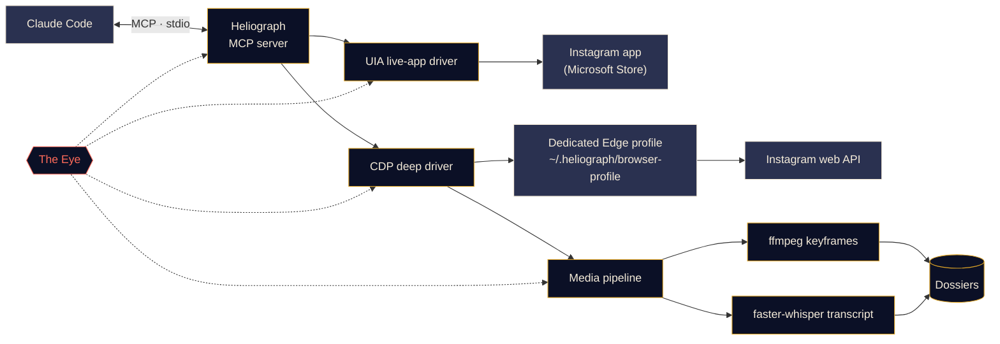

<p align="center">
  
</p>

<p align="center">
  <a href="#quick-start"></a>
  <a href="LICENSE"></a>
  <a href="#platform-support"></a>
  <a href="#how-it-works"></a>
  <a href="CONTRIBUTING.md#tests"></a>
</p>

<p align="center">
  <b>English</b> ·
  <a href="docs/i18n/README.es.md">Español</a> ·
  <a href="docs/i18n/README.fr.md">Français</a> ·
  <a href="docs/i18n/README.de.md">Deutsch</a> ·
  <a href="docs/i18n/README.pt-BR.md">Português (BR)</a> ·
  <a href="docs/i18n/README.it.md">Italiano</a> ·
  <a href="docs/i18n/README.ru.md">Русский</a> ·
  <a href="docs/i18n/README.tr.md">Türkçe</a> ·
  <a href="docs/i18n/README.ar.md">العربية</a> ·
  <a href="docs/i18n/README.hi.md">हिन्दी</a> ·
  <a href="docs/i18n/README.zh-CN.md">简体中文</a> ·
  <a href="docs/i18n/README.ja.md">日本語</a> ·
  <a href="docs/i18n/README.ko.md">한국어</a>
</p>

---

**Heliograph** links Claude (through [Claude Code](https://docs.anthropic.com/en/docs/claude-code) and an MCP server) to **your own Instagram, on your own device**. Claude can read what you see, work through your saved collections, and turn reels into structured, searchable dossiers — all locally, with you in control of every write action.

> **Why "Heliograph"?** The first photograph ever made was a *heliograph* (Niépce, 1820s). A heliograph is also a signalling device that flashes sunlight across distance with a mirror. A camera and a bridge — which is exactly what this project is.

> [!NOTE]
> **Status: early development (v0.1.0).** The architecture is settled and the core modules are being built. Every feature below is labelled **Available**, **In progress** or **Planned** — nothing here is a promise that has not been written yet.

## What it does

- **Lets Claude see and use Instagram the way you do** — in the real installed app, with your real session.
- **Pulls structured data** (saved collections, reel metadata, captions, media) through a separate, dedicated browser profile you log into once.
- **Turns reels into dossiers** — video, keyframes, a timestamped transcript and metadata in one folder Claude can read and reason over.
- **Watches itself** — *the Eye* records every tool call, driver action and subprocess locally, so failures are explainable, by you or by Claude.

## Features

<table>
  <tr>
    <td width="33%" valign="top">
      <h3>Live-app driver</h3>
      Drives the installed Microsoft Store Instagram app through Windows UI Automation: read the screen, navigate, like, save, follow, screenshot. No login step at all.<br><br><sub><b>In progress</b></sub>
    </td>
    <td width="33%" valign="top">
      <h3>Deep driver</h3>
      A dedicated Edge/Chrome profile driven over the Chrome DevTools Protocol, reading Instagram's own web API from inside the page for clean JSON, video URLs and bulk work.<br><br><sub><b>In progress</b></sub>
    </td>
    <td width="33%" valign="top">
      <h3>Reel dossiers</h3>
      ffmpeg scene-change keyframes with perceptual de-duplication plus a faster-whisper transcript, bundled into a Markdown dossier per reel.<br><br><sub><b>In progress</b></sub>
    </td>
  </tr>
  <tr>
    <td width="33%" valign="top">
      <h3>MCP server</h3>
      A FastMCP server that auto-registers with Claude Code via <code>.mcp.json</code> when you open the folder.<br><br><sub><b>In progress</b></sub>
    </td>
    <td width="33%" valign="top">
      <h3>The Eye</h3>
      Local-first tracing: spans, trace IDs, redaction, failure snapshots, a live terminal view and a report Claude can read.<br><br><sub><b>Available (early)</b></sub>
    </td>
    <td width="33%" valign="top">
      <h3>Safety rails</h3>
      Write actions need explicit confirmation, everything is rate-limited, downloads are restricted to Instagram's CDN, and no password ever passes through Heliograph.<br><br><sub><b>In progress</b></sub>
    </td>
  </tr>
</table>

## Quick start

**You need:** Python 3.11+ (3.12 recommended), [uv](https://docs.astral.sh/uv/), [ffmpeg](https://ffmpeg.org/), Microsoft Edge or Google Chrome, [Claude Code](https://docs.anthropic.com/en/docs/claude-code) and, for the live-app driver on Windows, the Instagram app from the Microsoft Store.

```bash
# 1. Clone
git clone https://github.com/DeanT-04/instagram-bridge-with-claude.git heliograph
cd heliograph

# 2. Run the one-command setup
./scripts/setup.ps1        # Windows (PowerShell)
./scripts/setup.sh         # macOS / Linux

# 3. Open Claude Code in the folder
claude
```

Claude Code picks up the Heliograph MCP server from `.mcp.json` and asks you to approve it the first time. Then just ask, for example: *"What's in my saved collection called Trading?"*

> [!IMPORTANT]
> The setup scripts, `.mcp.json` and `heliograph login` are **in progress**. Until they land, you can bootstrap by hand:
>
> ```bash
> uv sync
> uv run heliograph doctor
> ```
>
> `doctor` checks for the Instagram app, Edge/Chrome, ffmpeg and your OS, and tells you what is missing.

## How it works



<details>
<summary><b>Why two drivers?</b></summary>

<br>

The Microsoft Store Instagram app is an Edge web app running in your normal Edge profile. Recent Edge versions refuse to open a DevTools port on the default profile, so the installed app **cannot** be automated through DevTools. It **is**, however, fully readable and drivable through Windows UI Automation.

| Driver | Target | Strength | Used for |
|---|---|---|---|
| `uia` | The installed Store app window | Your real app and session, zero login | Navigating, reading what's on screen, like / save / follow, screenshots |
| `cdp` | A dedicated Edge/Chrome profile launched as an app window, DevTools bound to `127.0.0.1` | Structured JSON from Instagram's web API, video URLs, network capture | Saved collections, reel metadata, downloads, bulk extraction |

Both implement one `InstagramDriver` interface where they overlap. See [docs/ARCHITECTURE.md](docs/ARCHITECTURE.md) for the full design.

</details>

<a id="platform-support"></a>
<details>
<summary><b>Platform support</b></summary>

<br>

| | Windows 10/11 | macOS | Linux |
|---|---|---|---|
| Deep driver (CDP) | In progress | In progress | In progress |
| Media pipeline & dossiers | In progress | In progress | In progress |
| The Eye | Available | Available | Available |
| Live-app driver | In progress (UI Automation) | Planned | Not applicable |

</details>

## Trading reel extraction

A showcase workflow: you save trading reels into an Instagram collection, and Claude turns them into notes you can actually study.

1. You ask Claude: *"Extract the strategies from my saved collection 'Trading'."*
2. Heliograph lists the collection through the deep driver and downloads each reel from Instagram's CDN.
3. The media pipeline pulls scene-change keyframes (charts, setups, annotations) and a timestamped transcript.
4. Each reel becomes a dossier; Claude reads them and writes up the entry rules, exits, risk management and the claims it could not verify.

```text
dossiers/<reel-id>/
├── meta.json          # author, caption, date, URL, metrics
├── video.mp4
├── transcript.json    # timestamped segments
├── transcript.md
├── frames/*.jpg       # de-duplicated keyframes
└── dossier.md         # everything above, stitched for Claude
```

**Status:** dossier builder **in progress**; the `extract-trading-strategies` Claude Code skill is **planned**.

> [!CAUTION]
> Heliograph organises what creators say; it does not judge whether they are right. Nothing it produces is financial advice.

## The Eye

*The Eye* is Heliograph's built-in, local-first observability. No external service is needed.

- Every MCP tool call, driver action, HTTP request and ffmpeg/whisper subprocess is recorded as a **span** with a shared `trace_id`, so a single request from Claude can be followed end to end.
- Events go to `~/.heliograph/eye/events.jsonl` (rotating) with an SQLite index for querying.
- **Secrets are redacted before writing** — cookies, `sessionid`, `csrftoken`, auth headers and token-like strings.
- When a UI or browser step fails, a screenshot plus an accessibility/DOM snapshot is saved and linked to the event *(in progress)*.
- `heliograph eye` shows a live, colour-coded tail with rolling health: error rate, p95 latency, top failing operations.
- `heliograph eye report` — and the MCP tool `eye_report` *(in progress)* — summarises recent errors, so Claude can diagnose problems itself.
- Optional export to Langfuse when `LANGFUSE_PUBLIC_KEY` / `LANGFUSE_SECRET_KEY` are set (off by default).

## Security & privacy

- **One-time manual login.** You sign in to the dedicated browser profile yourself, once. Heliograph never types, stores or logs a password.
- **The live-app driver needs no login** — it uses the Instagram app you are already signed into.
- **Write actions require confirmation.** Like, follow, comment, DM, post and unsave all need an explicit `confirm=True` at the MCP layer, so Claude has to ask you first.
- **Rate limits with jitter** on writes *and* reads, to keep usage human-paced.
- **Local-only data.** Dossiers, logs and the browser profile stay under `~/.heliograph` on your machine. The DevTools port binds to `127.0.0.1` on a random free port.
- **Allow-listed downloads** — only HTTPS from Instagram's CDN hosts.

See [docs/SECURITY.md](docs/SECURITY.md) for the threat model and how to report a vulnerability.

## CLI reference

> This is the **planned interface**. The Status column shows what works today.

| Command | What it does | Status |
|---|---|---|
| `heliograph setup` | Installs dependencies, checks the environment and registers the MCP server | Planned (stub) |
| `heliograph doctor` | Detects the Instagram app, Edge/Chrome, ffmpeg, OS and login state | Available |
| `heliograph login` | Opens the dedicated browser profile so you can sign in once, by hand | Planned (stub) |
| `heliograph mcp` | Runs the MCP server over stdio (Claude Code starts this for you) | Planned (stub) |
| `heliograph extract <url>` | Builds a dossier for one reel or post | Planned (stub) |
| `heliograph eye` | Live tail of the Eye with rolling health | Available |
| `heliograph eye report` | Summary of recent errors and anomalies | Available |

<details>
<summary><b>Project structure</b></summary>

<br>

```text
src/heliograph/
├── cli.py              # Typer CLI
├── config.py           # settings (env prefix HELIOGRAPH_), paths under ~/.heliograph
├── errors.py           # HeliographError hierarchy
├── detect/             # environment detection: Store app, browsers, ffmpeg, OS
├── drivers/
│   ├── base.py         # InstagramDriver protocol + shared dataclasses
│   ├── uia/            # Windows UI Automation live-app driver
│   └── cdp/            # browser launcher, CDP session, web-API client
├── instagram/          # models + high-level service
├── media/              # allow-listed download, ffmpeg frames, faster-whisper
├── extract/            # reel -> dossier
├── eye/                # the Eye: spans, sinks, redaction, live view, reports
└── mcp/                # FastMCP server (in progress)
tests/                  # pytest; live tests marked @pytest.mark.live
docs/                   # architecture, security, translations, brand assets
scripts/                # setup.ps1 / setup.sh (in progress)
.claude/skills/         # Claude Code skills (planned)
.mcp.json               # MCP registration for Claude Code (in progress)
```

</details>

## Roadmap

- [ ] One-command setup, `.mcp.json` registration and `heliograph login`
- [ ] MCP server with read tools, then confirmed write tools
- [ ] `extract-trading-strategies` skill
- [ ] **Multi-account** support (separate profiles and state per account)
- [ ] **Android** via `adb`
- [ ] **macOS** live-app driver (Accessibility API)

## Contributing

Contributions are welcome — see [CONTRIBUTING.md](CONTRIBUTING.md) and the [Code of Conduct](CODE_OF_CONDUCT.md).

## Disclaimer

Heliograph is an independent open-source project. It is **not affiliated with, endorsed by or sponsored by Instagram or Meta Platforms, Inc.** "Instagram" is a trademark of its owner and is used here only to describe what the software works with. Use Heliograph **only on your own account**, keep usage personal and human-paced, and respect [Instagram's Terms of Use](https://help.instagram.com/581066165581870). You are responsible for how you use it.

## License

[MIT](LICENSE) © 2026 DeanT-04
