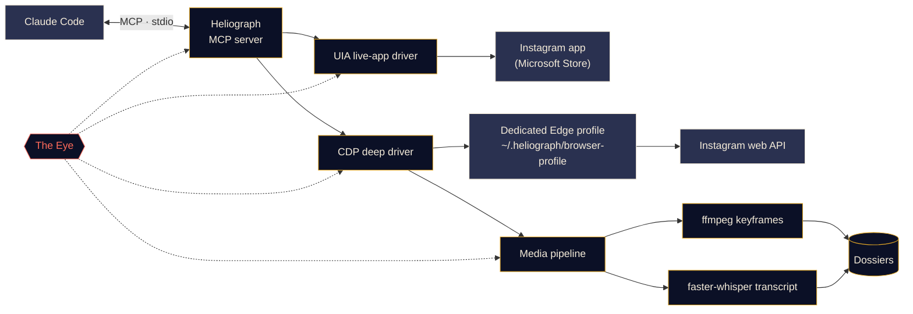

<p align="center">
  
</p>

<p align="center">
  <a href="#quick-start"></a>
  <a href="../../LICENSE"></a>
  <a href="#platform-support"></a>
  <a href="#how-it-works"></a>
  <a href="../../CONTRIBUTING.md#tests"></a>
</p>

<p align="center">
  <a href="../../README.md">English</a> ·
  <a href="README.es.md">Español</a> ·
  <a href="README.fr.md">Français</a> ·
  <a href="README.de.md">Deutsch</a> ·
  <a href="README.pt-BR.md">Português (BR)</a> ·
  <a href="README.it.md">Italiano</a> ·
  <a href="README.ru.md">Русский</a> ·
  <a href="README.tr.md">Türkçe</a> ·
  <b>العربية</b> ·
  <a href="README.hi.md">हिन्दी</a> ·
  <a href="README.zh-CN.md">简体中文</a> ·
  <a href="README.ja.md">日本語</a> ·
  <a href="README.ko.md">한국어</a>
</p>

<div dir="rtl">

> هذه ترجمة. [ملف README الإنجليزي](../../README.md) هو المرجع المعتمد؛ وعند أي اختلاف تُعتمد النسخة الإنجليزية.

---

يربط **Heliograph** بين Claude (عبر [Claude Code](https://docs.anthropic.com/en/docs/claude-code) وخادم MCP) و**حسابك أنت على Instagram، على جهازك أنت**. يستطيع Claude قراءة ما تراه، والمرور على مجموعاتك المحفوظة، وتحويل مقاطع الريلز إلى ملفات منظّمة قابلة للبحث — كل ذلك محليًا، مع بقاء كل إجراء كتابة تحت سيطرتك.

> **لماذا "Heliograph"؟** كانت أول صورة فوتوغرافية في التاريخ *هيليوغرافًا* (نييبس، عشرينيات القرن التاسع عشر). والهيليوغراف أيضًا جهاز إشارات يعكس ومضات ضوء الشمس بمرآة إلى مسافات بعيدة. كاميرا وجسر — وهذا بالضبط ما يمثّله هذا المشروع.

> [!NOTE]
> **الحالة: تطوير مبكر (v0.1.0).** اكتملت ملامح البنية ويجري بناء الوحدات الأساسية. كل ميزة أدناه موسومة بـ **متاح** أو **قيد التطوير** أو **مخطط له** — لا شيء هنا وعدٌ لم يُكتب له كود بعد.

## ماذا يفعل

- **يتيح لـ Claude رؤية Instagram واستخدامه كما تفعل أنت** — داخل التطبيق المثبّت الحقيقي، وبجلستك الحقيقية.
- **يستخرج بيانات منظّمة** (المجموعات المحفوظة، بيانات الريلز الوصفية، التعليقات التوضيحية، الوسائط) عبر ملف تعريف متصفح مخصّص ومستقل تسجّل الدخول إليه مرة واحدة فقط.
- **يحوّل الريلز إلى ملفات** — الفيديو، والإطارات الرئيسية، ونص مفرّغ بطوابع زمنية، والبيانات الوصفية في مجلد واحد يستطيع Claude قراءته وتحليله.
- **يراقب نفسه** — تسجّل *العين* محليًا كل استدعاء أداة وكل إجراء للمشغّلات وكل عملية فرعية، حتى يمكن تفسير الأعطال، سواء بواسطتك أو بواسطة Claude.

## الميزات

<table>
  <tr>
    <td width="33%" valign="top">
      <h3>مشغّل التطبيق المباشر</h3>
      يتحكم في تطبيق Instagram من Microsoft Store عبر Windows UI Automation: قراءة الشاشة، والتنقل، والإعجاب، والحفظ، والمتابعة، والتقاط الشاشة. دون أي خطوة تسجيل دخول.<br><br><sub><b>قيد التطوير</b></sub>
    </td>
    <td width="33%" valign="top">
      <h3>المشغّل العميق</h3>
      ملف تعريف مخصّص لـ Edge/Chrome يُدار عبر Chrome DevTools Protocol، ويقرأ واجهة Instagram البرمجية للويب من داخل الصفحة للحصول على JSON نظيف وروابط الفيديو والمعالجة المجمّعة.<br><br><sub><b>قيد التطوير</b></sub>
    </td>
    <td width="33%" valign="top">
      <h3>ملفات الريلز</h3>
      إطارات رئيسية عند تغيّر المشهد عبر ffmpeg مع إزالة التكرار الإدراكي، إضافة إلى نص مفرّغ بواسطة faster-whisper، مجمّعة في ملف Markdown لكل ريل.<br><br><sub><b>قيد التطوير</b></sub>
    </td>
  </tr>
  <tr>
    <td width="33%" valign="top">
      <h3>خادم MCP</h3>
      خادم FastMCP يسجّل نفسه تلقائيًا في Claude Code عبر <code>.mcp.json</code> عند فتح المجلد.<br><br><sub><b>قيد التطوير</b></sub>
    </td>
    <td width="33%" valign="top">
      <h3>العين</h3>
      تتبّع محلي أولًا: نطاقات (spans)، ومعرّفات تتبّع، وإخفاء للأسرار، ولقطات عند الأعطال، وعرض حيّ في الطرفية، وتقرير يستطيع Claude قراءته.<br><br><sub><b>متاح (مبكر)</b></sub>
    </td>
    <td width="33%" valign="top">
      <h3>ضوابط الأمان</h3>
      إجراءات الكتابة تتطلب تأكيدًا صريحًا، وكل شيء محدود المعدّل، والتنزيلات مقصورة على شبكة CDN الخاصة بـ Instagram، ولا تمرّ أي كلمة مرور عبر Heliograph أبدًا.<br><br><sub><b>قيد التطوير</b></sub>
    </td>
  </tr>
</table>

<a id="quick-start"></a>
## البدء السريع

**تحتاج إلى:** Python 3.11+ (يُنصح بـ 3.12)، و[uv](https://docs.astral.sh/uv/)، و[ffmpeg](https://ffmpeg.org/)، وMicrosoft Edge أو Google Chrome، و[Claude Code](https://docs.anthropic.com/en/docs/claude-code)، ولمشغّل التطبيق المباشر على Windows: تطبيق Instagram من Microsoft Store.

<div dir="ltr">

```bash
# 1. Clone
git clone https://github.com/DeanT-04/instagram-bridge-with-claude.git heliograph
cd heliograph

# 2. Run the one-command setup
./scripts/setup.ps1        # Windows (PowerShell)
./scripts/setup.sh         # macOS / Linux

# 3. Open Claude Code in the folder
claude
```

</div>

يكتشف Claude Code خادم Heliograph عبر `.mcp.json` ويطلب موافقتك في المرة الأولى. بعد ذلك اسأل ببساطة، مثلًا: *"ما الموجود في مجموعتي المحفوظة المسمّاة Trading؟"*

> [!IMPORTANT]
> سكربتات الإعداد و`.mcp.json` و`heliograph login` **قيد التطوير**. وإلى أن تكتمل، يمكنك تجهيز البيئة يدويًا:
>
> ```bash
> uv sync
> uv run heliograph doctor
> ```
>
> يفحص `doctor` وجود تطبيق Instagram وEdge/Chrome وffmpeg ونظام التشغيل، ويخبرك بما ينقص.

<a id="how-it-works"></a>
## كيف يعمل

<div dir="ltr">



</div>

<details>
<summary><b>لماذا مشغّلان؟</b></summary>

<br>

تطبيق Instagram من Microsoft Store هو تطبيق ويب لـ Edge يعمل داخل ملف تعريف Edge العادي لديك. ترفض إصدارات Edge الحديثة فتح منفذ DevTools على ملف التعريف الافتراضي، لذا **لا يمكن** أتمتة التطبيق المثبّت عبر DevTools. لكن **يمكن** قراءته والتحكم فيه بالكامل عبر Windows UI Automation.

| المشغّل | الهدف | نقطة القوة | الاستخدام |
|---|---|---|---|
| `uia` | نافذة تطبيق Store المثبّت | تطبيقك وجلستك الحقيقيان، دون تسجيل دخول | التنقل، وقراءة ما على الشاشة، والإعجاب / الحفظ / المتابعة، ولقطات الشاشة |
| `cdp` | ملف تعريف Edge/Chrome مخصّص يُفتح كنافذة تطبيق، مع ربط DevTools بـ `127.0.0.1` | JSON منظّم من واجهة Instagram البرمجية للويب، وروابط الفيديو، والتقاط الشبكة | المجموعات المحفوظة، وبيانات الريلز الوصفية، والتنزيلات، والاستخراج المجمّع |

يطبّق كلاهما واجهة `InstagramDriver` واحدة حيث تتقاطع وظائفهما. راجع [docs/ARCHITECTURE.md](../ARCHITECTURE.md) للتصميم الكامل.

</details>

<a id="platform-support"></a>
<details>
<summary><b>دعم المنصّات</b></summary>

<br>

| | Windows 10/11 | macOS | Linux |
|---|---|---|---|
| المشغّل العميق (CDP) | قيد التطوير | قيد التطوير | قيد التطوير |
| خط معالجة الوسائط والملفات | قيد التطوير | قيد التطوير | قيد التطوير |
| العين | متاح | متاح | متاح |
| مشغّل التطبيق المباشر | قيد التطوير (UI Automation) | مخطط له | غير منطبق |

</details>

## استخراج ريلز التداول

سير عمل استعراضي: تحفظ ريلز عن التداول في مجموعة على Instagram، فيحوّلها Claude إلى ملاحظات يمكنك دراستها فعلًا.

1. تطلب من Claude: *"استخرج الاستراتيجيات من مجموعتي المحفوظة 'Trading'."*
2. يسرد Heliograph محتويات المجموعة عبر المشغّل العميق وينزّل كل ريل من شبكة CDN الخاصة بـ Instagram.
3. يستخرج خط معالجة الوسائط الإطارات الرئيسية عند تغيّر المشهد (الرسوم البيانية، والإعدادات، والتعليقات التوضيحية) ونصًا مفرّغًا بطوابع زمنية.
4. يتحوّل كل ريل إلى ملف؛ يقرأها Claude ويكتب قواعد الدخول والخروج وإدارة المخاطر والادعاءات التي لم يتمكن من التحقق منها.

<div dir="ltr">

```text
dossiers/<reel-id>/
├── meta.json          # author, caption, date, URL, metrics
├── video.mp4
├── transcript.json    # timestamped segments
├── transcript.md
├── frames/*.jpg       # de-duplicated keyframes
└── dossier.md         # everything above, stitched for Claude
```

</div>

**الحالة:** مولّد الملفات **قيد التطوير**؛ ومهارة Claude Code المسمّاة `extract-trading-strategies` **مخطط لها**.

> [!CAUTION]
> ينظّم Heliograph ما يقوله صنّاع المحتوى، ولا يحكم على صحته. لا شيء مما ينتجه يُعدّ نصيحة مالية.

## العين

*العين* هي نظام المراقبة المدمج في Heliograph، ويعمل محليًا أولًا. لا حاجة إلى أي خدمة خارجية.

- يُسجَّل كل استدعاء لأداة MCP، وكل إجراء للمشغّلات، وكل طلب HTTP، وكل عملية فرعية لـ ffmpeg/whisper بوصفه **نطاقًا (span)** يحمل `trace_id` مشتركًا، بحيث يمكن تتبّع طلب واحد من Claude من بدايته إلى نهايته.
- تُكتب الأحداث في `~/.heliograph/eye/events.jsonl` (مع التدوير) إلى جانب فهرس SQLite للاستعلام.
- **تُخفى الأسرار قبل الكتابة** — ملفات تعريف الارتباط و`sessionid` و`csrftoken` وترويسات المصادقة وأي سلاسل تشبه الرموز المميّزة.
- عند فشل خطوة في الواجهة أو المتصفح، تُحفظ لقطة شاشة ولقطة لشجرة إمكانية الوصول/DOM وتُربطان بالحدث *(قيد التطوير)*.
- يعرض `heliograph eye` سجلًا حيًّا ملوّنًا مع مؤشرات صحة متجددة: معدّل الأخطاء، وزمن الاستجابة p95، والعمليات الأكثر فشلًا.
- يلخّص `heliograph eye report` — وأداة MCP المسمّاة `eye_report` *(قيد التطوير)* — الأخطاء الأخيرة، حتى يتمكن Claude من تشخيص المشكلات بنفسه.
- تصدير اختياري إلى Langfuse عند تعيين `LANGFUSE_PUBLIC_KEY` / `LANGFUSE_SECRET_KEY` (معطّل افتراضيًا).

## الأمان والخصوصية

- **تسجيل دخول يدوي لمرة واحدة.** تسجّل الدخول بنفسك إلى ملف تعريف المتصفح المخصّص، مرة واحدة. لا يكتب Heliograph أي كلمة مرور ولا يخزّنها ولا يسجّلها أبدًا.
- **مشغّل التطبيق المباشر لا يحتاج إلى تسجيل دخول** — فهو يستخدم تطبيق Instagram الذي سجّلت الدخول إليه مسبقًا.
- **إجراءات الكتابة تتطلب تأكيدًا.** الإعجاب والمتابعة والتعليق والرسائل الخاصة والنشر وإلغاء الحفظ كلها تتطلب `confirm=True` صريحًا في طبقة MCP، لذا يجب أن يسألك Claude أولًا.
- **حدود للمعدّل مع تذبذب عشوائي** على الكتابة *والقراءة* معًا، للحفاظ على إيقاع بشري.
- **بيانات محلية فقط.** تبقى الملفات والسجلات وملف تعريف المتصفح ضمن `~/.heliograph` على جهازك. يُربط منفذ DevTools بـ `127.0.0.1` على منفذ حرّ عشوائي.
- **تنزيلات من قائمة مسموح بها** — عبر HTTPS فقط ومن خوادم CDN الخاصة بـ Instagram.

راجع [docs/SECURITY.md](../SECURITY.md) لنموذج التهديدات وطريقة الإبلاغ عن ثغرة.

## مرجع سطر الأوامر

> هذه هي **الواجهة المخطط لها**. يوضّح عمود الحالة ما يعمل اليوم.

| الأمر | الوظيفة | الحالة |
|---|---|---|
| `heliograph setup` | يثبّت الاعتماديات ويفحص البيئة ويسجّل خادم MCP | مخطط له (هيكل مبدئي) |
| `heliograph doctor` | يكتشف تطبيق Instagram وEdge/Chrome وffmpeg ونظام التشغيل وحالة تسجيل الدخول | متاح |
| `heliograph login` | يفتح ملف تعريف المتصفح المخصّص لتسجّل الدخول يدويًا مرة واحدة | مخطط له (هيكل مبدئي) |
| `heliograph mcp` | يشغّل خادم MCP عبر stdio (يبدؤه Claude Code نيابةً عنك) | مخطط له (هيكل مبدئي) |
| `heliograph extract <url>` | ينشئ ملفًا لريل أو منشور واحد | مخطط له (هيكل مبدئي) |
| `heliograph eye` | سجل حيّ للعين مع مؤشرات الصحة | متاح |
| `heliograph eye report` | ملخّص للأخطاء والحالات الشاذة الأخيرة | متاح |

<details>
<summary><b>بنية المشروع</b></summary>

<br>

<div dir="ltr">

```text
src/heliograph/
├── cli.py              # Typer CLI
├── config.py           # settings (env prefix HELIOGRAPH_), paths under ~/.heliograph
├── errors.py           # HeliographError hierarchy
├── detect/             # environment detection: Store app, browsers, ffmpeg, OS
├── drivers/
│   ├── base.py         # InstagramDriver protocol + shared dataclasses
│   ├── uia/            # Windows UI Automation live-app driver
│   └── cdp/            # browser launcher, CDP session, web-API client
├── instagram/          # models + high-level service
├── media/              # allow-listed download, ffmpeg frames, faster-whisper
├── extract/            # reel -> dossier
├── eye/                # the Eye: spans, sinks, redaction, live view, reports
└── mcp/                # FastMCP server (in progress)
tests/                  # pytest; live tests marked @pytest.mark.live
docs/                   # architecture, security, translations, brand assets
scripts/                # setup.ps1 / setup.sh (in progress)
.claude/skills/         # Claude Code skills (planned)
.mcp.json               # MCP registration for Claude Code (in progress)
```

</div>

</details>

## خارطة الطريق

- [ ] إعداد بأمر واحد، والتسجيل عبر `.mcp.json`، و`heliograph login`
- [ ] خادم MCP بأدوات قراءة، ثم أدوات كتابة تتطلب التأكيد
- [ ] مهارة `extract-trading-strategies`
- [ ] دعم **الحسابات المتعددة** (ملف تعريف وحالة منفصلان لكل حساب)
- [ ] **Android** عبر `adb`
- [ ] مشغّل التطبيق المباشر لنظام **macOS** (واجهة إمكانية الوصول)

## المساهمة

المساهمات مرحّب بها — راجع [CONTRIBUTING.md](../../CONTRIBUTING.md) و[مدونة السلوك](../../CODE_OF_CONDUCT.md).

## إخلاء المسؤولية

Heliograph مشروع مستقل مفتوح المصدر. وهو **غير تابع لـ Instagram أو Meta Platforms, Inc.، ولا يحظى بتأييدهما أو رعايتهما.** "Instagram" علامة تجارية لمالكها، وتُستخدم هنا فقط لوصف ما يعمل معه البرنامج. استخدم Heliograph **على حسابك الخاص فقط**، وحافظ على استخدام شخصي وبإيقاع بشري، واحترم [شروط استخدام Instagram](https://help.instagram.com/581066165581870). أنت مسؤول عن طريقة استخدامك له.

## الترخيص

[MIT](../../LICENSE) © 2026 DeanT-04

</div>
