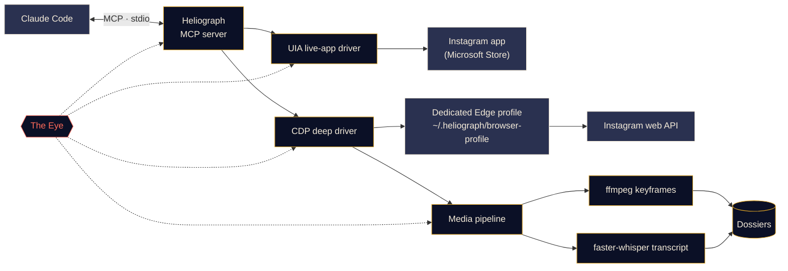

<p align="center">
  
</p>

<p align="center">
  <a href="#quick-start"></a>
  <a href="../../LICENSE"></a>
  <a href="#platform-support"></a>
  <a href="#mcp-tools"></a>
  <a href="../../CONTRIBUTING.md#tests"></a>
</p>

<p align="center">
  <a href="../../README.md">English</a> ·
  <a href="README.es.md">Español</a> ·
  <a href="README.fr.md">Français</a> ·
  <a href="README.de.md">Deutsch</a> ·
  <a href="README.pt-BR.md">Português (BR)</a> ·
  <a href="README.it.md">Italiano</a> ·
  <a href="README.ru.md">Русский</a> ·
  <a href="README.tr.md">Türkçe</a> ·
  <b>العربية</b> ·
  <a href="README.hi.md">हिन्दी</a> ·
  <a href="README.zh-CN.md">简体中文</a> ·
  <a href="README.ja.md">日本語</a> ·
  <a href="README.ko.md">한국어</a>
</p>

<div dir="rtl">

> هذه ترجمة. [ملف README الإنجليزي](../../README.md) هو المرجع المعتمد؛ وعند أي اختلاف تُعتمد النسخة الإنجليزية.

---

يربط **Heliograph** بين Claude (عبر [Claude Code](https://docs.anthropic.com/en/docs/claude-code) وخادم MCP) و**حسابك أنت على Instagram، على جهازك أنت**. يستطيع Claude قراءة ما تراه، والمرور على مجموعاتك المحفوظة، وتحويل مقاطع الريلز إلى ملفات منظّمة قابلة للبحث — كل ذلك محليًا، مع بقاء كل إجراء كتابة تحت سيطرتك.

> **لماذا "Heliograph"؟** كانت أول صورة فوتوغرافية في التاريخ *هيليوغرافًا* (نييبس، عشرينيات القرن التاسع عشر). والهيليوغراف أيضًا جهاز إشارات يعكس ومضات ضوء الشمس بمرآة إلى مسافات بعيدة. كاميرا وجسر — وهذا بالضبط ما يمثّله هذا المشروع.

> [!NOTE]
> **الحالة: v0.1.0 — مبكر، لكنه يعمل.** صدر الإعداد وسطر الأوامر وخادم MCP (41 أداة) والمشغّلان وخط إنتاج الملفات. جرى التحقق من عمليات القراءة مباشرةً على حساب حقيقي في Windows 11 (الحساب الحالي، والمجموعات، ومنشورات مجموعة، والبحث، وشارات التطبيق، والحالة). أمّا **إجراءات الكتابة** (الإعجاب، والحفظ، والمتابعة، والتعليق، والرسائل الخاصة…) فهي منفّذة ومختبرة في وضع المحاكاة، لكن **لم يُتحقق منها بعد على حساب حقيقي**.

## ماذا يفعل

- **يتيح لـ Claude رؤية Instagram واستخدامه كما تفعل أنت** — داخل التطبيق المثبّت الحقيقي، وبجلستك الحقيقية.
- **يستخرج بيانات منظّمة** (المجموعات المحفوظة، بيانات الريلز الوصفية، التعليقات التوضيحية، الرسائل الخاصة، الوسائط) عبر ملف تعريف متصفح مخصّص تسجّل الدخول إليه مرة واحدة فقط.
- **يحوّل الريلز إلى ملفات** — الفيديو، والإطارات الرئيسية، وورقة مصغّرات، ونص مفرّغ بطوابع زمنية، والبيانات الوصفية في مجلد واحد يستطيع Claude قراءته *والنظر إليه*.
- **يراقب نفسه** — تسجّل *العين* محليًا كل استدعاء أداة وكل إجراء للمشغّلات وكل عملية فرعية، حتى يمكن تفسير الأعطال، سواء بواسطتك أو بواسطة Claude.

## الميزات

<table>
  <tr>
    <td width="33%" valign="top">
      <h3>مشغّل التطبيق المباشر</h3>
      يتحكم في تطبيق Instagram من Microsoft Store عبر Windows UI Automation: قراءة الشاشة، والتنقل، والتمرير، والتقاط الشاشة، والنقر أو الكتابة (بتأكيد منك). دون أي خطوة تسجيل دخول.<br><br><sub><b>متاح · Windows</b></sub>
    </td>
    <td width="33%" valign="top">
      <h3>المشغّل العميق</h3>
      ملف تعريف مخصّص لـ Edge/Chrome يُدار عبر Chrome DevTools Protocol، ويقرأ واجهة Instagram البرمجية للويب من داخل الصفحة للحصول على JSON نظيف وروابط الفيديو والمعالجة المجمّعة.<br><br><sub><b>متاح</b></sub>
    </td>
    <td width="33%" valign="top">
      <h3>ملفات الريلز</h3>
      إطارات رئيسية عند تغيّر المشهد عبر ffmpeg مع إزالة التكرار الإدراكي، وورقة مصغّرات، ونص مفرّغ بواسطة faster-whisper، مجمّعة في ملف Markdown لكل ريل.<br><br><sub><b>متاح</b></sub>
    </td>
  </tr>
  <tr>
    <td width="33%" valign="top">
      <h3>خادم MCP</h3>
      41 أداة تُسجَّل تلقائيًا في Claude Code عبر <code>.mcp.json</code> عند فتح المجلد، إضافة إلى مهارتين للمشروع.<br><br><sub><b>متاح</b></sub>
    </td>
    <td width="33%" valign="top">
      <h3>العين</h3>
      تتبّع محلي أولًا: نطاقات (spans)، ومعرّفات تتبّع، وإخفاء للأسرار، ولقطات شاشة وDOM عند الأعطال، وعرض حيّ في الطرفية، وتقارير يستطيع Claude قراءتها.<br><br><sub><b>متاح</b></sub>
    </td>
    <td width="33%" valign="top">
      <h3>ضوابط الأمان</h3>
      إجراءات الكتابة محاكاة فقط ما لم تؤكَّد، وكل شيء محدود المعدّل، والروابط والتنزيلات ضمن قائمة مسموح بها، ولا تمرّ أي كلمة مرور عبر Heliograph أبدًا.<br><br><sub><b>متاح · الكتابة لم يُتحقق منها مباشرةً بعد</b></sub>
    </td>
  </tr>
</table>

<a id="quick-start"></a>
## البدء السريع

**تحتاج إلى:** Python 3.11+ (يُنصح بـ 3.12)، و[ffmpeg](https://ffmpeg.org/)، وMicrosoft Edge أو Google Chrome، و[Claude Code](https://docs.anthropic.com/en/docs/claude-code)، ولمشغّل التطبيق المباشر على Windows: تطبيق Instagram من Microsoft Store. يثبّت سكربت الإعداد أداة [uv](https://docs.astral.sh/uv/) إن لم تكن موجودة (بعد سؤالك).

<div dir="ltr">

```bash
# 1. Clone
git clone https://github.com/DeanT-04/instagram-bridge-with-claude.git heliograph
cd heliograph

# 2. Run the one-command setup
./scripts/setup.ps1        # Windows (PowerShell)
./scripts/setup.sh         # macOS / Linux

# 3. Sign in to Instagram once, yourself, in Heliograph's own browser window
uv run heliograph login

# 4. Open Claude Code in the folder
claude
```

</div>

يكتشف Claude Code خادم Heliograph عبر `.mcp.json` ويطلب موافقتك في المرة الأولى. يمكن إعادة تشغيل الإعداد بأمان؛ أضف `--yes` لتخطي الأسئلة أو `--with-whisper` لتنزيل نموذج الكلام مسبقًا (~500 ميغابايت). إن بدا شيء غير صحيح، شغّل `uv run heliograph doctor`.

## الاستخدام مع Claude

تحدّث ببساطة مع Claude داخل مجلد المشروع. مثلًا:

- *"استخرج كل الاستراتيجيات من مجموعتي 'Trading strats'."* — يشغّل مهارة `extract-trading-strategies` من البداية إلى النهاية.
- *"ما الجديد في رسائلي الخاصة وإشعاراتي؟ لخّص ولا تردّ."*
- *"افتح تطبيق Instagram، واذهب إلى Reels، وأخبرني بما على الشاشة."*
- *"اعثر على آخر خمسة منشورات لـ @some_creator واكتب مسودة تعليق على أحدثها."* — يعرض عليك Claude محاكاة أولًا؛ ولا يُنشر شيء حتى توافق.

يمنح `CLAUDE.md` لـ Claude دليل التشغيل (قواعد الأمان، وعائلات الأدوات، واستكشاف الأخطاء)، وتعلّمه مهارة [`instagram-control`](../../.claude/skills/instagram-control/SKILL.md) أي أداة يستخدم.

<a id="how-it-works"></a>
## كيف يعمل

<div dir="ltr">



</div>

<details>
<summary><b>لماذا مشغّلان؟</b></summary>

<br>

تطبيق Instagram من Microsoft Store هو تطبيق ويب لـ Edge يعمل داخل ملف تعريف Edge العادي لديك. ترفض إصدارات Edge الحديثة فتح منفذ DevTools على ملف التعريف الافتراضي، لذا **لا يمكن** أتمتة التطبيق المثبّت عبر DevTools. لكن **يمكن** قراءته والتحكم فيه بالكامل عبر Windows UI Automation.

| المشغّل | الهدف | نقطة القوة | الاستخدام |
|---|---|---|---|
| `uia` | نافذة تطبيق Store المثبّت | تطبيقك وجلستك الحقيقيان، دون تسجيل دخول | التنقل، وقراءة ما على الشاشة، ولقطات الشاشة، والنقرات المؤكَّدة |
| `cdp` | ملف تعريف Edge/Chrome مخصّص يُفتح كنافذة تطبيق، مع ربط DevTools بـ `127.0.0.1` | JSON منظّم من واجهة Instagram البرمجية للويب، وروابط الفيديو، والتقاط الشبكة | المجموعات المحفوظة، والخلاصات، والرسائل الخاصة، وبيانات الريلز، والتنزيلات، والاستخراج المجمّع |

راجع [docs/ARCHITECTURE.md](../ARCHITECTURE.md) للتصميم الكامل.

</details>

<a id="platform-support"></a>
<details>
<summary><b>دعم المنصّات</b></summary>

<br>

| | Windows 10/11 | macOS | Linux |
|---|---|---|---|
| سكربت الإعداد | تم التحقق | متاح (غير مختبَر) | متاح (غير مختبَر) |
| المشغّل العميق (CDP) وخادم MCP | تم التحقق | متاح (غير مختبَر) | متاح (غير مختبَر) |
| خط معالجة الوسائط والملفات | متاح | متاح (غير مختبَر) | متاح (غير مختبَر) |
| العين | متاح | متاح | متاح |
| مشغّل التطبيق المباشر (أدوات `app_*`) | تم التحقق | مخطط له | غير منطبق |

</details>

<a id="mcp-tools"></a>
## أدوات MCP

41 أداة في سبع عائلات. تقبل أدوات السرد `limit` و`cursor`؛ أعِد `next_cursor` للانتقال إلى الصفحة التالية.

<details open>
<summary><b>مرجع الأدوات</b></summary>

<br>

| العائلة | الأداة | الوظيفة |
|---|---|---|
| **الحالة** | `heliograph_status` | الصحة: نظام التشغيل، وتطبيق Store، والمتصفحات، وffmpeg، وحالة تسجيل الدخول |
| | `heliograph_setup_check` | ما تبقّى عليك فعله لتعمل كل الأدوات |
| **القراءة** | `ig_whoami` | الحساب المسجَّل في ملف تعريف متصفح Heliograph |
| | `ig_get_user` | الملف العام لحساب باسم المستخدم |
| | `ig_user_posts` | أحدث منشورات وريلز حساب ما |
| | `ig_get_media` | كل تفاصيل منشور/ريل، مع التعليق التوضيحي وروابط الوسائط |
| | `ig_comments` | التعليقات الرئيسية على منشور/ريل |
| | `ig_search` | البحث العام: المستخدمون والوسوم والأماكن |
| | `ig_timeline` | خلاصتك الرئيسية |
| | `ig_reels_feed` | خلاصة اكتشاف Reels |
| | `ig_explore` | منشورات من شبكة الاستكشاف |
| | `ig_inbox` | محادثات الرسائل الخاصة مع معاينة آخر رسالة |
| | `ig_thread` | رسائل محادثة خاصة واحدة |
| | `ig_activity` | الإشعارات الأخيرة: إعجابات، ومتابعات، وتعليقات، وإشارات |
| **المجموعات** | `ig_list_collections` | مجموعاتك المحفوظة |
| | `ig_collection_posts` | منشورات مجموعة بالاسم أو المعرّف |
| | `ig_saved_posts` | كل المنشورات المحفوظة، الأحدث أولًا |
| **الاستخراج** | `ig_extract_media` | ينشئ (أو يعيد استخدام) ملفًا لمنشور/ريل |
| | `ig_extract_collection` | ينشئ ملفات لمجموعة على دفعات |
| | `ig_read_dossier` | يقرأ Markdown الملف ونصّه المفرّغ وبياناته الوصفية |
| | `ig_view_frames` | يعيد ورقة المصغّرات أو الإطارات كصور يراها Claude |
| **التطبيق المباشر** *(Windows)* | `app_open` | يتصل بنافذة تطبيق Instagram |
| | `app_snapshot` | مخطط نصي لما على الشاشة (شجرة إمكانية الوصول) |
| | `app_screenshot` | لقطة لنافذة التطبيق حتى لو كانت خلف نوافذ أخرى |
| | `app_navigate` | يفتح قسمًا: الرئيسية، البحث، الاستكشاف، Reels، الرسائل… |
| | `app_click` | ينقر عنصرًا بالمرجع أو الاسم (الكتابة تتطلب تأكيدك) |
| | `app_scroll` | يمرّر شاشةً شاشة (ريل واحد لكل صفحة في عارض Reels) |
| | `app_type` | يكتب في حقل (الإرسال يتطلب تأكيدك) |
| | `app_visible_posts` | المنشورات/الريلز الظاهرة على الشاشة مع أزرارها |
| | `app_badges` | عدد غير المقروء في الرسائل والإشعارات |
| **الكتابة** *(بتأكيد)* | `ig_like` / `ig_unlike` | الإعجاب بمنشور/ريل أو إلغاؤه |
| | `ig_save` / `ig_unsave` | الحفظ أو الإلغاء، اختياريًا ضمن مجموعة |
| | `ig_follow` / `ig_unfollow` | متابعة حساب أو إلغاء متابعته |
| | `ig_comment` | نشر تعليق بالنص نفسه الذي وافقت عليه |
| | `ig_send_dm` | إرسال رسالة خاصة إلى مستخدم أو محادثة قائمة |
| **العين** | `eye_report` | ملخّص الصحة: معدّل الأخطاء، والعمليات البطيئة والفاشلة |
| | `eye_trace` | كل خطوة في استدعاء أداة واحد، مع تتبّعات الأخطاء والملفات الناتجة |
| | `eye_recent` | أحدث الأحداث، اختياريًا الأخطاء فقط |

</details>

## استخراج ريلز التداول

سير عمل استعراضي: تحفظ ريلز عن التداول في مجموعة على Instagram، فيحوّلها Claude إلى ملاحظات يمكنك دراستها فعلًا.

1. تطلب من Claude: *"استخرج كل الاستراتيجيات من مجموعتي 'Trading strats'."*
2. يسرد Heliograph محتويات المجموعة عبر المشغّل العميق وينزّل كل ريل من شبكة CDN الخاصة بـ Instagram.
3. يستخرج خط معالجة الوسائط الإطارات الرئيسية عند تغيّر المشهد (الرسوم البيانية، والإعدادات، والتعليقات التوضيحية)، وورقة مصغّرات، ونصًا مفرّغًا بطوابع زمنية.
4. يقرأ Claude كل ملف، و**ينظر إلى الإطارات** عبر `ig_view_frames`، ويكتب ملاحظة لكل ريل — قواعد الدخول والخروج وإدارة المخاطر وإعدادات المؤشرات والادعاءات التي لم يتمكن من التحقق منها — إضافة إلى فهرس.

<div dir="ltr">

```text
~/.heliograph/dossiers/<creator>/<code>/
├── meta.json          # author, caption, date, URL, metrics
├── caption.md
├── video.mp4          # or images/NN.jpg for photo posts
├── transcript.json    # timestamped segments + language
├── transcript.md
├── frames/*.jpg       # de-duplicated keyframes (+ frames.json)
├── contact_sheet.jpg  # every keyframe on one image
└── dossier.md         # everything above, stitched for Claude
```

</div>

تُكتب الملاحظات في المجلد `strategies/` داخل مجلد المشروع، ويتجاهله git لأنه بيانات شخصية. يمكنك أيضًا إنشاء الملفات دون Claude: `uv run heliograph extract --collection "Trading strats"`.

> [!CAUTION]
> ينظّم Heliograph ما يقوله صنّاع المحتوى، ولا يحكم على صحته. لا شيء مما ينتجه يُعدّ نصيحة مالية.

## العين

*العين* هي نظام المراقبة المدمج في Heliograph، ويعمل محليًا أولًا. لا حاجة إلى أي خدمة خارجية.

- يُسجَّل كل استدعاء لأداة MCP، وكل إجراء للمشغّلات، وكل طلب HTTP، وكل عملية فرعية لـ ffmpeg/whisper بوصفه **نطاقًا (span)** يحمل `trace_id` مشتركًا، بحيث يمكن تتبّع طلب واحد من Claude من بدايته إلى نهايته.
- تُكتب الأحداث في `~/.heliograph/eye/events.jsonl` (مع التدوير) إلى جانب فهرس SQLite للاستعلام.
- **تُخفى الأسرار قبل الكتابة** — ملفات تعريف الارتباط و`sessionid` و`csrftoken` وترويسات المصادقة وأي سلاسل تشبه الرموز المميّزة.
- عند فشل خطوة في الواجهة أو المتصفح، تُحفظ لقطة شاشة ولقطة لشجرة إمكانية الوصول/DOM وتُربطان بالحدث.
- يعيد كل خطأ أداة **تلميحًا** و**معرّف تتبّع**؛ ويستطيع Claude استدعاء `eye_trace` به ليرى بالضبط ما الذي حدث.
- يعرض `heliograph eye` سجلًا حيًّا ملوّنًا مع مؤشرات صحة متجددة: معدّل الأخطاء، وزمن الاستجابة p95، والعمليات الأكثر فشلًا. ويلخّص `heliograph eye report` الأخطاء الأخيرة.
- تصدير اختياري إلى Langfuse عند تعيين `LANGFUSE_PUBLIC_KEY` / `LANGFUSE_SECRET_KEY` (معطّل افتراضيًا).

## الأمان والخصوصية

- **تسجيل دخول يدوي لمرة واحدة.** تسجّل الدخول بنفسك إلى ملف تعريف المتصفح المخصّص، مرة واحدة (`heliograph login`). لا يكتب Heliograph أي كلمة مرور ولا يخزّنها ولا يسجّلها أبدًا.
- **مشغّل التطبيق المباشر لا يحتاج إلى تسجيل دخول** — فهو يستخدم تطبيق Instagram الذي سجّلت الدخول إليه مسبقًا.
- **إجراءات الكتابة محاكاة افتراضيًا.** الإعجاب والمتابعة والتعليق والرسائل الخاصة والحفظ وعكسها تعيد وصفًا لما *سيحدث*؛ ولا تُنفَّذ إلا عند استدعائها مجددًا مع `confirm=true` بعد موافقتك في المحادثة. وينطبق الأمر نفسه على النقر على أزرار الإجراءات أو إرسال نص في التطبيق المباشر.
- **حدود للمعدّل مع تذبذب عشوائي** على الكتابة *والقراءة* معًا، للحفاظ على إيقاع بشري.
- **بيانات محلية فقط.** تبقى الملفات والسجلات وملف تعريف المتصفح ضمن `~/.heliograph` على جهازك بصلاحيات ملفات خاصة. يُربط منفذ DevTools بـ `127.0.0.1` على منفذ حرّ عشوائي.
- **قوائم سماح صارمة** — لا تُقبل إلا روابط Instagram، ولا تأتي التنزيلات إلا عبر HTTPS من خوادم CDN الخاصة بـ Instagram. وتحمي ضوابط منع اجتياز المسارات عميلَ الواجهة البرمجية ومجلدات الملفات.

راجع [docs/SECURITY.md](../SECURITY.md) لنموذج التهديدات وطريقة الإبلاغ عن ثغرة.

## مرجع سطر الأوامر

| الأمر | الوظيفة | الحالة |
|---|---|---|
| `heliograph setup` | يفحص البيئة، ويقترح حلولًا (Chromium، تطبيق Store)، وينزّل Whisper مسبقًا اختياريًا، ويعرض الخطوات التالية | متاح |
| `heliograph doctor` | يكتشف تطبيق Instagram وEdge/Chrome وffmpeg ونظام التشغيل وحالة تسجيل الدخول (`--json` للمخرجات الخام) | متاح |
| `heliograph login` | يفتح ملف تعريف المتصفح المخصّص لتسجّل الدخول يدويًا مرة واحدة | متاح |
| `heliograph mcp` | يشغّل خادم MCP عبر stdio (يبدؤه Claude Code نيابةً عنك) | متاح |
| `heliograph extract <url>` | ينشئ ملفًا لريل/منشور واحد، أو لمجموعة كاملة مع `--collection "<الاسم>"` | متاح |
| `heliograph eye` | سجل حيّ للعين مع مؤشرات الصحة | متاح |
| `heliograph eye report` | ملخّص للأخطاء والحالات الشاذة الأخيرة | متاح |

تقبل معظم الأوامر `--account <مفتاح>` لاستخدام ملف تعريف متصفح منفصل.

<details>
<summary><b>بنية المشروع</b></summary>

<br>

<div dir="ltr">

```text
src/heliograph/
├── cli.py              # Typer CLI entry point
├── commands/           # setup, doctor, login, extract
├── config.py           # settings (env prefix HELIOGRAPH_), paths under ~/.heliograph
├── errors.py           # HeliographError hierarchy
├── detect/             # environment detection: Store app, browsers, ffmpeg, OS
├── drivers/
│   ├── base.py         # InstagramDriver protocol + shared dataclasses
│   ├── uia/            # Windows UI Automation live-app driver
│   └── cdp/            # browser launcher, CDP session, web-API client, rate limits
├── instagram/          # models, service, collections, write actions
├── media/              # allow-listed download, ffmpeg frames, faster-whisper
├── extract/            # reel -> dossier
├── eye/                # the Eye: spans, sinks, redaction, live view, reports
└── mcp/                # FastMCP server, tools_*.py per family, runtime, common
tests/                  # pytest; live tests marked @pytest.mark.live
docs/                   # architecture, security, translations, brand assets
scripts/                # setup.ps1 / setup.sh
.claude/skills/         # extract-trading-strategies, instagram-control
.mcp.json               # registers the MCP server with Claude Code
CLAUDE.md               # operating manual for Claude
```

</div>

</details>

## خارطة الطريق

- [x] إعداد بأمر واحد، والتسجيل عبر `.mcp.json`، و`heliograph login`
- [x] خادم MCP بأدوات القراءة والمجموعات والاستخراج والتطبيق المباشر والكتابة والعين
- [x] مهارتا `extract-trading-strategies` و`instagram-control`
- [ ] التحقق المباشر من كل إجراء كتابة
- [ ] تكامل مستمر (CI) على Windows وmacOS وLinux
- [ ] دعم **الحسابات المتعددة** في جلسات Claude (ملفات التعريف المنفصلة تعمل بالفعل عبر `--account`)
- [ ] **Android** عبر `adb`
- [ ] مشغّل التطبيق المباشر لنظام **macOS** (واجهة إمكانية الوصول)

## المساهمة

المساهمات مرحّب بها — راجع [CONTRIBUTING.md](../../CONTRIBUTING.md) و[مدونة السلوك](../../CODE_OF_CONDUCT.md).

## إخلاء المسؤولية

Heliograph مشروع مستقل مفتوح المصدر. وهو **غير تابع لـ Instagram أو Meta Platforms, Inc.، ولا يحظى بتأييدهما أو رعايتهما.** "Instagram" علامة تجارية لمالكها، وتُستخدم هنا فقط لوصف ما يعمل معه البرنامج. استخدم Heliograph **على حسابك الخاص فقط**، وحافظ على استخدام شخصي وبإيقاع بشري، واحترم [شروط استخدام Instagram](https://help.instagram.com/581066165581870). أنت مسؤول عن طريقة استخدامك له.

## الترخيص

[MIT](../../LICENSE) © 2026 DeanT-04

</div>
