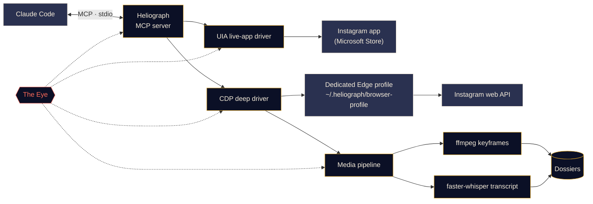

<p align="center">
  
</p>

<p align="center">
  <a href="#quick-start"></a>
  <a href="../../LICENSE"></a>
  <a href="#platform-support"></a>
  <a href="#mcp-tools"></a>
  <a href="https://github.com/DeanT-04/instagram-bridge-with-claude/actions/workflows/ci.yml"></a>
</p>

<p align="center">
  <a href="../../README.md">English</a> ·
  <a href="README.es.md">Español</a> ·
  <a href="README.fr.md">Français</a> ·
  <b>Deutsch</b> ·
  <a href="README.pt-BR.md">Português (BR)</a> ·
  <a href="README.it.md">Italiano</a> ·
  <a href="README.ru.md">Русский</a> ·
  <a href="README.tr.md">Türkçe</a> ·
  <a href="README.ar.md">العربية</a> ·
  <a href="README.hi.md">हिन्दी</a> ·
  <a href="README.zh-CN.md">简体中文</a> ·
  <a href="README.ja.md">日本語</a> ·
  <a href="README.ko.md">한국어</a>
</p>

> Dies ist eine Übersetzung. Maßgeblich ist die [englische README](../../README.md); bei Abweichungen gilt die englische Fassung.

---

**Heliograph** verbindet Claude (über [Claude Code](https://docs.anthropic.com/en/docs/claude-code) und einen MCP-Server) mit **deinem eigenen Instagram auf deinem eigenen Gerät**. Claude kann lesen, was du siehst, deine gespeicherten Sammlungen durcharbeiten und Reels in strukturierte, durchsuchbare Dossiers verwandeln — alles lokal, und jede schreibende Aktion bleibt unter deiner Kontrolle.

> **Warum „Heliograph“?** Die allererste Fotografie war eine *Heliografie* (Niépce, 1820er-Jahre). Ein Heliograph ist außerdem ein Signalgerät, das mit einem Spiegel Sonnenlicht über weite Entfernungen blitzen lässt. Eine Kamera und eine Brücke — genau das ist dieses Projekt.

> [!NOTE]
> **Status: v0.1.0 — früh, aber funktionsfähig.** Setup, CLI, MCP-Server (41 Tools), beide Treiber und die Dossier-Pipeline sind ausgeliefert. Lesezugriffe wurden live mit einem echten Konto unter Windows 11 geprüft (angemeldetes Konto, Sammlungen, Beiträge einer Sammlung, Suche, App-Badges, Status). **Schreibende Aktionen** (liken, speichern, folgen, kommentieren, DM …) sind implementiert und im Probelauf getestet, aber **noch nicht mit einem echten Konto verifiziert**.

## Was es kann

- **Lässt Claude Instagram so sehen und nutzen wie du** — in der echten installierten App, mit deiner echten Sitzung.
- **Holt strukturierte Daten** (gespeicherte Sammlungen, Reel-Metadaten, Bildunterschriften, DMs, Medien) über ein eigenes Browserprofil, in das du dich einmal einloggst.
- **Macht aus Reels Dossiers** — Video, Keyframes, ein Kontaktabzug, ein Transkript mit Zeitstempeln und Metadaten in einem Ordner, den Claude lesen *und ansehen* kann.
- **Überwacht sich selbst** — *das Auge* protokolliert jeden Tool-Aufruf, jede Treiberaktion und jeden Unterprozess lokal, damit sich Fehler erklären lassen, von dir oder von Claude.

## Funktionen

<table>
  <tr>
    <td width="33%" valign="top">
      <h3>Live-App-Treiber</h3>
      Steuert die Instagram-App aus dem Microsoft Store über Windows UI Automation: Bildschirm lesen, navigieren, scrollen, Screenshots, klicken oder tippen (mit deiner Bestätigung). Ganz ohne Login-Schritt.<br><br><sub><b>Verfügbar · Windows</b></sub>
    </td>
    <td width="33%" valign="top">
      <h3>Tiefen-Treiber</h3>
      Ein eigenes Edge/Chrome-Profil, gesteuert über das Chrome DevTools Protocol, das Instagrams eigene Web-API aus der Seite heraus liest — für sauberes JSON, Video-URLs und Massenverarbeitung.<br><br><sub><b>Verfügbar</b></sub>
    </td>
    <td width="33%" valign="top">
      <h3>Reel-Dossiers</h3>
      Keyframes bei Szenenwechseln per ffmpeg mit perzeptueller Deduplizierung, ein Kontaktabzug und ein faster-whisper-Transkript, gebündelt zu einem Markdown-Dossier pro Reel. Text auf dem Bildschirm wird per OCR gelesen, nicht-englische Sprache erhält zusätzlich eine englische Übersetzung, und kleine Chart-Beschriftungen lassen sich zuschneiden und vergrößern.<br><br><sub><b>Verfügbar</b></sub>
    </td>
  </tr>
  <tr>
    <td width="33%" valign="top">
      <h3>MCP-Server</h3>
      41 Tools, die sich über <code>.mcp.json</code> automatisch bei Claude Code registrieren, sobald du den Ordner öffnest — plus zwei Projekt-Skills.<br><br><sub><b>Verfügbar</b></sub>
    </td>
    <td width="33%" valign="top">
      <h3>Das Auge</h3>
      Lokales Tracing: Spans, Trace-IDs, Schwärzung von Geheimnissen, Fehler-Screenshots und DOM-Snapshots, eine Live-Ansicht im Terminal und Berichte, die Claude lesen kann.<br><br><sub><b>Verfügbar</b></sub>
    </td>
    <td width="33%" valign="top">
      <h3>Schutzmechanismen</h3>
      Schreibende Aktionen laufen ohne Bestätigung nur als Probelauf, alles ist ratenbegrenzt, URLs und Downloads stehen auf einer Allowlist, und kein Passwort läuft jemals durch Heliograph.<br><br><sub><b>Verfügbar · Schreibzugriffe noch nicht live verifiziert</b></sub>
    </td>
  </tr>
</table>

<a id="quick-start"></a>
## Schnellstart

**Voraussetzungen:** Python 3.11+ (3.12 empfohlen), [ffmpeg](https://ffmpeg.org/), Microsoft Edge oder Google Chrome, [Claude Code](https://docs.anthropic.com/en/docs/claude-code) und — für den Live-App-Treiber unter Windows — die Instagram-App aus dem Microsoft Store. Das Setup-Skript installiert [uv](https://docs.astral.sh/uv/), falls es fehlt (nach Rückfrage).

```bash
# 1. Clone
git clone https://github.com/DeanT-04/instagram-bridge-with-claude.git heliograph
cd heliograph

# 2. Run the one-command setup
powershell -ExecutionPolicy Bypass -File scripts\setup.ps1   # Windows
bash scripts/setup.sh                                        # macOS / Linux

# 3. Sign in to Instagram once, yourself, in Heliograph's own browser window
uv run heliograph login

# 4. Open Claude Code in the folder
claude
```

Claude Code erkennt den Heliograph-MCP-Server über `.mcp.json` und fragt beim ersten Mal nach deiner Freigabe. Ein frisches Windows blockiert Skripte (Ausführungsrichtlinie *Restricted*), starte das Setup daher wie gezeigt mit `powershell -ExecutionPolicy Bypass -File scripts\setup.ps1` – die Ausnahme gilt nur für diesen einen Aufruf und ändert keine Einstellungen. Das Setup kann gefahrlos erneut ausgeführt werden. Optionen unter **Windows**: `-Yes` (keine Rückfragen), `-NoInput` (fragt nie, antwortet mit Nein; für CI), `-WithWhisper` (lädt das Sprachmodell vorab, ~500 MB). Unter **macOS / Linux**: `--yes`, `--no-input`, `--with-whisper`. Fehlt uv, installiert das Skript nach Rückfrage uv 0.12.1 über den offiziellen, fest versionierten Installer. Wenn etwas nicht stimmt: `uv run heliograph doctor`.

## Nutzung mit Claude

Sprich im Projektordner einfach mit Claude. Zum Beispiel:

- *„Extrahiere jede Strategie aus meiner Sammlung ‚Trading strats‘.“* — führt den Skill `extract-trading-strategies` komplett aus.
- *„Was gibt es Neues in meinen DMs und Benachrichtigungen? Zusammenfassen, nicht antworten.“*
- *„Öffne die Instagram-App, geh zu Reels und sag mir, was auf dem Bildschirm ist.“*
- *„Finde die letzten fünf Beiträge von @some_creator und entwirf einen Kommentar zum neuesten.“* — Claude zeigt dir zuerst einen Probelauf; gepostet wird erst, wenn du Ja sagst.

`CLAUDE.md` gibt Claude sein Betriebshandbuch (Sicherheitsregeln, Tool-Familien, Fehlersuche), und der Skill [`instagram-control`](../../.claude/skills/instagram-control/SKILL.md) bringt ihm bei, welches Tool passt.

<a id="how-it-works"></a>
## So funktioniert es



<details>
<summary><b>Warum zwei Treiber?</b></summary>

<br>

Die Instagram-App aus dem Microsoft Store ist eine Edge-Web-App, die in deinem normalen Edge-Profil läuft. Aktuelle Edge-Versionen öffnen im Standardprofil keinen DevTools-Port, daher lässt sich die installierte App **nicht** über DevTools automatisieren. Über Windows UI Automation ist sie jedoch **vollständig** les- und steuerbar.

| Treiber | Ziel | Stärke | Einsatz |
|---|---|---|---|
| `uia` | Das Fenster der installierten Store-App | Deine echte App und Sitzung, kein Login | Navigieren, Bildschirminhalt lesen, Screenshots, bestätigte Klicks |
| `cdp` | Ein eigenes Edge/Chrome-Profil als App-Fenster, DevTools an `127.0.0.1` gebunden | Strukturiertes JSON aus Instagrams Web-API, Video-URLs, Netzwerkmitschnitt | Gespeicherte Sammlungen, Feeds, DMs, Reel-Metadaten, Downloads, Massenextraktion |

Das vollständige Design steht in [docs/ARCHITECTURE.md](../ARCHITECTURE.md).

</details>

<a id="platform-support"></a>
<details>
<summary><b>Plattformunterstützung</b></summary>

<br>

| | Windows 10/11 | macOS | Linux |
|---|---|---|---|
| Setup-Skript | Verifiziert | Verfügbar (ungetestet) | Verfügbar (ungetestet) |
| Tiefen-Treiber (CDP) & MCP-Server | Verifiziert | Verfügbar (ungetestet) | Verfügbar (ungetestet) |
| Medien-Pipeline & Dossiers | Verfügbar | Verfügbar (ungetestet) | Verfügbar (ungetestet) |
| Das Auge | Verfügbar | Verfügbar | Verfügbar |
| Live-App-Treiber (`app_*`-Tools) | Verifiziert | Geplant | Nicht zutreffend |

</details>

<a id="mcp-tools"></a>
## MCP-Tools

41 Tools in sieben Familien. Listen-Tools nehmen `limit` und `cursor`; gib `next_cursor` zurück, um weiterzublättern.

<details open>
<summary><b>Tool-Referenz</b></summary>

<br>

| Familie | Tool | Funktion |
|---|---|---|
| **Status** | `heliograph_status` | Zustand: OS, Store-App, Browser, ffmpeg, Login-Status |
| | `heliograph_setup_check` | Was noch zu tun ist, damit alle Tools funktionieren |
| **Lesen** | `ig_whoami` | Das im Heliograph-Browserprofil angemeldete Konto |
| | `ig_get_user` | Öffentliches Profil eines Kontos per Benutzername |
| | `ig_user_posts` | Neueste Beiträge und Reels eines Kontos |
| | `ig_get_media` | Alle Details zu einem Beitrag/Reel, inkl. Bildunterschrift und Medien-URLs |
| | `ig_comments` | Kommentare der obersten Ebene zu einem Beitrag/Reel |
| | `ig_search` | Top-Suche: Nutzer, Hashtags und Orte |
| | `ig_timeline` | Dein Home-Feed |
| | `ig_reels_feed` | Der Reels-Entdecken-Feed |
| | `ig_explore` | Beiträge aus dem Entdecken-Raster |
| | `ig_inbox` | DM-Unterhaltungen mit Vorschau der letzten Nachricht |
| | `ig_thread` | Nachrichten einer DM-Unterhaltung |
| | `ig_activity` | Aktuelle Benachrichtigungen: Likes, Follows, Kommentare, Erwähnungen |
| **Sammlungen** | `ig_list_collections` | Deine gespeicherten Sammlungen |
| | `ig_collection_posts` | Beiträge einer Sammlung, nach Name oder ID |
| | `ig_saved_posts` | Alle gespeicherten Beiträge, neueste zuerst |
| **Extraktion** | `ig_extract_media` | Erstellt (oder nutzt) ein Dossier für einen Beitrag/Reel |
| | `ig_extract_collection` | Erstellt Dossiers für eine Sammlung, in Stapeln |
| | `ig_read_dossier` | Liest Markdown, Transkript und Metadaten eines Dossiers |
| | `ig_view_frames` | Liefert Kontaktabzug oder Keyframes als Bilder, die Claude sehen kann |
| **Live-App** *(Windows)* | `app_open` | Verbindet sich mit dem Instagram-App-Fenster |
| | `app_snapshot` | Textgliederung des Bildschirminhalts (Accessibility-Baum) |
| | `app_screenshot` | Screenshot des App-Fensters, auch wenn es verdeckt ist |
| | `app_navigate` | Öffnet einen Bereich: Home, Suche, Entdecken, Reels, Nachrichten … |
| | `app_click` | Klickt ein Element per Ref oder Name (Schreibaktionen brauchen deine Bestätigung) |
| | `app_scroll` | Scrollt bildschirmweise (ein Reel pro Seite im Reels-Viewer) |
| | `app_type` | Tippt in ein Feld (Absenden braucht deine Bestätigung) |
| | `app_visible_posts` | Beiträge/Reels auf dem Bildschirm, mit ihren Buttons |
| | `app_badges` | Ungelesen-Zähler für Nachrichten und Benachrichtigungen |
| **Schreiben** *(mit Bestätigung)* | `ig_like` / `ig_unlike` | Beitrag/Reel liken oder Like entfernen |
| | `ig_save` / `ig_unsave` | Speichern oder entfernen, optional in einer Sammlung |
| | `ig_follow` / `ig_unfollow` | Einem Konto folgen oder entfolgen |
| | `ig_comment` | Kommentar mit genau dem Text posten, den du freigegeben hast |
| | `ig_send_dm` | DM an einen Nutzer oder in eine bestehende Unterhaltung senden |
| **Auge** | `eye_report` | Zustandsübersicht: Fehlerrate, langsame und fehlschlagende Operationen |
| | `eye_trace` | Jeder Schritt eines Tool-Aufrufs, mit Tracebacks und Artefakten |
| | `eye_recent` | Die neuesten Ereignisse, optional nur Fehler |

</details>

## Extraktion von Trading-Reels

Ein Vorzeige-Workflow: Du speicherst Trading-Reels in einer Instagram-Sammlung, und Claude macht daraus Notizen, mit denen du wirklich lernen kannst.

1. Du fragst Claude: *„Extrahiere jede Strategie aus meiner Sammlung ‚Trading strats‘.“*
2. Heliograph listet die Sammlung über den Tiefen-Treiber auf und lädt jedes Reel aus Instagrams CDN herunter.
3. Die Medien-Pipeline zieht Keyframes bei Szenenwechseln (Charts, Setups, Annotationen), einen Kontaktabzug und ein Transkript mit Zeitstempeln. Der Bildschirmtext jedes Keyframes wird per OCR gelesen, und nicht-englische Sprache erhält eine englische Übersetzung.
4. Claude liest jedes Dossier, **schaut sich die Bilder an** (`ig_view_frames`) und schreibt pro Reel eine Notiz — Einstiegsregeln, Ausstiege, Risikomanagement, Indikator-Einstellungen und nicht überprüfbare Behauptungen — plus einen Index. Kleine Chart-Beschriftungen und Indikator-Einstellungen werden zugeschnitten und vergrößert (`ig_view_frames(..., crop=...)`) und mit dem Gesagten abgeglichen.

```text
~/.heliograph/dossiers/<creator>/<code>/
├── meta.json          # author, caption, date, URL, metrics
├── caption.md
├── video.mp4          # or images/NN.jpg for photo posts
├── transcript.json    # timestamped segments + language (+ English translation)
├── transcript.md
├── frames/*.jpg       # de-duplicated keyframes (+ frames.json)
├── ocr.json           # on-screen text of every keyframe (OCR)
├── crops/             # zoomed regions of small chart text
├── contact_sheet.jpg  # every keyframe on one image
└── dossier.md         # everything above, stitched for Claude
```

Die Notizen landen in `strategies/` im Projektordner, der von git ignoriert wird, weil es persönliche Daten sind. Dossiers lassen sich auch ohne Claude erstellen: `uv run heliograph extract --collection "Trading strats"`.

> [!CAUTION]
> Heliograph ordnet, was Creator sagen; es beurteilt nicht, ob sie recht haben. Nichts, was es erzeugt, ist eine Finanzberatung.

## Das Auge

*Das Auge* ist Heliographs eingebaute, lokale Observability. Ein externer Dienst ist nicht nötig.

- Jeder MCP-Tool-Aufruf, jede Treiberaktion, jede HTTP-Anfrage und jeder ffmpeg/whisper-Unterprozess wird als **Span** mit gemeinsamer `trace_id` aufgezeichnet, sodass sich eine einzelne Anfrage von Claude durchgängig verfolgen lässt.
- Ereignisse landen in `~/.heliograph/eye/events.jsonl` (rotierend), dazu ein SQLite-Index für Abfragen.
- **Geheimnisse werden vor dem Schreiben geschwärzt** — Cookies, `sessionid`, `csrftoken`, Auth-Header und tokenartige Zeichenketten.
- Scheitert ein UI- oder Browser-Schritt, werden ein Screenshot und ein Accessibility-/DOM-Snapshot gespeichert und mit dem Ereignis verknüpft.
- Jeder Tool-Fehler liefert einen **Hinweis** und eine **Trace-ID**; Claude kann damit `eye_trace` aufrufen und genau sehen, was schiefging.
- `heliograph eye` zeigt einen farbigen Live-Verlauf mit laufendem Zustand: Fehlerrate, p95-Latenz, häufigste fehlschlagende Operationen. `heliograph eye report` fasst aktuelle Fehler zusammen.
- Optionaler Export zu Langfuse, wenn `LANGFUSE_PUBLIC_KEY` / `LANGFUSE_SECRET_KEY` gesetzt sind (standardmäßig aus).

## Sicherheit & Datenschutz

- **Einmaliger manueller Login.** Du meldest dich selbst, einmal, im eigenen Browserprofil an (`heliograph login`). Heliograph tippt, speichert oder protokolliert niemals ein Passwort.
- **Der Live-App-Treiber braucht keinen Login** — er nutzt die Instagram-App, in der du bereits angemeldet bist.
- **Schreibende Aktionen sind standardmäßig nur Probeläufe.** Liken, Folgen, Kommentieren, DMs, Speichern und ihre Umkehrungen beschreiben nur, was *passieren würde*; sie handeln erst, wenn sie nach deinem Ja im Chat erneut mit `confirm=true` aufgerufen werden. Dasselbe gilt für Klicks auf Aktions-Buttons oder das Absenden von Text in der Live-App.
- **Ratenbegrenzung mit Jitter** für Schreib- *und* Lesezugriffe, damit die Nutzung menschlich getaktet bleibt.
- **Nur lokale Daten.** Dossiers, Logs und das Browserprofil bleiben unter `~/.heliograph` auf deinem Rechner, mit privaten Dateiberechtigungen. Der DevTools-Port ist an `127.0.0.1` auf einem zufälligen freien Port gebunden.
- **Kurzlebiger Browser.** Solange der eigene Browser läuft, könnte jedes lokale Programm seinen DevTools-Port nutzen. Deshalb wird ein von Heliograph geöffneter Browser geschlossen, wenn der MCP-Server oder der CLI-Befehl endet, sowie nach 15 Minuten Leerlauf (`HELIOGRAPH_BROWSER_IDLE_MINUTES`, `0` = nie); beim nächsten Aufruf öffnet er sich wieder. CI-Actions sind auf Commit-SHAs gepinnt und werden von Dependabot aktuell gehalten.
- **Strikte Allowlists** — nur Instagram-URLs werden akzeptiert, und Downloads kommen ausschließlich per HTTPS von Instagrams CDN-Hosts. Schutz vor Path-Traversal sichert den API-Client und die Dossier-Ordner ab.

Das Bedrohungsmodell und wie du eine Schwachstelle meldest, findest du in [docs/SECURITY.md](../SECURITY.md).

## CLI-Referenz

| Befehl | Funktion | Status |
|---|---|---|
| `heliograph setup` | Prüft die Umgebung, bietet Abhilfe an (Chromium, Store-App), lädt optional Whisper vorab, zeigt die nächsten Schritte | Verfügbar |
| `heliograph setup --no-input` | Dieselben Prüfungen ganz ohne Rückfragen (antwortet mit Nein); für Skripte und CI | Verfügbar |
| `heliograph doctor` | Erkennt Instagram-App, Edge/Chrome, ffmpeg, Betriebssystem und Login-Status (`--json` für Rohausgabe) | Verfügbar |
| `heliograph login` | Öffnet das eigene Browserprofil, damit du dich einmal von Hand anmeldest | Verfügbar |
| `heliograph mcp` | Startet den MCP-Server über stdio (Claude Code startet ihn für dich) | Verfügbar |
| `heliograph extract <url>` | Erstellt ein Dossier für ein Reel/einen Beitrag oder mit `--collection "<Name>"` für eine ganze Sammlung | Verfügbar |
| `heliograph dossier show <code>` | Zeigt ein erstelltes Dossier: Beschreibung, erkannte Begriffe, Zeitleiste aus Sprache/Bildern/OCR (`--transcript` fügt das Transkript hinzu) | Verfügbar |
| `heliograph dossier frames <code>` | Listet Keyframes mit Zeitstempeln und Bildschirmtext oder speichert vergrößerte Ausschnitte (`--crop`, optional `--ocr`) | Verfügbar |
| `heliograph eye` | Live-Verlauf des Auges mit Zustandsanzeige | Verfügbar |
| `heliograph eye report` | Zusammenfassung aktueller Fehler und Auffälligkeiten | Verfügbar |
| `heliograph version` | Gibt die Heliograph-Version aus | Verfügbar |

Führe jeden Befehl im Projektordner als `uv run heliograph <Befehl>` aus. `login`, `mcp` und `extract` akzeptieren `--account <Schlüssel>`, um ein separates Browserprofil zu nutzen.

<details>
<summary><b>Projektstruktur</b></summary>

<br>

```text
src/heliograph/
├── cli.py              # Typer CLI entry point
├── commands/           # setup, doctor, login, extract, dossier.py (show / frames)
├── config.py           # settings (env prefix HELIOGRAPH_), paths under ~/.heliograph
├── errors.py           # HeliographError hierarchy
├── writelimit.py       # write rate limit shared by every process (lock file + state)
├── detect/             # environment detection: Store app, browsers, ffmpeg, OS
├── drivers/
│   ├── base.py         # InstagramDriver protocol + shared dataclasses
│   ├── uia/            # Windows UI Automation live-app driver
│   └── cdp/            # browser launcher, CDP session, web-API client, rate limits
├── instagram/          # models, service, collections, write actions
├── media/              # allow-listed download, ffmpeg frames, faster-whisper,
│                       #   ocr.py (on-screen text), dedupe.py (near-duplicate frames)
├── extract/            # reel -> dossier; render.py, signals.py (terms, mismatch),
│                       #   zoom.py (crop + zoom small chart text)
├── eye/                # the Eye: spans, sinks, redaction, live view, reports
└── mcp/                # FastMCP server, tools_*.py per family, runtime, common
tests/                  # pytest; live tests marked @pytest.mark.live
docs/                   # architecture, security, translations, brand assets
scripts/                # setup.ps1 / setup.sh
.github/workflows/ci.yml # lint, strict types and tests on Windows, macOS and Linux
.claude/skills/         # extract-trading-strategies, instagram-control
.mcp.json               # registers the MCP server with Claude Code
CLAUDE.md               # operating manual for Claude
```

</details>

## Roadmap

- [x] Setup mit einem Befehl, Registrierung über `.mcp.json` und `heliograph login`
- [x] MCP-Server mit Lese-, Sammlungs-, Extraktions-, Live-App-, Schreib- und Auge-Tools
- [x] Skills `extract-trading-strategies` und `instagram-control`
- [ ] Live-Verifizierung jeder Schreibaktion
- [x] CI unter Windows, macOS und Linux
- [ ] Unterstützung für **mehrere Konten** in Claude-Sitzungen (getrennte Profile funktionieren bereits per `--account`)
- [ ] **Android** über `adb`
- [ ] Live-App-Treiber für **macOS** (Accessibility-API)

## Mitwirken

Beiträge sind willkommen — siehe [CONTRIBUTING.md](../../CONTRIBUTING.md) und den [Verhaltenskodex](../../CODE_OF_CONDUCT.md).

## Haftungsausschluss

Heliograph ist ein unabhängiges Open-Source-Projekt. Es ist **weder mit Instagram noch mit Meta Platforms, Inc. verbunden, noch wird es von ihnen unterstützt oder gesponsert.** „Instagram“ ist eine Marke ihres Inhabers und wird hier nur verwendet, um zu beschreiben, womit die Software arbeitet. Nutze Heliograph **nur mit deinem eigenen Konto**, halte die Nutzung persönlich und menschlich getaktet und beachte die [Nutzungsbedingungen von Instagram](https://help.instagram.com/581066165581870). Du bist für deine Nutzung verantwortlich.

## Lizenz

[MIT](../../LICENSE) © 2026 DeanT-04
