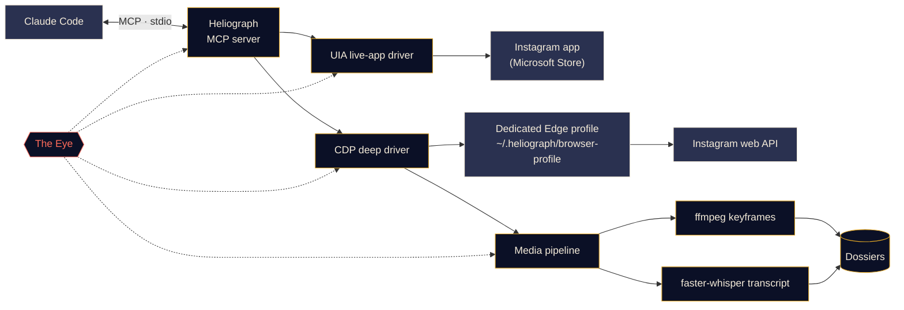

<p align="center">
  
</p>

<p align="center">
  <a href="#quick-start"></a>
  <a href="../../LICENSE"></a>
  <a href="#platform-support"></a>
  <a href="#how-it-works"></a>
  <a href="../../CONTRIBUTING.md#tests"></a>
</p>

<p align="center">
  <a href="../../README.md">English</a> ·
  <a href="README.es.md">Español</a> ·
  <a href="README.fr.md">Français</a> ·
  <b>Deutsch</b> ·
  <a href="README.pt-BR.md">Português (BR)</a> ·
  <a href="README.it.md">Italiano</a> ·
  <a href="README.ru.md">Русский</a> ·
  <a href="README.tr.md">Türkçe</a> ·
  <a href="README.ar.md">العربية</a> ·
  <a href="README.hi.md">हिन्दी</a> ·
  <a href="README.zh-CN.md">简体中文</a> ·
  <a href="README.ja.md">日本語</a> ·
  <a href="README.ko.md">한국어</a>
</p>

> Dies ist eine Übersetzung. Maßgeblich ist die [englische README](../../README.md); bei Abweichungen gilt die englische Fassung.

---

**Heliograph** verbindet Claude (über [Claude Code](https://docs.anthropic.com/en/docs/claude-code) und einen MCP-Server) mit **deinem eigenen Instagram auf deinem eigenen Gerät**. Claude kann lesen, was du siehst, deine gespeicherten Sammlungen durcharbeiten und Reels in strukturierte, durchsuchbare Dossiers verwandeln — alles lokal, und jede schreibende Aktion bleibt unter deiner Kontrolle.

> **Warum „Heliograph“?** Die allererste Fotografie war eine *Heliografie* (Niépce, 1820er-Jahre). Ein Heliograph ist außerdem ein Signalgerät, das mit einem Spiegel Sonnenlicht über weite Entfernungen blitzen lässt. Eine Kamera und eine Brücke — genau das ist dieses Projekt.

> [!NOTE]
> **Status: frühe Entwicklung (v0.1.0).** Die Architektur steht, die Kernmodule entstehen gerade. Jede Funktion unten ist als **Verfügbar**, **In Arbeit** oder **Geplant** gekennzeichnet — nichts hier ist ein Versprechen, für das es noch keinen Code gibt.

## Was es kann

- **Lässt Claude Instagram so sehen und nutzen wie du** — in der echten installierten App, mit deiner echten Sitzung.
- **Holt strukturierte Daten** (gespeicherte Sammlungen, Reel-Metadaten, Bildunterschriften, Medien) über ein separates, eigenes Browserprofil, in das du dich einmal einloggst.
- **Macht aus Reels Dossiers** — Video, Keyframes, ein Transkript mit Zeitstempeln und Metadaten in einem Ordner, den Claude lesen und auswerten kann.
- **Überwacht sich selbst** — *das Auge* protokolliert jeden Tool-Aufruf, jede Treiberaktion und jeden Unterprozess lokal, damit sich Fehler erklären lassen, von dir oder von Claude.

## Funktionen

<table>
  <tr>
    <td width="33%" valign="top">
      <h3>Live-App-Treiber</h3>
      Steuert die Instagram-App aus dem Microsoft Store über Windows UI Automation: Bildschirm lesen, navigieren, liken, speichern, folgen, Screenshots. Ganz ohne Login-Schritt.<br><br><sub><b>In Arbeit</b></sub>
    </td>
    <td width="33%" valign="top">
      <h3>Tiefen-Treiber</h3>
      Ein eigenes Edge/Chrome-Profil, gesteuert über das Chrome DevTools Protocol, das Instagrams eigene Web-API aus der Seite heraus liest — für sauberes JSON, Video-URLs und Massenverarbeitung.<br><br><sub><b>In Arbeit</b></sub>
    </td>
    <td width="33%" valign="top">
      <h3>Reel-Dossiers</h3>
      Keyframes bei Szenenwechseln per ffmpeg mit perzeptueller Deduplizierung plus ein faster-whisper-Transkript, gebündelt zu einem Markdown-Dossier pro Reel.<br><br><sub><b>In Arbeit</b></sub>
    </td>
  </tr>
  <tr>
    <td width="33%" valign="top">
      <h3>MCP-Server</h3>
      Ein FastMCP-Server, der sich über <code>.mcp.json</code> automatisch bei Claude Code registriert, sobald du den Ordner öffnest.<br><br><sub><b>In Arbeit</b></sub>
    </td>
    <td width="33%" valign="top">
      <h3>Das Auge</h3>
      Lokales Tracing: Spans, Trace-IDs, Schwärzung von Geheimnissen, Fehler-Snapshots, eine Live-Ansicht im Terminal und ein Bericht, den Claude lesen kann.<br><br><sub><b>Verfügbar (früh)</b></sub>
    </td>
    <td width="33%" valign="top">
      <h3>Schutzmechanismen</h3>
      Schreibende Aktionen erfordern eine ausdrückliche Bestätigung, alles ist ratenbegrenzt, Downloads sind auf Instagrams CDN beschränkt, und kein Passwort läuft jemals durch Heliograph.<br><br><sub><b>In Arbeit</b></sub>
    </td>
  </tr>
</table>

<a id="quick-start"></a>
## Schnellstart

**Voraussetzungen:** Python 3.11+ (3.12 empfohlen), [uv](https://docs.astral.sh/uv/), [ffmpeg](https://ffmpeg.org/), Microsoft Edge oder Google Chrome, [Claude Code](https://docs.anthropic.com/en/docs/claude-code) und — für den Live-App-Treiber unter Windows — die Instagram-App aus dem Microsoft Store.

```bash
# 1. Clone
git clone https://github.com/DeanT-04/instagram-bridge-with-claude.git heliograph
cd heliograph

# 2. Run the one-command setup
./scripts/setup.ps1        # Windows (PowerShell)
./scripts/setup.sh         # macOS / Linux

# 3. Open Claude Code in the folder
claude
```

Claude Code erkennt den Heliograph-MCP-Server über `.mcp.json` und fragt beim ersten Mal nach deiner Freigabe. Danach einfach fragen, zum Beispiel: *„Was ist in meiner gespeicherten Sammlung namens Trading?“*

> [!IMPORTANT]
> Die Setup-Skripte, `.mcp.json` und `heliograph login` sind **in Arbeit**. Bis dahin kannst du die Umgebung von Hand einrichten:
>
> ```bash
> uv sync
> uv run heliograph doctor
> ```
>
> `doctor` prüft Instagram-App, Edge/Chrome, ffmpeg und dein Betriebssystem und sagt dir, was fehlt.

<a id="how-it-works"></a>
## So funktioniert es



<details>
<summary><b>Warum zwei Treiber?</b></summary>

<br>

Die Instagram-App aus dem Microsoft Store ist eine Edge-Web-App, die in deinem normalen Edge-Profil läuft. Aktuelle Edge-Versionen öffnen im Standardprofil keinen DevTools-Port, daher lässt sich die installierte App **nicht** über DevTools automatisieren. Über Windows UI Automation ist sie jedoch **vollständig** les- und steuerbar.

| Treiber | Ziel | Stärke | Einsatz |
|---|---|---|---|
| `uia` | Das Fenster der installierten Store-App | Deine echte App und Sitzung, kein Login | Navigieren, Bildschirminhalt lesen, liken / speichern / folgen, Screenshots |
| `cdp` | Ein eigenes Edge/Chrome-Profil als App-Fenster, DevTools an `127.0.0.1` gebunden | Strukturiertes JSON aus Instagrams Web-API, Video-URLs, Netzwerkmitschnitt | Gespeicherte Sammlungen, Reel-Metadaten, Downloads, Massenextraktion |

Wo sie sich überschneiden, implementieren beide eine gemeinsame `InstagramDriver`-Schnittstelle. Das vollständige Design steht in [docs/ARCHITECTURE.md](../ARCHITECTURE.md).

</details>

<a id="platform-support"></a>
<details>
<summary><b>Plattformunterstützung</b></summary>

<br>

| | Windows 10/11 | macOS | Linux |
|---|---|---|---|
| Tiefen-Treiber (CDP) | In Arbeit | In Arbeit | In Arbeit |
| Medien-Pipeline & Dossiers | In Arbeit | In Arbeit | In Arbeit |
| Das Auge | Verfügbar | Verfügbar | Verfügbar |
| Live-App-Treiber | In Arbeit (UI Automation) | Geplant | Nicht zutreffend |

</details>

## Extraktion von Trading-Reels

Ein Vorzeige-Workflow: Du speicherst Trading-Reels in einer Instagram-Sammlung, und Claude macht daraus Notizen, mit denen du wirklich lernen kannst.

1. Du fragst Claude: *„Extrahiere die Strategien aus meiner gespeicherten Sammlung ‚Trading‘.“*
2. Heliograph listet die Sammlung über den Tiefen-Treiber auf und lädt jedes Reel aus Instagrams CDN herunter.
3. Die Medien-Pipeline zieht Keyframes bei Szenenwechseln (Charts, Setups, Annotationen) und ein Transkript mit Zeitstempeln.
4. Jedes Reel wird zu einem Dossier; Claude liest sie und schreibt Einstiegsregeln, Ausstiege, Risikomanagement und die Behauptungen auf, die es nicht überprüfen konnte.

```text
dossiers/<reel-id>/
├── meta.json          # author, caption, date, URL, metrics
├── video.mp4
├── transcript.json    # timestamped segments
├── transcript.md
├── frames/*.jpg       # de-duplicated keyframes
└── dossier.md         # everything above, stitched for Claude
```

**Status:** Dossier-Generator **in Arbeit**; der Claude-Code-Skill `extract-trading-strategies` ist **geplant**.

> [!CAUTION]
> Heliograph ordnet, was Creator sagen; es beurteilt nicht, ob sie recht haben. Nichts, was es erzeugt, ist eine Finanzberatung.

## Das Auge

*Das Auge* ist Heliographs eingebaute, lokale Observability. Ein externer Dienst ist nicht nötig.

- Jeder MCP-Tool-Aufruf, jede Treiberaktion, jede HTTP-Anfrage und jeder ffmpeg/whisper-Unterprozess wird als **Span** mit gemeinsamer `trace_id` aufgezeichnet, sodass sich eine einzelne Anfrage von Claude durchgängig verfolgen lässt.
- Ereignisse landen in `~/.heliograph/eye/events.jsonl` (rotierend), dazu ein SQLite-Index für Abfragen.
- **Geheimnisse werden vor dem Schreiben geschwärzt** — Cookies, `sessionid`, `csrftoken`, Auth-Header und tokenartige Zeichenketten.
- Scheitert ein UI- oder Browser-Schritt, werden ein Screenshot und ein Accessibility-/DOM-Snapshot gespeichert und mit dem Ereignis verknüpft *(in Arbeit)*.
- `heliograph eye` zeigt einen farbigen Live-Verlauf mit laufendem Zustand: Fehlerrate, p95-Latenz, häufigste fehlschlagende Operationen.
- `heliograph eye report` — und das MCP-Tool `eye_report` *(in Arbeit)* — fasst aktuelle Fehler zusammen, damit Claude Probleme selbst diagnostizieren kann.
- Optionaler Export zu Langfuse, wenn `LANGFUSE_PUBLIC_KEY` / `LANGFUSE_SECRET_KEY` gesetzt sind (standardmäßig aus).

## Sicherheit & Datenschutz

- **Einmaliger manueller Login.** Du meldest dich selbst, einmal, im eigenen Browserprofil an. Heliograph tippt, speichert oder protokolliert niemals ein Passwort.
- **Der Live-App-Treiber braucht keinen Login** — er nutzt die Instagram-App, in der du bereits angemeldet bist.
- **Schreibende Aktionen erfordern Bestätigung.** Liken, Folgen, Kommentieren, DMs, Posten und Entfernen aus Gespeichertem brauchen ein ausdrückliches `confirm=True` auf MCP-Ebene — Claude muss dich also zuerst fragen.
- **Ratenbegrenzung mit Jitter** für Schreib- *und* Lesezugriffe, damit die Nutzung menschlich getaktet bleibt.
- **Nur lokale Daten.** Dossiers, Logs und das Browserprofil bleiben unter `~/.heliograph` auf deinem Rechner. Der DevTools-Port ist an `127.0.0.1` auf einem zufälligen freien Port gebunden.
- **Downloads nur per Allowlist** — ausschließlich HTTPS von Instagrams CDN-Hosts.

Das Bedrohungsmodell und wie du eine Schwachstelle meldest, findest du in [docs/SECURITY.md](../SECURITY.md).

## CLI-Referenz

> Dies ist die **geplante Schnittstelle**. Die Spalte Status zeigt, was heute funktioniert.

| Befehl | Funktion | Status |
|---|---|---|
| `heliograph setup` | Installiert Abhängigkeiten, prüft die Umgebung und registriert den MCP-Server | Geplant (Gerüst) |
| `heliograph doctor` | Erkennt Instagram-App, Edge/Chrome, ffmpeg, Betriebssystem und Login-Status | Verfügbar |
| `heliograph login` | Öffnet das eigene Browserprofil, damit du dich einmal von Hand anmeldest | Geplant (Gerüst) |
| `heliograph mcp` | Startet den MCP-Server über stdio (Claude Code startet ihn für dich) | Geplant (Gerüst) |
| `heliograph extract <url>` | Erstellt ein Dossier für ein Reel oder einen Beitrag | Geplant (Gerüst) |
| `heliograph eye` | Live-Verlauf des Auges mit Zustandsanzeige | Verfügbar |
| `heliograph eye report` | Zusammenfassung aktueller Fehler und Auffälligkeiten | Verfügbar |

<details>
<summary><b>Projektstruktur</b></summary>

<br>

```text
src/heliograph/
├── cli.py              # Typer CLI
├── config.py           # settings (env prefix HELIOGRAPH_), paths under ~/.heliograph
├── errors.py           # HeliographError hierarchy
├── detect/             # environment detection: Store app, browsers, ffmpeg, OS
├── drivers/
│   ├── base.py         # InstagramDriver protocol + shared dataclasses
│   ├── uia/            # Windows UI Automation live-app driver
│   └── cdp/            # browser launcher, CDP session, web-API client
├── instagram/          # models + high-level service
├── media/              # allow-listed download, ffmpeg frames, faster-whisper
├── extract/            # reel -> dossier
├── eye/                # the Eye: spans, sinks, redaction, live view, reports
└── mcp/                # FastMCP server (in progress)
tests/                  # pytest; live tests marked @pytest.mark.live
docs/                   # architecture, security, translations, brand assets
scripts/                # setup.ps1 / setup.sh (in progress)
.claude/skills/         # Claude Code skills (planned)
.mcp.json               # MCP registration for Claude Code (in progress)
```

</details>

## Roadmap

- [ ] Setup mit einem Befehl, Registrierung über `.mcp.json` und `heliograph login`
- [ ] MCP-Server mit Lese-Tools, danach bestätigte Schreib-Tools
- [ ] Skill `extract-trading-strategies`
- [ ] Unterstützung für **mehrere Konten** (getrennte Profile und Zustände pro Konto)
- [ ] **Android** über `adb`
- [ ] Live-App-Treiber für **macOS** (Accessibility-API)

## Mitwirken

Beiträge sind willkommen — siehe [CONTRIBUTING.md](../../CONTRIBUTING.md) und den [Verhaltenskodex](../../CODE_OF_CONDUCT.md).

## Haftungsausschluss

Heliograph ist ein unabhängiges Open-Source-Projekt. Es ist **weder mit Instagram noch mit Meta Platforms, Inc. verbunden, noch wird es von ihnen unterstützt oder gesponsert.** „Instagram“ ist eine Marke ihres Inhabers und wird hier nur verwendet, um zu beschreiben, womit die Software arbeitet. Nutze Heliograph **nur mit deinem eigenen Konto**, halte die Nutzung persönlich und menschlich getaktet und beachte die [Nutzungsbedingungen von Instagram](https://help.instagram.com/581066165581870). Du bist für deine Nutzung verantwortlich.

## Lizenz

[MIT](../../LICENSE) © 2026 DeanT-04
