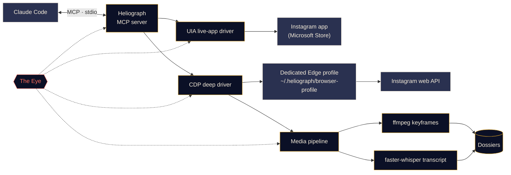

<p align="center">
  
</p>

<p align="center">
  <a href="#quick-start"></a>
  <a href="../../LICENSE"></a>
  <a href="#platform-support"></a>
  <a href="#how-it-works"></a>
  <a href="../../CONTRIBUTING.md#tests"></a>
</p>

<p align="center">
  <a href="../../README.md">English</a> ·
  <b>Español</b> ·
  <a href="README.fr.md">Français</a> ·
  <a href="README.de.md">Deutsch</a> ·
  <a href="README.pt-BR.md">Português (BR)</a> ·
  <a href="README.it.md">Italiano</a> ·
  <a href="README.ru.md">Русский</a> ·
  <a href="README.tr.md">Türkçe</a> ·
  <a href="README.ar.md">العربية</a> ·
  <a href="README.hi.md">हिन्दी</a> ·
  <a href="README.zh-CN.md">简体中文</a> ·
  <a href="README.ja.md">日本語</a> ·
  <a href="README.ko.md">한국어</a>
</p>

> Esta es una traducción. El [README en inglés](../../README.md) es la fuente de verdad; si algo difiere, prevalece la versión en inglés.

---

**Heliograph** conecta a Claude (a través de [Claude Code](https://docs.anthropic.com/en/docs/claude-code) y un servidor MCP) con **tu propio Instagram, en tu propio dispositivo**. Claude puede leer lo que ves, recorrer tus colecciones guardadas y convertir reels en dosieres estructurados y consultables, todo de forma local y con control total sobre cada acción de escritura.

> **¿Por qué "Heliograph"?** La primera fotografía de la historia fue una *heliografía* (Niépce, década de 1820). Un heliógrafo es también un aparato de señales que, con un espejo, lanza destellos de luz solar a distancia. Una cámara y un puente: exactamente lo que es este proyecto.

> [!NOTE]
> **Estado: desarrollo temprano (v0.1.0).** La arquitectura está definida y los módulos principales se están construyendo. Cada función de abajo está marcada como **Disponible**, **En progreso** o **Planificada**; nada de lo que aquí aparece es una promesa sin código detrás.

## Qué hace

- **Permite a Claude ver y usar Instagram como tú**: en la aplicación instalada real, con tu sesión real.
- **Extrae datos estructurados** (colecciones guardadas, metadatos de reels, descripciones, contenido multimedia) mediante un perfil de navegador dedicado e independiente en el que inicias sesión una sola vez.
- **Convierte reels en dosieres**: vídeo, fotogramas clave, una transcripción con marcas de tiempo y metadatos en una carpeta que Claude puede leer y analizar.
- **Se vigila a sí mismo**: *el Ojo* registra localmente cada llamada a herramientas, cada acción de los drivers y cada subproceso, para que los fallos puedan explicarse, por ti o por Claude.

## Funciones

<table>
  <tr>
    <td width="33%" valign="top">
      <h3>Driver de la app en vivo</h3>
      Controla la aplicación de Instagram de Microsoft Store mediante Windows UI Automation: leer la pantalla, navegar, dar "me gusta", guardar, seguir, hacer capturas. Sin ningún paso de inicio de sesión.<br><br><sub><b>En progreso</b></sub>
    </td>
    <td width="33%" valign="top">
      <h3>Driver profundo</h3>
      Un perfil dedicado de Edge/Chrome controlado mediante el Chrome DevTools Protocol, que lee la propia API web de Instagram desde dentro de la página para obtener JSON limpio, URLs de vídeo y trabajo por lotes.<br><br><sub><b>En progreso</b></sub>
    </td>
    <td width="33%" valign="top">
      <h3>Dosieres de reels</h3>
      Fotogramas clave por cambio de escena con ffmpeg y deduplicación perceptual, más una transcripción con faster-whisper, reunidos en un dosier Markdown por reel.<br><br><sub><b>En progreso</b></sub>
    </td>
  </tr>
  <tr>
    <td width="33%" valign="top">
      <h3>Servidor MCP</h3>
      Un servidor FastMCP que se registra automáticamente en Claude Code mediante <code>.mcp.json</code> al abrir la carpeta.<br><br><sub><b>En progreso</b></sub>
    </td>
    <td width="33%" valign="top">
      <h3>El Ojo</h3>
      Trazas locales primero: spans, IDs de traza, redacción de secretos, instantáneas de fallos, una vista en vivo en la terminal y un informe que Claude puede leer.<br><br><sub><b>Disponible (inicial)</b></sub>
    </td>
    <td width="33%" valign="top">
      <h3>Salvaguardas</h3>
      Las acciones de escritura requieren confirmación explícita, todo tiene límite de frecuencia, las descargas se restringen a la CDN de Instagram y ninguna contraseña pasa jamás por Heliograph.<br><br><sub><b>En progreso</b></sub>
    </td>
  </tr>
</table>

<a id="quick-start"></a>
## Inicio rápido

**Necesitas:** Python 3.11+ (se recomienda 3.12), [uv](https://docs.astral.sh/uv/), [ffmpeg](https://ffmpeg.org/), Microsoft Edge o Google Chrome, [Claude Code](https://docs.anthropic.com/en/docs/claude-code) y, para el driver de la app en vivo en Windows, la aplicación de Instagram de Microsoft Store.

```bash
# 1. Clone
git clone https://github.com/DeanT-04/instagram-bridge-with-claude.git heliograph
cd heliograph

# 2. Run the one-command setup
./scripts/setup.ps1        # Windows (PowerShell)
./scripts/setup.sh         # macOS / Linux

# 3. Open Claude Code in the folder
claude
```

Claude Code detecta el servidor MCP de Heliograph en `.mcp.json` y te pide aprobarlo la primera vez. Después, simplemente pregunta, por ejemplo: *"¿Qué hay en mi colección guardada llamada Trading?"*

> [!IMPORTANT]
> Los scripts de instalación, `.mcp.json` y `heliograph login` están **en progreso**. Hasta que estén listos, puedes preparar el entorno a mano:
>
> ```bash
> uv sync
> uv run heliograph doctor
> ```
>
> `doctor` comprueba la app de Instagram, Edge/Chrome, ffmpeg y tu sistema operativo, y te indica lo que falta.

<a id="how-it-works"></a>
## Cómo funciona



<details>
<summary><b>¿Por qué dos drivers?</b></summary>

<br>

La aplicación de Instagram de Microsoft Store es una aplicación web de Edge que se ejecuta en tu perfil normal de Edge. Las versiones recientes de Edge se niegan a abrir un puerto de DevTools en el perfil predeterminado, así que la app instalada **no puede** automatizarse mediante DevTools. Sin embargo, **sí** puede leerse y controlarse por completo mediante Windows UI Automation.

| Driver | Objetivo | Punto fuerte | Se usa para |
|---|---|---|---|
| `uia` | La ventana de la app instalada de Store | Tu app y sesión reales, sin inicio de sesión | Navegar, leer lo que hay en pantalla, me gusta / guardar / seguir, capturas |
| `cdp` | Un perfil dedicado de Edge/Chrome abierto como ventana de app, con DevTools ligado a `127.0.0.1` | JSON estructurado de la API web de Instagram, URLs de vídeo, captura de red | Colecciones guardadas, metadatos de reels, descargas, extracción masiva |

Ambos implementan una única interfaz `InstagramDriver` donde se solapan. Consulta [docs/ARCHITECTURE.md](../ARCHITECTURE.md) para el diseño completo.

</details>

<a id="platform-support"></a>
<details>
<summary><b>Plataformas compatibles</b></summary>

<br>

| | Windows 10/11 | macOS | Linux |
|---|---|---|---|
| Driver profundo (CDP) | En progreso | En progreso | En progreso |
| Pipeline multimedia y dosieres | En progreso | En progreso | En progreso |
| El Ojo | Disponible | Disponible | Disponible |
| Driver de la app en vivo | En progreso (UI Automation) | Planificado | No aplica |

</details>

## Extracción de reels de trading

Un flujo de demostración: guardas reels de trading en una colección de Instagram y Claude los convierte en notas que realmente puedes estudiar.

1. Le pides a Claude: *"Extrae las estrategias de mi colección guardada 'Trading'."*
2. Heliograph lista la colección mediante el driver profundo y descarga cada reel desde la CDN de Instagram.
3. El pipeline multimedia extrae fotogramas clave por cambio de escena (gráficos, configuraciones, anotaciones) y una transcripción con marcas de tiempo.
4. Cada reel se convierte en un dosier; Claude los lee y redacta las reglas de entrada, las salidas, la gestión del riesgo y las afirmaciones que no pudo verificar.

```text
dossiers/<reel-id>/
├── meta.json          # author, caption, date, URL, metrics
├── video.mp4
├── transcript.json    # timestamped segments
├── transcript.md
├── frames/*.jpg       # de-duplicated keyframes
└── dossier.md         # everything above, stitched for Claude
```

**Estado:** el generador de dosieres está **en progreso**; la skill de Claude Code `extract-trading-strategies` está **planificada**.

> [!CAUTION]
> Heliograph organiza lo que dicen los creadores; no juzga si tienen razón. Nada de lo que produce es asesoramiento financiero.

## El Ojo

*El Ojo* es la observabilidad integrada de Heliograph, local primero. No necesita ningún servicio externo.

- Cada llamada a herramientas MCP, acción de driver, petición HTTP y subproceso de ffmpeg/whisper se registra como un **span** con un `trace_id` compartido, de modo que una sola petición de Claude puede seguirse de principio a fin.
- Los eventos se escriben en `~/.heliograph/eye/events.jsonl` (con rotación) junto con un índice SQLite para consultas.
- **Los secretos se ocultan antes de escribir**: cookies, `sessionid`, `csrftoken`, cabeceras de autenticación y cadenas con aspecto de token.
- Cuando falla un paso de la interfaz o del navegador, se guarda una captura de pantalla y una instantánea de accesibilidad/DOM enlazadas al evento *(en progreso)*.
- `heliograph eye` muestra un registro en vivo con colores y salud en tiempo real: tasa de errores, latencia p95, operaciones que más fallan.
- `heliograph eye report` —y la herramienta MCP `eye_report` *(en progreso)*— resume los errores recientes, para que Claude pueda diagnosticar problemas por sí mismo.
- Exportación opcional a Langfuse cuando se definen `LANGFUSE_PUBLIC_KEY` / `LANGFUSE_SECRET_KEY` (desactivada por defecto).

## Seguridad y privacidad

- **Inicio de sesión manual, una sola vez.** Inicias sesión tú mismo en el perfil de navegador dedicado, una vez. Heliograph nunca escribe, guarda ni registra una contraseña.
- **El driver de la app en vivo no necesita iniciar sesión**: usa la app de Instagram en la que ya tienes la sesión abierta.
- **Las acciones de escritura requieren confirmación.** Me gusta, seguir, comentar, enviar DM, publicar y quitar de guardados necesitan un `confirm=True` explícito en la capa MCP, así que Claude tiene que preguntarte primero.
- **Límites de frecuencia con variación aleatoria** tanto en escrituras *como* en lecturas, para mantener un ritmo humano.
- **Datos solo locales.** Los dosieres, los registros y el perfil del navegador se quedan en `~/.heliograph` en tu equipo. El puerto de DevTools se liga a `127.0.0.1` en un puerto libre aleatorio.
- **Descargas en lista blanca**: solo HTTPS desde los hosts de la CDN de Instagram.

Consulta [docs/SECURITY.md](../SECURITY.md) para el modelo de amenazas y cómo informar de una vulnerabilidad.

## Referencia de la CLI

> Esta es la **interfaz planificada**. La columna Estado muestra lo que funciona hoy.

| Comando | Qué hace | Estado |
|---|---|---|
| `heliograph setup` | Instala dependencias, comprueba el entorno y registra el servidor MCP | Planificado (esqueleto) |
| `heliograph doctor` | Detecta la app de Instagram, Edge/Chrome, ffmpeg, el sistema operativo y el estado de la sesión | Disponible |
| `heliograph login` | Abre el perfil de navegador dedicado para que inicies sesión una vez, a mano | Planificado (esqueleto) |
| `heliograph mcp` | Ejecuta el servidor MCP por stdio (Claude Code lo inicia por ti) | Planificado (esqueleto) |
| `heliograph extract <url>` | Genera un dosier para un reel o una publicación | Planificado (esqueleto) |
| `heliograph eye` | Registro en vivo del Ojo con estado de salud | Disponible |
| `heliograph eye report` | Resumen de errores y anomalías recientes | Disponible |

<details>
<summary><b>Estructura del proyecto</b></summary>

<br>

```text
src/heliograph/
├── cli.py              # Typer CLI
├── config.py           # settings (env prefix HELIOGRAPH_), paths under ~/.heliograph
├── errors.py           # HeliographError hierarchy
├── detect/             # environment detection: Store app, browsers, ffmpeg, OS
├── drivers/
│   ├── base.py         # InstagramDriver protocol + shared dataclasses
│   ├── uia/            # Windows UI Automation live-app driver
│   └── cdp/            # browser launcher, CDP session, web-API client
├── instagram/          # models + high-level service
├── media/              # allow-listed download, ffmpeg frames, faster-whisper
├── extract/            # reel -> dossier
├── eye/                # the Eye: spans, sinks, redaction, live view, reports
└── mcp/                # FastMCP server (in progress)
tests/                  # pytest; live tests marked @pytest.mark.live
docs/                   # architecture, security, translations, brand assets
scripts/                # setup.ps1 / setup.sh (in progress)
.claude/skills/         # Claude Code skills (planned)
.mcp.json               # MCP registration for Claude Code (in progress)
```

</details>

## Hoja de ruta

- [ ] Instalación con un solo comando, registro mediante `.mcp.json` y `heliograph login`
- [ ] Servidor MCP con herramientas de lectura y, después, herramientas de escritura con confirmación
- [ ] Skill `extract-trading-strategies`
- [ ] Soporte **multicuenta** (perfiles y estado separados por cuenta)
- [ ] **Android** mediante `adb`
- [ ] Driver de la app en vivo para **macOS** (API de Accesibilidad)

## Contribuir

Las contribuciones son bienvenidas: consulta [CONTRIBUTING.md](../../CONTRIBUTING.md) y el [Código de Conducta](../../CODE_OF_CONDUCT.md).

## Aviso legal

Heliograph es un proyecto independiente de código abierto. **No está afiliado, respaldado ni patrocinado por Instagram ni por Meta Platforms, Inc.** "Instagram" es una marca registrada de su propietario y aquí se usa únicamente para describir con qué funciona el software. Usa Heliograph **solo en tu propia cuenta**, mantén un uso personal y a ritmo humano, y respeta las [Condiciones de uso de Instagram](https://help.instagram.com/581066165581870). Eres responsable del uso que hagas de él.

## Licencia

[MIT](../../LICENSE) © 2026 DeanT-04
