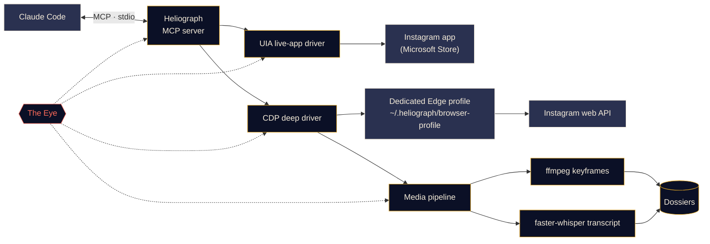

<p align="center">
  
</p>

<p align="center">
  <a href="#quick-start"></a>
  <a href="../../LICENSE"></a>
  <a href="#platform-support"></a>
  <a href="#mcp-tools"></a>
  <a href="../../CONTRIBUTING.md#tests"></a>
</p>

<p align="center">
  <a href="../../README.md">English</a> ·
  <b>Español</b> ·
  <a href="README.fr.md">Français</a> ·
  <a href="README.de.md">Deutsch</a> ·
  <a href="README.pt-BR.md">Português (BR)</a> ·
  <a href="README.it.md">Italiano</a> ·
  <a href="README.ru.md">Русский</a> ·
  <a href="README.tr.md">Türkçe</a> ·
  <a href="README.ar.md">العربية</a> ·
  <a href="README.hi.md">हिन्दी</a> ·
  <a href="README.zh-CN.md">简体中文</a> ·
  <a href="README.ja.md">日本語</a> ·
  <a href="README.ko.md">한국어</a>
</p>

> Esta es una traducción. El [README en inglés](../../README.md) es la fuente de verdad; si algo difiere, prevalece la versión en inglés.

---

**Heliograph** conecta a Claude (a través de [Claude Code](https://docs.anthropic.com/en/docs/claude-code) y un servidor MCP) con **tu propio Instagram, en tu propio dispositivo**. Claude puede leer lo que ves, recorrer tus colecciones guardadas y convertir reels en dosieres estructurados y consultables, todo de forma local y con control total sobre cada acción de escritura.

> **¿Por qué "Heliograph"?** La primera fotografía de la historia fue una *heliografía* (Niépce, década de 1820). Un heliógrafo es también un aparato de señales que, con un espejo, lanza destellos de luz solar a distancia. Una cámara y un puente: exactamente lo que es este proyecto.

> [!NOTE]
> **Estado: v0.1.0 — temprano, pero funcional.** La instalación, la CLI, el servidor MCP (41 herramientas), ambos drivers y el pipeline de dosieres ya están publicados. Las lecturas se han verificado en vivo con una cuenta real en Windows 11 (cuenta actual, colecciones, publicaciones de una colección, búsqueda, insignias de la app, estado). Las **acciones de escritura** (me gusta, guardar, seguir, comentar, DM…) están implementadas y probadas en modo simulación, pero **aún no se han verificado con una cuenta real**.

## Qué hace

- **Permite a Claude ver y usar Instagram como tú**: en la aplicación instalada real, con tu sesión real.
- **Extrae datos estructurados** (colecciones guardadas, metadatos de reels, descripciones, DMs, contenido multimedia) mediante un perfil de navegador dedicado en el que inicias sesión una sola vez.
- **Convierte reels en dosieres**: vídeo, fotogramas clave, una hoja de contactos, una transcripción con marcas de tiempo y metadatos en una carpeta que Claude puede leer *y ver*.
- **Se vigila a sí mismo**: *el Ojo* registra localmente cada llamada a herramientas, cada acción de los drivers y cada subproceso, para que los fallos puedan explicarse, por ti o por Claude.

## Funciones

<table>
  <tr>
    <td width="33%" valign="top">
      <h3>Driver de la app en vivo</h3>
      Controla la aplicación de Instagram de Microsoft Store mediante Windows UI Automation: leer la pantalla, navegar, desplazarse, hacer capturas y pulsar o escribir (con tu confirmación). Sin ningún paso de inicio de sesión.<br><br><sub><b>Disponible · Windows</b></sub>
    </td>
    <td width="33%" valign="top">
      <h3>Driver profundo</h3>
      Un perfil dedicado de Edge/Chrome controlado mediante el Chrome DevTools Protocol, que lee la propia API web de Instagram desde dentro de la página para obtener JSON limpio, URLs de vídeo y trabajo por lotes.<br><br><sub><b>Disponible</b></sub>
    </td>
    <td width="33%" valign="top">
      <h3>Dosieres de reels</h3>
      Fotogramas clave por cambio de escena con ffmpeg y deduplicación perceptual, una hoja de contactos y una transcripción con faster-whisper, reunidos en un dosier Markdown por reel.<br><br><sub><b>Disponible</b></sub>
    </td>
  </tr>
  <tr>
    <td width="33%" valign="top">
      <h3>Servidor MCP</h3>
      41 herramientas que se registran automáticamente en Claude Code mediante <code>.mcp.json</code> al abrir la carpeta, más dos skills del proyecto.<br><br><sub><b>Disponible</b></sub>
    </td>
    <td width="33%" valign="top">
      <h3>El Ojo</h3>
      Trazas locales primero: spans, IDs de traza, redacción de secretos, capturas e instantáneas DOM de los fallos, una vista en vivo en la terminal e informes que Claude puede leer.<br><br><sub><b>Disponible</b></sub>
    </td>
    <td width="33%" valign="top">
      <h3>Salvaguardas</h3>
      Las acciones de escritura solo simulan salvo confirmación, todo tiene límite de frecuencia, las URLs y descargas están en lista blanca y ninguna contraseña pasa jamás por Heliograph.<br><br><sub><b>Disponible · escrituras aún no verificadas en vivo</b></sub>
    </td>
  </tr>
</table>

<a id="quick-start"></a>
## Inicio rápido

**Necesitas:** Python 3.11+ (se recomienda 3.12), [ffmpeg](https://ffmpeg.org/), Microsoft Edge o Google Chrome, [Claude Code](https://docs.anthropic.com/en/docs/claude-code) y, para el driver de la app en vivo en Windows, la aplicación de Instagram de Microsoft Store. El script de instalación instala [uv](https://docs.astral.sh/uv/) si falta (tras preguntarte).

```bash
# 1. Clone
git clone https://github.com/DeanT-04/instagram-bridge-with-claude.git heliograph
cd heliograph

# 2. Run the one-command setup
./scripts/setup.ps1        # Windows (PowerShell)
./scripts/setup.sh         # macOS / Linux

# 3. Sign in to Instagram once, yourself, in Heliograph's own browser window
uv run heliograph login

# 4. Open Claude Code in the folder
claude
```

Claude Code detecta el servidor MCP de Heliograph en `.mcp.json` y te pide aprobarlo la primera vez. La instalación se puede repetir sin riesgo; añade `--yes` para omitir preguntas o `--with-whisper` para descargar de antemano el modelo de voz (~500 MB). Si algo no cuadra, ejecuta `uv run heliograph doctor`.

## Uso con Claude

Simplemente habla con Claude en la carpeta del proyecto. Por ejemplo:

- *"Extrae todas las estrategias de mi colección 'Trading strats'."* — ejecuta la skill `extract-trading-strategies` de principio a fin.
- *"¿Qué hay de nuevo en mis DMs y notificaciones? Resume, no respondas."*
- *"Abre la app de Instagram, ve a Reels y dime qué hay en pantalla."*
- *"Busca las últimas cinco publicaciones de @some_creator y redacta un comentario en la más reciente."* — Claude te muestra primero una simulación; no se publica nada hasta que digas que sí.

`CLAUDE.md` le da a Claude su manual de operación (reglas de seguridad, familias de herramientas, resolución de problemas), y la skill [`instagram-control`](../../.claude/skills/instagram-control/SKILL.md) le enseña qué herramienta usar.

<a id="how-it-works"></a>
## Cómo funciona



<details>
<summary><b>¿Por qué dos drivers?</b></summary>

<br>

La aplicación de Instagram de Microsoft Store es una aplicación web de Edge que se ejecuta en tu perfil normal de Edge. Las versiones recientes de Edge se niegan a abrir un puerto de DevTools en el perfil predeterminado, así que la app instalada **no puede** automatizarse mediante DevTools. Sin embargo, **sí** puede leerse y controlarse por completo mediante Windows UI Automation.

| Driver | Objetivo | Punto fuerte | Se usa para |
|---|---|---|---|
| `uia` | La ventana de la app instalada de Store | Tu app y sesión reales, sin inicio de sesión | Navegar, leer lo que hay en pantalla, capturas, clics confirmados |
| `cdp` | Un perfil dedicado de Edge/Chrome abierto como ventana de app, con DevTools ligado a `127.0.0.1` | JSON estructurado de la API web de Instagram, URLs de vídeo, captura de red | Colecciones guardadas, feeds, DMs, metadatos de reels, descargas, extracción masiva |

Consulta [docs/ARCHITECTURE.md](../ARCHITECTURE.md) para el diseño completo.

</details>

<a id="platform-support"></a>
<details>
<summary><b>Plataformas compatibles</b></summary>

<br>

| | Windows 10/11 | macOS | Linux |
|---|---|---|---|
| Script de instalación | Verificado | Disponible (sin probar) | Disponible (sin probar) |
| Driver profundo (CDP) y servidor MCP | Verificado | Disponible (sin probar) | Disponible (sin probar) |
| Pipeline multimedia y dosieres | Disponible | Disponible (sin probar) | Disponible (sin probar) |
| El Ojo | Disponible | Disponible | Disponible |
| Driver de la app en vivo (herramientas `app_*`) | Verificado | Planificado | No aplica |

</details>

<a id="mcp-tools"></a>
## Herramientas MCP

41 herramientas en siete familias. Las herramientas de listado aceptan `limit` y `cursor`; devuelve `next_cursor` para pasar de página.

<details open>
<summary><b>Referencia de herramientas</b></summary>

<br>

| Familia | Herramienta | Qué hace |
|---|---|---|
| **Estado** | `heliograph_status` | Salud: SO, app de Store, navegadores, ffmpeg, estado de la sesión |
| | `heliograph_setup_check` | Lo que aún te falta para que funcionen todas las herramientas |
| **Lectura** | `ig_whoami` | La cuenta con sesión iniciada en el perfil de navegador de Heliograph |
| | `ig_get_user` | Perfil público de una cuenta por nombre de usuario |
| | `ig_user_posts` | Publicaciones y reels recientes de una cuenta |
| | `ig_get_media` | Detalles completos de una publicación/reel, con descripción y URLs de medios |
| | `ig_comments` | Comentarios principales de una publicación/reel |
| | `ig_search` | Búsqueda principal: usuarios, hashtags y lugares |
| | `ig_timeline` | Tu feed de inicio |
| | `ig_reels_feed` | El feed de descubrimiento de Reels |
| | `ig_explore` | Publicaciones de la cuadrícula Explorar |
| | `ig_inbox` | Hilos de DM con la vista previa del último mensaje |
| | `ig_thread` | Mensajes de un hilo de DM |
| | `ig_activity` | Notificaciones recientes: me gusta, seguidores, comentarios, menciones |
| **Colecciones** | `ig_list_collections` | Tus colecciones guardadas |
| | `ig_collection_posts` | Publicaciones de una colección, por nombre o id |
| | `ig_saved_posts` | Todas las publicaciones guardadas, las más recientes primero |
| **Extracción** | `ig_extract_media` | Crea (o reutiliza) un dosier para una publicación/reel |
| | `ig_extract_collection` | Crea dosieres para una colección, por lotes |
| | `ig_read_dossier` | Lee el Markdown, la transcripción y los metadatos de un dosier |
| | `ig_view_frames` | Devuelve la hoja de contactos o los fotogramas como imágenes que Claude puede ver |
| **App en vivo** *(Windows)* | `app_open` | Se conecta a la ventana de la app de Instagram |
| | `app_snapshot` | Esquema de texto de lo que hay en pantalla (árbol de accesibilidad) |
| | `app_screenshot` | Captura de la ventana de la app, aunque esté detrás de otras |
| | `app_navigate` | Abre una sección: inicio, búsqueda, explorar, reels, mensajes… |
| | `app_click` | Pulsa un elemento por ref o nombre (las escrituras requieren tu confirmación) |
| | `app_scroll` | Se desplaza por pantallas (un reel por página en el visor de Reels) |
| | `app_type` | Escribe en un campo (enviar requiere tu confirmación) |
| | `app_visible_posts` | Publicaciones/reels en pantalla, con sus botones |
| | `app_badges` | Contadores de no leídos de mensajes y notificaciones |
| **Escritura** *(con confirmación)* | `ig_like` / `ig_unlike` | Da o quita un me gusta a una publicación/reel |
| | `ig_save` / `ig_unsave` | Guarda o quita de guardados, opcionalmente en una colección |
| | `ig_follow` / `ig_unfollow` | Sigue o deja de seguir una cuenta |
| | `ig_comment` | Publica un comentario con el texto exacto que aprobaste |
| | `ig_send_dm` | Envía un DM a un usuario o a un hilo existente |
| **Ojo** | `eye_report` | Resumen de salud: tasa de errores, operaciones lentas y fallidas |
| | `eye_trace` | Cada paso de una llamada, con trazas de error y artefactos |
| | `eye_recent` | Los últimos eventos, opcionalmente solo errores |

</details>

## Extracción de reels de trading

Un flujo de demostración: guardas reels de trading en una colección de Instagram y Claude los convierte en notas que realmente puedes estudiar.

1. Le pides a Claude: *"Extrae todas las estrategias de mi colección 'Trading strats'."*
2. Heliograph lista la colección mediante el driver profundo y descarga cada reel desde la CDN de Instagram.
3. El pipeline multimedia extrae fotogramas clave por cambio de escena (gráficos, configuraciones, anotaciones), una hoja de contactos y una transcripción con marcas de tiempo.
4. Claude lee cada dosier, **mira los fotogramas** con `ig_view_frames` y escribe una nota por reel —reglas de entrada, salidas, gestión del riesgo, ajustes de indicadores y las afirmaciones que no pudo verificar— más un índice.

```text
~/.heliograph/dossiers/<creator>/<code>/
├── meta.json          # author, caption, date, URL, metrics
├── caption.md
├── video.mp4          # or images/NN.jpg for photo posts
├── transcript.json    # timestamped segments + language
├── transcript.md
├── frames/*.jpg       # de-duplicated keyframes (+ frames.json)
├── contact_sheet.jpg  # every keyframe on one image
└── dossier.md         # everything above, stitched for Claude
```

Las notas se guardan en `strategies/` dentro de la carpeta del proyecto, que git ignora porque son datos personales. También puedes crear dosieres sin Claude: `uv run heliograph extract --collection "Trading strats"`.

> [!CAUTION]
> Heliograph organiza lo que dicen los creadores; no juzga si tienen razón. Nada de lo que produce es asesoramiento financiero.

## El Ojo

*El Ojo* es la observabilidad integrada de Heliograph, local primero. No necesita ningún servicio externo.

- Cada llamada a herramientas MCP, acción de driver, petición HTTP y subproceso de ffmpeg/whisper se registra como un **span** con un `trace_id` compartido, de modo que una sola petición de Claude puede seguirse de principio a fin.
- Los eventos se escriben en `~/.heliograph/eye/events.jsonl` (con rotación) junto con un índice SQLite para consultas.
- **Los secretos se ocultan antes de escribir**: cookies, `sessionid`, `csrftoken`, cabeceras de autenticación y cadenas con aspecto de token.
- Cuando falla un paso de la interfaz o del navegador, se guarda una captura de pantalla y una instantánea de accesibilidad/DOM enlazadas al evento.
- Cada error de herramienta devuelve una **pista** y un **id de traza**; Claude puede llamar a `eye_trace` con él para ver exactamente qué falló.
- `heliograph eye` muestra un registro en vivo con colores y salud en tiempo real: tasa de errores, latencia p95, operaciones que más fallan. `heliograph eye report` resume los errores recientes.
- Exportación opcional a Langfuse cuando se definen `LANGFUSE_PUBLIC_KEY` / `LANGFUSE_SECRET_KEY` (desactivada por defecto).

## Seguridad y privacidad

- **Inicio de sesión manual, una sola vez.** Inicias sesión tú mismo en el perfil de navegador dedicado, una vez (`heliograph login`). Heliograph nunca escribe, guarda ni registra una contraseña.
- **El driver de la app en vivo no necesita iniciar sesión**: usa la app de Instagram en la que ya tienes la sesión abierta.
- **Las acciones de escritura simulan por defecto.** Me gusta, seguir, comentar, DM, guardar y sus inversas devuelven una descripción de lo que *ocurriría*; solo actúan si se llaman de nuevo con `confirm=true`, después de que digas que sí en el chat. Lo mismo vale para pulsar botones de acción o enviar texto en la app en vivo.
- **Límites de frecuencia con variación aleatoria** tanto en escrituras *como* en lecturas, para mantener un ritmo humano.
- **Datos solo locales.** Los dosieres, los registros y el perfil del navegador se quedan en `~/.heliograph` en tu equipo, con permisos de archivo privados. El puerto de DevTools se liga a `127.0.0.1` en un puerto libre aleatorio.
- **Listas blancas estrictas**: solo se aceptan URLs de Instagram y las descargas solo llegan por HTTPS desde los hosts de la CDN de Instagram. Protecciones contra path traversal cubren el cliente de la API y las carpetas de dosieres.

Consulta [docs/SECURITY.md](../SECURITY.md) para el modelo de amenazas y cómo informar de una vulnerabilidad.

## Referencia de la CLI

| Comando | Qué hace | Estado |
|---|---|---|
| `heliograph setup` | Comprueba el entorno, ofrece soluciones (Chromium, app de Store), descarga Whisper opcionalmente e indica los siguientes pasos | Disponible |
| `heliograph doctor` | Detecta la app de Instagram, Edge/Chrome, ffmpeg, el SO y el estado de la sesión (`--json` para salida sin formato) | Disponible |
| `heliograph login` | Abre el perfil de navegador dedicado para que inicies sesión una vez, a mano | Disponible |
| `heliograph mcp` | Ejecuta el servidor MCP por stdio (Claude Code lo inicia por ti) | Disponible |
| `heliograph extract <url>` | Crea un dosier para un reel/publicación, o `--collection "<nombre>"` para una colección entera | Disponible |
| `heliograph eye` | Registro en vivo del Ojo con estado de salud | Disponible |
| `heliograph eye report` | Resumen de errores y anomalías recientes | Disponible |

La mayoría de los comandos aceptan `--account <clave>` para usar un perfil de navegador separado.

<details>
<summary><b>Estructura del proyecto</b></summary>

<br>

```text
src/heliograph/
├── cli.py              # Typer CLI entry point
├── commands/           # setup, doctor, login, extract
├── config.py           # settings (env prefix HELIOGRAPH_), paths under ~/.heliograph
├── errors.py           # HeliographError hierarchy
├── detect/             # environment detection: Store app, browsers, ffmpeg, OS
├── drivers/
│   ├── base.py         # InstagramDriver protocol + shared dataclasses
│   ├── uia/            # Windows UI Automation live-app driver
│   └── cdp/            # browser launcher, CDP session, web-API client, rate limits
├── instagram/          # models, service, collections, write actions
├── media/              # allow-listed download, ffmpeg frames, faster-whisper
├── extract/            # reel -> dossier
├── eye/                # the Eye: spans, sinks, redaction, live view, reports
└── mcp/                # FastMCP server, tools_*.py per family, runtime, common
tests/                  # pytest; live tests marked @pytest.mark.live
docs/                   # architecture, security, translations, brand assets
scripts/                # setup.ps1 / setup.sh
.claude/skills/         # extract-trading-strategies, instagram-control
.mcp.json               # registers the MCP server with Claude Code
CLAUDE.md               # operating manual for Claude
```

</details>

## Hoja de ruta

- [x] Instalación con un solo comando, registro mediante `.mcp.json` y `heliograph login`
- [x] Servidor MCP con herramientas de lectura, colecciones, extracción, app en vivo, escritura y Ojo
- [x] Skills `extract-trading-strategies` e `instagram-control`
- [ ] Verificación en vivo de cada acción de escritura
- [ ] CI en Windows, macOS y Linux
- [ ] Soporte **multicuenta** en sesiones de Claude (los perfiles separados ya funcionan con `--account`)
- [ ] **Android** mediante `adb`
- [ ] Driver de la app en vivo para **macOS** (API de Accesibilidad)

## Contribuir

Las contribuciones son bienvenidas: consulta [CONTRIBUTING.md](../../CONTRIBUTING.md) y el [Código de Conducta](../../CODE_OF_CONDUCT.md).

## Aviso legal

Heliograph es un proyecto independiente de código abierto. **No está afiliado, respaldado ni patrocinado por Instagram ni por Meta Platforms, Inc.** "Instagram" es una marca registrada de su propietario y aquí se usa únicamente para describir con qué funciona el software. Usa Heliograph **solo en tu propia cuenta**, mantén un uso personal y a ritmo humano, y respeta las [Condiciones de uso de Instagram](https://help.instagram.com/581066165581870). Eres responsable del uso que hagas de él.

## Licencia

[MIT](../../LICENSE) © 2026 DeanT-04
