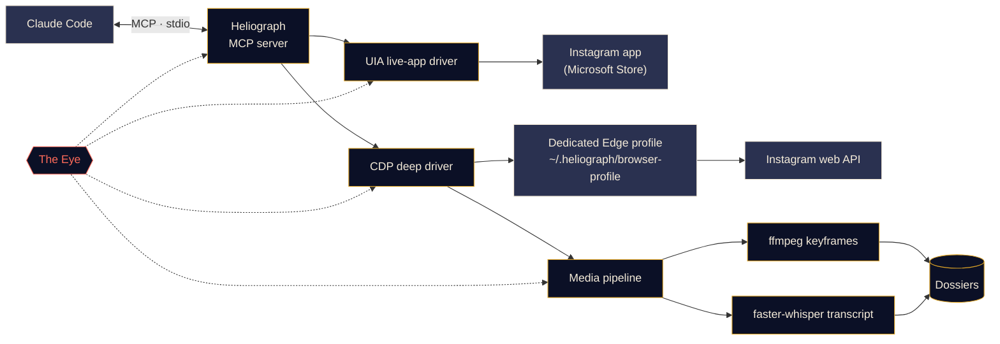

<p align="center">
  
</p>

<p align="center">
  <a href="#quick-start"></a>
  <a href="../../LICENSE"></a>
  <a href="#platform-support"></a>
  <a href="#how-it-works"></a>
  <a href="../../CONTRIBUTING.md#tests"></a>
</p>

<p align="center">
  <a href="../../README.md">English</a> ·
  <a href="README.es.md">Español</a> ·
  <b>Français</b> ·
  <a href="README.de.md">Deutsch</a> ·
  <a href="README.pt-BR.md">Português (BR)</a> ·
  <a href="README.it.md">Italiano</a> ·
  <a href="README.ru.md">Русский</a> ·
  <a href="README.tr.md">Türkçe</a> ·
  <a href="README.ar.md">العربية</a> ·
  <a href="README.hi.md">हिन्दी</a> ·
  <a href="README.zh-CN.md">简体中文</a> ·
  <a href="README.ja.md">日本語</a> ·
  <a href="README.ko.md">한국어</a>
</p>

> Ceci est une traduction. Le [README anglais](../../README.md) fait foi ; en cas de divergence, la version anglaise l'emporte.

---

**Heliograph** relie Claude (via [Claude Code](https://docs.anthropic.com/en/docs/claude-code) et un serveur MCP) à **votre propre Instagram, sur votre propre appareil**. Claude peut lire ce que vous voyez, parcourir vos collections enregistrées et transformer des reels en dossiers structurés et consultables — le tout en local, en gardant la main sur chaque action d'écriture.

> **Pourquoi « Heliograph » ?** La toute première photographie était une *héliographie* (Niépce, années 1820). Un héliographe est aussi un appareil de signalisation qui projette, à l'aide d'un miroir, des éclats de soleil à distance. Un appareil photo et un pont — exactement ce qu'est ce projet.

> [!NOTE]
> **Statut : développement précoce (v0.1.0).** L'architecture est arrêtée et les modules principaux sont en cours de construction. Chaque fonctionnalité ci-dessous est marquée **Disponible**, **En cours** ou **Prévue** — rien ici n'est une promesse qui n'a pas encore été écrite.

## Ce que ça fait

- **Permet à Claude de voir et d'utiliser Instagram comme vous** — dans la vraie application installée, avec votre vraie session.
- **Récupère des données structurées** (collections enregistrées, métadonnées des reels, légendes, médias) via un profil de navigateur dédié et séparé, auquel vous vous connectez une seule fois.
- **Transforme les reels en dossiers** — vidéo, images clés, transcription horodatée et métadonnées réunies dans un dossier que Claude peut lire et analyser.
- **Se surveille lui-même** — *l'Œil* enregistre localement chaque appel d'outil, chaque action des pilotes et chaque sous-processus, pour que les échecs puissent être expliqués, par vous ou par Claude.

## Fonctionnalités

<table>
  <tr>
    <td width="33%" valign="top">
      <h3>Pilote de l'app en direct</h3>
      Pilote l'application Instagram du Microsoft Store via Windows UI Automation : lire l'écran, naviguer, aimer, enregistrer, suivre, faire des captures. Aucune étape de connexion.<br><br><sub><b>En cours</b></sub>
    </td>
    <td width="33%" valign="top">
      <h3>Pilote approfondi</h3>
      Un profil Edge/Chrome dédié piloté via le Chrome DevTools Protocol, qui interroge l'API web d'Instagram depuis la page pour obtenir du JSON propre, des URL vidéo et du traitement par lots.<br><br><sub><b>En cours</b></sub>
    </td>
    <td width="33%" valign="top">
      <h3>Dossiers de reels</h3>
      Images clés par changement de scène avec ffmpeg et déduplication perceptuelle, plus une transcription faster-whisper, réunies dans un dossier Markdown par reel.<br><br><sub><b>En cours</b></sub>
    </td>
  </tr>
  <tr>
    <td width="33%" valign="top">
      <h3>Serveur MCP</h3>
      Un serveur FastMCP qui s'enregistre automatiquement auprès de Claude Code via <code>.mcp.json</code> dès que vous ouvrez le dossier.<br><br><sub><b>En cours</b></sub>
    </td>
    <td width="33%" valign="top">
      <h3>L'Œil</h3>
      Traçage local d'abord : spans, identifiants de trace, masquage des secrets, captures en cas d'échec, vue en direct dans le terminal et rapport lisible par Claude.<br><br><sub><b>Disponible (préliminaire)</b></sub>
    </td>
    <td width="33%" valign="top">
      <h3>Garde-fous</h3>
      Les actions d'écriture exigent une confirmation explicite, tout est limité en débit, les téléchargements sont restreints au CDN d'Instagram et aucun mot de passe ne transite jamais par Heliograph.<br><br><sub><b>En cours</b></sub>
    </td>
  </tr>
</table>

<a id="quick-start"></a>
## Démarrage rapide

**Prérequis :** Python 3.11+ (3.12 recommandé), [uv](https://docs.astral.sh/uv/), [ffmpeg](https://ffmpeg.org/), Microsoft Edge ou Google Chrome, [Claude Code](https://docs.anthropic.com/en/docs/claude-code) et, pour le pilote de l'app en direct sous Windows, l'application Instagram du Microsoft Store.

```bash
# 1. Clone
git clone https://github.com/DeanT-04/instagram-bridge-with-claude.git heliograph
cd heliograph

# 2. Run the one-command setup
./scripts/setup.ps1        # Windows (PowerShell)
./scripts/setup.sh         # macOS / Linux

# 3. Open Claude Code in the folder
claude
```

Claude Code détecte le serveur MCP de Heliograph dans `.mcp.json` et vous demande de l'approuver la première fois. Ensuite, il suffit de demander, par exemple : *« Qu'y a-t-il dans ma collection enregistrée nommée Trading ? »*

> [!IMPORTANT]
> Les scripts d'installation, `.mcp.json` et `heliograph login` sont **en cours**. En attendant, vous pouvez préparer l'environnement à la main :
>
> ```bash
> uv sync
> uv run heliograph doctor
> ```
>
> `doctor` vérifie la présence de l'app Instagram, d'Edge/Chrome, de ffmpeg et votre système, et vous indique ce qui manque.

<a id="how-it-works"></a>
## Comment ça marche



<details>
<summary><b>Pourquoi deux pilotes ?</b></summary>

<br>

L'application Instagram du Microsoft Store est une application web Edge qui tourne dans votre profil Edge habituel. Les versions récentes d'Edge refusent d'ouvrir un port DevTools sur le profil par défaut : l'app installée **ne peut donc pas** être automatisée via DevTools. En revanche, elle **peut** être entièrement lue et pilotée via Windows UI Automation.

| Pilote | Cible | Point fort | Utilisé pour |
|---|---|---|---|
| `uia` | La fenêtre de l'app du Store installée | Votre vraie app et votre vraie session, sans connexion | Naviguer, lire l'écran, aimer / enregistrer / suivre, captures |
| `cdp` | Un profil Edge/Chrome dédié lancé comme fenêtre d'app, DevTools lié à `127.0.0.1` | JSON structuré de l'API web d'Instagram, URL vidéo, capture réseau | Collections enregistrées, métadonnées des reels, téléchargements, extraction en masse |

Les deux implémentent une interface commune `InstagramDriver` là où ils se recoupent. Voir [docs/ARCHITECTURE.md](../ARCHITECTURE.md) pour la conception complète.

</details>

<a id="platform-support"></a>
<details>
<summary><b>Plateformes prises en charge</b></summary>

<br>

| | Windows 10/11 | macOS | Linux |
|---|---|---|---|
| Pilote approfondi (CDP) | En cours | En cours | En cours |
| Pipeline média et dossiers | En cours | En cours | En cours |
| L'Œil | Disponible | Disponible | Disponible |
| Pilote de l'app en direct | En cours (UI Automation) | Prévu | Sans objet |

</details>

## Extraction de reels de trading

Un flux de démonstration : vous enregistrez des reels de trading dans une collection Instagram, et Claude en fait des notes que vous pouvez vraiment étudier.

1. Vous demandez à Claude : *« Extrais les stratégies de ma collection enregistrée "Trading". »*
2. Heliograph liste la collection via le pilote approfondi et télécharge chaque reel depuis le CDN d'Instagram.
3. Le pipeline média extrait les images clés par changement de scène (graphiques, configurations, annotations) et une transcription horodatée.
4. Chaque reel devient un dossier ; Claude les lit et rédige les règles d'entrée, les sorties, la gestion du risque et les affirmations qu'il n'a pas pu vérifier.

```text
dossiers/<reel-id>/
├── meta.json          # author, caption, date, URL, metrics
├── video.mp4
├── transcript.json    # timestamped segments
├── transcript.md
├── frames/*.jpg       # de-duplicated keyframes
└── dossier.md         # everything above, stitched for Claude
```

**Statut :** le générateur de dossiers est **en cours** ; la skill Claude Code `extract-trading-strategies` est **prévue**.

> [!CAUTION]
> Heliograph organise ce que disent les créateurs ; il ne juge pas s'ils ont raison. Rien de ce qu'il produit ne constitue un conseil financier.

## L'Œil

*L'Œil* est l'observabilité intégrée de Heliograph, locale d'abord. Aucun service externe n'est nécessaire.

- Chaque appel d'outil MCP, action de pilote, requête HTTP et sous-processus ffmpeg/whisper est enregistré comme un **span** avec un `trace_id` partagé, pour suivre une requête de Claude de bout en bout.
- Les événements sont écrits dans `~/.heliograph/eye/events.jsonl` (avec rotation), accompagnés d'un index SQLite pour les requêtes.
- **Les secrets sont masqués avant l'écriture** — cookies, `sessionid`, `csrftoken`, en-têtes d'authentification et chaînes ressemblant à des jetons.
- Lorsqu'une étape de l'interface ou du navigateur échoue, une capture d'écran et un instantané d'accessibilité/DOM sont enregistrés et liés à l'événement *(en cours)*.
- `heliograph eye` affiche un flux en direct, en couleurs, avec l'état de santé glissant : taux d'erreur, latence p95, opérations qui échouent le plus.
- `heliograph eye report` — et l'outil MCP `eye_report` *(en cours)* — résume les erreurs récentes, pour que Claude puisse diagnostiquer les problèmes lui-même.
- Export optionnel vers Langfuse lorsque `LANGFUSE_PUBLIC_KEY` / `LANGFUSE_SECRET_KEY` sont définies (désactivé par défaut).

## Sécurité et confidentialité

- **Connexion manuelle, une seule fois.** Vous vous connectez vous-même au profil de navigateur dédié, une fois. Heliograph ne saisit, ne stocke ni ne journalise jamais de mot de passe.
- **Le pilote de l'app en direct ne nécessite aucune connexion** — il utilise l'app Instagram sur laquelle vous êtes déjà connecté.
- **Les actions d'écriture exigent une confirmation.** Aimer, suivre, commenter, envoyer un message, publier et retirer des enregistrements nécessitent un `confirm=True` explicite au niveau MCP : Claude doit d'abord vous demander.
- **Limites de débit avec gigue** sur les écritures *et* les lectures, pour garder un rythme humain.
- **Données uniquement locales.** Les dossiers, les journaux et le profil du navigateur restent dans `~/.heliograph` sur votre machine. Le port DevTools est lié à `127.0.0.1`, sur un port libre aléatoire.
- **Téléchargements sur liste blanche** — uniquement en HTTPS depuis les hôtes du CDN d'Instagram.

Voir [docs/SECURITY.md](../SECURITY.md) pour le modèle de menaces et la façon de signaler une vulnérabilité.

## Référence de la CLI

> Il s'agit de l'**interface prévue**. La colonne Statut indique ce qui fonctionne aujourd'hui.

| Commande | Rôle | Statut |
|---|---|---|
| `heliograph setup` | Installe les dépendances, vérifie l'environnement et enregistre le serveur MCP | Prévu (ébauche) |
| `heliograph doctor` | Détecte l'app Instagram, Edge/Chrome, ffmpeg, le système et l'état de connexion | Disponible |
| `heliograph login` | Ouvre le profil de navigateur dédié pour vous connecter une fois, à la main | Prévu (ébauche) |
| `heliograph mcp` | Lance le serveur MCP sur stdio (Claude Code le démarre pour vous) | Prévu (ébauche) |
| `heliograph extract <url>` | Construit un dossier pour un reel ou une publication | Prévu (ébauche) |
| `heliograph eye` | Flux en direct de l'Œil avec état de santé | Disponible |
| `heliograph eye report` | Synthèse des erreurs et anomalies récentes | Disponible |

<details>
<summary><b>Structure du projet</b></summary>

<br>

```text
src/heliograph/
├── cli.py              # Typer CLI
├── config.py           # settings (env prefix HELIOGRAPH_), paths under ~/.heliograph
├── errors.py           # HeliographError hierarchy
├── detect/             # environment detection: Store app, browsers, ffmpeg, OS
├── drivers/
│   ├── base.py         # InstagramDriver protocol + shared dataclasses
│   ├── uia/            # Windows UI Automation live-app driver
│   └── cdp/            # browser launcher, CDP session, web-API client
├── instagram/          # models + high-level service
├── media/              # allow-listed download, ffmpeg frames, faster-whisper
├── extract/            # reel -> dossier
├── eye/                # the Eye: spans, sinks, redaction, live view, reports
└── mcp/                # FastMCP server (in progress)
tests/                  # pytest; live tests marked @pytest.mark.live
docs/                   # architecture, security, translations, brand assets
scripts/                # setup.ps1 / setup.sh (in progress)
.claude/skills/         # Claude Code skills (planned)
.mcp.json               # MCP registration for Claude Code (in progress)
```

</details>

## Feuille de route

- [ ] Installation en une commande, enregistrement via `.mcp.json` et `heliograph login`
- [ ] Serveur MCP avec des outils de lecture, puis des outils d'écriture confirmés
- [ ] Skill `extract-trading-strategies`
- [ ] Prise en charge **multi-comptes** (profils et état séparés par compte)
- [ ] **Android** via `adb`
- [ ] Pilote de l'app en direct pour **macOS** (API d'accessibilité)

## Contribuer

Les contributions sont les bienvenues — voir [CONTRIBUTING.md](../../CONTRIBUTING.md) et le [Code de conduite](../../CODE_OF_CONDUCT.md).

## Avertissement

Heliograph est un projet open source indépendant. Il **n'est ni affilié à, ni approuvé, ni sponsorisé par Instagram ou Meta Platforms, Inc.** « Instagram » est une marque de son propriétaire, utilisée ici uniquement pour décrire ce avec quoi le logiciel fonctionne. Utilisez Heliograph **uniquement sur votre propre compte**, gardez un usage personnel et à rythme humain, et respectez les [Conditions d'utilisation d'Instagram](https://help.instagram.com/581066165581870). Vous êtes responsable de l'usage que vous en faites.

## Licence

[MIT](../../LICENSE) © 2026 DeanT-04
