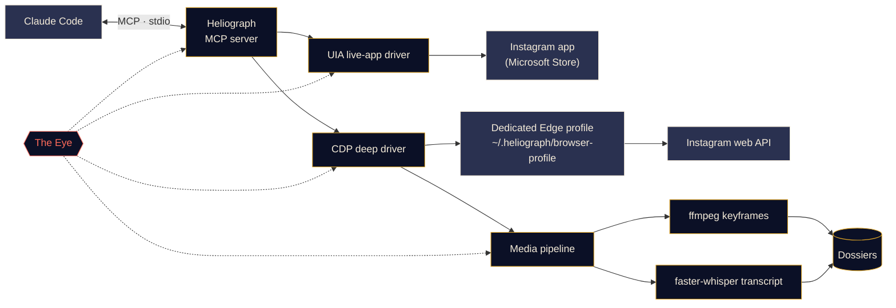

<p align="center">
  
</p>

<p align="center">
  <a href="#quick-start"></a>
  <a href="../../LICENSE"></a>
  <a href="#platform-support"></a>
  <a href="#mcp-tools"></a>
  <a href="https://github.com/DeanT-04/instagram-bridge-with-claude/actions/workflows/ci.yml"></a>
</p>

<p align="center">
  <a href="../../README.md">English</a> ·
  <a href="README.es.md">Español</a> ·
  <b>Français</b> ·
  <a href="README.de.md">Deutsch</a> ·
  <a href="README.pt-BR.md">Português (BR)</a> ·
  <a href="README.it.md">Italiano</a> ·
  <a href="README.ru.md">Русский</a> ·
  <a href="README.tr.md">Türkçe</a> ·
  <a href="README.ar.md">العربية</a> ·
  <a href="README.hi.md">हिन्दी</a> ·
  <a href="README.zh-CN.md">简体中文</a> ·
  <a href="README.ja.md">日本語</a> ·
  <a href="README.ko.md">한국어</a>
</p>

> Ceci est une traduction. Le [README anglais](../../README.md) fait foi ; en cas de divergence, la version anglaise l'emporte.

---

**Heliograph** relie Claude (via [Claude Code](https://docs.anthropic.com/en/docs/claude-code) et un serveur MCP) à **votre propre Instagram, sur votre propre appareil**. Claude peut lire ce que vous voyez, parcourir vos collections enregistrées et transformer des reels en dossiers structurés et consultables — le tout en local, en gardant la main sur chaque action d'écriture.

> **Pourquoi « Heliograph » ?** La toute première photographie était une *héliographie* (Niépce, années 1820). Un héliographe est aussi un appareil de signalisation qui projette, à l'aide d'un miroir, des éclats de soleil à distance. Un appareil photo et un pont — exactement ce qu'est ce projet.

> [!NOTE]
> **Statut : v0.1.0 — précoce, mais fonctionnel.** L'installation, la CLI, le serveur MCP (41 outils), les deux pilotes et le pipeline de dossiers sont livrés. Les lectures ont été vérifiées en direct sur un vrai compte sous Windows 11 (compte connecté, collections, publications d'une collection, recherche, badges de l'app, statut). Les **actions d'écriture** (aimer, enregistrer, suivre, commenter, DM…) sont implémentées et testées en simulation, mais **pas encore vérifiées sur un compte réel**.

## Ce que ça fait

- **Permet à Claude de voir et d'utiliser Instagram comme vous** — dans la vraie application installée, avec votre vraie session.
- **Récupère des données structurées** (collections enregistrées, métadonnées des reels, légendes, DM, médias) via un profil de navigateur dédié auquel vous vous connectez une seule fois.
- **Transforme les reels en dossiers** — vidéo, images clés, planche contact, transcription horodatée et métadonnées dans un dossier que Claude peut lire *et regarder*.
- **Se surveille lui-même** — *l'Œil* enregistre localement chaque appel d'outil, chaque action des pilotes et chaque sous-processus, pour que les échecs puissent être expliqués, par vous ou par Claude.

## Fonctionnalités

<table>
  <tr>
    <td width="33%" valign="top">
      <h3>Pilote de l'app en direct</h3>
      Pilote l'application Instagram du Microsoft Store via Windows UI Automation : lire l'écran, naviguer, défiler, faire des captures, cliquer ou saisir du texte (avec votre confirmation). Aucune étape de connexion.<br><br><sub><b>Disponible · Windows</b></sub>
    </td>
    <td width="33%" valign="top">
      <h3>Pilote approfondi</h3>
      Un profil Edge/Chrome dédié piloté via le Chrome DevTools Protocol, qui interroge l'API web d'Instagram depuis la page pour obtenir du JSON propre, des URL vidéo et du traitement par lots.<br><br><sub><b>Disponible</b></sub>
    </td>
    <td width="33%" valign="top">
      <h3>Dossiers de reels</h3>
      Images clés par changement de scène avec ffmpeg et déduplication perceptuelle, une planche contact et une transcription faster-whisper, réunies dans un dossier Markdown par reel. Le texte à l'écran est lu par OCR, la parole non anglaise reçoit aussi une traduction anglaise, et les petites étiquettes des graphiques peuvent être recadrées et agrandies.<br><br><sub><b>Disponible</b></sub>
    </td>
  </tr>
  <tr>
    <td width="33%" valign="top">
      <h3>Serveur MCP</h3>
      41 outils qui s'enregistrent automatiquement auprès de Claude Code via <code>.mcp.json</code> dès que vous ouvrez le dossier, plus deux skills de projet.<br><br><sub><b>Disponible</b></sub>
    </td>
    <td width="33%" valign="top">
      <h3>L'Œil</h3>
      Traçage local d'abord : spans, identifiants de trace, masquage des secrets, captures et instantanés DOM des échecs, vue en direct dans le terminal et rapports lisibles par Claude.<br><br><sub><b>Disponible</b></sub>
    </td>
    <td width="33%" valign="top">
      <h3>Garde-fous</h3>
      Les actions d'écriture ne font qu'une simulation sans confirmation, tout est limité en débit, les URL et téléchargements sont sur liste blanche et aucun mot de passe ne transite jamais par Heliograph.<br><br><sub><b>Disponible · écritures pas encore vérifiées en direct</b></sub>
    </td>
  </tr>
</table>

<a id="quick-start"></a>
## Démarrage rapide

**Prérequis :** Python 3.11+ (3.12 recommandé), [ffmpeg](https://ffmpeg.org/), Microsoft Edge ou Google Chrome, [Claude Code](https://docs.anthropic.com/en/docs/claude-code) et, pour le pilote de l'app en direct sous Windows, l'application Instagram du Microsoft Store. Le script d'installation installe [uv](https://docs.astral.sh/uv/) s'il manque (après vous l'avoir demandé).

```bash
# 1. Clone
git clone https://github.com/DeanT-04/instagram-bridge-with-claude.git heliograph
cd heliograph

# 2. Run the one-command setup
powershell -ExecutionPolicy Bypass -File scripts\setup.ps1   # Windows
bash scripts/setup.sh                                        # macOS / Linux

# 3. Sign in to Instagram once, yourself, in Heliograph's own browser window
uv run heliograph login

# 4. Open Claude Code in the folder
claude
```

Claude Code détecte le serveur MCP de Heliograph via `.mcp.json` et vous demande de l'approuver la première fois. Windows bloque les scripts par défaut (stratégie d'exécution *Restricted*) : lancez donc le setup avec `powershell -ExecutionPolicy Bypass -File scripts\setup.ps1` comme ci-dessus ; la dérogation ne vaut que pour cette exécution et ne modifie aucun réglage. Le setup peut être relancé sans risque. Options sous **Windows** : `-Yes` (aucune question), `-NoInput` (ne demande jamais, répond non ; pour la CI), `-WithWhisper` (pré-télécharge le modèle vocal, ~500 Mo). Sous **macOS / Linux** : `--yes`, `--no-input`, `--with-whisper`. Si uv manque, le script installe uv 0.12.1 avec son installateur officiel épinglé, après vous avoir demandé. En cas de doute, lancez `uv run heliograph doctor`.

## Utilisation avec Claude

Parlez simplement à Claude dans le dossier du projet. Par exemple :

- *« Extrais toutes les stratégies de ma collection "Trading strats". »* — exécute la skill `extract-trading-strategies` de bout en bout.
- *« Quoi de neuf dans mes DM et mes notifications ? Résume, ne réponds pas. »*
- *« Ouvre l'app Instagram, va dans Reels et dis-moi ce qui est à l'écran. »*
- *« Trouve les cinq dernières publications de @some_creator et rédige un commentaire sur la plus récente. »* — Claude vous montre d'abord une simulation ; rien n'est publié tant que vous n'avez pas dit oui.

`CLAUDE.md` fournit à Claude son manuel d'utilisation (règles de sécurité, familles d'outils, dépannage), et la skill [`instagram-control`](../../.claude/skills/instagram-control/SKILL.md) lui apprend quel outil choisir.

<a id="how-it-works"></a>
## Comment ça marche



<details>
<summary><b>Pourquoi deux pilotes ?</b></summary>

<br>

L'application Instagram du Microsoft Store est une application web Edge qui tourne dans votre profil Edge habituel. Les versions récentes d'Edge refusent d'ouvrir un port DevTools sur le profil par défaut : l'app installée **ne peut donc pas** être automatisée via DevTools. En revanche, elle **peut** être entièrement lue et pilotée via Windows UI Automation.

| Pilote | Cible | Point fort | Utilisé pour |
|---|---|---|---|
| `uia` | La fenêtre de l'app du Store installée | Votre vraie app et votre vraie session, sans connexion | Naviguer, lire l'écran, captures, clics confirmés |
| `cdp` | Un profil Edge/Chrome dédié lancé comme fenêtre d'app, DevTools lié à `127.0.0.1` | JSON structuré de l'API web d'Instagram, URL vidéo, capture réseau | Collections enregistrées, fils, DM, métadonnées des reels, téléchargements, extraction en masse |

Voir [docs/ARCHITECTURE.md](../ARCHITECTURE.md) pour la conception complète.

</details>

<a id="platform-support"></a>
<details>
<summary><b>Plateformes prises en charge</b></summary>

<br>

| | Windows 10/11 | macOS | Linux |
|---|---|---|---|
| Script d'installation | Vérifié | Disponible (non testé) | Disponible (non testé) |
| Pilote approfondi (CDP) et serveur MCP | Vérifié | Disponible (non testé) | Disponible (non testé) |
| Pipeline média et dossiers | Disponible | Disponible (non testé) | Disponible (non testé) |
| L'Œil | Disponible | Disponible | Disponible |
| Pilote de l'app en direct (outils `app_*`) | Vérifié | Prévu | Sans objet |

</details>

<a id="mcp-tools"></a>
## Outils MCP

41 outils répartis en sept familles. Les outils de liste acceptent `limit` et `cursor` ; renvoyez `next_cursor` pour passer à la page suivante.

<details open>
<summary><b>Référence des outils</b></summary>

<br>

| Famille | Outil | Rôle |
|---|---|---|
| **Statut** | `heliograph_status` | Santé : OS, app du Store, navigateurs, ffmpeg, état de connexion |
| | `heliograph_setup_check` | Ce qu'il vous reste à faire pour que tous les outils fonctionnent |
| **Lecture** | `ig_whoami` | Le compte connecté au profil de navigateur de Heliograph |
| | `ig_get_user` | Profil public d'un compte par nom d'utilisateur |
| | `ig_user_posts` | Publications et reels récents d'un compte |
| | `ig_get_media` | Détails complets d'une publication/reel, avec légende et URL des médias |
| | `ig_comments` | Commentaires principaux d'une publication/reel |
| | `ig_search` | Recherche : utilisateurs, hashtags et lieux |
| | `ig_timeline` | Votre fil d'accueil |
| | `ig_reels_feed` | Le fil de découverte Reels |
| | `ig_explore` | Publications de la grille Explorer |
| | `ig_inbox` | Conversations DM avec l'aperçu du dernier message |
| | `ig_thread` | Messages d'une conversation DM |
| | `ig_activity` | Notifications récentes : j'aime, abonnements, commentaires, mentions |
| **Collections** | `ig_list_collections` | Vos collections enregistrées |
| | `ig_collection_posts` | Publications d'une collection, par nom ou id |
| | `ig_saved_posts` | Toutes les publications enregistrées, les plus récentes d'abord |
| **Extraction** | `ig_extract_media` | Construit (ou réutilise) un dossier pour une publication/reel |
| | `ig_extract_collection` | Construit les dossiers d'une collection, par lots |
| | `ig_read_dossier` | Lit le Markdown, la transcription et les métadonnées d'un dossier |
| | `ig_view_frames` | Renvoie la planche contact ou des images clés que Claude peut voir |
| **App en direct** *(Windows)* | `app_open` | Se rattache à la fenêtre de l'app Instagram |
| | `app_snapshot` | Plan textuel de l'écran (arbre d'accessibilité) |
| | `app_screenshot` | Capture de la fenêtre de l'app, même masquée par d'autres |
| | `app_navigate` | Ouvre une section : accueil, recherche, explorer, reels, messages… |
| | `app_click` | Clique un élément par réf ou par nom (les écritures exigent votre confirmation) |
| | `app_scroll` | Défile d'écran en écran (un reel par page dans la visionneuse Reels) |
| | `app_type` | Saisit du texte dans un champ (l'envoi exige votre confirmation) |
| | `app_visible_posts` | Publications/reels affichés à l'écran, avec leurs boutons |
| | `app_badges` | Compteurs de non-lus pour messages et notifications |
| **Écriture** *(avec confirmation)* | `ig_like` / `ig_unlike` | Aime ou n'aime plus une publication/reel |
| | `ig_save` / `ig_unsave` | Enregistre ou retire, éventuellement dans une collection |
| | `ig_follow` / `ig_unfollow` | Suit ou ne suit plus un compte |
| | `ig_comment` | Publie un commentaire avec le texte exact que vous avez approuvé |
| | `ig_send_dm` | Envoie un DM à un utilisateur ou dans une conversation existante |
| **Œil** | `eye_report` | Synthèse de santé : taux d'erreur, opérations lentes et en échec |
| | `eye_trace` | Chaque étape d'un appel d'outil, avec traces d'erreur et artefacts |
| | `eye_recent` | Les derniers événements, éventuellement les erreurs seulement |

</details>

## Extraction de reels de trading

Un flux de démonstration : vous enregistrez des reels de trading dans une collection Instagram, et Claude en fait des notes que vous pouvez vraiment étudier.

1. Vous demandez à Claude : *« Extrais toutes les stratégies de ma collection "Trading strats". »*
2. Heliograph liste la collection via le pilote approfondi et télécharge chaque reel depuis le CDN d'Instagram.
3. Le pipeline média extrait les images clés par changement de scène (graphiques, configurations, annotations), une planche contact et une transcription horodatée. Le texte à l'écran de chaque image clé est lu par OCR, et la parole non anglaise reçoit une traduction anglaise.
4. Claude lit chaque dossier, **regarde les images** avec `ig_view_frames` et rédige une note par reel — règles d'entrée, sorties, gestion du risque, réglages des indicateurs et affirmations qu'il n'a pas pu vérifier — ainsi qu'un index. Les petites étiquettes des graphiques et les réglages d'indicateurs sont recadrés et agrandis (`ig_view_frames(..., crop=...)`) puis confrontés à ce qui est dit.

```text
~/.heliograph/dossiers/<creator>/<code>/
├── meta.json          # author, caption, date, URL, metrics
├── caption.md
├── video.mp4          # or images/NN.jpg for photo posts
├── transcript.json    # timestamped segments + language (+ English translation)
├── transcript.md
├── frames/*.jpg       # de-duplicated keyframes (+ frames.json)
├── ocr.json           # on-screen text of every keyframe (OCR)
├── crops/             # zoomed regions of small chart text
├── contact_sheet.jpg  # every keyframe on one image
└── dossier.md         # everything above, stitched for Claude
```

Les notes sont écrites dans `strategies/` au sein du dossier du projet, ignoré par git car il s'agit de données personnelles. Vous pouvez aussi construire des dossiers sans Claude : `uv run heliograph extract --collection "Trading strats"`.

> [!CAUTION]
> Heliograph organise ce que disent les créateurs ; il ne juge pas s'ils ont raison. Rien de ce qu'il produit ne constitue un conseil financier.

## L'Œil

*L'Œil* est l'observabilité intégrée de Heliograph, locale d'abord. Aucun service externe n'est nécessaire.

- Chaque appel d'outil MCP, action de pilote, requête HTTP et sous-processus ffmpeg/whisper est enregistré comme un **span** avec un `trace_id` partagé, pour suivre une requête de Claude de bout en bout.
- Les événements sont écrits dans `~/.heliograph/eye/events.jsonl` (avec rotation), accompagnés d'un index SQLite pour les requêtes.
- **Les secrets sont masqués avant l'écriture** — cookies, `sessionid`, `csrftoken`, en-têtes d'authentification et chaînes ressemblant à des jetons.
- Lorsqu'une étape de l'interface ou du navigateur échoue, une capture d'écran et un instantané d'accessibilité/DOM sont enregistrés et liés à l'événement.
- Chaque erreur d'outil renvoie un **indice** et un **identifiant de trace** ; Claude peut appeler `eye_trace` dessus pour voir exactement ce qui a échoué.
- `heliograph eye` affiche un flux en direct, en couleurs, avec l'état de santé glissant : taux d'erreur, latence p95, opérations qui échouent le plus. `heliograph eye report` résume les erreurs récentes.
- Export optionnel vers Langfuse lorsque `LANGFUSE_PUBLIC_KEY` / `LANGFUSE_SECRET_KEY` sont définies (désactivé par défaut).

## Sécurité et confidentialité

- **Connexion manuelle, une seule fois.** Vous vous connectez vous-même au profil de navigateur dédié, une fois (`heliograph login`). Heliograph ne saisit, ne stocke ni ne journalise jamais de mot de passe.
- **Le pilote de l'app en direct ne nécessite aucune connexion** — il utilise l'app Instagram sur laquelle vous êtes déjà connecté.
- **Les actions d'écriture sont simulées par défaut.** Aimer, suivre, commenter, DM, enregistrer et leurs inverses renvoient une description de ce qui *se passerait* ; elles n'agissent que si on les rappelle avec `confirm=true`, après votre accord dans le chat. Il en va de même pour les clics sur les boutons d'action ou l'envoi de texte dans l'app en direct.
- **Limites de débit avec gigue** sur les écritures *et* les lectures, pour garder un rythme humain.
- **Données uniquement locales.** Les dossiers, les journaux et le profil du navigateur restent dans `~/.heliograph` sur votre machine, avec des permissions de fichiers privées. Le port DevTools est lié à `127.0.0.1`, sur un port libre aléatoire.
- **Listes blanches strictes** — seules les URL Instagram sont acceptées, et les téléchargements n'arrivent qu'en HTTPS depuis les hôtes du CDN d'Instagram. Des protections contre le path traversal couvrent le client API et les dossiers.

Voir [docs/SECURITY.md](../SECURITY.md) pour le modèle de menaces et la façon de signaler une vulnérabilité.

## Référence de la CLI

| Commande | Rôle | Statut |
|---|---|---|
| `heliograph setup` | Vérifie l'environnement, propose des correctifs (Chromium, app du Store), pré-télécharge Whisper en option, indique les étapes suivantes | Disponible |
| `heliograph setup --no-input` | Les mêmes vérifications sans aucune question (répond non) ; pour les scripts et la CI | Disponible |
| `heliograph doctor` | Détecte l'app Instagram, Edge/Chrome, ffmpeg, le système et l'état de connexion (`--json` pour la sortie brute) | Disponible |
| `heliograph login` | Ouvre le profil de navigateur dédié pour vous connecter une fois, à la main | Disponible |
| `heliograph mcp` | Lance le serveur MCP sur stdio (Claude Code le démarre pour vous) | Disponible |
| `heliograph extract <url>` | Construit un dossier pour un reel/une publication, ou `--collection "<nom>"` pour toute une collection | Disponible |
| `heliograph dossier show <code>` | Affiche un dossier déjà construit : légende, termes détectés, chronologie parole/images/OCR (`--transcript` ajoute la transcription) | Disponible |
| `heliograph dossier frames <code>` | Liste les images clés avec horodatage et texte à l'écran, ou enregistre des zooms recadrés (`--crop`, `--ocr` en option) | Disponible |
| `heliograph eye` | Flux en direct de l'Œil avec état de santé | Disponible |
| `heliograph eye report` | Synthèse des erreurs et anomalies récentes | Disponible |
| `heliograph version` | Affiche la version de Heliograph | Disponible |

Lancez chaque commande depuis le dossier du projet sous la forme `uv run heliograph <commande>`. `login`, `mcp` et `extract` acceptent `--account <clé>` pour utiliser un profil de navigateur séparé.

<details>
<summary><b>Structure du projet</b></summary>

<br>

```text
src/heliograph/
├── cli.py              # Typer CLI entry point
├── commands/           # setup, doctor, login, extract, dossier.py (show / frames)
├── config.py           # settings (env prefix HELIOGRAPH_), paths under ~/.heliograph
├── errors.py           # HeliographError hierarchy
├── writelimit.py       # write rate limit shared by every process (lock file + state)
├── detect/             # environment detection: Store app, browsers, ffmpeg, OS
├── drivers/
│   ├── base.py         # InstagramDriver protocol + shared dataclasses
│   ├── uia/            # Windows UI Automation live-app driver
│   └── cdp/            # browser launcher, CDP session, web-API client, rate limits
├── instagram/          # models, service, collections, write actions
├── media/              # allow-listed download, ffmpeg frames, faster-whisper,
│                       #   ocr.py (on-screen text), dedupe.py (near-duplicate frames)
├── extract/            # reel -> dossier; render.py, signals.py (terms, mismatch),
│                       #   zoom.py (crop + zoom small chart text)
├── eye/                # the Eye: spans, sinks, redaction, live view, reports
└── mcp/                # FastMCP server, tools_*.py per family, runtime, common
tests/                  # pytest; live tests marked @pytest.mark.live
docs/                   # architecture, security, translations, brand assets
scripts/                # setup.ps1 / setup.sh
.github/workflows/ci.yml # lint, strict types and tests on Windows, macOS and Linux
.claude/skills/         # extract-trading-strategies, instagram-control
.mcp.json               # registers the MCP server with Claude Code
CLAUDE.md               # operating manual for Claude
```

</details>

## Feuille de route

- [x] Installation en une commande, enregistrement via `.mcp.json` et `heliograph login`
- [x] Serveur MCP avec outils de lecture, collections, extraction, app en direct, écriture et Œil
- [x] Skills `extract-trading-strategies` et `instagram-control`
- [ ] Vérification en direct de chaque action d'écriture
- [x] CI sous Windows, macOS et Linux
- [ ] Prise en charge **multi-comptes** dans les sessions Claude (les profils séparés fonctionnent déjà via `--account`)
- [ ] **Android** via `adb`
- [ ] Pilote de l'app en direct pour **macOS** (API d'accessibilité)

## Contribuer

Les contributions sont les bienvenues — voir [CONTRIBUTING.md](../../CONTRIBUTING.md) et le [Code de conduite](../../CODE_OF_CONDUCT.md).

## Avertissement

Heliograph est un projet open source indépendant. Il **n'est ni affilié à, ni approuvé, ni sponsorisé par Instagram ou Meta Platforms, Inc.** « Instagram » est une marque de son propriétaire, utilisée ici uniquement pour décrire ce avec quoi le logiciel fonctionne. Utilisez Heliograph **uniquement sur votre propre compte**, gardez un usage personnel et à rythme humain, et respectez les [Conditions d'utilisation d'Instagram](https://help.instagram.com/581066165581870). Vous êtes responsable de l'usage que vous en faites.

## Licence

[MIT](../../LICENSE) © 2026 DeanT-04
