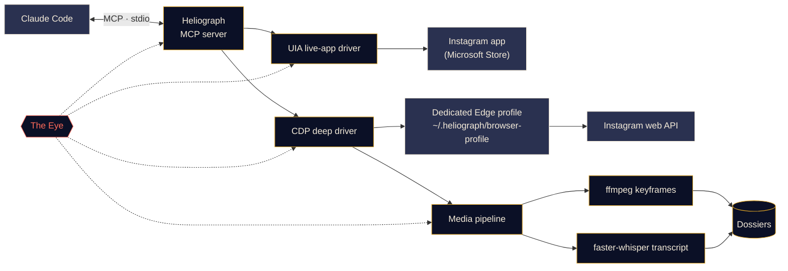

<p align="center">
  
</p>

<p align="center">
  <a href="#quick-start"></a>
  <a href="../../LICENSE"></a>
  <a href="#platform-support"></a>
  <a href="#how-it-works"></a>
  <a href="../../CONTRIBUTING.md#tests"></a>
</p>

<p align="center">
  <a href="../../README.md">English</a> ·
  <a href="README.es.md">Español</a> ·
  <a href="README.fr.md">Français</a> ·
  <a href="README.de.md">Deutsch</a> ·
  <a href="README.pt-BR.md">Português (BR)</a> ·
  <a href="README.it.md">Italiano</a> ·
  <a href="README.ru.md">Русский</a> ·
  <a href="README.tr.md">Türkçe</a> ·
  <a href="README.ar.md">العربية</a> ·
  <b>हिन्दी</b> ·
  <a href="README.zh-CN.md">简体中文</a> ·
  <a href="README.ja.md">日本語</a> ·
  <a href="README.ko.md">한국어</a>
</p>

> यह एक अनुवाद है। [अंग्रेज़ी README](../../README.md) ही आधिकारिक स्रोत है; किसी भी अंतर की स्थिति में अंग्रेज़ी संस्करण मान्य होगा।

---

**Heliograph** Claude को ([Claude Code](https://docs.anthropic.com/en/docs/claude-code) और एक MCP सर्वर के ज़रिए) **आपके अपने डिवाइस पर आपके अपने Instagram** से जोड़ता है। Claude वह पढ़ सकता है जो आप देखते हैं, आपके सेव किए गए कलेक्शन देख सकता है, और रील्स को व्यवस्थित, खोजने योग्य डोज़ियर में बदल सकता है — सब कुछ लोकल रूप से, और हर लिखने वाली कार्रवाई पर नियंत्रण आपका।

> **"Heliograph" ही क्यों?** इतिहास की पहली तस्वीर एक *हीलियोग्राफ़* थी (निएप्स, 1820 का दशक)। हीलियोग्राफ़ एक संकेत-यंत्र भी है, जो दर्पण से सूरज की रोशनी को दूर तक चमकाकर संदेश भेजता है। एक कैमरा और एक पुल — यह प्रोजेक्ट ठीक यही है।

> [!NOTE]
> **स्थिति: शुरुआती विकास (v0.1.0)।** आर्किटेक्चर तय हो चुका है और मुख्य मॉड्यूल बनाए जा रहे हैं। नीचे की हर सुविधा पर **उपलब्ध**, **प्रगति पर** या **नियोजित** लिखा है — यहाँ ऐसा कोई वादा नहीं है जिसका कोड अभी लिखा ही न गया हो।

## यह क्या करता है

- **Claude को Instagram वैसे ही देखने और इस्तेमाल करने देता है जैसे आप करते हैं** — असली इंस्टॉल किए गए ऐप में, आपके असली सेशन के साथ।
- **संरचित डेटा निकालता है** (सेव किए गए कलेक्शन, रील मेटाडेटा, कैप्शन, मीडिया) — एक अलग, समर्पित ब्राउज़र प्रोफ़ाइल के ज़रिए, जिसमें आप सिर्फ़ एक बार लॉग इन करते हैं।
- **रील्स को डोज़ियर में बदलता है** — वीडियो, कीफ़्रेम, टाइमस्टैम्प वाला ट्रांसक्रिप्ट और मेटाडेटा एक ही फ़ोल्डर में, जिसे Claude पढ़ और समझ सकता है।
- **ख़ुद पर नज़र रखता है** — *द आई* हर टूल कॉल, ड्राइवर कार्रवाई और सबप्रोसेस को लोकल रूप से रिकॉर्ड करता है, ताकि विफलताओं को समझाया जा सके — आपके द्वारा या Claude द्वारा।

## सुविधाएँ

<table>
  <tr>
    <td width="33%" valign="top">
      <h3>लाइव-ऐप ड्राइवर</h3>
      Microsoft Store वाले Instagram ऐप को Windows UI Automation से चलाता है: स्क्रीन पढ़ना, नेविगेट करना, लाइक, सेव, फ़ॉलो, स्क्रीनशॉट। कोई लॉगिन चरण नहीं।<br><br><sub><b>प्रगति पर</b></sub>
    </td>
    <td width="33%" valign="top">
      <h3>डीप ड्राइवर</h3>
      Chrome DevTools Protocol से चलने वाली एक समर्पित Edge/Chrome प्रोफ़ाइल, जो पेज के अंदर से Instagram का अपना वेब API पढ़ती है — साफ़ JSON, वीडियो URL और बल्क काम के लिए।<br><br><sub><b>प्रगति पर</b></sub>
    </td>
    <td width="33%" valign="top">
      <h3>रील डोज़ियर</h3>
      परसेप्चुअल डी-डुप्लिकेशन के साथ ffmpeg सीन-चेंज कीफ़्रेम और faster-whisper ट्रांसक्रिप्ट, हर रील के लिए एक Markdown डोज़ियर में।<br><br><sub><b>प्रगति पर</b></sub>
    </td>
  </tr>
  <tr>
    <td width="33%" valign="top">
      <h3>MCP सर्वर</h3>
      एक FastMCP सर्वर जो फ़ोल्डर खोलते ही <code>.mcp.json</code> के ज़रिए Claude Code में अपने-आप रजिस्टर हो जाता है।<br><br><sub><b>प्रगति पर</b></sub>
    </td>
    <td width="33%" valign="top">
      <h3>द आई</h3>
      लोकल-फ़र्स्ट ट्रेसिंग: स्पैन, ट्रेस ID, सीक्रेट्स को छिपाना, विफलता स्नैपशॉट, टर्मिनल में लाइव व्यू, और एक रिपोर्ट जिसे Claude पढ़ सकता है।<br><br><sub><b>उपलब्ध (शुरुआती)</b></sub>
    </td>
    <td width="33%" valign="top">
      <h3>सुरक्षा उपाय</h3>
      लिखने वाली कार्रवाइयों के लिए स्पष्ट पुष्टि ज़रूरी है, हर चीज़ पर रेट लिमिट है, डाउनलोड केवल Instagram के CDN से होते हैं, और कोई भी पासवर्ड कभी Heliograph से होकर नहीं गुज़रता।<br><br><sub><b>प्रगति पर</b></sub>
    </td>
  </tr>
</table>

<a id="quick-start"></a>
## क्विक स्टार्ट

**आपको चाहिए:** Python 3.11+ (3.12 अनुशंसित), [uv](https://docs.astral.sh/uv/), [ffmpeg](https://ffmpeg.org/), Microsoft Edge या Google Chrome, [Claude Code](https://docs.anthropic.com/en/docs/claude-code), और Windows पर लाइव-ऐप ड्राइवर के लिए Microsoft Store से Instagram ऐप।

```bash
# 1. Clone
git clone https://github.com/DeanT-04/instagram-bridge-with-claude.git heliograph
cd heliograph

# 2. Run the one-command setup
./scripts/setup.ps1        # Windows (PowerShell)
./scripts/setup.sh         # macOS / Linux

# 3. Open Claude Code in the folder
claude
```

Claude Code `.mcp.json` से Heliograph MCP सर्वर को पहचान लेता है और पहली बार आपसे उसे मंज़ूरी देने के लिए कहता है। इसके बाद बस पूछिए, जैसे: *"मेरे Trading नाम के सेव किए गए कलेक्शन में क्या है?"*

> [!IMPORTANT]
> सेटअप स्क्रिप्ट, `.mcp.json` और `heliograph login` अभी **प्रगति पर** हैं। तब तक आप हाथ से सेटअप कर सकते हैं:
>
> ```bash
> uv sync
> uv run heliograph doctor
> ```
>
> `doctor` Instagram ऐप, Edge/Chrome, ffmpeg और आपके OS की जाँच करता है और बताता है कि क्या कमी है।

<a id="how-it-works"></a>
## यह कैसे काम करता है



<details>
<summary><b>दो ड्राइवर क्यों?</b></summary>

<br>

Microsoft Store वाला Instagram ऐप एक Edge वेब ऐप है जो आपकी सामान्य Edge प्रोफ़ाइल में चलता है। Edge के हाल के संस्करण डिफ़ॉल्ट प्रोफ़ाइल पर DevTools पोर्ट खोलने से इनकार करते हैं, इसलिए इंस्टॉल किए गए ऐप को DevTools से **ऑटोमेट नहीं किया जा सकता**। लेकिन Windows UI Automation के ज़रिए इसे पूरी तरह **पढ़ा और चलाया जा सकता है**।

| ड्राइवर | लक्ष्य | ख़ूबी | उपयोग |
|---|---|---|---|
| `uia` | इंस्टॉल किए गए Store ऐप की विंडो | आपका असली ऐप और सेशन, कोई लॉगिन नहीं | नेविगेशन, स्क्रीन पर जो है उसे पढ़ना, लाइक / सेव / फ़ॉलो, स्क्रीनशॉट |
| `cdp` | ऐप विंडो के रूप में खुलने वाली समर्पित Edge/Chrome प्रोफ़ाइल, DevTools `127.0.0.1` से बंधा | Instagram वेब API से संरचित JSON, वीडियो URL, नेटवर्क कैप्चर | सेव किए गए कलेक्शन, रील मेटाडेटा, डाउनलोड, बल्क एक्सट्रैक्शन |

जहाँ दोनों की क्षमताएँ मिलती हैं, वहाँ दोनों एक ही `InstagramDriver` इंटरफ़ेस लागू करते हैं। पूरे डिज़ाइन के लिए [docs/ARCHITECTURE.md](../ARCHITECTURE.md) देखें।

</details>

<a id="platform-support"></a>
<details>
<summary><b>प्लेटफ़ॉर्म समर्थन</b></summary>

<br>

| | Windows 10/11 | macOS | Linux |
|---|---|---|---|
| डीप ड्राइवर (CDP) | प्रगति पर | प्रगति पर | प्रगति पर |
| मीडिया पाइपलाइन और डोज़ियर | प्रगति पर | प्रगति पर | प्रगति पर |
| द आई | उपलब्ध | उपलब्ध | उपलब्ध |
| लाइव-ऐप ड्राइवर | प्रगति पर (UI Automation) | नियोजित | लागू नहीं |

</details>

## ट्रेडिंग रील एक्सट्रैक्शन

एक नमूना वर्कफ़्लो: आप ट्रेडिंग रील्स को Instagram कलेक्शन में सेव करते हैं, और Claude उन्हें ऐसे नोट्स में बदल देता है जिनसे आप सच में सीख सकें।

1. आप Claude से कहते हैं: *"मेरे सेव किए गए 'Trading' कलेक्शन से रणनीतियाँ निकालो।"*
2. Heliograph डीप ड्राइवर के ज़रिए कलेक्शन की सूची बनाता है और हर रील को Instagram के CDN से डाउनलोड करता है।
3. मीडिया पाइपलाइन सीन-चेंज कीफ़्रेम (चार्ट, सेटअप, एनोटेशन) और टाइमस्टैम्प वाला ट्रांसक्रिप्ट निकालती है।
4. हर रील एक डोज़ियर बन जाती है; Claude उन्हें पढ़कर एंट्री नियम, एग्ज़िट, रिस्क मैनेजमेंट, और वे दावे लिखता है जिनकी वह पुष्टि नहीं कर सका।

```text
dossiers/<reel-id>/
├── meta.json          # author, caption, date, URL, metrics
├── video.mp4
├── transcript.json    # timestamped segments
├── transcript.md
├── frames/*.jpg       # de-duplicated keyframes
└── dossier.md         # everything above, stitched for Claude
```

**स्थिति:** डोज़ियर बिल्डर **प्रगति पर** है; `extract-trading-strategies` Claude Code स्किल **नियोजित** है।

> [!CAUTION]
> Heliograph क्रिएटर्स की कही बातों को व्यवस्थित करता है; यह तय नहीं करता कि वे सही हैं या नहीं। इसका कोई भी आउटपुट वित्तीय सलाह नहीं है।

## द आई

*द आई* Heliograph की अंतर्निहित, लोकल-फ़र्स्ट ऑब्ज़र्वेबिलिटी है। किसी बाहरी सेवा की ज़रूरत नहीं।

- हर MCP टूल कॉल, ड्राइवर कार्रवाई, HTTP अनुरोध और ffmpeg/whisper सबप्रोसेस एक साझा `trace_id` के साथ **स्पैन** के रूप में दर्ज होता है, ताकि Claude के एक अनुरोध को शुरू से अंत तक ट्रैक किया जा सके।
- इवेंट `~/.heliograph/eye/events.jsonl` (रोटेटिंग) में जाते हैं, साथ में क्वेरी के लिए एक SQLite इंडेक्स।
- **लिखने से पहले सीक्रेट्स छिपा दिए जाते हैं** — कुकीज़, `sessionid`, `csrftoken`, ऑथ हेडर और टोकन जैसी स्ट्रिंग्स।
- जब UI या ब्राउज़र का कोई चरण विफल होता है, तो एक स्क्रीनशॉट और एक्सेसिबिलिटी/DOM स्नैपशॉट सहेजकर इवेंट से जोड़ दिया जाता है *(प्रगति पर)*।
- `heliograph eye` रंगीन लाइव टेल और चलती हुई हेल्थ दिखाता है: त्रुटि दर, p95 लेटेंसी, सबसे ज़्यादा विफल होने वाले ऑपरेशन।
- `heliograph eye report` — और MCP टूल `eye_report` *(प्रगति पर)* — हाल की त्रुटियों का सार देता है, ताकि Claude ख़ुद समस्याओं का निदान कर सके।
- `LANGFUSE_PUBLIC_KEY` / `LANGFUSE_SECRET_KEY` सेट होने पर Langfuse में वैकल्पिक एक्सपोर्ट (डिफ़ॉल्ट रूप से बंद)।

## सुरक्षा और गोपनीयता

- **एक बार, हाथ से लॉगिन।** आप ख़ुद, एक बार, समर्पित ब्राउज़र प्रोफ़ाइल में साइन इन करते हैं। Heliograph कभी भी पासवर्ड टाइप, स्टोर या लॉग नहीं करता।
- **लाइव-ऐप ड्राइवर को लॉगिन की ज़रूरत नहीं** — यह उसी Instagram ऐप का उपयोग करता है जिसमें आप पहले से साइन इन हैं।
- **लिखने वाली कार्रवाइयों के लिए पुष्टि ज़रूरी है।** लाइक, फ़ॉलो, कमेंट, DM, पोस्ट और अनसेव — सभी के लिए MCP स्तर पर स्पष्ट `confirm=True` चाहिए, इसलिए Claude को पहले आपसे पूछना होगा।
- **जिटर के साथ रेट लिमिट** लिखने *और* पढ़ने दोनों पर, ताकि उपयोग इंसानी रफ़्तार में रहे।
- **केवल लोकल डेटा।** डोज़ियर, लॉग और ब्राउज़र प्रोफ़ाइल आपकी मशीन पर `~/.heliograph` में रहते हैं। DevTools पोर्ट एक रैंडम ख़ाली पोर्ट पर `127.0.0.1` से बंधा होता है।
- **अनुमत-सूची वाले डाउनलोड** — केवल Instagram के CDN होस्ट से HTTPS के ज़रिए।

थ्रेट मॉडल और किसी कमज़ोरी की रिपोर्ट करने के तरीके के लिए [docs/SECURITY.md](../SECURITY.md) देखें।

## CLI संदर्भ

> यह **नियोजित इंटरफ़ेस** है। स्थिति कॉलम बताता है कि आज क्या काम करता है।

| कमांड | क्या करता है | स्थिति |
|---|---|---|
| `heliograph setup` | डिपेंडेंसी इंस्टॉल करता है, परिवेश जाँचता है और MCP सर्वर रजिस्टर करता है | नियोजित (स्टब) |
| `heliograph doctor` | Instagram ऐप, Edge/Chrome, ffmpeg, OS और लॉगिन स्थिति का पता लगाता है | उपलब्ध |
| `heliograph login` | समर्पित ब्राउज़र प्रोफ़ाइल खोलता है ताकि आप एक बार हाथ से साइन इन कर सकें | नियोजित (स्टब) |
| `heliograph mcp` | MCP सर्वर को stdio पर चलाता है (Claude Code इसे आपके लिए शुरू करता है) | नियोजित (स्टब) |
| `heliograph extract <url>` | एक रील या पोस्ट के लिए डोज़ियर बनाता है | नियोजित (स्टब) |
| `heliograph eye` | हेल्थ के साथ द आई का लाइव टेल | उपलब्ध |
| `heliograph eye report` | हाल की त्रुटियों और असामान्यताओं का सारांश | उपलब्ध |

<details>
<summary><b>प्रोजेक्ट संरचना</b></summary>

<br>

```text
src/heliograph/
├── cli.py              # Typer CLI
├── config.py           # settings (env prefix HELIOGRAPH_), paths under ~/.heliograph
├── errors.py           # HeliographError hierarchy
├── detect/             # environment detection: Store app, browsers, ffmpeg, OS
├── drivers/
│   ├── base.py         # InstagramDriver protocol + shared dataclasses
│   ├── uia/            # Windows UI Automation live-app driver
│   └── cdp/            # browser launcher, CDP session, web-API client
├── instagram/          # models + high-level service
├── media/              # allow-listed download, ffmpeg frames, faster-whisper
├── extract/            # reel -> dossier
├── eye/                # the Eye: spans, sinks, redaction, live view, reports
└── mcp/                # FastMCP server (in progress)
tests/                  # pytest; live tests marked @pytest.mark.live
docs/                   # architecture, security, translations, brand assets
scripts/                # setup.ps1 / setup.sh (in progress)
.claude/skills/         # Claude Code skills (planned)
.mcp.json               # MCP registration for Claude Code (in progress)
```

</details>

## रोडमैप

- [ ] एक-कमांड सेटअप, `.mcp.json` रजिस्ट्रेशन और `heliograph login`
- [ ] पढ़ने वाले टूल्स के साथ MCP सर्वर, फिर पुष्टि वाले लिखने के टूल्स
- [ ] `extract-trading-strategies` स्किल
- [ ] **मल्टी-अकाउंट** समर्थन (हर अकाउंट के लिए अलग प्रोफ़ाइल और स्थिति)
- [ ] `adb` के ज़रिए **Android**
- [ ] **macOS** लाइव-ऐप ड्राइवर (Accessibility API)

## योगदान

योगदान का स्वागत है — [CONTRIBUTING.md](../../CONTRIBUTING.md) और [आचार संहिता](../../CODE_OF_CONDUCT.md) देखें।

## अस्वीकरण

Heliograph एक स्वतंत्र ओपन-सोर्स प्रोजेक्ट है। यह **Instagram या Meta Platforms, Inc. से संबद्ध नहीं है, न ही उनके द्वारा समर्थित या प्रायोजित है।** "Instagram" इसके स्वामी का ट्रेडमार्क है और यहाँ केवल यह बताने के लिए उपयोग किया गया है कि सॉफ़्टवेयर किसके साथ काम करता है। Heliograph का उपयोग **केवल अपने अकाउंट पर** करें, उपयोग को निजी और इंसानी रफ़्तार में रखें, और [Instagram की उपयोग की शर्तों](https://help.instagram.com/581066165581870) का सम्मान करें। इसके उपयोग की ज़िम्मेदारी आपकी है।

## लाइसेंस

[MIT](../../LICENSE) © 2026 DeanT-04
