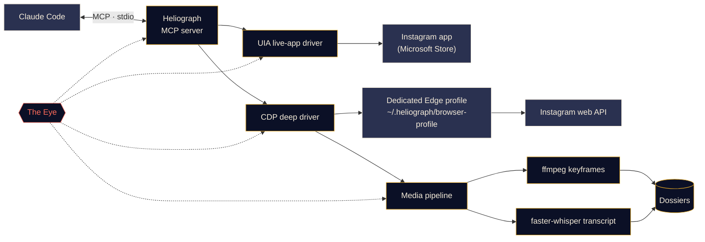

<p align="center">
  
</p>

<p align="center">
  <a href="#quick-start"></a>
  <a href="../../LICENSE"></a>
  <a href="#platform-support"></a>
  <a href="#mcp-tools"></a>
  <a href="https://github.com/DeanT-04/instagram-bridge-with-claude/actions/workflows/ci.yml"></a>
</p>

<p align="center">
  <a href="../../README.md">English</a> ·
  <a href="README.es.md">Español</a> ·
  <a href="README.fr.md">Français</a> ·
  <a href="README.de.md">Deutsch</a> ·
  <a href="README.pt-BR.md">Português (BR)</a> ·
  <a href="README.it.md">Italiano</a> ·
  <a href="README.ru.md">Русский</a> ·
  <a href="README.tr.md">Türkçe</a> ·
  <a href="README.ar.md">العربية</a> ·
  <b>हिन्दी</b> ·
  <a href="README.zh-CN.md">简体中文</a> ·
  <a href="README.ja.md">日本語</a> ·
  <a href="README.ko.md">한국어</a>
</p>

> यह एक अनुवाद है। [अंग्रेज़ी README](../../README.md) ही आधिकारिक स्रोत है; किसी भी अंतर की स्थिति में अंग्रेज़ी संस्करण मान्य होगा।

---

**Heliograph** Claude को ([Claude Code](https://docs.anthropic.com/en/docs/claude-code) और एक MCP सर्वर के ज़रिए) **आपके अपने डिवाइस पर आपके अपने Instagram** से जोड़ता है। Claude वह पढ़ सकता है जो आप देखते हैं, आपके सेव किए गए कलेक्शन देख सकता है, और रील्स को व्यवस्थित, खोजने योग्य डोज़ियर में बदल सकता है — सब कुछ लोकल रूप से, और हर लिखने वाली कार्रवाई पर नियंत्रण आपका।

> **"Heliograph" ही क्यों?** इतिहास की पहली तस्वीर एक *हीलियोग्राफ़* थी (निएप्स, 1820 का दशक)। हीलियोग्राफ़ एक संकेत-यंत्र भी है, जो दर्पण से सूरज की रोशनी को दूर तक चमकाकर संदेश भेजता है। एक कैमरा और एक पुल — यह प्रोजेक्ट ठीक यही है।

> [!NOTE]
> **स्थिति: v0.1.0 — शुरुआती, लेकिन काम कर रहा है।** सेटअप, CLI, MCP सर्वर (41 टूल), दोनों ड्राइवर और डोज़ियर पाइपलाइन जारी हो चुके हैं। पढ़ने वाली कार्रवाइयों की Windows 11 पर एक असली अकाउंट के साथ लाइव पुष्टि हो चुकी है (लॉग-इन अकाउंट, कलेक्शन, कलेक्शन की पोस्ट, सर्च, ऐप बैज, स्थिति)। **लिखने वाली कार्रवाइयाँ** (लाइक, सेव, फ़ॉलो, कमेंट, DM…) लागू हैं और ड्राई-रन में जाँची गई हैं, लेकिन **अभी किसी असली अकाउंट पर इनकी पुष्टि नहीं हुई है**।

## यह क्या करता है

- **Claude को Instagram वैसे ही देखने और इस्तेमाल करने देता है जैसे आप करते हैं** — असली इंस्टॉल किए गए ऐप में, आपके असली सेशन के साथ।
- **संरचित डेटा निकालता है** (सेव किए गए कलेक्शन, रील मेटाडेटा, कैप्शन, DM, मीडिया) — एक समर्पित ब्राउज़र प्रोफ़ाइल के ज़रिए, जिसमें आप सिर्फ़ एक बार लॉग इन करते हैं।
- **रील्स को डोज़ियर में बदलता है** — वीडियो, कीफ़्रेम, एक कॉन्टैक्ट शीट, टाइमस्टैम्प वाला ट्रांसक्रिप्ट और मेटाडेटा एक ही फ़ोल्डर में, जिसे Claude पढ़ *और देख* सकता है।
- **ख़ुद पर नज़र रखता है** — *द आई* हर टूल कॉल, ड्राइवर कार्रवाई और सबप्रोसेस को लोकल रूप से रिकॉर्ड करता है, ताकि विफलताओं को समझाया जा सके — आपके द्वारा या Claude द्वारा।

## सुविधाएँ

<table>
  <tr>
    <td width="33%" valign="top">
      <h3>लाइव-ऐप ड्राइवर</h3>
      Microsoft Store वाले Instagram ऐप को Windows UI Automation से चलाता है: स्क्रीन पढ़ना, नेविगेट करना, स्क्रॉल, स्क्रीनशॉट, और क्लिक या टाइप करना (आपकी पुष्टि के साथ)। कोई लॉगिन चरण नहीं।<br><br><sub><b>उपलब्ध · Windows</b></sub>
    </td>
    <td width="33%" valign="top">
      <h3>डीप ड्राइवर</h3>
      Chrome DevTools Protocol से चलने वाली एक समर्पित Edge/Chrome प्रोफ़ाइल, जो पेज के अंदर से Instagram का अपना वेब API पढ़ती है — साफ़ JSON, वीडियो URL और बल्क काम के लिए।<br><br><sub><b>उपलब्ध</b></sub>
    </td>
    <td width="33%" valign="top">
      <h3>रील डोज़ियर</h3>
      परसेप्चुअल डी-डुप्लिकेशन के साथ ffmpeg सीन-चेंज कीफ़्रेम, एक कॉन्टैक्ट शीट और faster-whisper ट्रांसक्रिप्ट, हर रील के लिए एक Markdown डोज़ियर में। स्क्रीन पर लिखा टेक्स्ट OCR से पढ़ा जाता है, गैर-अंग्रेज़ी बोली का अंग्रेज़ी अनुवाद भी जुड़ता है, और चार्ट के छोटे लेबल क्रॉप करके ज़ूम किए जा सकते हैं।<br><br><sub><b>उपलब्ध</b></sub>
    </td>
  </tr>
  <tr>
    <td width="33%" valign="top">
      <h3>MCP सर्वर</h3>
      41 टूल जो फ़ोल्डर खोलते ही <code>.mcp.json</code> के ज़रिए Claude Code में अपने-आप रजिस्टर हो जाते हैं, साथ में दो प्रोजेक्ट स्किल।<br><br><sub><b>उपलब्ध</b></sub>
    </td>
    <td width="33%" valign="top">
      <h3>द आई</h3>
      लोकल-फ़र्स्ट ट्रेसिंग: स्पैन, ट्रेस ID, सीक्रेट्स को छिपाना, विफलता के स्क्रीनशॉट और DOM स्नैपशॉट, टर्मिनल में लाइव व्यू, और रिपोर्टें जिन्हें Claude पढ़ सकता है।<br><br><sub><b>उपलब्ध</b></sub>
    </td>
    <td width="33%" valign="top">
      <h3>सुरक्षा उपाय</h3>
      पुष्टि के बिना लिखने वाली कार्रवाइयाँ सिर्फ़ ड्राई-रन होती हैं, हर चीज़ पर रेट लिमिट है, URL और डाउनलोड अनुमत-सूची में हैं, और कोई भी पासवर्ड कभी Heliograph से होकर नहीं गुज़रता।<br><br><sub><b>उपलब्ध · लिखने की लाइव पुष्टि अभी बाकी</b></sub>
    </td>
  </tr>
</table>

<a id="quick-start"></a>
## क्विक स्टार्ट

**आपको चाहिए:** Python 3.11+ (3.12 अनुशंसित), [ffmpeg](https://ffmpeg.org/), Microsoft Edge या Google Chrome, [Claude Code](https://docs.anthropic.com/en/docs/claude-code), और Windows पर लाइव-ऐप ड्राइवर के लिए Microsoft Store से Instagram ऐप। अगर [uv](https://docs.astral.sh/uv/) नहीं है तो सेटअप स्क्रिप्ट (पूछकर) उसे इंस्टॉल कर देती है।

```bash
# 1. Clone
git clone https://github.com/DeanT-04/instagram-bridge-with-claude.git heliograph
cd heliograph

# 2. Run the one-command setup
powershell -ExecutionPolicy Bypass -File scripts\setup.ps1   # Windows
bash scripts/setup.sh                                        # macOS / Linux

# 3. Sign in to Instagram once, yourself, in Heliograph's own browser window
uv run heliograph login

# 4. Open Claude Code in the folder
claude
```

Claude Code `.mcp.json` से Heliograph MCP सर्वर पहचान लेता है और पहली बार आपसे मंज़ूरी माँगता है। नया Windows स्क्रिप्ट ब्लॉक करता है (एक्ज़िक्यूशन पॉलिसी *Restricted*), इसलिए सेटअप ऊपर दिखाए अनुसार `powershell -ExecutionPolicy Bypass -File scripts\setup.ps1` से चलाएँ: यह छूट सिर्फ़ उसी बार के लिए है और कोई सेटिंग नहीं बदलती। सेटअप दोबारा चलाना सुरक्षित है। **Windows** पर विकल्प: `-Yes` (कोई सवाल नहीं), `-NoInput` (कभी नहीं पूछता, जवाब 'नहीं'; CI के लिए), `-WithWhisper` (स्पीच मॉडल पहले से डाउनलोड, ~500 MB)। **macOS / Linux** पर: `--yes`, `--no-input`, `--with-whisper`। अगर uv नहीं है, तो स्क्रिप्ट पूछने के बाद पिन किए गए आधिकारिक इंस्टॉलर से uv 0.12.1 इंस्टॉल करती है। कुछ गड़बड़ लगे तो `uv run heliograph doctor` चलाएँ।

## Claude के साथ उपयोग

बस प्रोजेक्ट फ़ोल्डर में Claude से बात करें। उदाहरण:

- *"मेरे 'Trading strats' कलेक्शन से हर रणनीति निकालो।"* — `extract-trading-strategies` स्किल को शुरू से अंत तक चलाता है।
- *"मेरे DM और नोटिफ़िकेशन में नया क्या है? सारांश दो, जवाब मत दो।"*
- *"Instagram ऐप खोलो, Reels पर जाओ और बताओ स्क्रीन पर क्या है।"*
- *"@some_creator की पिछली पाँच पोस्ट ढूँढो और सबसे नई पर एक कमेंट का ड्राफ़्ट लिखो।"* — Claude पहले आपको ड्राई-रन दिखाता है; जब तक आप हाँ न कहें, कुछ पोस्ट नहीं होता।

`CLAUDE.md` Claude को उसका संचालन मैनुअल देता है (सुरक्षा नियम, टूल परिवार, समस्या-निवारण), और [`instagram-control`](../../.claude/skills/instagram-control/SKILL.md) स्किल उसे सिखाती है कि कौन-सा टूल चुनना है।

<a id="how-it-works"></a>
## यह कैसे काम करता है



<details>
<summary><b>दो ड्राइवर क्यों?</b></summary>

<br>

Microsoft Store वाला Instagram ऐप एक Edge वेब ऐप है जो आपकी सामान्य Edge प्रोफ़ाइल में चलता है। Edge के हाल के संस्करण डिफ़ॉल्ट प्रोफ़ाइल पर DevTools पोर्ट खोलने से इनकार करते हैं, इसलिए इंस्टॉल किए गए ऐप को DevTools से **ऑटोमेट नहीं किया जा सकता**। लेकिन Windows UI Automation के ज़रिए इसे पूरी तरह **पढ़ा और चलाया जा सकता है**।

| ड्राइवर | लक्ष्य | ख़ूबी | उपयोग |
|---|---|---|---|
| `uia` | इंस्टॉल किए गए Store ऐप की विंडो | आपका असली ऐप और सेशन, कोई लॉगिन नहीं | नेविगेशन, स्क्रीन पर जो है उसे पढ़ना, स्क्रीनशॉट, पुष्टि वाले क्लिक |
| `cdp` | ऐप विंडो के रूप में खुलने वाली समर्पित Edge/Chrome प्रोफ़ाइल, DevTools `127.0.0.1` से बंधा | Instagram वेब API से संरचित JSON, वीडियो URL, नेटवर्क कैप्चर | सेव किए गए कलेक्शन, फ़ीड, DM, रील मेटाडेटा, डाउनलोड, बल्क एक्सट्रैक्शन |

पूरे डिज़ाइन के लिए [docs/ARCHITECTURE.md](../ARCHITECTURE.md) देखें।

</details>

<a id="platform-support"></a>
<details>
<summary><b>प्लेटफ़ॉर्म समर्थन</b></summary>

<br>

| | Windows 10/11 | macOS | Linux |
|---|---|---|---|
| सेटअप स्क्रिप्ट | पुष्टि हुई | उपलब्ध (परीक्षण नहीं) | उपलब्ध (परीक्षण नहीं) |
| डीप ड्राइवर (CDP) और MCP सर्वर | पुष्टि हुई | उपलब्ध (परीक्षण नहीं) | उपलब्ध (परीक्षण नहीं) |
| मीडिया पाइपलाइन और डोज़ियर | उपलब्ध | उपलब्ध (परीक्षण नहीं) | उपलब्ध (परीक्षण नहीं) |
| द आई | उपलब्ध | उपलब्ध | उपलब्ध |
| लाइव-ऐप ड्राइवर (`app_*` टूल) | पुष्टि हुई | नियोजित | लागू नहीं |

</details>

<a id="mcp-tools"></a>
## MCP टूल

सात परिवारों में 41 टूल। सूची वाले टूल `limit` और `cursor` लेते हैं; अगला पेज पाने के लिए `next_cursor` वापस भेजें।

<details open>
<summary><b>टूल संदर्भ</b></summary>

<br>

| परिवार | टूल | क्या करता है |
|---|---|---|
| **स्थिति** | `heliograph_status` | हेल्थ: OS, Store ऐप, ब्राउज़र, ffmpeg, लॉगिन स्थिति |
| | `heliograph_setup_check` | सभी टूल चलाने के लिए आपको अभी क्या करना बाकी है |
| **पढ़ना** | `ig_whoami` | Heliograph की ब्राउज़र प्रोफ़ाइल में लॉग-इन अकाउंट |
| | `ig_get_user` | यूज़रनेम से किसी अकाउंट की सार्वजनिक प्रोफ़ाइल |
| | `ig_user_posts` | किसी अकाउंट की हाल की पोस्ट और रील्स |
| | `ig_get_media` | एक पोस्ट/रील का पूरा विवरण, कैप्शन और मीडिया URL सहित |
| | `ig_comments` | किसी पोस्ट/रील के मुख्य कमेंट |
| | `ig_search` | टॉप सर्च: यूज़र, हैशटैग और जगहें |
| | `ig_timeline` | आपकी होम फ़ीड |
| | `ig_reels_feed` | Reels डिस्कवरी फ़ीड |
| | `ig_explore` | Explore ग्रिड की पोस्ट |
| | `ig_inbox` | आख़िरी संदेश के प्रीव्यू के साथ DM थ्रेड |
| | `ig_thread` | एक DM थ्रेड के संदेश |
| | `ig_activity` | हाल के नोटिफ़िकेशन: लाइक, फ़ॉलो, कमेंट, मेंशन |
| **कलेक्शन** | `ig_list_collections` | आपके सेव किए गए कलेक्शन |
| | `ig_collection_posts` | नाम या id से एक कलेक्शन की पोस्ट |
| | `ig_saved_posts` | सभी सेव की गई पोस्ट, सबसे नई पहले |
| **एक्सट्रैक्ट** | `ig_extract_media` | एक पोस्ट/रील का डोज़ियर बनाता (या दोबारा इस्तेमाल करता) है |
| | `ig_extract_collection` | किसी कलेक्शन के डोज़ियर बैच में बनाता है |
| | `ig_read_dossier` | डोज़ियर का Markdown, ट्रांसक्रिप्ट और मेटाडेटा पढ़ता है |
| | `ig_view_frames` | कॉन्टैक्ट शीट या कीफ़्रेम को ऐसी इमेज के रूप में लौटाता है जिन्हें Claude देख सके |
| **लाइव ऐप** *(Windows)* | `app_open` | Instagram ऐप विंडो से जुड़ता है |
| | `app_snapshot` | स्क्रीन पर जो है उसकी टेक्स्ट रूपरेखा (एक्सेसिबिलिटी ट्री) |
| | `app_screenshot` | ऐप विंडो का स्क्रीनशॉट, भले वह दूसरी विंडो के पीछे हो |
| | `app_navigate` | कोई सेक्शन खोलता है: होम, सर्च, एक्सप्लोर, रील्स, मैसेज… |
| | `app_click` | ref या नाम से किसी एलिमेंट पर क्लिक (लिखने के लिए आपकी पुष्टि ज़रूरी) |
| | `app_scroll` | स्क्रीन-दर-स्क्रीन स्क्रॉल (Reels व्यूअर में हर पेज पर एक रील) |
| | `app_type` | किसी फ़ील्ड में टाइप (भेजने के लिए आपकी पुष्टि ज़रूरी) |
| | `app_visible_posts` | स्क्रीन पर दिख रही पोस्ट/रील्स, उनके बटनों के साथ |
| | `app_badges` | मैसेज और नोटिफ़िकेशन के अनपढ़े काउंट |
| **लिखना** *(पुष्टि के साथ)* | `ig_like` / `ig_unlike` | किसी पोस्ट/रील को लाइक या अनलाइक करना |
| | `ig_save` / `ig_unsave` | सेव या अनसेव, चाहें तो किसी कलेक्शन में |
| | `ig_follow` / `ig_unfollow` | किसी अकाउंट को फ़ॉलो या अनफ़ॉलो करना |
| | `ig_comment` | ठीक वही टेक्स्ट कमेंट करना जिसे आपने मंज़ूरी दी |
| | `ig_send_dm` | किसी यूज़र या मौजूदा थ्रेड में DM भेजना |
| **आई** | `eye_report` | हेल्थ सारांश: त्रुटि दर, धीमे और विफल ऑपरेशन |
| | `eye_trace` | एक टूल कॉल का हर चरण, ट्रेसबैक और आर्टिफ़ैक्ट के साथ |
| | `eye_recent` | सबसे हाल के इवेंट, चाहें तो सिर्फ़ त्रुटियाँ |

</details>

## ट्रेडिंग रील एक्सट्रैक्शन

एक नमूना वर्कफ़्लो: आप ट्रेडिंग रील्स को Instagram कलेक्शन में सेव करते हैं, और Claude उन्हें ऐसे नोट्स में बदल देता है जिनसे आप सच में सीख सकें।

1. आप Claude से कहते हैं: *"मेरे 'Trading strats' कलेक्शन से हर रणनीति निकालो।"*
2. Heliograph डीप ड्राइवर के ज़रिए कलेक्शन की सूची बनाता है और हर रील को Instagram के CDN से डाउनलोड करता है।
3. मीडिया पाइपलाइन सीन-चेंज कीफ़्रेम (चार्ट, सेटअप, एनोटेशन), एक कॉन्टैक्ट शीट और टाइमस्टैम्प वाला ट्रांसक्रिप्ट निकालती है। हर कीफ़्रेम का स्क्रीन टेक्स्ट OCR से पढ़ा जाता है, और गैर-अंग्रेज़ी बोली का अंग्रेज़ी अनुवाद जुड़ता है।
4. Claude हर डोज़ियर पढ़ता है, `ig_view_frames` से **फ़्रेम देखता है**, और हर रील के लिए एक नोट लिखता है — एंट्री नियम, एग्ज़िट, रिस्क मैनेजमेंट, इंडिकेटर सेटिंग, और वे दावे जिनकी वह पुष्टि नहीं कर सका — साथ में एक इंडेक्स। चार्ट के छोटे लेबल और इंडिकेटर सेटिंग्स क्रॉप और ज़ूम की जाती हैं (`ig_view_frames(..., crop=...)`) और कही गई बातों से मिलाई जाती हैं।

```text
~/.heliograph/dossiers/<creator>/<code>/
├── meta.json          # author, caption, date, URL, metrics
├── caption.md
├── video.mp4          # or images/NN.jpg for photo posts
├── transcript.json    # timestamped segments + language (+ English translation)
├── transcript.md
├── frames/*.jpg       # de-duplicated keyframes (+ frames.json)
├── ocr.json           # on-screen text of every keyframe (OCR)
├── crops/             # zoomed regions of small chart text
├── contact_sheet.jpg  # every keyframe on one image
└── dossier.md         # everything above, stitched for Claude
```

नोट्स प्रोजेक्ट फ़ोल्डर के `strategies/` में लिखे जाते हैं, जिसे git अनदेखा करता है क्योंकि यह निजी डेटा है। आप Claude के बिना भी डोज़ियर बना सकते हैं: `uv run heliograph extract --collection "Trading strats"`।

> [!CAUTION]
> Heliograph क्रिएटर्स की कही बातों को व्यवस्थित करता है; यह तय नहीं करता कि वे सही हैं या नहीं। इसका कोई भी आउटपुट वित्तीय सलाह नहीं है।

## द आई

*द आई* Heliograph की अंतर्निहित, लोकल-फ़र्स्ट ऑब्ज़र्वेबिलिटी है। किसी बाहरी सेवा की ज़रूरत नहीं।

- हर MCP टूल कॉल, ड्राइवर कार्रवाई, HTTP अनुरोध और ffmpeg/whisper सबप्रोसेस एक साझा `trace_id` के साथ **स्पैन** के रूप में दर्ज होता है, ताकि Claude के एक अनुरोध को शुरू से अंत तक ट्रैक किया जा सके।
- इवेंट `~/.heliograph/eye/events.jsonl` (रोटेटिंग) में जाते हैं, साथ में क्वेरी के लिए एक SQLite इंडेक्स।
- **लिखने से पहले सीक्रेट्स छिपा दिए जाते हैं** — कुकीज़, `sessionid`, `csrftoken`, ऑथ हेडर और टोकन जैसी स्ट्रिंग्स।
- जब UI या ब्राउज़र का कोई चरण विफल होता है, तो एक स्क्रीनशॉट और एक्सेसिबिलिटी/DOM स्नैपशॉट सहेजकर इवेंट से जोड़ दिया जाता है।
- हर टूल त्रुटि एक **संकेत** और एक **ट्रेस id** लौटाती है; Claude उससे `eye_trace` चलाकर ठीक-ठीक देख सकता है कि क्या गलत हुआ।
- `heliograph eye` रंगीन लाइव टेल और चलती हुई हेल्थ दिखाता है: त्रुटि दर, p95 लेटेंसी, सबसे ज़्यादा विफल होने वाले ऑपरेशन। `heliograph eye report` हाल की त्रुटियों का सार देता है।
- `LANGFUSE_PUBLIC_KEY` / `LANGFUSE_SECRET_KEY` सेट होने पर Langfuse में वैकल्पिक एक्सपोर्ट (डिफ़ॉल्ट रूप से बंद)।

## सुरक्षा और गोपनीयता

- **एक बार, हाथ से लॉगिन।** आप ख़ुद, एक बार, समर्पित ब्राउज़र प्रोफ़ाइल में साइन इन करते हैं (`heliograph login`)। Heliograph कभी भी पासवर्ड टाइप, स्टोर या लॉग नहीं करता।
- **लाइव-ऐप ड्राइवर को लॉगिन की ज़रूरत नहीं** — यह उसी Instagram ऐप का उपयोग करता है जिसमें आप पहले से साइन इन हैं।
- **लिखने वाली कार्रवाइयाँ डिफ़ॉल्ट रूप से ड्राई-रन हैं।** लाइक, फ़ॉलो, कमेंट, DM, सेव और इनके उलटे काम सिर्फ़ बताते हैं कि क्या *होगा*; ये तभी चलते हैं जब चैट में आपकी हाँ के बाद इन्हें `confirm=true` के साथ दोबारा बुलाया जाए। लाइव ऐप में एक्शन बटन पर क्लिक या टेक्स्ट भेजने पर भी यही नियम लागू है।
- **जिटर के साथ रेट लिमिट** लिखने *और* पढ़ने दोनों पर, ताकि उपयोग इंसानी रफ़्तार में रहे।
- **केवल लोकल डेटा।** डोज़ियर, लॉग और ब्राउज़र प्रोफ़ाइल आपकी मशीन पर `~/.heliograph` में, निजी फ़ाइल अनुमतियों के साथ रहते हैं। DevTools पोर्ट एक रैंडम ख़ाली पोर्ट पर `127.0.0.1` से बंधा होता है।
- **अल्पकालिक ब्राउज़र।** जब तक समर्पित ब्राउज़र चलता है, कोई भी लोकल प्रोग्राम उसके DevTools पोर्ट का उपयोग कर सकता है, इसलिए Heliograph द्वारा खोला गया ब्राउज़र MCP सर्वर या CLI कमांड के बंद होने पर, और 15 मिनट निष्क्रिय रहने के बाद (`HELIOGRAPH_BROWSER_IDLE_MINUTES`, `0` = कभी नहीं) बंद कर दिया जाता है; अगली कॉल पर यह फिर खुल जाता है। CI actions commit SHA पर पिन हैं और Dependabot उन्हें अपडेट रखता है।
- **सख़्त अनुमत-सूचियाँ** — केवल Instagram URL स्वीकार होते हैं, और डाउनलोड सिर्फ़ Instagram के CDN होस्ट से HTTPS के ज़रिए आते हैं। पाथ-ट्रैवर्सल सुरक्षा API क्लाइंट और डोज़ियर फ़ोल्डरों को बचाती है।

थ्रेट मॉडल और किसी कमज़ोरी की रिपोर्ट करने के तरीके के लिए [docs/SECURITY.md](../SECURITY.md) देखें।

## CLI संदर्भ

| कमांड | क्या करता है | स्थिति |
|---|---|---|
| `heliograph setup` | परिवेश जाँचता है, समाधान सुझाता है (Chromium, Store ऐप), चाहें तो Whisper पहले से डाउनलोड करता है, अगले चरण बताता है | उपलब्ध |
| `heliograph setup --no-input` | वही जाँचें, बिना किसी सवाल के (जवाब 'नहीं'); स्क्रिप्ट और CI के लिए | उपलब्ध |
| `heliograph doctor` | Instagram ऐप, Edge/Chrome, ffmpeg, OS और लॉगिन स्थिति का पता लगाता है (कच्चे आउटपुट के लिए `--json`) | उपलब्ध |
| `heliograph login` | समर्पित ब्राउज़र प्रोफ़ाइल खोलता है ताकि आप एक बार हाथ से साइन इन कर सकें | उपलब्ध |
| `heliograph mcp` | MCP सर्वर को stdio पर चलाता है (Claude Code इसे आपके लिए शुरू करता है) | उपलब्ध |
| `heliograph extract <url>` | एक रील/पोस्ट के लिए डोज़ियर बनाता है, या `--collection "<नाम>"` से पूरे कलेक्शन के लिए | उपलब्ध |
| `heliograph dossier show <code>` | बना हुआ डोज़ियर दिखाता है: कैप्शन, पहचाने गए शब्द, बोली/फ़्रेम/OCR टाइमलाइन (`--transcript` ट्रांसक्रिप्ट भी जोड़ता है) | उपलब्ध |
| `heliograph dossier frames <code>` | कीफ़्रेम को टाइमस्टैम्प और स्क्रीन टेक्स्ट के साथ सूचीबद्ध करता है, या ज़ूम किए गए क्रॉप सहेजता है (`--crop`, वैकल्पिक `--ocr`) | उपलब्ध |
| `heliograph eye` | हेल्थ के साथ द आई का लाइव टेल | उपलब्ध |
| `heliograph eye report` | हाल की त्रुटियों और असामान्यताओं का सारांश | उपलब्ध |
| `heliograph version` | Heliograph का वर्ज़न दिखाता है | उपलब्ध |

हर कमांड प्रोजेक्ट फ़ोल्डर से `uv run heliograph <कमांड>` के रूप में चलाएँ। `login`, `mcp` और `extract` अलग ब्राउज़र प्रोफ़ाइल के लिए `--account <key>` स्वीकार करते हैं।

<details>
<summary><b>प्रोजेक्ट संरचना</b></summary>

<br>

```text
src/heliograph/
├── cli.py              # Typer CLI entry point
├── commands/           # setup, doctor, login, extract, dossier.py (show / frames)
├── config.py           # settings (env prefix HELIOGRAPH_), paths under ~/.heliograph
├── errors.py           # HeliographError hierarchy
├── writelimit.py       # write rate limit shared by every process (lock file + state)
├── detect/             # environment detection: Store app, browsers, ffmpeg, OS
├── drivers/
│   ├── base.py         # InstagramDriver protocol + shared dataclasses
│   ├── uia/            # Windows UI Automation live-app driver
│   └── cdp/            # browser launcher, CDP session, web-API client, rate limits
├── instagram/          # models, service, collections, write actions
├── media/              # allow-listed download, ffmpeg frames, faster-whisper,
│                       #   ocr.py (on-screen text), dedupe.py (near-duplicate frames)
├── extract/            # reel -> dossier; render.py, signals.py (terms, mismatch),
│                       #   zoom.py (crop + zoom small chart text)
├── eye/                # the Eye: spans, sinks, redaction, live view, reports
└── mcp/                # FastMCP server, tools_*.py per family, runtime, common
tests/                  # pytest; live tests marked @pytest.mark.live
docs/                   # architecture, security, translations, brand assets
scripts/                # setup.ps1 / setup.sh
.github/workflows/ci.yml # lint, strict types and tests on Windows, macOS and Linux
.claude/skills/         # extract-trading-strategies, instagram-control
.mcp.json               # registers the MCP server with Claude Code
CLAUDE.md               # operating manual for Claude
```

</details>

## रोडमैप

- [x] एक-कमांड सेटअप, `.mcp.json` रजिस्ट्रेशन और `heliograph login`
- [x] पढ़ने, कलेक्शन, एक्सट्रैक्ट, लाइव-ऐप, लिखने और आई टूल्स वाला MCP सर्वर
- [x] `extract-trading-strategies` और `instagram-control` स्किल
- [ ] हर लिखने वाली कार्रवाई की लाइव पुष्टि
- [x] Windows, macOS और Linux पर CI
- [ ] Claude सेशन में **मल्टी-अकाउंट** समर्थन (अलग प्रोफ़ाइलें `--account` से पहले ही काम करती हैं)
- [ ] `adb` के ज़रिए **Android**
- [ ] **macOS** लाइव-ऐप ड्राइवर (Accessibility API)

## योगदान

योगदान का स्वागत है — [CONTRIBUTING.md](../../CONTRIBUTING.md) और [आचार संहिता](../../CODE_OF_CONDUCT.md) देखें।

## अस्वीकरण

Heliograph एक स्वतंत्र ओपन-सोर्स प्रोजेक्ट है। यह **Instagram या Meta Platforms, Inc. से संबद्ध नहीं है, न ही उनके द्वारा समर्थित या प्रायोजित है।** "Instagram" इसके स्वामी का ट्रेडमार्क है और यहाँ केवल यह बताने के लिए उपयोग किया गया है कि सॉफ़्टवेयर किसके साथ काम करता है। Heliograph का उपयोग **केवल अपने अकाउंट पर** करें, उपयोग को निजी और इंसानी रफ़्तार में रखें, और [Instagram की उपयोग की शर्तों](https://help.instagram.com/581066165581870) का सम्मान करें। इसके उपयोग की ज़िम्मेदारी आपकी है।

## लाइसेंस

[MIT](../../LICENSE) © 2026 DeanT-04
