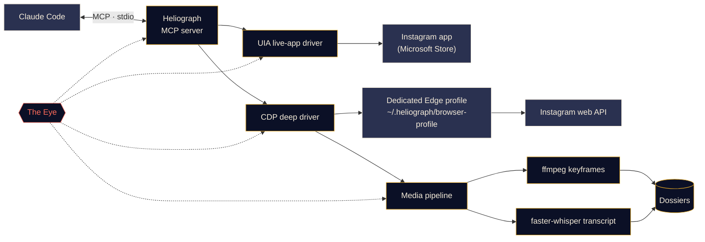

<p align="center">
  
</p>

<p align="center">
  <a href="#quick-start"></a>
  <a href="../../LICENSE"></a>
  <a href="#platform-support"></a>
  <a href="#how-it-works"></a>
  <a href="../../CONTRIBUTING.md#tests"></a>
</p>

<p align="center">
  <a href="../../README.md">English</a> ·
  <a href="README.es.md">Español</a> ·
  <a href="README.fr.md">Français</a> ·
  <a href="README.de.md">Deutsch</a> ·
  <a href="README.pt-BR.md">Português (BR)</a> ·
  <b>Italiano</b> ·
  <a href="README.ru.md">Русский</a> ·
  <a href="README.tr.md">Türkçe</a> ·
  <a href="README.ar.md">العربية</a> ·
  <a href="README.hi.md">हिन्दी</a> ·
  <a href="README.zh-CN.md">简体中文</a> ·
  <a href="README.ja.md">日本語</a> ·
  <a href="README.ko.md">한국어</a>
</p>

> Questa è una traduzione. Il [README in inglese](../../README.md) è la fonte autorevole; in caso di differenze prevale la versione inglese.

---

**Heliograph** collega Claude (tramite [Claude Code](https://docs.anthropic.com/en/docs/claude-code) e un server MCP) al **tuo Instagram, sul tuo dispositivo**. Claude può leggere ciò che vedi, esaminare le tue raccolte salvate e trasformare i reel in dossier strutturati e consultabili — tutto in locale, con te al comando di ogni azione di scrittura.

> **Perché "Heliograph"?** La prima fotografia della storia fu un'*eliografia* (Niépce, anni Venti dell'Ottocento). Un eliografo è anche un dispositivo di segnalazione che, con uno specchio, lancia lampi di luce solare a distanza. Una macchina fotografica e un ponte: esattamente ciò che è questo progetto.

> [!NOTE]
> **Stato: sviluppo iniziale (v0.1.0).** L'architettura è definita e i moduli principali sono in costruzione. Ogni funzionalità qui sotto è contrassegnata come **Disponibile**, **In corso** o **Pianificata**: nulla di quanto scritto è una promessa senza codice alle spalle.

## Cosa fa

- **Permette a Claude di vedere e usare Instagram come fai tu**: nell'app installata vera, con la tua sessione vera.
- **Estrae dati strutturati** (raccolte salvate, metadati dei reel, didascalie, contenuti multimediali) tramite un profilo browser dedicato e separato, in cui accedi una sola volta.
- **Trasforma i reel in dossier**: video, fotogrammi chiave, una trascrizione con marcatori temporali e metadati in un'unica cartella che Claude può leggere e analizzare.
- **Si osserva da solo**: *l'Occhio* registra in locale ogni chiamata a strumenti, ogni azione dei driver e ogni sottoprocesso, così i problemi si possono spiegare, da te o da Claude.

## Funzionalità

<table>
  <tr>
    <td width="33%" valign="top">
      <h3>Driver dell'app dal vivo</h3>
      Controlla l'app Instagram del Microsoft Store tramite Windows UI Automation: leggere lo schermo, navigare, mettere "mi piace", salvare, seguire, fare screenshot. Nessun passaggio di accesso.<br><br><sub><b>In corso</b></sub>
    </td>
    <td width="33%" valign="top">
      <h3>Driver profondo</h3>
      Un profilo Edge/Chrome dedicato controllato tramite il Chrome DevTools Protocol, che legge l'API web di Instagram dall'interno della pagina per ottenere JSON pulito, URL dei video e lavorazioni in blocco.<br><br><sub><b>In corso</b></sub>
    </td>
    <td width="33%" valign="top">
      <h3>Dossier dei reel</h3>
      Fotogrammi chiave ai cambi di scena con ffmpeg e deduplicazione percettiva, più una trascrizione faster-whisper, riuniti in un dossier Markdown per ogni reel.<br><br><sub><b>In corso</b></sub>
    </td>
  </tr>
  <tr>
    <td width="33%" valign="top">
      <h3>Server MCP</h3>
      Un server FastMCP che si registra automaticamente in Claude Code tramite <code>.mcp.json</code> quando apri la cartella.<br><br><sub><b>In corso</b></sub>
    </td>
    <td width="33%" valign="top">
      <h3>L'Occhio</h3>
      Tracciamento anzitutto locale: span, ID di traccia, oscuramento dei segreti, snapshot degli errori, una vista dal vivo nel terminale e un report leggibile da Claude.<br><br><sub><b>Disponibile (iniziale)</b></sub>
    </td>
    <td width="33%" valign="top">
      <h3>Misure di sicurezza</h3>
      Le azioni di scrittura richiedono una conferma esplicita, tutto ha limiti di frequenza, i download sono limitati alla CDN di Instagram e nessuna password passa mai da Heliograph.<br><br><sub><b>In corso</b></sub>
    </td>
  </tr>
</table>

<a id="quick-start"></a>
## Avvio rapido

**Ti servono:** Python 3.11+ (consigliato 3.12), [uv](https://docs.astral.sh/uv/), [ffmpeg](https://ffmpeg.org/), Microsoft Edge o Google Chrome, [Claude Code](https://docs.anthropic.com/en/docs/claude-code) e, per il driver dell'app dal vivo su Windows, l'app Instagram del Microsoft Store.

```bash
# 1. Clone
git clone https://github.com/DeanT-04/instagram-bridge-with-claude.git heliograph
cd heliograph

# 2. Run the one-command setup
./scripts/setup.ps1        # Windows (PowerShell)
./scripts/setup.sh         # macOS / Linux

# 3. Open Claude Code in the folder
claude
```

Claude Code rileva il server MCP di Heliograph da `.mcp.json` e ti chiede di approvarlo la prima volta. Poi basta chiedere, per esempio: *"Cosa c'è nella mia raccolta salvata chiamata Trading?"*

> [!IMPORTANT]
> Gli script di installazione, `.mcp.json` e `heliograph login` sono **in corso**. Nel frattempo puoi preparare l'ambiente a mano:
>
> ```bash
> uv sync
> uv run heliograph doctor
> ```
>
> `doctor` controlla l'app Instagram, Edge/Chrome, ffmpeg e il sistema operativo, e ti dice cosa manca.

<a id="how-it-works"></a>
## Come funziona



<details>
<summary><b>Perché due driver?</b></summary>

<br>

L'app Instagram del Microsoft Store è una web app di Edge che gira nel tuo normale profilo Edge. Le versioni recenti di Edge rifiutano di aprire una porta DevTools sul profilo predefinito, quindi l'app installata **non può** essere automatizzata tramite DevTools. **Può** però essere letta e controllata completamente tramite Windows UI Automation.

| Driver | Obiettivo | Punto di forza | Usato per |
|---|---|---|---|
| `uia` | La finestra dell'app installata dallo Store | La tua app e la tua sessione reali, nessun accesso | Navigare, leggere lo schermo, mi piace / salva / segui, screenshot |
| `cdp` | Un profilo Edge/Chrome dedicato avviato come finestra di app, DevTools vincolato a `127.0.0.1` | JSON strutturato dall'API web di Instagram, URL dei video, cattura del traffico di rete | Raccolte salvate, metadati dei reel, download, estrazione in blocco |

Entrambi implementano un'unica interfaccia `InstagramDriver` dove si sovrappongono. Vedi [docs/ARCHITECTURE.md](../ARCHITECTURE.md) per il progetto completo.

</details>

<a id="platform-support"></a>
<details>
<summary><b>Piattaforme supportate</b></summary>

<br>

| | Windows 10/11 | macOS | Linux |
|---|---|---|---|
| Driver profondo (CDP) | In corso | In corso | In corso |
| Pipeline multimediale e dossier | In corso | In corso | In corso |
| L'Occhio | Disponibile | Disponibile | Disponibile |
| Driver dell'app dal vivo | In corso (UI Automation) | Pianificato | Non applicabile |

</details>

## Estrazione di reel di trading

Un flusso dimostrativo: salvi reel di trading in una raccolta Instagram e Claude li trasforma in appunti su cui puoi davvero studiare.

1. Chiedi a Claude: *"Estrai le strategie dalla mia raccolta salvata 'Trading'."*
2. Heliograph elenca la raccolta tramite il driver profondo e scarica ogni reel dalla CDN di Instagram.
3. La pipeline multimediale estrae i fotogrammi chiave ai cambi di scena (grafici, setup, annotazioni) e una trascrizione con marcatori temporali.
4. Ogni reel diventa un dossier; Claude li legge e mette per iscritto regole di ingresso, uscite, gestione del rischio e le affermazioni che non ha potuto verificare.

```text
dossiers/<reel-id>/
├── meta.json          # author, caption, date, URL, metrics
├── video.mp4
├── transcript.json    # timestamped segments
├── transcript.md
├── frames/*.jpg       # de-duplicated keyframes
└── dossier.md         # everything above, stitched for Claude
```

**Stato:** generatore di dossier **in corso**; la skill di Claude Code `extract-trading-strategies` è **pianificata**.

> [!CAUTION]
> Heliograph organizza ciò che dicono i creator; non giudica se abbiano ragione. Nulla di ciò che produce costituisce consulenza finanziaria.

## L'Occhio

*L'Occhio* è l'osservabilità integrata di Heliograph, anzitutto locale. Non serve alcun servizio esterno.

- Ogni chiamata a strumenti MCP, azione dei driver, richiesta HTTP e sottoprocesso ffmpeg/whisper viene registrata come **span** con un `trace_id` condiviso, così una singola richiesta di Claude può essere seguita dall'inizio alla fine.
- Gli eventi finiscono in `~/.heliograph/eye/events.jsonl` (con rotazione), con un indice SQLite per le interrogazioni.
- **I segreti vengono oscurati prima della scrittura**: cookie, `sessionid`, `csrftoken`, intestazioni di autenticazione e stringhe simili a token.
- Quando un passaggio dell'interfaccia o del browser fallisce, vengono salvati uno screenshot e uno snapshot di accessibilità/DOM collegati all'evento *(in corso)*.
- `heliograph eye` mostra un flusso dal vivo a colori con lo stato di salute aggiornato: tasso di errore, latenza p95, operazioni che falliscono di più.
- `heliograph eye report` — e lo strumento MCP `eye_report` *(in corso)* — riassume gli errori recenti, così Claude può diagnosticare i problemi da solo.
- Esportazione facoltativa verso Langfuse quando sono impostate `LANGFUSE_PUBLIC_KEY` / `LANGFUSE_SECRET_KEY` (disattivata per impostazione predefinita).

## Sicurezza e privacy

- **Accesso manuale, una sola volta.** Accedi tu stesso al profilo browser dedicato, una volta. Heliograph non digita, non memorizza e non registra mai una password.
- **Il driver dell'app dal vivo non richiede accesso**: usa l'app Instagram in cui hai già effettuato l'accesso.
- **Le azioni di scrittura richiedono conferma.** Mettere "mi piace", seguire, commentare, inviare DM, pubblicare e rimuovere dai salvati richiedono un `confirm=True` esplicito a livello MCP, quindi Claude deve prima chiederlo a te.
- **Limiti di frequenza con jitter** su scritture *e* letture, per mantenere un ritmo umano.
- **Dati solo in locale.** Dossier, log e profilo del browser restano in `~/.heliograph` sul tuo computer. La porta DevTools è vincolata a `127.0.0.1`, su una porta libera casuale.
- **Download in allowlist**: solo HTTPS dagli host della CDN di Instagram.

Vedi [docs/SECURITY.md](../SECURITY.md) per il modello delle minacce e come segnalare una vulnerabilità.

## Riferimento della CLI

> Questa è l'**interfaccia pianificata**. La colonna Stato mostra cosa funziona oggi.

| Comando | Cosa fa | Stato |
|---|---|---|
| `heliograph setup` | Installa le dipendenze, controlla l'ambiente e registra il server MCP | Pianificato (bozza) |
| `heliograph doctor` | Rileva app Instagram, Edge/Chrome, ffmpeg, sistema operativo e stato dell'accesso | Disponibile |
| `heliograph login` | Apre il profilo browser dedicato per accedere una volta, a mano | Pianificato (bozza) |
| `heliograph mcp` | Avvia il server MCP su stdio (Claude Code lo avvia per te) | Pianificato (bozza) |
| `heliograph extract <url>` | Crea un dossier per un reel o un post | Pianificato (bozza) |
| `heliograph eye` | Flusso dal vivo dell'Occhio con stato di salute | Disponibile |
| `heliograph eye report` | Riepilogo di errori e anomalie recenti | Disponibile |

<details>
<summary><b>Struttura del progetto</b></summary>

<br>

```text
src/heliograph/
├── cli.py              # Typer CLI
├── config.py           # settings (env prefix HELIOGRAPH_), paths under ~/.heliograph
├── errors.py           # HeliographError hierarchy
├── detect/             # environment detection: Store app, browsers, ffmpeg, OS
├── drivers/
│   ├── base.py         # InstagramDriver protocol + shared dataclasses
│   ├── uia/            # Windows UI Automation live-app driver
│   └── cdp/            # browser launcher, CDP session, web-API client
├── instagram/          # models + high-level service
├── media/              # allow-listed download, ffmpeg frames, faster-whisper
├── extract/            # reel -> dossier
├── eye/                # the Eye: spans, sinks, redaction, live view, reports
└── mcp/                # FastMCP server (in progress)
tests/                  # pytest; live tests marked @pytest.mark.live
docs/                   # architecture, security, translations, brand assets
scripts/                # setup.ps1 / setup.sh (in progress)
.claude/skills/         # Claude Code skills (planned)
.mcp.json               # MCP registration for Claude Code (in progress)
```

</details>

## Roadmap

- [ ] Installazione con un solo comando, registrazione tramite `.mcp.json` e `heliograph login`
- [ ] Server MCP con strumenti di lettura, poi strumenti di scrittura con conferma
- [ ] Skill `extract-trading-strategies`
- [ ] Supporto **multi-account** (profili e stato separati per account)
- [ ] **Android** tramite `adb`
- [ ] Driver dell'app dal vivo per **macOS** (API di accessibilità)

## Contribuire

I contributi sono benvenuti: vedi [CONTRIBUTING.md](../../CONTRIBUTING.md) e il [Codice di condotta](../../CODE_OF_CONDUCT.md).

## Avvertenze

Heliograph è un progetto open source indipendente. **Non è affiliato, approvato né sponsorizzato da Instagram o da Meta Platforms, Inc.** "Instagram" è un marchio del rispettivo titolare ed è usato qui solo per descrivere con cosa funziona il software. Usa Heliograph **solo sul tuo account**, mantieni un uso personale e a ritmo umano e rispetta le [Condizioni d'uso di Instagram](https://help.instagram.com/581066165581870). Sei responsabile dell'uso che ne fai.

## Licenza

[MIT](../../LICENSE) © 2026 DeanT-04
