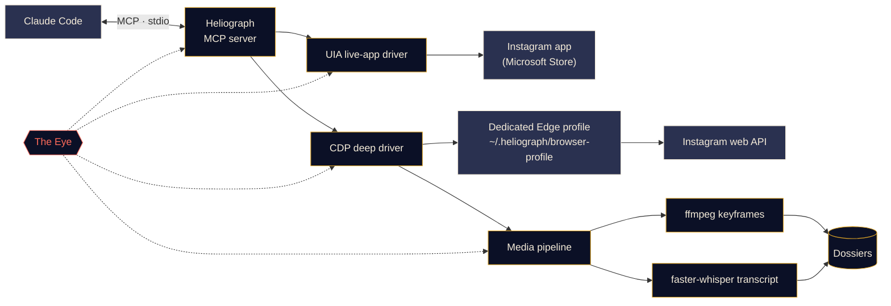

<p align="center">
  
</p>

<p align="center">
  <a href="#quick-start"></a>
  <a href="../../LICENSE"></a>
  <a href="#platform-support"></a>
  <a href="#mcp-tools"></a>
  <a href="https://github.com/DeanT-04/instagram-bridge-with-claude/actions/workflows/ci.yml"></a>
</p>

<p align="center">
  <a href="../../README.md">English</a> ·
  <a href="README.es.md">Español</a> ·
  <a href="README.fr.md">Français</a> ·
  <a href="README.de.md">Deutsch</a> ·
  <a href="README.pt-BR.md">Português (BR)</a> ·
  <b>Italiano</b> ·
  <a href="README.ru.md">Русский</a> ·
  <a href="README.tr.md">Türkçe</a> ·
  <a href="README.ar.md">العربية</a> ·
  <a href="README.hi.md">हिन्दी</a> ·
  <a href="README.zh-CN.md">简体中文</a> ·
  <a href="README.ja.md">日本語</a> ·
  <a href="README.ko.md">한국어</a>
</p>

> Questa è una traduzione. Il [README in inglese](../../README.md) è la fonte autorevole; in caso di differenze prevale la versione inglese.

---

**Heliograph** collega Claude (tramite [Claude Code](https://docs.anthropic.com/en/docs/claude-code) e un server MCP) al **tuo Instagram, sul tuo dispositivo**. Claude può leggere ciò che vedi, esaminare le tue raccolte salvate e trasformare i reel in dossier strutturati e consultabili — tutto in locale, con te al comando di ogni azione di scrittura.

> **Perché "Heliograph"?** La prima fotografia della storia fu un'*eliografia* (Niépce, anni Venti dell'Ottocento). Un eliografo è anche un dispositivo di segnalazione che, con uno specchio, lancia lampi di luce solare a distanza. Una macchina fotografica e un ponte: esattamente ciò che è questo progetto.

> [!NOTE]
> **Stato: v0.1.0 — iniziale, ma funzionante.** Installazione, CLI, server MCP (41 strumenti), entrambi i driver e la pipeline dei dossier sono rilasciati. Le letture sono state verificate dal vivo su un account reale con Windows 11 (account corrente, raccolte, post di una raccolta, ricerca, badge dell'app, stato). Le **azioni di scrittura** (mi piace, salva, segui, commenta, DM…) sono implementate e testate in simulazione, ma **non ancora verificate su un account reale**.

## Cosa fa

- **Permette a Claude di vedere e usare Instagram come fai tu**: nell'app installata vera, con la tua sessione vera.
- **Estrae dati strutturati** (raccolte salvate, metadati dei reel, didascalie, DM, contenuti multimediali) tramite un profilo browser dedicato in cui accedi una sola volta.
- **Trasforma i reel in dossier**: video, fotogrammi chiave, un provino, una trascrizione con marcatori temporali e metadati in un'unica cartella che Claude può leggere *e guardare*.
- **Si osserva da solo**: *l'Occhio* registra in locale ogni chiamata a strumenti, ogni azione dei driver e ogni sottoprocesso, così i problemi si possono spiegare, da te o da Claude.

## Funzionalità

<table>
  <tr>
    <td width="33%" valign="top">
      <h3>Driver dell'app dal vivo</h3>
      Controlla l'app Instagram del Microsoft Store tramite Windows UI Automation: leggere lo schermo, navigare, scorrere, fare screenshot, cliccare o digitare (con la tua conferma). Nessun passaggio di accesso.<br><br><sub><b>Disponibile · Windows</b></sub>
    </td>
    <td width="33%" valign="top">
      <h3>Driver profondo</h3>
      Un profilo Edge/Chrome dedicato controllato tramite il Chrome DevTools Protocol, che legge l'API web di Instagram dall'interno della pagina per ottenere JSON pulito, URL dei video e lavorazioni in blocco.<br><br><sub><b>Disponibile</b></sub>
    </td>
    <td width="33%" valign="top">
      <h3>Dossier dei reel</h3>
      Fotogrammi chiave ai cambi di scena con ffmpeg e deduplicazione percettiva, un provino e una trascrizione faster-whisper, riuniti in un dossier Markdown per ogni reel. Il testo a schermo viene letto con l'OCR, il parlato non in inglese riceve anche una traduzione in inglese e le piccole etichette dei grafici si possono ritagliare e ingrandire.<br><br><sub><b>Disponibile</b></sub>
    </td>
  </tr>
  <tr>
    <td width="33%" valign="top">
      <h3>Server MCP</h3>
      41 strumenti che si registrano automaticamente in Claude Code tramite <code>.mcp.json</code> quando apri la cartella, più due skill di progetto.<br><br><sub><b>Disponibile</b></sub>
    </td>
    <td width="33%" valign="top">
      <h3>L'Occhio</h3>
      Tracciamento anzitutto locale: span, ID di traccia, oscuramento dei segreti, screenshot e snapshot DOM degli errori, una vista dal vivo nel terminale e report leggibili da Claude.<br><br><sub><b>Disponibile</b></sub>
    </td>
    <td width="33%" valign="top">
      <h3>Misure di sicurezza</h3>
      Le azioni di scrittura sono solo simulate senza conferma, tutto ha limiti di frequenza, URL e download sono in allowlist e nessuna password passa mai da Heliograph.<br><br><sub><b>Disponibile · scritture non ancora verificate dal vivo</b></sub>
    </td>
  </tr>
</table>

<a id="quick-start"></a>
## Avvio rapido

**Ti servono:** Python 3.11+ (consigliato 3.12), [ffmpeg](https://ffmpeg.org/), Microsoft Edge o Google Chrome, [Claude Code](https://docs.anthropic.com/en/docs/claude-code) e, per il driver dell'app dal vivo su Windows, l'app Instagram del Microsoft Store. Lo script di installazione installa [uv](https://docs.astral.sh/uv/) se manca (dopo avertelo chiesto).

```bash
# 1. Clone
git clone https://github.com/DeanT-04/instagram-bridge-with-claude.git heliograph
cd heliograph

# 2. Run the one-command setup
powershell -ExecutionPolicy Bypass -File scripts\setup.ps1   # Windows
bash scripts/setup.sh                                        # macOS / Linux

# 3. Sign in to Instagram once, yourself, in Heliograph's own browser window
uv run heliograph login

# 4. Open Claude Code in the folder
claude
```

Claude Code rileva il server MCP di Heliograph da `.mcp.json` e ti chiede di approvarlo la prima volta. Windows blocca gli script per impostazione predefinita (criterio di esecuzione *Restricted*), quindi avvia il setup con `powershell -ExecutionPolicy Bypass -File scripts\setup.ps1` come mostrato: l'eccezione vale solo per quell'esecuzione e non modifica alcuna impostazione. Il setup si può rieseguire senza problemi. Opzioni su **Windows**: `-Yes` (nessuna domanda), `-NoInput` (non chiede mai, risponde no; per la CI), `-WithWhisper` (scarica in anticipo il modello vocale, ~500 MB). Su **macOS / Linux**: `--yes`, `--no-input`, `--with-whisper`. Se manca uv, lo script installa uv 0.12.1 con il suo installer ufficiale a versione fissa, dopo avertelo chiesto. Se qualcosa non torna, esegui `uv run heliograph doctor`.

## Uso con Claude

Basta parlare con Claude nella cartella del progetto. Per esempio:

- *"Estrai tutte le strategie dalla mia raccolta 'Trading strats'."* — esegue la skill `extract-trading-strategies` dall'inizio alla fine.
- *"Cosa c'è di nuovo nei miei DM e nelle notifiche? Riassumi, non rispondere."*
- *"Apri l'app di Instagram, vai su Reels e dimmi cosa c'è sullo schermo."*
- *"Trova gli ultimi cinque post di @some_creator e prepara una bozza di commento sul più recente."* — Claude ti mostra prima una simulazione; non viene pubblicato nulla finché non dici sì.

`CLAUDE.md` fornisce a Claude il suo manuale operativo (regole di sicurezza, famiglie di strumenti, risoluzione dei problemi) e la skill [`instagram-control`](../../.claude/skills/instagram-control/SKILL.md) gli insegna quale strumento usare.

<a id="how-it-works"></a>
## Come funziona



<details>
<summary><b>Perché due driver?</b></summary>

<br>

L'app Instagram del Microsoft Store è una web app di Edge che gira nel tuo normale profilo Edge. Le versioni recenti di Edge rifiutano di aprire una porta DevTools sul profilo predefinito, quindi l'app installata **non può** essere automatizzata tramite DevTools. **Può** però essere letta e controllata completamente tramite Windows UI Automation.

| Driver | Obiettivo | Punto di forza | Usato per |
|---|---|---|---|
| `uia` | La finestra dell'app installata dallo Store | La tua app e la tua sessione reali, nessun accesso | Navigare, leggere lo schermo, screenshot, clic confermati |
| `cdp` | Un profilo Edge/Chrome dedicato avviato come finestra di app, DevTools vincolato a `127.0.0.1` | JSON strutturato dall'API web di Instagram, URL dei video, cattura del traffico di rete | Raccolte salvate, feed, DM, metadati dei reel, download, estrazione in blocco |

Vedi [docs/ARCHITECTURE.md](../ARCHITECTURE.md) per il progetto completo.

</details>

<a id="platform-support"></a>
<details>
<summary><b>Piattaforme supportate</b></summary>

<br>

| | Windows 10/11 | macOS | Linux |
|---|---|---|---|
| Script di installazione | Verificato | Disponibile (non testato) | Disponibile (non testato) |
| Driver profondo (CDP) e server MCP | Verificato | Disponibile (non testato) | Disponibile (non testato) |
| Pipeline multimediale e dossier | Disponibile | Disponibile (non testato) | Disponibile (non testato) |
| L'Occhio | Disponibile | Disponibile | Disponibile |
| Driver dell'app dal vivo (strumenti `app_*`) | Verificato | Pianificato | Non applicabile |

</details>

<a id="mcp-tools"></a>
## Strumenti MCP

41 strumenti in sette famiglie. Gli strumenti di elenco accettano `limit` e `cursor`; ripassa `next_cursor` per andare alla pagina successiva.

<details open>
<summary><b>Riferimento degli strumenti</b></summary>

<br>

| Famiglia | Strumento | Cosa fa |
|---|---|---|
| **Stato** | `heliograph_status` | Salute: SO, app dello Store, browser, ffmpeg, stato dell'accesso |
| | `heliograph_setup_check` | Cosa ti manca ancora perché tutti gli strumenti funzionino |
| **Lettura** | `ig_whoami` | L'account connesso al profilo browser di Heliograph |
| | `ig_get_user` | Profilo pubblico di un account per nome utente |
| | `ig_user_posts` | Post e reel recenti di un account |
| | `ig_get_media` | Dettagli completi di un post/reel, con didascalia e URL dei media |
| | `ig_comments` | Commenti principali di un post/reel |
| | `ig_search` | Ricerca principale: utenti, hashtag e luoghi |
| | `ig_timeline` | Il tuo feed home |
| | `ig_reels_feed` | Il feed di scoperta dei Reels |
| | `ig_explore` | Post dalla griglia Esplora |
| | `ig_inbox` | Conversazioni DM con l'anteprima dell'ultimo messaggio |
| | `ig_thread` | Messaggi di una conversazione DM |
| | `ig_activity` | Notifiche recenti: mi piace, follower, commenti, menzioni |
| **Raccolte** | `ig_list_collections` | Le tue raccolte salvate |
| | `ig_collection_posts` | Post di una raccolta, per nome o id |
| | `ig_saved_posts` | Tutti i post salvati, dal più recente |
| **Estrazione** | `ig_extract_media` | Crea (o riusa) un dossier per un post/reel |
| | `ig_extract_collection` | Crea i dossier di una raccolta, a lotti |
| | `ig_read_dossier` | Legge Markdown, trascrizione e metadati di un dossier |
| | `ig_view_frames` | Restituisce il provino o i fotogrammi come immagini che Claude può vedere |
| **App dal vivo** *(Windows)* | `app_open` | Si collega alla finestra dell'app Instagram |
| | `app_snapshot` | Schema testuale di ciò che è sullo schermo (albero di accessibilità) |
| | `app_screenshot` | Screenshot della finestra dell'app, anche se coperta da altre |
| | `app_navigate` | Apre una sezione: home, ricerca, esplora, reels, messaggi… |
| | `app_click` | Clicca un elemento per ref o nome (le scritture richiedono la tua conferma) |
| | `app_scroll` | Scorre per schermate (un reel per pagina nel visualizzatore Reels) |
| | `app_type` | Digita in un campo (l'invio richiede la tua conferma) |
| | `app_visible_posts` | Post/reel sullo schermo, con i loro pulsanti |
| | `app_badges` | Contatori dei non letti per messaggi e notifiche |
| **Scrittura** *(con conferma)* | `ig_like` / `ig_unlike` | Mette o toglie il mi piace a un post/reel |
| | `ig_save` / `ig_unsave` | Salva o rimuove, eventualmente in una raccolta |
| | `ig_follow` / `ig_unfollow` | Segue o smette di seguire un account |
| | `ig_comment` | Pubblica un commento con il testo esatto che hai approvato |
| | `ig_send_dm` | Invia un DM a un utente o in una conversazione esistente |
| **Occhio** | `eye_report` | Riepilogo di salute: tasso di errore, operazioni lente e fallite |
| | `eye_trace` | Ogni passaggio di una chiamata, con traceback e artefatti |
| | `eye_recent` | Gli ultimi eventi, eventualmente solo gli errori |

</details>

## Estrazione di reel di trading

Un flusso dimostrativo: salvi reel di trading in una raccolta Instagram e Claude li trasforma in appunti su cui puoi davvero studiare.

1. Chiedi a Claude: *"Estrai tutte le strategie dalla mia raccolta 'Trading strats'."*
2. Heliograph elenca la raccolta tramite il driver profondo e scarica ogni reel dalla CDN di Instagram.
3. La pipeline multimediale estrae i fotogrammi chiave ai cambi di scena (grafici, setup, annotazioni), un provino e una trascrizione con marcatori temporali. Il testo a schermo di ogni fotogramma chiave viene letto con l'OCR e il parlato non in inglese riceve una traduzione in inglese.
4. Claude legge ogni dossier, **guarda i fotogrammi** con `ig_view_frames` e scrive una nota per reel — regole di ingresso, uscite, gestione del rischio, impostazioni degli indicatori e le affermazioni che non ha potuto verificare — più un indice. Le piccole etichette dei grafici e le impostazioni degli indicatori vengono ritagliate e ingrandite (`ig_view_frames(..., crop=...)`) e confrontate con quanto viene detto.

```text
~/.heliograph/dossiers/<creator>/<code>/
├── meta.json          # author, caption, date, URL, metrics
├── caption.md
├── video.mp4          # or images/NN.jpg for photo posts
├── transcript.json    # timestamped segments + language (+ English translation)
├── transcript.md
├── frames/*.jpg       # de-duplicated keyframes (+ frames.json)
├── ocr.json           # on-screen text of every keyframe (OCR)
├── crops/             # zoomed regions of small chart text
├── contact_sheet.jpg  # every keyframe on one image
└── dossier.md         # everything above, stitched for Claude
```

Le note vengono scritte in `strategies/` nella cartella del progetto, ignorata da git perché contiene dati personali. Puoi creare dossier anche senza Claude: `uv run heliograph extract --collection "Trading strats"`.

> [!CAUTION]
> Heliograph organizza ciò che dicono i creator; non giudica se abbiano ragione. Nulla di ciò che produce costituisce consulenza finanziaria.

## L'Occhio

*L'Occhio* è l'osservabilità integrata di Heliograph, anzitutto locale. Non serve alcun servizio esterno.

- Ogni chiamata a strumenti MCP, azione dei driver, richiesta HTTP e sottoprocesso ffmpeg/whisper viene registrata come **span** con un `trace_id` condiviso, così una singola richiesta di Claude può essere seguita dall'inizio alla fine.
- Gli eventi finiscono in `~/.heliograph/eye/events.jsonl` (con rotazione), con un indice SQLite per le interrogazioni.
- **I segreti vengono oscurati prima della scrittura**: cookie, `sessionid`, `csrftoken`, intestazioni di autenticazione e stringhe simili a token.
- Quando un passaggio dell'interfaccia o del browser fallisce, vengono salvati uno screenshot e uno snapshot di accessibilità/DOM collegati all'evento.
- Ogni errore di uno strumento restituisce un **suggerimento** e un **ID di traccia**; Claude può chiamare `eye_trace` con esso per vedere esattamente cosa è andato storto.
- `heliograph eye` mostra un flusso dal vivo a colori con lo stato di salute aggiornato: tasso di errore, latenza p95, operazioni che falliscono di più. `heliograph eye report` riassume gli errori recenti.
- Esportazione facoltativa verso Langfuse quando sono impostate `LANGFUSE_PUBLIC_KEY` / `LANGFUSE_SECRET_KEY` (disattivata per impostazione predefinita).

## Sicurezza e privacy

- **Accesso manuale, una sola volta.** Accedi tu stesso al profilo browser dedicato, una volta (`heliograph login`). Heliograph non digita, non memorizza e non registra mai una password.
- **Il driver dell'app dal vivo non richiede accesso**: usa l'app Instagram in cui hai già effettuato l'accesso.
- **Le azioni di scrittura sono simulate per impostazione predefinita.** Mi piace, segui, commenta, DM, salva e i loro opposti restituiscono una descrizione di ciò che *accadrebbe*; agiscono solo se richiamate con `confirm=true`, dopo il tuo sì in chat. Lo stesso vale per i clic sui pulsanti di azione o l'invio di testo nell'app dal vivo.
- **Limiti di frequenza con jitter** su scritture *e* letture, per mantenere un ritmo umano.
- **Dati solo in locale.** Dossier, log e profilo del browser restano in `~/.heliograph` sul tuo computer, con permessi dei file privati. La porta DevTools è vincolata a `127.0.0.1`, su una porta libera casuale.
- **Allowlist rigorose**: sono accettati solo URL di Instagram e i download arrivano solo via HTTPS dagli host della CDN di Instagram. Protezioni contro il path traversal coprono il client API e le cartelle dei dossier.

Vedi [docs/SECURITY.md](../SECURITY.md) per il modello delle minacce e come segnalare una vulnerabilità.

## Riferimento della CLI

| Comando | Cosa fa | Stato |
|---|---|---|
| `heliograph setup` | Controlla l'ambiente, propone correzioni (Chromium, app dello Store), scarica Whisper facoltativamente, mostra i passi successivi | Disponibile |
| `heliograph setup --no-input` | Gli stessi controlli senza alcuna domanda (risponde no); per script e CI | Disponibile |
| `heliograph doctor` | Rileva app Instagram, Edge/Chrome, ffmpeg, sistema operativo e stato dell'accesso (`--json` per l'output grezzo) | Disponibile |
| `heliograph login` | Apre il profilo browser dedicato per accedere una volta, a mano | Disponibile |
| `heliograph mcp` | Avvia il server MCP su stdio (Claude Code lo avvia per te) | Disponibile |
| `heliograph extract <url>` | Crea un dossier per un reel/post, oppure `--collection "<nome>"` per un'intera raccolta | Disponibile |
| `heliograph dossier show <code>` | Mostra un dossier già creato: didascalia, termini rilevati, cronologia di parlato/fotogrammi/OCR (`--transcript` aggiunge la trascrizione) | Disponibile |
| `heliograph dossier frames <code>` | Elenca i fotogrammi chiave con orari e testo a schermo, oppure salva ritagli ingranditi (`--crop`, `--ocr` facoltativo) | Disponibile |
| `heliograph eye` | Flusso dal vivo dell'Occhio con stato di salute | Disponibile |
| `heliograph eye report` | Riepilogo di errori e anomalie recenti | Disponibile |
| `heliograph version` | Mostra la versione di Heliograph | Disponibile |

Esegui ogni comando dalla cartella del progetto come `uv run heliograph <comando>`. `login`, `mcp` ed `extract` accettano `--account <chiave>` per usare un profilo browser separato.

<details>
<summary><b>Struttura del progetto</b></summary>

<br>

```text
src/heliograph/
├── cli.py              # Typer CLI entry point
├── commands/           # setup, doctor, login, extract, dossier.py (show / frames)
├── config.py           # settings (env prefix HELIOGRAPH_), paths under ~/.heliograph
├── errors.py           # HeliographError hierarchy
├── writelimit.py       # write rate limit shared by every process (lock file + state)
├── detect/             # environment detection: Store app, browsers, ffmpeg, OS
├── drivers/
│   ├── base.py         # InstagramDriver protocol + shared dataclasses
│   ├── uia/            # Windows UI Automation live-app driver
│   └── cdp/            # browser launcher, CDP session, web-API client, rate limits
├── instagram/          # models, service, collections, write actions
├── media/              # allow-listed download, ffmpeg frames, faster-whisper,
│                       #   ocr.py (on-screen text), dedupe.py (near-duplicate frames)
├── extract/            # reel -> dossier; render.py, signals.py (terms, mismatch),
│                       #   zoom.py (crop + zoom small chart text)
├── eye/                # the Eye: spans, sinks, redaction, live view, reports
└── mcp/                # FastMCP server, tools_*.py per family, runtime, common
tests/                  # pytest; live tests marked @pytest.mark.live
docs/                   # architecture, security, translations, brand assets
scripts/                # setup.ps1 / setup.sh
.github/workflows/ci.yml # lint, strict types and tests on Windows, macOS and Linux
.claude/skills/         # extract-trading-strategies, instagram-control
.mcp.json               # registers the MCP server with Claude Code
CLAUDE.md               # operating manual for Claude
```

</details>

## Roadmap

- [x] Installazione con un solo comando, registrazione tramite `.mcp.json` e `heliograph login`
- [x] Server MCP con strumenti di lettura, raccolte, estrazione, app dal vivo, scrittura e Occhio
- [x] Skill `extract-trading-strategies` e `instagram-control`
- [ ] Verifica dal vivo di ogni azione di scrittura
- [x] CI su Windows, macOS e Linux
- [ ] Supporto **multi-account** nelle sessioni di Claude (i profili separati funzionano già con `--account`)
- [ ] **Android** tramite `adb`
- [ ] Driver dell'app dal vivo per **macOS** (API di accessibilità)

## Contribuire

I contributi sono benvenuti: vedi [CONTRIBUTING.md](../../CONTRIBUTING.md) e il [Codice di condotta](../../CODE_OF_CONDUCT.md).

## Avvertenze

Heliograph è un progetto open source indipendente. **Non è affiliato, approvato né sponsorizzato da Instagram o da Meta Platforms, Inc.** "Instagram" è un marchio del rispettivo titolare ed è usato qui solo per descrivere con cosa funziona il software. Usa Heliograph **solo sul tuo account**, mantieni un uso personale e a ritmo umano e rispetta le [Condizioni d'uso di Instagram](https://help.instagram.com/581066165581870). Sei responsabile dell'uso che ne fai.

## Licenza

[MIT](../../LICENSE) © 2026 DeanT-04
