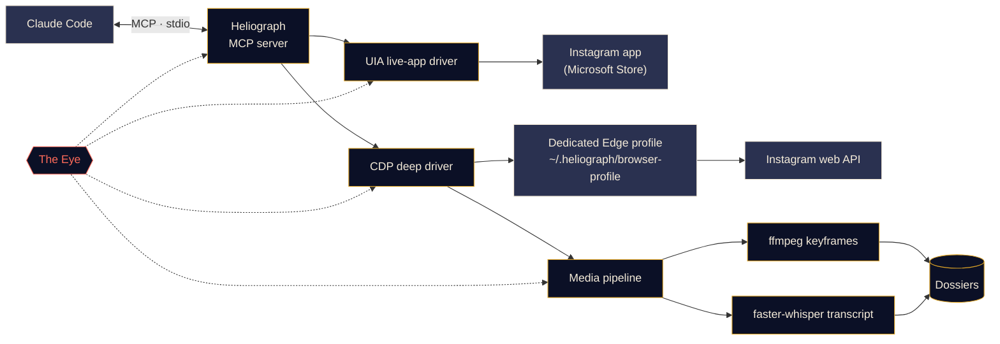

<p align="center">
  
</p>

<p align="center">
  <a href="#quick-start"></a>
  <a href="../../LICENSE"></a>
  <a href="#platform-support"></a>
  <a href="#how-it-works"></a>
  <a href="../../CONTRIBUTING.md#tests"></a>
</p>

<p align="center">
  <a href="../../README.md">English</a> ·
  <a href="README.es.md">Español</a> ·
  <a href="README.fr.md">Français</a> ·
  <a href="README.de.md">Deutsch</a> ·
  <a href="README.pt-BR.md">Português (BR)</a> ·
  <a href="README.it.md">Italiano</a> ·
  <a href="README.ru.md">Русский</a> ·
  <a href="README.tr.md">Türkçe</a> ·
  <a href="README.ar.md">العربية</a> ·
  <a href="README.hi.md">हिन्दी</a> ·
  <a href="README.zh-CN.md">简体中文</a> ·
  <b>日本語</b> ·
  <a href="README.ko.md">한국어</a>
</p>

> これは翻訳版です。正式な内容は[英語版 README](../../README.md) であり、相違がある場合は英語版が優先されます。

---

**Heliograph** は、[Claude Code](https://docs.anthropic.com/en/docs/claude-code) と MCP サーバーを通じて、Claude を**あなた自身のデバイス上にある、あなた自身の Instagram** とつなぎます。Claude はあなたが見ている画面を読み取り、保存済みコレクションを確認し、リールを構造化された検索可能なドシエ（資料フォルダ）に変換できます。すべてローカルで動作し、書き込み操作はすべてあなたの管理下にあります。

> **なぜ「Heliograph」？** 世界最初の写真は*ヘリオグラフ*（ニエプス、1820 年代）でした。ヘリオグラフは、鏡で太陽光を遠くへ点滅させて合図を送る信号機の名前でもあります。カメラであり、橋でもある——それがまさにこのプロジェクトです。

> [!NOTE]
> **ステータス：初期開発（v0.1.0）。** アーキテクチャは固まり、コアモジュールを構築中です。以下の各機能には **利用可能**・**開発中**・**予定** のいずれかを明記しています。まだコードになっていないものを約束することはしません。

## できること

- **Claude があなたと同じように Instagram を見て操作できる**——実際にインストールされたアプリで、あなたの本当のセッションのまま。
- **構造化データを取得する**（保存済みコレクション、リールのメタデータ、キャプション、メディア）。一度だけログインする、独立した専用ブラウザプロファイルを使います。
- **リールをドシエに変換する**——動画、キーフレーム、タイムスタンプ付きの文字起こし、メタデータを 1 つのフォルダにまとめ、Claude が読んで分析できるようにします。
- **自分自身を監視する**——*The Eye* がすべてのツール呼び出し、ドライバー操作、サブプロセスをローカルに記録するので、失敗の原因をあなたや Claude が説明できます。

## 機能

<table>
  <tr>
    <td width="33%" valign="top">
      <h3>ライブアプリ・ドライバー</h3>
      Microsoft Store 版 Instagram アプリを Windows UI Automation で操作します。画面の読み取り、移動、いいね、保存、フォロー、スクリーンショット。ログイン手順は一切不要です。<br><br><sub><b>開発中</b></sub>
    </td>
    <td width="33%" valign="top">
      <h3>ディープ・ドライバー</h3>
      Chrome DevTools Protocol で専用の Edge/Chrome プロファイルを操作し、ページ内から Instagram 自身の Web API を読み取ります。きれいな JSON、動画 URL、一括処理に対応。<br><br><sub><b>開発中</b></sub>
    </td>
    <td width="33%" valign="top">
      <h3>リール・ドシエ</h3>
      ffmpeg によるシーン切り替えキーフレーム（知覚ハッシュで重複除去）と faster-whisper の文字起こしを、リールごとに 1 つの Markdown ドシエにまとめます。<br><br><sub><b>開発中</b></sub>
    </td>
  </tr>
  <tr>
    <td width="33%" valign="top">
      <h3>MCP サーバー</h3>
      フォルダを開くと <code>.mcp.json</code> 経由で Claude Code に自動登録される FastMCP サーバー。<br><br><sub><b>開発中</b></sub>
    </td>
    <td width="33%" valign="top">
      <h3>The Eye</h3>
      ローカルファーストのトレーシング：スパン、トレース ID、秘密情報のマスキング、失敗時スナップショット、ターミナルのライブ表示、そして Claude が読めるレポート。<br><br><sub><b>利用可能（初期）</b></sub>
    </td>
    <td width="33%" valign="top">
      <h3>安全装置</h3>
      書き込み操作には明示的な確認が必要。すべてにレート制限があり、ダウンロードは Instagram の CDN に限定。パスワードが Heliograph を通ることはありません。<br><br><sub><b>開発中</b></sub>
    </td>
  </tr>
</table>

<a id="quick-start"></a>
## クイックスタート

**必要なもの：** Python 3.11 以上（3.12 推奨）、[uv](https://docs.astral.sh/uv/)、[ffmpeg](https://ffmpeg.org/)、Microsoft Edge または Google Chrome、[Claude Code](https://docs.anthropic.com/en/docs/claude-code)。Windows でライブアプリ・ドライバーを使う場合は Microsoft Store 版 Instagram アプリも必要です。

```bash
# 1. Clone
git clone https://github.com/DeanT-04/instagram-bridge-with-claude.git heliograph
cd heliograph

# 2. Run the one-command setup
./scripts/setup.ps1        # Windows (PowerShell)
./scripts/setup.sh         # macOS / Linux

# 3. Open Claude Code in the folder
claude
```

Claude Code は `.mcp.json` から Heliograph MCP サーバーを検出し、初回に承認を求めます。あとは話しかけるだけです。例：*「Trading という保存済みコレクションには何が入ってる？」*

> [!IMPORTANT]
> セットアップスクリプト、`.mcp.json`、`heliograph login` は**開発中**です。それまでは手動で準備できます：
>
> ```bash
> uv sync
> uv run heliograph doctor
> ```
>
> `doctor` は Instagram アプリ、Edge/Chrome、ffmpeg、OS をチェックし、足りないものを教えてくれます。

<a id="how-it-works"></a>
## 仕組み



<details>
<summary><b>なぜドライバーが 2 つあるのか？</b></summary>

<br>

Microsoft Store 版 Instagram アプリは、普段使いの Edge プロファイル上で動く Edge の Web アプリです。最近の Edge はデフォルトプロファイルで DevTools ポートを開くことを拒否するため、インストール済みアプリを DevTools で自動化することは**できません**。一方、Windows UI Automation を使えば完全に読み取り・操作**できます**。

| ドライバー | 対象 | 強み | 用途 |
|---|---|---|---|
| `uia` | インストール済み Store アプリのウィンドウ | 本物のアプリとセッション、ログイン不要 | 移動、画面内容の読み取り、いいね / 保存 / フォロー、スクリーンショット |
| `cdp` | アプリウィンドウとして起動する専用 Edge/Chrome プロファイル（DevTools は `127.0.0.1` にバインド） | Instagram Web API からの構造化 JSON、動画 URL、ネットワークキャプチャ | 保存済みコレクション、リールのメタデータ、ダウンロード、一括抽出 |

機能が重なる部分では、両者とも共通の `InstagramDriver` インターフェースを実装しています。設計の詳細は [docs/ARCHITECTURE.md](../ARCHITECTURE.md) を参照してください。

</details>

<a id="platform-support"></a>
<details>
<summary><b>対応プラットフォーム</b></summary>

<br>

| | Windows 10/11 | macOS | Linux |
|---|---|---|---|
| ディープ・ドライバー（CDP） | 開発中 | 開発中 | 開発中 |
| メディアパイプラインとドシエ | 開発中 | 開発中 | 開発中 |
| The Eye | 利用可能 | 利用可能 | 利用可能 |
| ライブアプリ・ドライバー | 開発中（UI Automation） | 予定 | 対象外 |

</details>

## トレード系リールの抽出

ショーケースとなるワークフロー：トレード関連のリールを Instagram のコレクションに保存しておくと、Claude がそれを本当に学べるノートにまとめます。

1. Claude に頼みます：*「保存済みコレクション『Trading』から戦略を抽出して。」*
2. Heliograph がディープ・ドライバーでコレクションを一覧し、各リールを Instagram の CDN からダウンロードします。
3. メディアパイプラインがシーン切り替えのキーフレーム（チャート、セットアップ、注釈）とタイムスタンプ付き文字起こしを取り出します。
4. 各リールがドシエになり、Claude がそれを読んでエントリールール、エグジット、リスク管理、そして検証できなかった主張を書き出します。

```text
dossiers/<reel-id>/
├── meta.json          # author, caption, date, URL, metrics
├── video.mp4
├── transcript.json    # timestamped segments
├── transcript.md
├── frames/*.jpg       # de-duplicated keyframes
└── dossier.md         # everything above, stitched for Claude
```

**ステータス：** ドシエ生成は**開発中**、Claude Code スキル `extract-trading-strategies` は**予定**です。

> [!CAUTION]
> Heliograph はクリエイターの発言を整理するだけで、その正しさを判断しません。生成されるものはいずれも投資助言ではありません。

## The Eye

*The Eye* は Heliograph に組み込まれた、ローカルファーストのオブザーバビリティ機能です。外部サービスは不要です。

- MCP ツール呼び出し、ドライバー操作、HTTP リクエスト、ffmpeg/whisper サブプロセスはすべて、共通の `trace_id` を持つ**スパン**として記録されます。Claude からの 1 つのリクエストを最初から最後まで追跡できます。
- イベントは `~/.heliograph/eye/events.jsonl`（ローテーションあり）に書き込まれ、検索用の SQLite インデックスも作られます。
- **書き込み前に秘密情報をマスク**——Cookie、`sessionid`、`csrftoken`、認証ヘッダー、トークンらしき文字列。
- UI やブラウザの手順が失敗すると、スクリーンショットとアクセシビリティ/DOM スナップショットを保存し、イベントにリンクします*（開発中）*。
- `heliograph eye` は色分けされたライブ表示と、エラー率・p95 レイテンシ・失敗の多い操作といった直近の健全性を表示します。
- `heliograph eye report`——および MCP ツール `eye_report`*（開発中）*——が最近のエラーを要約するので、Claude が自分で問題を診断できます。
- `LANGFUSE_PUBLIC_KEY` / `LANGFUSE_SECRET_KEY` を設定すると Langfuse へのエクスポートも可能です（デフォルトはオフ）。

## セキュリティとプライバシー

- **ログインは手動で 1 回だけ。** 専用ブラウザプロファイルへのサインインはあなた自身が一度だけ行います。Heliograph がパスワードを入力・保存・記録することは一切ありません。
- **ライブアプリ・ドライバーはログイン不要**——すでにサインイン済みの Instagram アプリを使います。
- **書き込み操作には確認が必要。** いいね、フォロー、コメント、DM、投稿、保存解除には、MCP 層で明示的な `confirm=True` が必要です。つまり Claude はまずあなたに確認しなければなりません。
- **ジッター付きレート制限**を書き込み*と*読み取りの両方に適用し、人間らしいペースを保ちます。
- **データはローカルのみ。** ドシエ、ログ、ブラウザプロファイルはあなたのマシンの `~/.heliograph` に保存されます。DevTools ポートは `127.0.0.1` のランダムな空きポートにバインドされます。
- **許可リスト方式のダウンロード**——Instagram の CDN ホストから HTTPS でのみ取得します。

脅威モデルと脆弱性の報告方法は [docs/SECURITY.md](../SECURITY.md) を参照してください。

## CLI リファレンス

> これは**予定しているインターフェース**です。「ステータス」列は現時点で動くものを示します。

| コマンド | 内容 | ステータス |
|---|---|---|
| `heliograph setup` | 依存関係のインストール、環境チェック、MCP サーバーの登録 | 予定（スタブ） |
| `heliograph doctor` | Instagram アプリ、Edge/Chrome、ffmpeg、OS、ログイン状態を検出 | 利用可能 |
| `heliograph login` | 専用ブラウザプロファイルを開き、手動で一度だけサインイン | 予定（スタブ） |
| `heliograph mcp` | stdio で MCP サーバーを起動（Claude Code が自動で起動します） | 予定（スタブ） |
| `heliograph extract <url>` | 1 つのリールまたは投稿のドシエを作成 | 予定（スタブ） |
| `heliograph eye` | The Eye のライブ表示と健全性 | 利用可能 |
| `heliograph eye report` | 最近のエラーと異常の要約 | 利用可能 |

<details>
<summary><b>プロジェクト構成</b></summary>

<br>

```text
src/heliograph/
├── cli.py              # Typer CLI
├── config.py           # settings (env prefix HELIOGRAPH_), paths under ~/.heliograph
├── errors.py           # HeliographError hierarchy
├── detect/             # environment detection: Store app, browsers, ffmpeg, OS
├── drivers/
│   ├── base.py         # InstagramDriver protocol + shared dataclasses
│   ├── uia/            # Windows UI Automation live-app driver
│   └── cdp/            # browser launcher, CDP session, web-API client
├── instagram/          # models + high-level service
├── media/              # allow-listed download, ffmpeg frames, faster-whisper
├── extract/            # reel -> dossier
├── eye/                # the Eye: spans, sinks, redaction, live view, reports
└── mcp/                # FastMCP server (in progress)
tests/                  # pytest; live tests marked @pytest.mark.live
docs/                   # architecture, security, translations, brand assets
scripts/                # setup.ps1 / setup.sh (in progress)
.claude/skills/         # Claude Code skills (planned)
.mcp.json               # MCP registration for Claude Code (in progress)
```

</details>

## ロードマップ

- [ ] ワンコマンドセットアップ、`.mcp.json` による登録、`heliograph login`
- [ ] 読み取りツールを備えた MCP サーバー、続いて確認付きの書き込みツール
- [ ] `extract-trading-strategies` スキル
- [ ] **マルチアカウント**対応（アカウントごとに独立したプロファイルと状態）
- [ ] `adb` による **Android** 対応
- [ ] **macOS** 向けライブアプリ・ドライバー（アクセシビリティ API）

## コントリビュート

コントリビュートを歓迎します。[CONTRIBUTING.md](../../CONTRIBUTING.md) と[行動規範](../../CODE_OF_CONDUCT.md)をご覧ください。

## 免責事項

Heliograph は独立したオープンソースプロジェクトです。**Instagram および Meta Platforms, Inc. とは提携しておらず、承認や後援も受けていません。**「Instagram」はその所有者の商標であり、本ソフトウェアの対象を説明する目的でのみ使用しています。Heliograph は**ご自身のアカウントでのみ**使用し、個人的かつ人間らしいペースで利用し、[Instagram の利用規約](https://help.instagram.com/581066165581870)を守ってください。利用に関する責任はご自身にあります。

## ライセンス

[MIT](../../LICENSE) © 2026 DeanT-04
