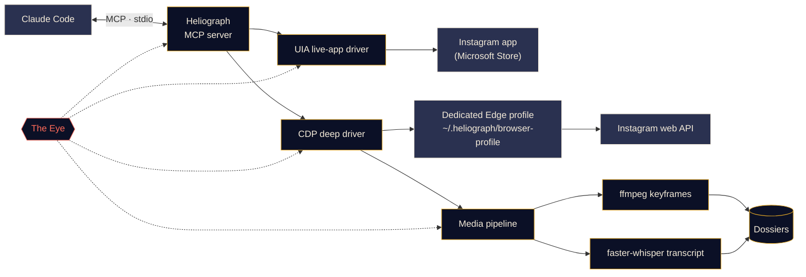

<p align="center">
  
</p>

<p align="center">
  <a href="#quick-start"></a>
  <a href="../../LICENSE"></a>
  <a href="#platform-support"></a>
  <a href="#mcp-tools"></a>
  <a href="https://github.com/DeanT-04/instagram-bridge-with-claude/actions/workflows/ci.yml"></a>
</p>

<p align="center">
  <a href="../../README.md">English</a> ·
  <a href="README.es.md">Español</a> ·
  <a href="README.fr.md">Français</a> ·
  <a href="README.de.md">Deutsch</a> ·
  <a href="README.pt-BR.md">Português (BR)</a> ·
  <a href="README.it.md">Italiano</a> ·
  <a href="README.ru.md">Русский</a> ·
  <a href="README.tr.md">Türkçe</a> ·
  <a href="README.ar.md">العربية</a> ·
  <a href="README.hi.md">हिन्दी</a> ·
  <a href="README.zh-CN.md">简体中文</a> ·
  <b>日本語</b> ·
  <a href="README.ko.md">한국어</a>
</p>

> これは翻訳版です。正式な内容は[英語版 README](../../README.md) であり、相違がある場合は英語版が優先されます。

---

**Heliograph** は、[Claude Code](https://docs.anthropic.com/en/docs/claude-code) と MCP サーバーを通じて、Claude を**あなた自身のデバイス上にある、あなた自身の Instagram** とつなぎます。Claude はあなたが見ている画面を読み取り、保存済みコレクションを確認し、リールを構造化された検索可能なドシエ（資料フォルダ）に変換できます。すべてローカルで動作し、書き込み操作はすべてあなたの管理下にあります。

> **なぜ「Heliograph」？** 世界最初の写真は*ヘリオグラフ*（ニエプス、1820 年代）でした。ヘリオグラフは、鏡で太陽光を遠くへ点滅させて合図を送る信号機の名前でもあります。カメラであり、橋でもある——それがまさにこのプロジェクトです。

> [!NOTE]
> **ステータス：v0.1.0——初期段階ですが動作します。** セットアップ、CLI、MCP サーバー（41 ツール）、2 つのドライバー、ドシエ生成パイプラインをリリース済みです。読み取り操作は Windows 11 上の実アカウントでライブ検証済みです（ログイン中のアカウント、コレクション一覧、コレクション内の投稿、検索、アプリのバッジ、ステータス）。**書き込み操作**（いいね、保存、フォロー、コメント、DM など）は実装済みでドライラン（模擬実行）テストも通っていますが、**実アカウントでの検証はまだです**。

## できること

- **Claude があなたと同じように Instagram を見て操作できる**——実際にインストールされたアプリで、あなたの本当のセッションのまま。
- **構造化データを取得する**（保存済みコレクション、リールのメタデータ、キャプション、DM、メディア）。一度だけログインする専用ブラウザプロファイルを使います。
- **リールをドシエに変換する**——動画、キーフレーム、コンタクトシート、タイムスタンプ付きの文字起こし、メタデータを 1 つのフォルダにまとめ、Claude が読んで*見る*ことができます。
- **自分自身を監視する**——*The Eye* がすべてのツール呼び出し、ドライバー操作、サブプロセスをローカルに記録するので、失敗の原因をあなたや Claude が説明できます。

## 機能

<table>
  <tr>
    <td width="33%" valign="top">
      <h3>ライブアプリ・ドライバー</h3>
      Microsoft Store 版 Instagram アプリを Windows UI Automation で操作します。画面の読み取り、移動、スクロール、スクリーンショット、クリックや入力（あなたの確認つき）。ログイン手順は一切不要です。<br><br><sub><b>利用可能 · Windows</b></sub>
    </td>
    <td width="33%" valign="top">
      <h3>ディープ・ドライバー</h3>
      Chrome DevTools Protocol で専用の Edge/Chrome プロファイルを操作し、ページ内から Instagram 自身の Web API を読み取ります。きれいな JSON、動画 URL、一括処理に対応。<br><br><sub><b>利用可能</b></sub>
    </td>
    <td width="33%" valign="top">
      <h3>リール・ドシエ</h3>
      ffmpeg によるシーン切り替えキーフレーム（知覚ハッシュで重複除去）、コンタクトシート、faster-whisper の文字起こしを、リールごとに 1 つの Markdown ドシエにまとめます。画面上の文字は OCR で読み取り、英語以外の音声には英訳も付きます。チャートの小さなラベルは切り出して拡大できます。<br><br><sub><b>利用可能</b></sub>
    </td>
  </tr>
  <tr>
    <td width="33%" valign="top">
      <h3>MCP サーバー</h3>
      フォルダを開くと <code>.mcp.json</code> 経由で Claude Code に自動登録される 41 のツールと、2 つのプロジェクトスキル。<br><br><sub><b>利用可能</b></sub>
    </td>
    <td width="33%" valign="top">
      <h3>The Eye</h3>
      ローカルファーストのトレーシング：スパン、トレース ID、秘密情報のマスキング、失敗時のスクリーンショットと DOM スナップショット、ターミナルのライブ表示、Claude が読めるレポート。<br><br><sub><b>利用可能</b></sub>
    </td>
    <td width="33%" valign="top">
      <h3>安全装置</h3>
      書き込み操作は確認がなければドライランのみ。すべてにレート制限があり、URL とダウンロードは許可リスト方式、パスワードが Heliograph を通ることはありません。<br><br><sub><b>利用可能 · 書き込みはライブ未検証</b></sub>
    </td>
  </tr>
</table>

<a id="quick-start"></a>
## クイックスタート

**必要なもの：** Python 3.11 以上（3.12 推奨）、[ffmpeg](https://ffmpeg.org/)、Microsoft Edge または Google Chrome、[Claude Code](https://docs.anthropic.com/en/docs/claude-code)。Windows でライブアプリ・ドライバーを使う場合は Microsoft Store 版 Instagram アプリも必要です。[uv](https://docs.astral.sh/uv/) がなければ、セットアップスクリプトが確認のうえインストールします。

```bash
# 1. Clone
git clone https://github.com/DeanT-04/instagram-bridge-with-claude.git heliograph
cd heliograph

# 2. Run the one-command setup
powershell -ExecutionPolicy Bypass -File scripts\setup.ps1   # Windows
bash scripts/setup.sh                                        # macOS / Linux

# 3. Sign in to Instagram once, yourself, in Heliograph's own browser window
uv run heliograph login

# 4. Open Claude Code in the folder
claude
```

Claude Code は `.mcp.json` から Heliograph の MCP サーバーを見つけ、初回に承認を求めます。標準の Windows はスクリプトの実行をブロックする（実行ポリシー *Restricted*）ため、上のとおり `powershell -ExecutionPolicy Bypass -File scripts\setup.ps1` でセットアップを起動してください。この例外はその 1 回の実行にだけ適用され、設定は何も変わりません。セットアップは何度でも安全に再実行できます。**Windows** のオプション：`-Yes`（確認なし）、`-NoInput`（一切確認せず「いいえ」と回答。CI 向け）、`-WithWhisper`（音声モデル約 500 MB を事前ダウンロード）。**macOS / Linux**：`--yes`、`--no-input`、`--with-whisper`。uv がない場合、スクリプトは確認のうえ、バージョン固定の公式インストーラーで uv 0.12.1 をインストールします。何かおかしいときは `uv run heliograph doctor` を実行してください。

## Claude と使う

プロジェクトフォルダで Claude に話しかけるだけです。例：

- *「保存済みコレクション『Trading strats』から戦略をすべて抽出して。」*——`extract-trading-strategies` スキルを最初から最後まで実行します。
- *「DM と通知に何か新しいことはある？要約だけして、返信はしないで。」*
- *「Instagram アプリを開いてリールに移動し、画面に何が映っているか教えて。」*
- *「@some_creator の最新 5 件の投稿を探して、いちばん新しい投稿へのコメント案を書いて。」*——Claude はまずドライランの結果を見せます。あなたが承認するまで何も投稿されません。

`CLAUDE.md` は Claude の運用マニュアル（安全ルール、ツールの分類、トラブルシューティング）で、[`instagram-control`](../../.claude/skills/instagram-control/SKILL.md) スキルがどのツールを使うべきかを教えます。

<a id="how-it-works"></a>
## 仕組み



<details>
<summary><b>なぜドライバーが 2 つあるのか？</b></summary>

<br>

Microsoft Store 版 Instagram アプリは、普段使いの Edge プロファイル上で動く Edge の Web アプリです。最近の Edge はデフォルトプロファイルで DevTools ポートを開くことを拒否するため、インストール済みアプリを DevTools で自動化することは**できません**。一方、Windows UI Automation を使えば完全に読み取り・操作**できます**。

| ドライバー | 対象 | 強み | 用途 |
|---|---|---|---|
| `uia` | インストール済み Store アプリのウィンドウ | 本物のアプリとセッション、ログイン不要 | 移動、画面内容の読み取り、スクリーンショット、確認済みのクリック |
| `cdp` | アプリウィンドウとして起動する専用 Edge/Chrome プロファイル（DevTools は `127.0.0.1` にバインド） | Instagram Web API からの構造化 JSON、動画 URL、ネットワークキャプチャ | 保存済みコレクション、フィード、DM、リールのメタデータ、ダウンロード、一括抽出 |

設計の詳細は [docs/ARCHITECTURE.md](../ARCHITECTURE.md) を参照してください。

</details>

<a id="platform-support"></a>
<details>
<summary><b>対応プラットフォーム</b></summary>

<br>

| | Windows 10/11 | macOS | Linux |
|---|---|---|---|
| セットアップスクリプト | 検証済み | 利用可能（未テスト） | 利用可能（未テスト） |
| ディープ・ドライバー（CDP）と MCP サーバー | 検証済み | 利用可能（未テスト） | 利用可能（未テスト） |
| メディアパイプラインとドシエ | 利用可能 | 利用可能（未テスト） | 利用可能（未テスト） |
| The Eye | 利用可能 | 利用可能 | 利用可能 |
| ライブアプリ・ドライバー（`app_*` ツール） | 検証済み | 予定 | 対象外 |

</details>

<a id="mcp-tools"></a>
## MCP ツール

7 つのカテゴリに 41 のツールがあります。一覧系ツールは `limit` と `cursor` を受け取ります。次のページは返された `next_cursor` を渡して取得します。

<details open>
<summary><b>ツールリファレンス</b></summary>

<br>

| カテゴリ | ツール | 内容 |
|---|---|---|
| **ステータス** | `heliograph_status` | 状態：OS、Store アプリ、ブラウザー、ffmpeg、ログイン状態 |
| | `heliograph_setup_check` | すべてのツールを使えるようにするため、残っている作業 |
| **読み取り** | `ig_whoami` | Heliograph のブラウザープロファイルにログイン中のアカウント |
| | `ig_get_user` | ユーザー名からアカウントの公開プロフィールを取得 |
| | `ig_user_posts` | アカウントの最近の投稿とリール |
| | `ig_get_media` | 投稿/リールの詳細（キャプションとメディア URL を含む） |
| | `ig_comments` | 投稿/リールのトップレベルのコメント |
| | `ig_search` | 検索：ユーザー、ハッシュタグ、場所 |
| | `ig_timeline` | ホームフィード |
| | `ig_reels_feed` | リールの発見フィード |
| | `ig_explore` | 発見タブのグリッドの投稿 |
| | `ig_inbox` | 最新メッセージのプレビュー付き DM スレッド |
| | `ig_thread` | 1 つの DM スレッドのメッセージ |
| | `ig_activity` | 最近の通知：いいね、フォロー、コメント、メンション |
| **コレクション** | `ig_list_collections` | 保存済みコレクションの一覧 |
| | `ig_collection_posts` | 名前または ID で指定したコレクションの投稿 |
| | `ig_saved_posts` | 保存済みの全投稿（新しい順） |
| **抽出** | `ig_extract_media` | 投稿/リールのドシエを作成（または再利用） |
| | `ig_extract_collection` | コレクションのドシエをバッチで作成 |
| | `ig_read_dossier` | ドシエの Markdown、文字起こし、メタデータを読む |
| | `ig_view_frames` | コンタクトシートやキーフレームを Claude が見られる画像として返す |
| **ライブアプリ** *（Windows）* | `app_open` | Instagram アプリのウィンドウに接続 |
| | `app_snapshot` | 画面内容のテキスト構造（アクセシビリティツリー） |
| | `app_screenshot` | アプリウィンドウのスクリーンショット（他のウィンドウの背後でも可） |
| | `app_navigate` | セクションを開く：ホーム、検索、発見、リール、メッセージ… |
| | `app_click` | ref または名前で要素をクリック（書き込みには確認が必要） |
| | `app_scroll` | 画面単位でスクロール（リールビューアーでは 1 ページ 1 リール） |
| | `app_type` | 入力欄に文字を入力（送信には確認が必要） |
| | `app_visible_posts` | 画面に表示中の投稿/リールとそのボタン |
| | `app_badges` | メッセージと通知の未読数 |
| **書き込み** *（確認制）* | `ig_like` / `ig_unlike` | 投稿/リールにいいね、または取り消し |
| | `ig_save` / `ig_unsave` | 保存または保存解除（コレクション指定も可） |
| | `ig_follow` / `ig_unfollow` | アカウントをフォロー、またはフォロー解除 |
| | `ig_comment` | あなたが承認した文面そのままでコメントを投稿 |
| | `ig_send_dm` | ユーザーまたは既存スレッドに DM を送信 |
| **Eye** | `eye_report` | 健全性の要約：エラー率、遅い操作・失敗した操作 |
| | `eye_trace` | 1 回のツール呼び出しの全ステップ（トレースバックと成果物つき） |
| | `eye_recent` | 最新のイベント（エラーのみに絞り込みも可） |

</details>

## トレード系リールの抽出

ショーケースとなるワークフロー：トレード関連のリールを Instagram のコレクションに保存しておくと、Claude がそれを本当に学べるノートにまとめます。

1. Claude に頼みます：*「保存済みコレクション『Trading strats』から戦略をすべて抽出して。」*
2. Heliograph がディープ・ドライバーでコレクションを一覧し、各リールを Instagram の CDN からダウンロードします。
3. メディアパイプラインがシーン切り替えのキーフレーム（チャート、セットアップ、注釈）、コンタクトシート、タイムスタンプ付き文字起こしを取り出します。各キーフレームの画面上の文字を OCR で読み取り、英語以外の音声には英訳を付けます。
4. Claude は各ドシエを読み、`ig_view_frames` で**フレームを実際に見て**、リールごとにノートを書きます——エントリールール、エグジット、リスク管理、インジケーター設定、そして検証できなかった主張——さらに索引も作ります。チャートの小さなラベルやインジケーターの設定値は切り出して拡大し（`ig_view_frames(..., crop=...)`）、話の内容と照らし合わせます。

```text
~/.heliograph/dossiers/<creator>/<code>/
├── meta.json          # author, caption, date, URL, metrics
├── caption.md
├── video.mp4          # or images/NN.jpg for photo posts
├── transcript.json    # timestamped segments + language (+ English translation)
├── transcript.md
├── frames/*.jpg       # de-duplicated keyframes (+ frames.json)
├── ocr.json           # on-screen text of every keyframe (OCR)
├── crops/             # zoomed regions of small chart text
├── contact_sheet.jpg  # every keyframe on one image
└── dossier.md         # everything above, stitched for Claude
```

ノートはプロジェクトフォルダ内の `strategies/` に書き出されます。個人データのため git の管理対象外です。Claude を使わずにドシエだけ作ることもできます：`uv run heliograph extract --collection "Trading strats"`。

> [!CAUTION]
> Heliograph はクリエイターの発言を整理するだけで、その正しさを判断しません。生成されるものはいずれも投資助言ではありません。

## The Eye

*The Eye* は Heliograph に組み込まれた、ローカルファーストのオブザーバビリティ機能です。外部サービスは不要です。

- MCP ツール呼び出し、ドライバー操作、HTTP リクエスト、ffmpeg/whisper サブプロセスはすべて、共通の `trace_id` を持つ**スパン**として記録されます。Claude からの 1 つのリクエストを最初から最後まで追跡できます。
- イベントは `~/.heliograph/eye/events.jsonl`（ローテーションあり）に書き込まれ、検索用の SQLite インデックスも作られます。
- **書き込み前に秘密情報をマスク**——Cookie、`sessionid`、`csrftoken`、認証ヘッダー、トークンらしき文字列。
- UI やブラウザの手順が失敗すると、スクリーンショットとアクセシビリティ/DOM スナップショットを保存し、イベントにリンクします。
- ツールのエラーには必ず**ヒント**と**トレース ID** が付きます。Claude はそれで `eye_trace` を呼び、何が起きたかを正確に確認できます。
- `heliograph eye` は色分けされたライブ表示と、エラー率・p95 レイテンシ・失敗の多い操作といった直近の健全性を表示します。`heliograph eye report` は最近のエラーを要約します。
- `LANGFUSE_PUBLIC_KEY` / `LANGFUSE_SECRET_KEY` を設定すると Langfuse へのエクスポートも可能です（デフォルトはオフ）。

## セキュリティとプライバシー

- **ログインは手動で 1 回だけ。** 専用ブラウザプロファイルへのサインインはあなた自身が一度だけ行います（`heliograph login`）。Heliograph がパスワードを入力・保存・記録することは一切ありません。
- **ライブアプリ・ドライバーはログイン不要**——すでにサインイン済みの Instagram アプリを使います。
- **書き込み操作はデフォルトでドライラン。** いいね、フォロー、コメント、DM、保存とそれらの取り消しは、何が*起きるか*の説明を返すだけです。チャットであなたが承認した後に `confirm=true` で再度呼ばれたときだけ実行されます。ライブアプリでのアクションボタンのクリックやテキスト送信も同様です。
- **ジッター付きレート制限**を書き込み*と*読み取りの両方に適用し、人間らしいペースを保ちます。
- **データはローカルのみ。** ドシエ、ログ、ブラウザプロファイルはあなたのマシンの `~/.heliograph` に、非公開のファイル権限で保存されます。DevTools ポートは `127.0.0.1` のランダムな空きポートにバインドされます。
- **短命なブラウザ。** 専用ブラウザの実行中は、ローカルの任意のプログラムがその DevTools ポートを使えてしまうため、Heliograph が起動したブラウザは MCP サーバーや CLI コマンドの終了時、および 15 分間アイドル状態が続いた後（`HELIOGRAPH_BROWSER_IDLE_MINUTES`、`0` = 無効）に閉じられ、次の呼び出しで自動的に再起動します。CI の Actions はコミット SHA に固定され、Dependabot が最新に保ちます。
- **厳格な許可リスト**——受け付ける URL は Instagram のものだけで、ダウンロードは Instagram の CDN ホストから HTTPS でのみ行います。パストラバーサル対策が API クライアントとドシエのフォルダを守ります。

脅威モデルと脆弱性の報告方法は [docs/SECURITY.md](../SECURITY.md) を参照してください。

## CLI リファレンス

| コマンド | 内容 | ステータス |
|---|---|---|
| `heliograph setup` | 環境をチェックし、対処（Chromium、Store アプリ）を提案、必要に応じて Whisper を事前ダウンロードし、次の手順を表示 | 利用可能 |
| `heliograph setup --no-input` | 同じチェックを一切の確認なしで実行（「いいえ」と回答）。スクリプトや CI 向け | 利用可能 |
| `heliograph doctor` | Instagram アプリ、Edge/Chrome、ffmpeg、OS、ログイン状態を検出（生データは `--json`） | 利用可能 |
| `heliograph login` | 専用ブラウザプロファイルを開き、手動で一度だけサインイン | 利用可能 |
| `heliograph mcp` | stdio で MCP サーバーを起動（Claude Code が自動で起動します） | 利用可能 |
| `heliograph extract <url>` | リール/投稿 1 件のドシエを作成。`--collection "<名前>"` でコレクション全体 | 利用可能 |
| `heliograph dossier show <code>` | 作成済みのドシエを表示：キャプション、検出された用語、音声/フレーム/OCR のタイムライン（`--transcript` で文字起こしも表示） | 利用可能 |
| `heliograph dossier frames <code>` | キーフレームをタイムスタンプと画面上の文字つきで一覧表示、または拡大した切り出し画像を保存（`--crop`、任意で `--ocr`） | 利用可能 |
| `heliograph eye` | The Eye のライブ表示と健全性 | 利用可能 |
| `heliograph eye report` | 最近のエラーと異常の要約 | 利用可能 |
| `heliograph version` | Heliograph のバージョンを表示 | 利用可能 |

各コマンドはプロジェクトフォルダーで `uv run heliograph <コマンド>` として実行します。`login`、`mcp`、`extract` は `--account <キー>` で別のブラウザープロファイルを使えます。

<details>
<summary><b>プロジェクト構成</b></summary>

<br>

```text
src/heliograph/
├── cli.py              # Typer CLI entry point
├── commands/           # setup, doctor, login, extract, dossier.py (show / frames)
├── config.py           # settings (env prefix HELIOGRAPH_), paths under ~/.heliograph
├── errors.py           # HeliographError hierarchy
├── writelimit.py       # write rate limit shared by every process (lock file + state)
├── detect/             # environment detection: Store app, browsers, ffmpeg, OS
├── drivers/
│   ├── base.py         # InstagramDriver protocol + shared dataclasses
│   ├── uia/            # Windows UI Automation live-app driver
│   └── cdp/            # browser launcher, CDP session, web-API client, rate limits
├── instagram/          # models, service, collections, write actions
├── media/              # allow-listed download, ffmpeg frames, faster-whisper,
│                       #   ocr.py (on-screen text), dedupe.py (near-duplicate frames)
├── extract/            # reel -> dossier; render.py, signals.py (terms, mismatch),
│                       #   zoom.py (crop + zoom small chart text)
├── eye/                # the Eye: spans, sinks, redaction, live view, reports
└── mcp/                # FastMCP server, tools_*.py per family, runtime, common
tests/                  # pytest; live tests marked @pytest.mark.live
docs/                   # architecture, security, translations, brand assets
scripts/                # setup.ps1 / setup.sh
.github/workflows/ci.yml # lint, strict types and tests on Windows, macOS and Linux
.claude/skills/         # extract-trading-strategies, instagram-control
.mcp.json               # registers the MCP server with Claude Code
CLAUDE.md               # operating manual for Claude
```

</details>

## ロードマップ

- [x] ワンコマンドセットアップ、`.mcp.json` による登録、`heliograph login`
- [x] 読み取り・コレクション・抽出・ライブアプリ・書き込み・Eye のツールを備えた MCP サーバー
- [x] `extract-trading-strategies` と `instagram-control` スキル
- [ ] すべての書き込み操作のライブ検証
- [x] Windows、macOS、Linux での CI
- [ ] Claude セッションでの**マルチアカウント**対応（別プロファイルは `--account` で既に利用可能）
- [ ] `adb` による **Android** 対応
- [ ] **macOS** 向けライブアプリ・ドライバー（アクセシビリティ API）

## コントリビュート

コントリビュートを歓迎します。[CONTRIBUTING.md](../../CONTRIBUTING.md) と[行動規範](../../CODE_OF_CONDUCT.md)をご覧ください。

## 免責事項

Heliograph は独立したオープンソースプロジェクトです。**Instagram および Meta Platforms, Inc. とは提携しておらず、承認や後援も受けていません。**「Instagram」はその所有者の商標であり、本ソフトウェアの対象を説明する目的でのみ使用しています。Heliograph は**ご自身のアカウントでのみ**使用し、個人的かつ人間らしいペースで利用し、[Instagram の利用規約](https://help.instagram.com/581066165581870)を守ってください。利用に関する責任はご自身にあります。

## ライセンス

[MIT](../../LICENSE) © 2026 DeanT-04
