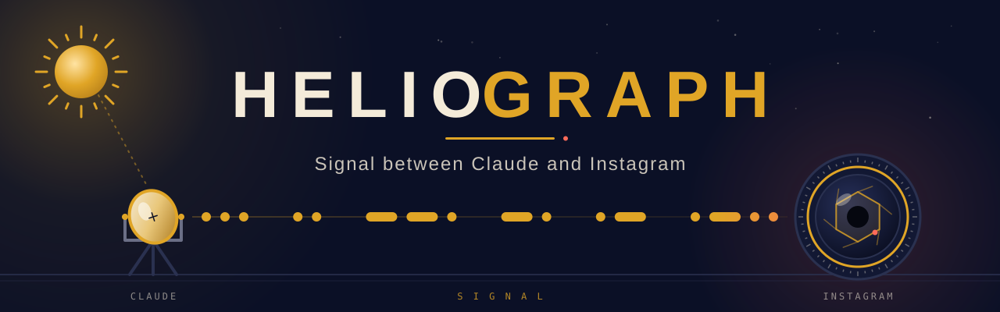
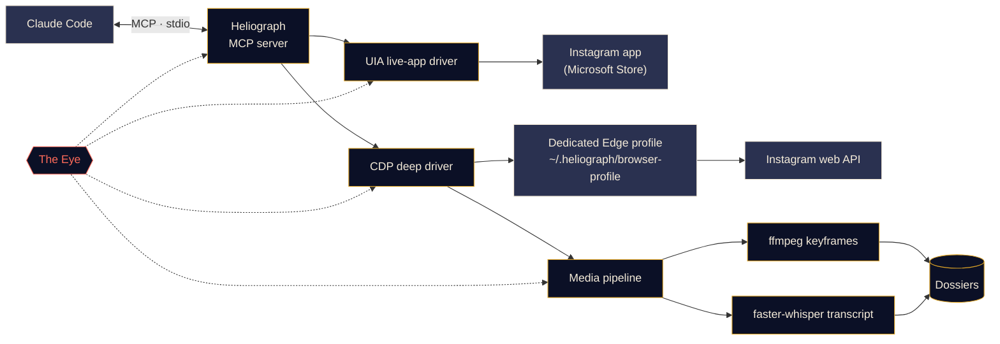

<p align="center">
  
</p>

<p align="center">
  <a href="#quick-start"></a>
  <a href="../../LICENSE"></a>
  <a href="#platform-support"></a>
  <a href="#how-it-works"></a>
  <a href="../../CONTRIBUTING.md#tests"></a>
</p>

<p align="center">
  <a href="../../README.md">English</a> ·
  <a href="README.es.md">Español</a> ·
  <a href="README.fr.md">Français</a> ·
  <a href="README.de.md">Deutsch</a> ·
  <a href="README.pt-BR.md">Português (BR)</a> ·
  <a href="README.it.md">Italiano</a> ·
  <a href="README.ru.md">Русский</a> ·
  <a href="README.tr.md">Türkçe</a> ·
  <a href="README.ar.md">العربية</a> ·
  <a href="README.hi.md">हिन्दी</a> ·
  <a href="README.zh-CN.md">简体中文</a> ·
  <a href="README.ja.md">日本語</a> ·
  <b>한국어</b>
</p>

> 이 문서는 번역본입니다. 기준 문서는 [영어 README](../../README.md)이며, 내용이 다를 경우 영어판이 우선합니다.

---

**Heliograph**는 [Claude Code](https://docs.anthropic.com/en/docs/claude-code)와 MCP 서버를 통해 Claude를 **내 기기에 있는 내 Instagram**과 연결합니다. Claude는 내가 보는 화면을 읽고, 저장한 컬렉션을 살펴보고, 릴스를 구조화되고 검색 가능한 도시에(자료 폴더)로 바꿀 수 있습니다. 모든 작업은 로컬에서 이루어지며, 모든 쓰기 작업은 내가 통제합니다.

> **왜 "Heliograph"인가요?** 역사상 최초의 사진은 *헬리오그래프*(니엡스, 1820년대)였습니다. 헬리오그래프는 거울로 햇빛을 반사해 먼 곳에 신호를 보내는 장치이기도 합니다. 카메라이자 다리 — 이 프로젝트가 바로 그렇습니다.

> [!NOTE]
> **상태: 초기 개발 단계(v0.1.0).** 아키텍처는 확정되었고 핵심 모듈을 만들고 있습니다. 아래 모든 기능에는 **사용 가능**, **진행 중**, **계획됨** 중 하나가 표시되어 있습니다. 아직 코드로 작성되지 않은 것을 약속하지 않습니다.

## 무엇을 하나요

- **Claude가 나처럼 Instagram을 보고 사용하게 합니다** — 실제로 설치된 앱에서, 나의 실제 세션으로.
- **구조화된 데이터를 가져옵니다**(저장한 컬렉션, 릴스 메타데이터, 캡션, 미디어). 한 번만 로그인하는 별도의 전용 브라우저 프로필을 사용합니다.
- **릴스를 도시에로 만듭니다** — 동영상, 키프레임, 타임스탬프가 있는 자막, 메타데이터를 한 폴더에 모아 Claude가 읽고 분석할 수 있게 합니다.
- **스스로를 관찰합니다** — *The Eye*가 모든 도구 호출, 드라이버 동작, 하위 프로세스를 로컬에 기록하므로, 실패 원인을 나 또는 Claude가 설명할 수 있습니다.

## 기능

<table>
  <tr>
    <td width="33%" valign="top">
      <h3>라이브 앱 드라이버</h3>
      Windows UI Automation으로 Microsoft Store Instagram 앱을 조작합니다. 화면 읽기, 이동, 좋아요, 저장, 팔로우, 스크린샷. 로그인 단계가 전혀 없습니다.<br><br><sub><b>진행 중</b></sub>
    </td>
    <td width="33%" valign="top">
      <h3>딥 드라이버</h3>
      Chrome DevTools Protocol로 전용 Edge/Chrome 프로필을 제어하며, 페이지 안에서 Instagram 자체 웹 API를 읽어 깔끔한 JSON, 동영상 URL, 대량 작업을 제공합니다.<br><br><sub><b>진행 중</b></sub>
    </td>
    <td width="33%" valign="top">
      <h3>릴스 도시에</h3>
      ffmpeg 장면 전환 키프레임(지각 해시로 중복 제거)과 faster-whisper 자막을 릴스마다 하나의 Markdown 도시에로 묶습니다.<br><br><sub><b>진행 중</b></sub>
    </td>
  </tr>
  <tr>
    <td width="33%" valign="top">
      <h3>MCP 서버</h3>
      폴더를 열면 <code>.mcp.json</code>을 통해 Claude Code에 자동 등록되는 FastMCP 서버.<br><br><sub><b>진행 중</b></sub>
    </td>
    <td width="33%" valign="top">
      <h3>The Eye</h3>
      로컬 우선 트레이싱: 스팬, 트레이스 ID, 비밀 정보 마스킹, 실패 스냅샷, 터미널 실시간 보기, 그리고 Claude가 읽을 수 있는 리포트.<br><br><sub><b>사용 가능(초기)</b></sub>
    </td>
    <td width="33%" valign="top">
      <h3>안전장치</h3>
      쓰기 작업은 명시적 확인이 필요하고, 모든 작업에 속도 제한이 있으며, 다운로드는 Instagram CDN으로 제한되고, 어떤 비밀번호도 Heliograph를 거치지 않습니다.<br><br><sub><b>진행 중</b></sub>
    </td>
  </tr>
</table>

<a id="quick-start"></a>
## 빠른 시작

**필요한 것:** Python 3.11+ (3.12 권장), [uv](https://docs.astral.sh/uv/), [ffmpeg](https://ffmpeg.org/), Microsoft Edge 또는 Google Chrome, [Claude Code](https://docs.anthropic.com/en/docs/claude-code), 그리고 Windows에서 라이브 앱 드라이버를 쓰려면 Microsoft Store의 Instagram 앱.

```bash
# 1. Clone
git clone https://github.com/DeanT-04/instagram-bridge-with-claude.git heliograph
cd heliograph

# 2. Run the one-command setup
./scripts/setup.ps1        # Windows (PowerShell)
./scripts/setup.sh         # macOS / Linux

# 3. Open Claude Code in the folder
claude
```

Claude Code는 `.mcp.json`에서 Heliograph MCP 서버를 찾아 처음 한 번 승인을 요청합니다. 그다음에는 그냥 물어보면 됩니다. 예: *"Trading이라는 저장 컬렉션에 뭐가 있어?"*

> [!IMPORTANT]
> 설치 스크립트, `.mcp.json`, `heliograph login`은 **진행 중**입니다. 준비되기 전까지는 직접 설정할 수 있습니다:
>
> ```bash
> uv sync
> uv run heliograph doctor
> ```
>
> `doctor`는 Instagram 앱, Edge/Chrome, ffmpeg, 운영체제를 확인하고 무엇이 빠졌는지 알려줍니다.

<a id="how-it-works"></a>
## 작동 방식



<details>
<summary><b>왜 드라이버가 두 개인가요?</b></summary>

<br>

Microsoft Store Instagram 앱은 평소 쓰는 Edge 프로필에서 실행되는 Edge 웹 앱입니다. 최신 Edge는 기본 프로필에서 DevTools 포트를 여는 것을 거부하므로, 설치된 앱은 DevTools로 **자동화할 수 없습니다**. 하지만 Windows UI Automation으로는 완전히 **읽고 조작할 수 있습니다**.

| 드라이버 | 대상 | 강점 | 용도 |
|---|---|---|---|
| `uia` | 설치된 Store 앱 창 | 실제 앱과 세션, 로그인 불필요 | 이동, 화면 내용 읽기, 좋아요 / 저장 / 팔로우, 스크린샷 |
| `cdp` | 앱 창으로 실행되는 전용 Edge/Chrome 프로필, DevTools는 `127.0.0.1`에 바인딩 | Instagram 웹 API의 구조화된 JSON, 동영상 URL, 네트워크 캡처 | 저장 컬렉션, 릴스 메타데이터, 다운로드, 대량 추출 |

기능이 겹치는 부분에서는 둘 다 하나의 `InstagramDriver` 인터페이스를 구현합니다. 전체 설계는 [docs/ARCHITECTURE.md](../ARCHITECTURE.md)를 참고하세요.

</details>

<a id="platform-support"></a>
<details>
<summary><b>플랫폼 지원</b></summary>

<br>

| | Windows 10/11 | macOS | Linux |
|---|---|---|---|
| 딥 드라이버(CDP) | 진행 중 | 진행 중 | 진행 중 |
| 미디어 파이프라인 및 도시에 | 진행 중 | 진행 중 | 진행 중 |
| The Eye | 사용 가능 | 사용 가능 | 사용 가능 |
| 라이브 앱 드라이버 | 진행 중(UI Automation) | 계획됨 | 해당 없음 |

</details>

## 트레이딩 릴스 추출

대표 워크플로: 트레이딩 릴스를 Instagram 컬렉션에 저장해 두면, Claude가 이를 실제로 공부할 수 있는 노트로 바꿔 줍니다.

1. Claude에게 요청합니다: *"저장 컬렉션 'Trading'에서 전략을 추출해 줘."*
2. Heliograph가 딥 드라이버로 컬렉션 목록을 가져오고, 각 릴스를 Instagram CDN에서 다운로드합니다.
3. 미디어 파이프라인이 장면 전환 키프레임(차트, 셋업, 주석)과 타임스탬프가 있는 자막을 추출합니다.
4. 각 릴스가 도시에가 되고, Claude가 이를 읽고 진입 규칙, 청산, 리스크 관리, 그리고 검증할 수 없었던 주장을 정리합니다.

```text
dossiers/<reel-id>/
├── meta.json          # author, caption, date, URL, metrics
├── video.mp4
├── transcript.json    # timestamped segments
├── transcript.md
├── frames/*.jpg       # de-duplicated keyframes
└── dossier.md         # everything above, stitched for Claude
```

**상태:** 도시에 생성기는 **진행 중**, Claude Code 스킬 `extract-trading-strategies`는 **계획됨**입니다.

> [!CAUTION]
> Heliograph는 크리에이터의 말을 정리할 뿐, 그 말이 옳은지 판단하지 않습니다. 생성되는 어떤 내용도 투자 조언이 아닙니다.

## The Eye

*The Eye*는 Heliograph에 내장된 로컬 우선 관측(observability) 기능입니다. 외부 서비스가 필요 없습니다.

- 모든 MCP 도구 호출, 드라이버 동작, HTTP 요청, ffmpeg/whisper 하위 프로세스가 공유 `trace_id`를 가진 **스팬**으로 기록되어, Claude의 요청 하나를 처음부터 끝까지 추적할 수 있습니다.
- 이벤트는 `~/.heliograph/eye/events.jsonl`(순환 기록)에 저장되고, 조회용 SQLite 인덱스도 함께 만들어집니다.
- **기록 전에 비밀 정보를 가립니다** — 쿠키, `sessionid`, `csrftoken`, 인증 헤더, 토큰처럼 보이는 문자열.
- UI나 브라우저 단계가 실패하면 스크린샷과 접근성/DOM 스냅샷을 저장해 이벤트에 연결합니다 *(진행 중)*.
- `heliograph eye`는 색상으로 구분된 실시간 로그와 오류율, p95 지연 시간, 가장 많이 실패한 작업 같은 최근 상태를 보여줍니다.
- `heliograph eye report` — 그리고 MCP 도구 `eye_report` *(진행 중)* — 는 최근 오류를 요약해 Claude가 스스로 문제를 진단할 수 있게 합니다.
- `LANGFUSE_PUBLIC_KEY` / `LANGFUSE_SECRET_KEY`를 설정하면 Langfuse로 선택적으로 내보낼 수 있습니다(기본값은 꺼짐).

## 보안 및 개인정보

- **한 번만 직접 로그인.** 전용 브라우저 프로필에 직접, 한 번 로그인합니다. Heliograph는 비밀번호를 입력하거나 저장하거나 기록하지 않습니다.
- **라이브 앱 드라이버는 로그인이 필요 없습니다** — 이미 로그인된 Instagram 앱을 사용합니다.
- **쓰기 작업에는 확인이 필요합니다.** 좋아요, 팔로우, 댓글, DM, 게시, 저장 취소는 모두 MCP 계층에서 명시적인 `confirm=True`가 필요하므로, Claude는 먼저 사용자에게 물어봐야 합니다.
- **지터가 적용된 속도 제한**을 쓰기*와* 읽기 모두에 적용해 사람과 비슷한 속도를 유지합니다.
- **데이터는 로컬에만.** 도시에, 로그, 브라우저 프로필은 내 컴퓨터의 `~/.heliograph`에 남습니다. DevTools 포트는 `127.0.0.1`의 임의의 빈 포트에 바인딩됩니다.
- **허용 목록 기반 다운로드** — Instagram CDN 호스트에서 HTTPS로만 받습니다.

위협 모델과 취약점 제보 방법은 [docs/SECURITY.md](../SECURITY.md)를 참고하세요.

## CLI 레퍼런스

> 이것은 **계획된 인터페이스**입니다. 상태 열은 현재 동작하는 기능을 보여줍니다.

| 명령 | 설명 | 상태 |
|---|---|---|
| `heliograph setup` | 의존성 설치, 환경 점검, MCP 서버 등록 | 계획됨(스텁) |
| `heliograph doctor` | Instagram 앱, Edge/Chrome, ffmpeg, 운영체제, 로그인 상태 감지 | 사용 가능 |
| `heliograph login` | 전용 브라우저 프로필을 열어 한 번 직접 로그인 | 계획됨(스텁) |
| `heliograph mcp` | stdio로 MCP 서버 실행(Claude Code가 대신 시작) | 계획됨(스텁) |
| `heliograph extract <url>` | 릴스나 게시물 하나의 도시에 생성 | 계획됨(스텁) |
| `heliograph eye` | 상태 표시가 포함된 The Eye 실시간 보기 | 사용 가능 |
| `heliograph eye report` | 최근 오류와 이상 징후 요약 | 사용 가능 |

<details>
<summary><b>프로젝트 구조</b></summary>

<br>

```text
src/heliograph/
├── cli.py              # Typer CLI
├── config.py           # settings (env prefix HELIOGRAPH_), paths under ~/.heliograph
├── errors.py           # HeliographError hierarchy
├── detect/             # environment detection: Store app, browsers, ffmpeg, OS
├── drivers/
│   ├── base.py         # InstagramDriver protocol + shared dataclasses
│   ├── uia/            # Windows UI Automation live-app driver
│   └── cdp/            # browser launcher, CDP session, web-API client
├── instagram/          # models + high-level service
├── media/              # allow-listed download, ffmpeg frames, faster-whisper
├── extract/            # reel -> dossier
├── eye/                # the Eye: spans, sinks, redaction, live view, reports
└── mcp/                # FastMCP server (in progress)
tests/                  # pytest; live tests marked @pytest.mark.live
docs/                   # architecture, security, translations, brand assets
scripts/                # setup.ps1 / setup.sh (in progress)
.claude/skills/         # Claude Code skills (planned)
.mcp.json               # MCP registration for Claude Code (in progress)
```

</details>

## 로드맵

- [ ] 명령 하나로 설치, `.mcp.json` 등록, `heliograph login`
- [ ] 읽기 도구를 갖춘 MCP 서버, 이후 확인 기반 쓰기 도구
- [ ] `extract-trading-strategies` 스킬
- [ ] **다중 계정** 지원(계정별 독립 프로필과 상태)
- [ ] `adb`를 통한 **Android** 지원
- [ ] **macOS** 라이브 앱 드라이버(접근성 API)

## 기여하기

기여를 환영합니다. [CONTRIBUTING.md](../../CONTRIBUTING.md)와 [행동 강령](../../CODE_OF_CONDUCT.md)을 참고하세요.

## 면책 조항

Heliograph는 독립적인 오픈 소스 프로젝트입니다. **Instagram 또는 Meta Platforms, Inc.와 제휴 관계가 없으며, 이들의 보증이나 후원을 받지 않습니다.** "Instagram"은 해당 소유자의 상표이며, 이 소프트웨어가 무엇과 함께 동작하는지 설명하기 위해서만 사용됩니다. Heliograph는 **본인 계정에서만** 사용하고, 개인적인 용도로 사람과 비슷한 속도를 유지하며, [Instagram 이용 약관](https://help.instagram.com/581066165581870)을 준수하세요. 사용에 대한 책임은 사용자 본인에게 있습니다.

## 라이선스

[MIT](../../LICENSE) © 2026 DeanT-04
