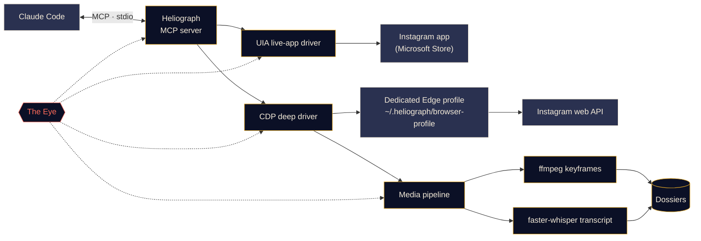

<p align="center">
  
</p>

<p align="center">
  <a href="#quick-start"></a>
  <a href="../../LICENSE"></a>
  <a href="#platform-support"></a>
  <a href="#mcp-tools"></a>
  <a href="../../CONTRIBUTING.md#tests"></a>
</p>

<p align="center">
  <a href="../../README.md">English</a> ·
  <a href="README.es.md">Español</a> ·
  <a href="README.fr.md">Français</a> ·
  <a href="README.de.md">Deutsch</a> ·
  <a href="README.pt-BR.md">Português (BR)</a> ·
  <a href="README.it.md">Italiano</a> ·
  <a href="README.ru.md">Русский</a> ·
  <a href="README.tr.md">Türkçe</a> ·
  <a href="README.ar.md">العربية</a> ·
  <a href="README.hi.md">हिन्दी</a> ·
  <a href="README.zh-CN.md">简体中文</a> ·
  <a href="README.ja.md">日本語</a> ·
  <b>한국어</b>
</p>

> 이 문서는 번역본입니다. 기준 문서는 [영어 README](../../README.md)이며, 내용이 다를 경우 영어판이 우선합니다.

---

**Heliograph**는 [Claude Code](https://docs.anthropic.com/en/docs/claude-code)와 MCP 서버를 통해 Claude를 **내 기기에 있는 내 Instagram**과 연결합니다. Claude는 내가 보는 화면을 읽고, 저장한 컬렉션을 살펴보고, 릴스를 구조화되고 검색 가능한 도시에(자료 폴더)로 바꿀 수 있습니다. 모든 작업은 로컬에서 이루어지며, 모든 쓰기 작업은 내가 통제합니다.

> **왜 "Heliograph"인가요?** 역사상 최초의 사진은 *헬리오그래프*(니엡스, 1820년대)였습니다. 헬리오그래프는 거울로 햇빛을 반사해 먼 곳에 신호를 보내는 장치이기도 합니다. 카메라이자 다리 — 이 프로젝트가 바로 그렇습니다.

> [!NOTE]
> **상태: v0.1.0 — 초기지만 동작합니다.** 설치, CLI, MCP 서버(41개 도구), 두 드라이버, 도시에 파이프라인이 출시되었습니다. 읽기 기능은 Windows 11에서 실제 계정으로 실시간 검증했습니다(로그인한 계정, 컬렉션 목록, 컬렉션 게시물, 검색, 앱 배지, 상태). **쓰기 작업**(좋아요, 저장, 팔로우, 댓글, DM 등)은 구현되어 드라이런(모의 실행)으로 테스트했지만, **아직 실제 계정에서는 검증하지 않았습니다**.

## 무엇을 하나요

- **Claude가 나처럼 Instagram을 보고 사용하게 합니다** — 실제로 설치된 앱에서, 나의 실제 세션으로.
- **구조화된 데이터를 가져옵니다**(저장한 컬렉션, 릴스 메타데이터, 캡션, DM, 미디어). 한 번만 로그인하는 전용 브라우저 프로필을 사용합니다.
- **릴스를 도시에로 만듭니다** — 동영상, 키프레임, 콘택트 시트, 타임스탬프가 있는 자막, 메타데이터를 한 폴더에 모아 Claude가 읽고 *볼* 수 있게 합니다.
- **스스로를 관찰합니다** — *The Eye*가 모든 도구 호출, 드라이버 동작, 하위 프로세스를 로컬에 기록하므로, 실패 원인을 나 또는 Claude가 설명할 수 있습니다.

## 기능

<table>
  <tr>
    <td width="33%" valign="top">
      <h3>라이브 앱 드라이버</h3>
      Windows UI Automation으로 Microsoft Store Instagram 앱을 조작합니다. 화면 읽기, 이동, 스크롤, 스크린샷, 클릭이나 입력(사용자 확인 필요). 로그인 단계가 전혀 없습니다.<br><br><sub><b>사용 가능 · Windows</b></sub>
    </td>
    <td width="33%" valign="top">
      <h3>딥 드라이버</h3>
      Chrome DevTools Protocol로 전용 Edge/Chrome 프로필을 제어하며, 페이지 안에서 Instagram 자체 웹 API를 읽어 깔끔한 JSON, 동영상 URL, 대량 작업을 제공합니다.<br><br><sub><b>사용 가능</b></sub>
    </td>
    <td width="33%" valign="top">
      <h3>릴스 도시에</h3>
      ffmpeg 장면 전환 키프레임(지각 해시로 중복 제거), 콘택트 시트, faster-whisper 자막을 릴스마다 하나의 Markdown 도시에로 묶습니다.<br><br><sub><b>사용 가능</b></sub>
    </td>
  </tr>
  <tr>
    <td width="33%" valign="top">
      <h3>MCP 서버</h3>
      폴더를 열면 <code>.mcp.json</code>을 통해 Claude Code에 자동 등록되는 41개 도구와 두 개의 프로젝트 스킬.<br><br><sub><b>사용 가능</b></sub>
    </td>
    <td width="33%" valign="top">
      <h3>The Eye</h3>
      로컬 우선 트레이싱: 스팬, 트레이스 ID, 비밀 정보 마스킹, 실패 시 스크린샷과 DOM 스냅샷, 터미널 실시간 보기, 그리고 Claude가 읽을 수 있는 리포트.<br><br><sub><b>사용 가능</b></sub>
    </td>
    <td width="33%" valign="top">
      <h3>안전장치</h3>
      쓰기 작업은 확인 전까지 드라이런만 하고, 모든 작업에 속도 제한이 있으며, URL과 다운로드는 허용 목록으로 제한되고, 어떤 비밀번호도 Heliograph를 거치지 않습니다.<br><br><sub><b>사용 가능 · 쓰기는 아직 실시간 미검증</b></sub>
    </td>
  </tr>
</table>

<a id="quick-start"></a>
## 빠른 시작

**필요한 것:** Python 3.11+ (3.12 권장), [ffmpeg](https://ffmpeg.org/), Microsoft Edge 또는 Google Chrome, [Claude Code](https://docs.anthropic.com/en/docs/claude-code), 그리고 Windows에서 라이브 앱 드라이버를 쓰려면 Microsoft Store의 Instagram 앱. [uv](https://docs.astral.sh/uv/)가 없으면 설치 스크립트가 먼저 물어본 뒤 설치해 줍니다.

```bash
# 1. Clone
git clone https://github.com/DeanT-04/instagram-bridge-with-claude.git heliograph
cd heliograph

# 2. Run the one-command setup
./scripts/setup.ps1        # Windows (PowerShell)
./scripts/setup.sh         # macOS / Linux

# 3. Sign in to Instagram once, yourself, in Heliograph's own browser window
uv run heliograph login

# 4. Open Claude Code in the folder
claude
```

Claude Code는 `.mcp.json`에서 Heliograph MCP 서버를 찾아 처음 한 번 승인을 요청합니다. 설치는 여러 번 실행해도 안전합니다. 질문을 건너뛰려면 `--yes`, 음성 모델(~500 MB)을 미리 받으려면 `--with-whisper`를 붙이세요. 문제가 있어 보이면 `uv run heliograph doctor`를 실행하세요.

## Claude와 함께 사용하기

프로젝트 폴더에서 Claude에게 말하기만 하면 됩니다. 예:

- *"'Trading strats' 컬렉션의 모든 전략을 추출해 줘."* — `extract-trading-strategies` 스킬을 처음부터 끝까지 실행합니다.
- *"DM이랑 알림에 새로운 거 있어? 요약만 하고 답장은 하지 마."*
- *"Instagram 앱을 열고 릴스로 가서 화면에 뭐가 있는지 알려 줘."*
- *"@some_creator의 최근 게시물 다섯 개를 찾아서 가장 최신 게시물에 달 댓글 초안을 써 줘."* — Claude가 먼저 드라이런 결과를 보여 주며, 내가 승인하기 전에는 아무것도 게시되지 않습니다.

`CLAUDE.md`는 Claude의 운영 매뉴얼(안전 규칙, 도구 분류, 문제 해결)이고, [`instagram-control`](../../.claude/skills/instagram-control/SKILL.md) 스킬은 어떤 도구를 써야 하는지 알려 줍니다.

<a id="how-it-works"></a>
## 작동 방식



<details>
<summary><b>왜 드라이버가 두 개인가요?</b></summary>

<br>

Microsoft Store Instagram 앱은 평소 쓰는 Edge 프로필에서 실행되는 Edge 웹 앱입니다. 최신 Edge는 기본 프로필에서 DevTools 포트를 여는 것을 거부하므로, 설치된 앱은 DevTools로 **자동화할 수 없습니다**. 하지만 Windows UI Automation으로는 완전히 **읽고 조작할 수 있습니다**.

| 드라이버 | 대상 | 강점 | 용도 |
|---|---|---|---|
| `uia` | 설치된 Store 앱 창 | 실제 앱과 세션, 로그인 불필요 | 이동, 화면 내용 읽기, 스크린샷, 확인된 클릭 |
| `cdp` | 앱 창으로 실행되는 전용 Edge/Chrome 프로필, DevTools는 `127.0.0.1`에 바인딩 | Instagram 웹 API의 구조화된 JSON, 동영상 URL, 네트워크 캡처 | 저장 컬렉션, 피드, DM, 릴스 메타데이터, 다운로드, 대량 추출 |

전체 설계는 [docs/ARCHITECTURE.md](../ARCHITECTURE.md)를 참고하세요.

</details>

<a id="platform-support"></a>
<details>
<summary><b>플랫폼 지원</b></summary>

<br>

| | Windows 10/11 | macOS | Linux |
|---|---|---|---|
| 설치 스크립트 | 검증됨 | 사용 가능(미테스트) | 사용 가능(미테스트) |
| 딥 드라이버(CDP) 및 MCP 서버 | 검증됨 | 사용 가능(미테스트) | 사용 가능(미테스트) |
| 미디어 파이프라인 및 도시에 | 사용 가능 | 사용 가능(미테스트) | 사용 가능(미테스트) |
| The Eye | 사용 가능 | 사용 가능 | 사용 가능 |
| 라이브 앱 드라이버(`app_*` 도구) | 검증됨 | 계획됨 | 해당 없음 |

</details>

<a id="mcp-tools"></a>
## MCP 도구

7개 분류에 41개 도구가 있습니다. 목록 도구는 `limit`와 `cursor`를 받으며, 다음 페이지는 반환된 `next_cursor`를 다시 넘겨 가져옵니다.

<details open>
<summary><b>도구 레퍼런스</b></summary>

<br>

| 분류 | 도구 | 설명 |
|---|---|---|
| **상태** | `heliograph_status` | 상태 점검: 운영체제, Store 앱, 브라우저, ffmpeg, 로그인 상태 |
| | `heliograph_setup_check` | 모든 도구가 동작하려면 아직 해야 할 일 |
| **읽기** | `ig_whoami` | Heliograph 브라우저 프로필에 로그인된 계정 |
| | `ig_get_user` | 사용자 이름으로 계정의 공개 프로필 조회 |
| | `ig_user_posts` | 계정의 최근 게시물과 릴스 |
| | `ig_get_media` | 게시물/릴스의 전체 정보(캡션과 미디어 URL 포함) |
| | `ig_comments` | 게시물/릴스의 최상위 댓글 |
| | `ig_search` | 통합 검색: 사용자, 해시태그, 장소 |
| | `ig_timeline` | 홈 피드 |
| | `ig_reels_feed` | 릴스 탐색 피드 |
| | `ig_explore` | 탐색 탭 그리드의 게시물 |
| | `ig_inbox` | 최근 메시지 미리보기가 있는 DM 대화 목록 |
| | `ig_thread` | DM 대화 하나의 메시지 |
| | `ig_activity` | 최근 알림: 좋아요, 팔로우, 댓글, 멘션 |
| **컬렉션** | `ig_list_collections` | 저장한 컬렉션 목록 |
| | `ig_collection_posts` | 이름 또는 ID로 지정한 컬렉션의 게시물 |
| | `ig_saved_posts` | 저장한 모든 게시물, 최신순 |
| **추출** | `ig_extract_media` | 게시물/릴스 하나의 도시에 생성(또는 재사용) |
| | `ig_extract_collection` | 컬렉션의 도시에를 배치로 생성 |
| | `ig_read_dossier` | 도시에의 Markdown, 자막, 메타데이터 읽기 |
| | `ig_view_frames` | 콘택트 시트나 키프레임을 Claude가 볼 수 있는 이미지로 반환 |
| **라이브 앱** *(Windows)* | `app_open` | Instagram 앱 창에 연결 |
| | `app_snapshot` | 화면 내용의 텍스트 개요(접근성 트리) |
| | `app_screenshot` | 앱 창 스크린샷(다른 창 뒤에 있어도 가능) |
| | `app_navigate` | 섹션 열기: 홈, 검색, 탐색, 릴스, 메시지… |
| | `app_click` | ref 또는 이름으로 요소 클릭(쓰기 작업은 사용자 확인 필요) |
| | `app_scroll` | 화면 단위로 스크롤(릴스 뷰어에서는 페이지당 릴스 하나) |
| | `app_type` | 입력란에 텍스트 입력(전송은 사용자 확인 필요) |
| | `app_visible_posts` | 화면에 보이는 게시물/릴스와 해당 버튼 |
| | `app_badges` | 메시지와 알림의 읽지 않은 개수 |
| **쓰기** *(확인 필요)* | `ig_like` / `ig_unlike` | 게시물/릴스에 좋아요 또는 취소 |
| | `ig_save` / `ig_unsave` | 저장 또는 저장 취소(컬렉션 지정 가능) |
| | `ig_follow` / `ig_unfollow` | 계정 팔로우 또는 언팔로우 |
| | `ig_comment` | 승인한 문구 그대로 댓글 게시 |
| | `ig_send_dm` | 사용자 또는 기존 대화에 DM 전송 |
| **Eye** | `eye_report` | 상태 요약: 오류율, 느린 작업과 실패한 작업 |
| | `eye_trace` | 도구 호출 한 번의 모든 단계(트레이스백과 산출물 포함) |
| | `eye_recent` | 최근 이벤트(오류만 볼 수도 있음) |

</details>

## 트레이딩 릴스 추출

대표 워크플로: 트레이딩 릴스를 Instagram 컬렉션에 저장해 두면, Claude가 이를 실제로 공부할 수 있는 노트로 바꿔 줍니다.

1. Claude에게 요청합니다: *"'Trading strats' 컬렉션의 모든 전략을 추출해 줘."*
2. Heliograph가 딥 드라이버로 컬렉션 목록을 가져오고, 각 릴스를 Instagram CDN에서 다운로드합니다.
3. 미디어 파이프라인이 장면 전환 키프레임(차트, 셋업, 주석), 콘택트 시트, 타임스탬프가 있는 자막을 추출합니다.
4. Claude는 각 도시에를 읽고 `ig_view_frames`로 **프레임을 직접 보며**, 릴스마다 노트를 씁니다 — 진입 규칙, 청산, 리스크 관리, 지표 설정, 그리고 검증할 수 없었던 주장 — 그리고 색인도 만듭니다.

```text
~/.heliograph/dossiers/<creator>/<code>/
├── meta.json          # author, caption, date, URL, metrics
├── caption.md
├── video.mp4          # or images/NN.jpg for photo posts
├── transcript.json    # timestamped segments + language
├── transcript.md
├── frames/*.jpg       # de-duplicated keyframes (+ frames.json)
├── contact_sheet.jpg  # every keyframe on one image
└── dossier.md         # everything above, stitched for Claude
```

노트는 프로젝트 폴더의 `strategies/`에 저장되며, 개인 데이터이므로 git에서 제외됩니다. Claude 없이 도시에만 만들 수도 있습니다: `uv run heliograph extract --collection "Trading strats"`.

> [!CAUTION]
> Heliograph는 크리에이터의 말을 정리할 뿐, 그 말이 옳은지 판단하지 않습니다. 생성되는 어떤 내용도 투자 조언이 아닙니다.

## The Eye

*The Eye*는 Heliograph에 내장된 로컬 우선 관측(observability) 기능입니다. 외부 서비스가 필요 없습니다.

- 모든 MCP 도구 호출, 드라이버 동작, HTTP 요청, ffmpeg/whisper 하위 프로세스가 공유 `trace_id`를 가진 **스팬**으로 기록되어, Claude의 요청 하나를 처음부터 끝까지 추적할 수 있습니다.
- 이벤트는 `~/.heliograph/eye/events.jsonl`(순환 기록)에 저장되고, 조회용 SQLite 인덱스도 함께 만들어집니다.
- **기록 전에 비밀 정보를 가립니다** — 쿠키, `sessionid`, `csrftoken`, 인증 헤더, 토큰처럼 보이는 문자열.
- UI나 브라우저 단계가 실패하면 스크린샷과 접근성/DOM 스냅샷을 저장해 이벤트에 연결합니다.
- 모든 도구 오류는 **힌트**와 **트레이스 ID**를 함께 반환합니다. Claude는 이를 `eye_trace`에 넘겨 정확히 무엇이 잘못됐는지 확인할 수 있습니다.
- `heliograph eye`는 색상으로 구분된 실시간 로그와 오류율, p95 지연 시간, 가장 많이 실패한 작업 같은 최근 상태를 보여줍니다. `heliograph eye report`는 최근 오류를 요약합니다.
- `LANGFUSE_PUBLIC_KEY` / `LANGFUSE_SECRET_KEY`를 설정하면 Langfuse로 선택적으로 내보낼 수 있습니다(기본값은 꺼짐).

## 보안 및 개인정보

- **한 번만 직접 로그인.** 전용 브라우저 프로필에 직접, 한 번 로그인합니다(`heliograph login`). Heliograph는 비밀번호를 입력하거나 저장하거나 기록하지 않습니다.
- **라이브 앱 드라이버는 로그인이 필요 없습니다** — 이미 로그인된 Instagram 앱을 사용합니다.
- **쓰기 작업은 기본적으로 드라이런입니다.** 좋아요, 팔로우, 댓글, DM, 저장과 그 반대 동작은 무엇이 *일어날지*만 설명합니다. 채팅에서 사용자가 승인한 뒤 `confirm=true`로 다시 호출될 때만 실행됩니다. 라이브 앱에서 액션 버튼을 누르거나 텍스트를 전송할 때도 마찬가지입니다.
- **지터가 적용된 속도 제한**을 쓰기*와* 읽기 모두에 적용해 사람과 비슷한 속도를 유지합니다.
- **데이터는 로컬에만.** 도시에, 로그, 브라우저 프로필은 내 컴퓨터의 `~/.heliograph`에 비공개 파일 권한으로 저장됩니다. DevTools 포트는 `127.0.0.1`의 임의의 빈 포트에 바인딩됩니다.
- **엄격한 허용 목록** — Instagram URL만 받으며, 다운로드는 Instagram CDN 호스트에서 HTTPS로만 받습니다. 경로 조작(path traversal) 방지 장치가 API 클라이언트와 도시에 폴더를 보호합니다.

위협 모델과 취약점 제보 방법은 [docs/SECURITY.md](../SECURITY.md)를 참고하세요.

## CLI 레퍼런스

| 명령 | 설명 | 상태 |
|---|---|---|
| `heliograph setup` | 환경을 점검하고 해결책(Chromium, Store 앱)을 제안하며, 선택적으로 Whisper를 미리 받고 다음 단계를 안내 | 사용 가능 |
| `heliograph doctor` | Instagram 앱, Edge/Chrome, ffmpeg, 운영체제, 로그인 상태 감지(원본 출력은 `--json`) | 사용 가능 |
| `heliograph login` | 전용 브라우저 프로필을 열어 한 번 직접 로그인 | 사용 가능 |
| `heliograph mcp` | stdio로 MCP 서버 실행(Claude Code가 대신 시작) | 사용 가능 |
| `heliograph extract <url>` | 릴스/게시물 하나의 도시에 생성, `--collection "<이름>"`이면 컬렉션 전체 | 사용 가능 |
| `heliograph eye` | 상태 표시가 포함된 The Eye 실시간 보기 | 사용 가능 |
| `heliograph eye report` | 최근 오류와 이상 징후 요약 | 사용 가능 |

대부분의 명령은 별도 브라우저 프로필을 쓰기 위한 `--account <키>`를 지원합니다.

<details>
<summary><b>프로젝트 구조</b></summary>

<br>

```text
src/heliograph/
├── cli.py              # Typer CLI entry point
├── commands/           # setup, doctor, login, extract
├── config.py           # settings (env prefix HELIOGRAPH_), paths under ~/.heliograph
├── errors.py           # HeliographError hierarchy
├── detect/             # environment detection: Store app, browsers, ffmpeg, OS
├── drivers/
│   ├── base.py         # InstagramDriver protocol + shared dataclasses
│   ├── uia/            # Windows UI Automation live-app driver
│   └── cdp/            # browser launcher, CDP session, web-API client, rate limits
├── instagram/          # models, service, collections, write actions
├── media/              # allow-listed download, ffmpeg frames, faster-whisper
├── extract/            # reel -> dossier
├── eye/                # the Eye: spans, sinks, redaction, live view, reports
└── mcp/                # FastMCP server, tools_*.py per family, runtime, common
tests/                  # pytest; live tests marked @pytest.mark.live
docs/                   # architecture, security, translations, brand assets
scripts/                # setup.ps1 / setup.sh
.claude/skills/         # extract-trading-strategies, instagram-control
.mcp.json               # registers the MCP server with Claude Code
CLAUDE.md               # operating manual for Claude
```

</details>

## 로드맵

- [x] 명령 하나로 설치, `.mcp.json` 등록, `heliograph login`
- [x] 읽기, 컬렉션, 추출, 라이브 앱, 쓰기, Eye 도구를 갖춘 MCP 서버
- [x] `extract-trading-strategies`와 `instagram-control` 스킬
- [ ] 모든 쓰기 작업의 실시간 검증
- [ ] Windows, macOS, Linux에서 CI
- [ ] Claude 세션에서 **다중 계정** 지원(별도 프로필은 이미 `--account`로 사용 가능)
- [ ] `adb`를 통한 **Android** 지원
- [ ] **macOS** 라이브 앱 드라이버(접근성 API)

## 기여하기

기여를 환영합니다. [CONTRIBUTING.md](../../CONTRIBUTING.md)와 [행동 강령](../../CODE_OF_CONDUCT.md)을 참고하세요.

## 면책 조항

Heliograph는 독립적인 오픈 소스 프로젝트입니다. **Instagram 또는 Meta Platforms, Inc.와 제휴 관계가 없으며, 이들의 보증이나 후원을 받지 않습니다.** "Instagram"은 해당 소유자의 상표이며, 이 소프트웨어가 무엇과 함께 동작하는지 설명하기 위해서만 사용됩니다. Heliograph는 **본인 계정에서만** 사용하고, 개인적인 용도로 사람과 비슷한 속도를 유지하며, [Instagram 이용 약관](https://help.instagram.com/581066165581870)을 준수하세요. 사용에 대한 책임은 사용자 본인에게 있습니다.

## 라이선스

[MIT](../../LICENSE) © 2026 DeanT-04
