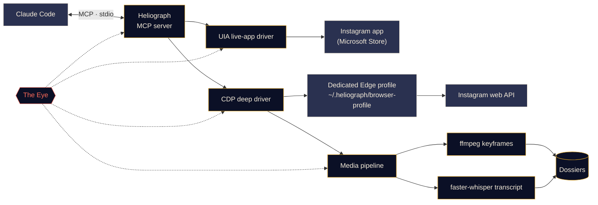

<p align="center">
  
</p>

<p align="center">
  <a href="#quick-start"></a>
  <a href="../../LICENSE"></a>
  <a href="#platform-support"></a>
  <a href="#mcp-tools"></a>
  <a href="https://github.com/DeanT-04/instagram-bridge-with-claude/actions/workflows/ci.yml"></a>
</p>

<p align="center">
  <a href="../../README.md">English</a> ·
  <a href="README.es.md">Español</a> ·
  <a href="README.fr.md">Français</a> ·
  <a href="README.de.md">Deutsch</a> ·
  <b>Português (BR)</b> ·
  <a href="README.it.md">Italiano</a> ·
  <a href="README.ru.md">Русский</a> ·
  <a href="README.tr.md">Türkçe</a> ·
  <a href="README.ar.md">العربية</a> ·
  <a href="README.hi.md">हिन्दी</a> ·
  <a href="README.zh-CN.md">简体中文</a> ·
  <a href="README.ja.md">日本語</a> ·
  <a href="README.ko.md">한국어</a>
</p>

> Esta é uma tradução. O [README em inglês](../../README.md) é a fonte oficial; em caso de divergência, vale a versão em inglês.

---

**Heliograph** conecta o Claude (via [Claude Code](https://docs.anthropic.com/en/docs/claude-code) e um servidor MCP) ao **seu próprio Instagram, no seu próprio dispositivo**. O Claude pode ler o que você vê, percorrer suas coleções salvas e transformar reels em dossiês estruturados e pesquisáveis — tudo localmente, com você no controle de cada ação de escrita.

> **Por que "Heliograph"?** A primeira fotografia da história foi uma *heliografia* (Niépce, década de 1820). Um heliógrafo também é um aparelho de sinalização que, com um espelho, envia lampejos de luz solar a distância. Uma câmera e uma ponte — exatamente o que este projeto é.

> [!NOTE]
> **Status: v0.1.0 — inicial, mas funcionando.** Instalação, CLI, servidor MCP (41 ferramentas), os dois drivers e o pipeline de dossiês já foram entregues. As leituras foram verificadas ao vivo com uma conta real no Windows 11 (conta atual, coleções, posts de uma coleção, busca, badges do app, status). As **ações de escrita** (curtir, salvar, seguir, comentar, DM…) estão implementadas e testadas em modo simulação, mas **ainda não foram verificadas com uma conta real**.

## O que ele faz

- **Permite que o Claude veja e use o Instagram como você** — no app instalado de verdade, com a sua sessão de verdade.
- **Obtém dados estruturados** (coleções salvas, metadados de reels, legendas, DMs, mídia) por meio de um perfil de navegador dedicado, no qual você faz login uma única vez.
- **Transforma reels em dossiês** — vídeo, quadros-chave, uma folha de contatos, uma transcrição com marcações de tempo e metadados em uma pasta que o Claude pode ler *e ver*.
- **Monitora a si mesmo** — *o Olho* registra localmente cada chamada de ferramenta, ação dos drivers e subprocesso, para que falhas possam ser explicadas, por você ou pelo Claude.

## Recursos

<table>
  <tr>
    <td width="33%" valign="top">
      <h3>Driver do app ao vivo</h3>
      Controla o app do Instagram da Microsoft Store via Windows UI Automation: ler a tela, navegar, rolar, capturar a tela e clicar ou digitar (com a sua confirmação). Sem nenhuma etapa de login.<br><br><sub><b>Disponível · Windows</b></sub>
    </td>
    <td width="33%" valign="top">
      <h3>Driver profundo</h3>
      Um perfil dedicado do Edge/Chrome controlado pelo Chrome DevTools Protocol, que lê a própria API web do Instagram de dentro da página para obter JSON limpo, URLs de vídeo e processamento em lote.<br><br><sub><b>Disponível</b></sub>
    </td>
    <td width="33%" valign="top">
      <h3>Dossiês de reels</h3>
      Quadros-chave por mudança de cena com ffmpeg e deduplicação perceptual, uma folha de contatos e uma transcrição com faster-whisper, reunidos em um dossiê Markdown por reel. O texto na tela é lido por OCR, a fala que não está em inglês ganha também uma tradução para o inglês, e rótulos pequenos dos gráficos podem ser recortados e ampliados.<br><br><sub><b>Disponível</b></sub>
    </td>
  </tr>
  <tr>
    <td width="33%" valign="top">
      <h3>Servidor MCP</h3>
      41 ferramentas que se registram automaticamente no Claude Code via <code>.mcp.json</code> quando você abre a pasta, além de duas skills do projeto.<br><br><sub><b>Disponível</b></sub>
    </td>
    <td width="33%" valign="top">
      <h3>O Olho</h3>
      Rastreamento local em primeiro lugar: spans, IDs de rastreamento, ocultação de segredos, capturas e snapshots DOM de falhas, visualização ao vivo no terminal e relatórios que o Claude consegue ler.<br><br><sub><b>Disponível</b></sub>
    </td>
    <td width="33%" valign="top">
      <h3>Proteções</h3>
      Ações de escrita só simulam sem confirmação, tudo tem limite de taxa, URLs e downloads estão em lista de permissões e nenhuma senha jamais passa pelo Heliograph.<br><br><sub><b>Disponível · escritas ainda não verificadas ao vivo</b></sub>
    </td>
  </tr>
</table>

<a id="quick-start"></a>
## Início rápido

**Você precisa de:** Python 3.11+ (3.12 recomendado), [ffmpeg](https://ffmpeg.org/), Microsoft Edge ou Google Chrome, [Claude Code](https://docs.anthropic.com/en/docs/claude-code) e, para o driver do app ao vivo no Windows, o app do Instagram da Microsoft Store. O script de instalação instala o [uv](https://docs.astral.sh/uv/) se estiver faltando (depois de perguntar).

```bash
# 1. Clone
git clone https://github.com/DeanT-04/instagram-bridge-with-claude.git heliograph
cd heliograph

# 2. Run the one-command setup
powershell -ExecutionPolicy Bypass -File scripts\setup.ps1   # Windows
bash scripts/setup.sh                                        # macOS / Linux

# 3. Sign in to Instagram once, yourself, in Heliograph's own browser window
uv run heliograph login

# 4. Open Claude Code in the folder
claude
```

O Claude Code detecta o servidor MCP do Heliograph pelo `.mcp.json` e pede sua aprovação na primeira vez. O Windows bloqueia scripts por padrão (política de execução *Restricted*), então inicie o setup com `powershell -ExecutionPolicy Bypass -File scripts\setup.ps1`, como mostrado: a exceção vale só para essa execução e não altera nenhuma configuração. O setup pode ser executado de novo sem problemas. Opções no **Windows**: `-Yes` (sem perguntas), `-NoInput` (nunca pergunta, responde não; para CI), `-WithWhisper` (baixa antes o modelo de fala, ~500 MB). No **macOS / Linux**: `--yes`, `--no-input`, `--with-whisper`. Se o uv não estiver instalado, o script instala o uv 0.12.1 pelo instalador oficial fixado, depois de perguntar. Se algo parecer errado, rode `uv run heliograph doctor`.

## Usando com o Claude

É só conversar com o Claude na pasta do projeto. Por exemplo:

- *"Extraia todas as estratégias da minha coleção 'Trading strats'."* — executa a skill `extract-trading-strategies` de ponta a ponta.
- *"O que há de novo nas minhas DMs e notificações? Resuma, não responda."*
- *"Abra o app do Instagram, vá para Reels e me diga o que está na tela."*
- *"Encontre os cinco últimos posts de @some_creator e escreva um rascunho de comentário no mais recente."* — o Claude mostra primeiro uma simulação; nada é publicado até você dizer sim.

O `CLAUDE.md` dá ao Claude o seu manual de operação (regras de segurança, famílias de ferramentas, solução de problemas), e a skill [`instagram-control`](../../.claude/skills/instagram-control/SKILL.md) ensina qual ferramenta usar.

<a id="how-it-works"></a>
## Como funciona



<details>
<summary><b>Por que dois drivers?</b></summary>

<br>

O app do Instagram da Microsoft Store é um web app do Edge que roda no seu perfil normal do Edge. Versões recentes do Edge se recusam a abrir uma porta de DevTools no perfil padrão, então o app instalado **não pode** ser automatizado via DevTools. Ele **pode**, porém, ser totalmente lido e controlado via Windows UI Automation.

| Driver | Alvo | Ponto forte | Usado para |
|---|---|---|---|
| `uia` | A janela do app instalado da Store | Seu app e sessão reais, sem login | Navegar, ler o que está na tela, capturas de tela, cliques confirmados |
| `cdp` | Um perfil dedicado do Edge/Chrome aberto como janela de app, DevTools vinculado a `127.0.0.1` | JSON estruturado da API web do Instagram, URLs de vídeo, captura de rede | Coleções salvas, feeds, DMs, metadados de reels, downloads, extração em massa |

Veja [docs/ARCHITECTURE.md](../ARCHITECTURE.md) para o design completo.

</details>

<a id="platform-support"></a>
<details>
<summary><b>Plataformas suportadas</b></summary>

<br>

| | Windows 10/11 | macOS | Linux |
|---|---|---|---|
| Script de instalação | Verificado | Disponível (não testado) | Disponível (não testado) |
| Driver profundo (CDP) e servidor MCP | Verificado | Disponível (não testado) | Disponível (não testado) |
| Pipeline de mídia e dossiês | Disponível | Disponível (não testado) | Disponível (não testado) |
| O Olho | Disponível | Disponível | Disponível |
| Driver do app ao vivo (ferramentas `app_*`) | Verificado | Planejado | Não se aplica |

</details>

<a id="mcp-tools"></a>
## Ferramentas MCP

41 ferramentas em sete famílias. Ferramentas de listagem aceitam `limit` e `cursor`; devolva `next_cursor` para ir à próxima página.

<details open>
<summary><b>Referência de ferramentas</b></summary>

<br>

| Família | Ferramenta | O que faz |
|---|---|---|
| **Status** | `heliograph_status` | Saúde: SO, app da Store, navegadores, ffmpeg, estado do login |
| | `heliograph_setup_check` | O que ainda falta para todas as ferramentas funcionarem |
| **Leitura** | `ig_whoami` | A conta conectada ao perfil de navegador do Heliograph |
| | `ig_get_user` | Perfil público de uma conta pelo nome de usuário |
| | `ig_user_posts` | Posts e reels recentes de uma conta |
| | `ig_get_media` | Detalhes completos de um post/reel, incluindo legenda e URLs de mídia |
| | `ig_comments` | Comentários principais de um post/reel |
| | `ig_search` | Busca principal: usuários, hashtags e lugares |
| | `ig_timeline` | Seu feed inicial |
| | `ig_reels_feed` | O feed de descoberta de Reels |
| | `ig_explore` | Posts da grade Explorar |
| | `ig_inbox` | Conversas de DM com prévia da última mensagem |
| | `ig_thread` | Mensagens de uma conversa de DM |
| | `ig_activity` | Notificações recentes: curtidas, seguidores, comentários, menções |
| **Coleções** | `ig_list_collections` | Suas coleções salvas |
| | `ig_collection_posts` | Posts de uma coleção, por nome ou id |
| | `ig_saved_posts` | Todos os posts salvos, mais recentes primeiro |
| **Extração** | `ig_extract_media` | Cria (ou reutiliza) um dossiê para um post/reel |
| | `ig_extract_collection` | Cria dossiês para uma coleção, em lotes |
| | `ig_read_dossier` | Lê o Markdown, a transcrição e os metadados de um dossiê |
| | `ig_view_frames` | Retorna a folha de contatos ou quadros como imagens que o Claude pode ver |
| **App ao vivo** *(Windows)* | `app_open` | Conecta à janela do app do Instagram |
| | `app_snapshot` | Esboço em texto do que está na tela (árvore de acessibilidade) |
| | `app_screenshot` | Captura da janela do app, mesmo atrás de outras janelas |
| | `app_navigate` | Abre uma seção: início, busca, explorar, reels, mensagens… |
| | `app_click` | Clica um elemento por ref ou nome (escritas exigem sua confirmação) |
| | `app_scroll` | Rola por telas (um reel por página no visualizador de Reels) |
| | `app_type` | Digita em um campo (enviar exige sua confirmação) |
| | `app_visible_posts` | Posts/reels na tela, com seus botões |
| | `app_badges` | Contadores de não lidos de mensagens e notificações |
| **Escrita** *(com confirmação)* | `ig_like` / `ig_unlike` | Curte ou descurte um post/reel |
| | `ig_save` / `ig_unsave` | Salva ou remove, opcionalmente em uma coleção |
| | `ig_follow` / `ig_unfollow` | Segue ou deixa de seguir uma conta |
| | `ig_comment` | Publica um comentário com o texto exato que você aprovou |
| | `ig_send_dm` | Envia uma DM a um usuário ou a uma conversa existente |
| **Olho** | `eye_report` | Resumo de saúde: taxa de erros, operações lentas e com falha |
| | `eye_trace` | Cada etapa de uma chamada, com tracebacks e artefatos |
| | `eye_recent` | Os eventos mais recentes, opcionalmente só erros |

</details>

## Extração de reels de trading

Um fluxo de demonstração: você salva reels de trading em uma coleção do Instagram e o Claude os transforma em anotações que você realmente pode estudar.

1. Você pede ao Claude: *"Extraia todas as estratégias da minha coleção 'Trading strats'."*
2. O Heliograph lista a coleção pelo driver profundo e baixa cada reel da CDN do Instagram.
3. O pipeline de mídia extrai quadros-chave por mudança de cena (gráficos, setups, anotações), uma folha de contatos e uma transcrição com marcações de tempo. O texto na tela de cada quadro-chave é lido por OCR, e a fala que não está em inglês ganha uma tradução para o inglês.
4. O Claude lê cada dossiê, **olha os quadros** com `ig_view_frames` e escreve uma nota por reel — regras de entrada, saídas, gestão de risco, configurações de indicadores e as afirmações que não conseguiu verificar — além de um índice. Rótulos pequenos dos gráficos e configurações de indicadores são recortados e ampliados (`ig_view_frames(..., crop=...)`) e comparados com o que é dito.

```text
~/.heliograph/dossiers/<creator>/<code>/
├── meta.json          # author, caption, date, URL, metrics
├── caption.md
├── video.mp4          # or images/NN.jpg for photo posts
├── transcript.json    # timestamped segments + language (+ English translation)
├── transcript.md
├── frames/*.jpg       # de-duplicated keyframes (+ frames.json)
├── ocr.json           # on-screen text of every keyframe (OCR)
├── crops/             # zoomed regions of small chart text
├── contact_sheet.jpg  # every keyframe on one image
└── dossier.md         # everything above, stitched for Claude
```

As notas são gravadas em `strategies/` na pasta do projeto, que o git ignora porque são dados pessoais. Você também pode criar dossiês sem o Claude: `uv run heliograph extract --collection "Trading strats"`.

> [!CAUTION]
> O Heliograph organiza o que os criadores dizem; ele não julga se estão certos. Nada do que ele produz é recomendação financeira.

## O Olho

*O Olho* é a observabilidade embutida do Heliograph, local em primeiro lugar. Nenhum serviço externo é necessário.

- Cada chamada de ferramenta MCP, ação de driver, requisição HTTP e subprocesso de ffmpeg/whisper é registrado como um **span** com um `trace_id` compartilhado, para que uma única solicitação do Claude possa ser acompanhada de ponta a ponta.
- Os eventos vão para `~/.heliograph/eye/events.jsonl` (com rotação), com um índice SQLite para consultas.
- **Segredos são ocultados antes da gravação** — cookies, `sessionid`, `csrftoken`, cabeçalhos de autenticação e strings com cara de token.
- Quando uma etapa da interface ou do navegador falha, uma captura de tela e um snapshot de acessibilidade/DOM são salvos e vinculados ao evento.
- Todo erro de ferramenta retorna uma **dica** e um **id de rastreamento**; o Claude pode chamar `eye_trace` com ele para ver exatamente o que deu errado.
- `heliograph eye` mostra um acompanhamento ao vivo, colorido, com a saúde em tempo real: taxa de erros, latência p95, operações que mais falham. `heliograph eye report` resume os erros recentes.
- Exportação opcional para o Langfuse quando `LANGFUSE_PUBLIC_KEY` / `LANGFUSE_SECRET_KEY` estão definidas (desativada por padrão).

## Segurança e privacidade

- **Login manual, uma única vez.** Você mesmo faz login no perfil de navegador dedicado, uma vez (`heliograph login`). O Heliograph nunca digita, armazena ou registra uma senha.
- **O driver do app ao vivo não precisa de login** — ele usa o app do Instagram em que você já está conectado.
- **Ações de escrita simulam por padrão.** Curtir, seguir, comentar, DM, salvar e seus inversos retornam uma descrição do que *aconteceria*; só agem quando chamados de novo com `confirm=true`, depois que você disse sim no chat. O mesmo vale para clicar em botões de ação ou enviar texto no app ao vivo.
- **Limites de taxa com variação aleatória** em escritas *e* leituras, para manter um ritmo humano.
- **Dados apenas locais.** Dossiês, logs e o perfil do navegador ficam em `~/.heliograph` na sua máquina, com permissões de arquivo privadas. A porta do DevTools é vinculada a `127.0.0.1`, em uma porta livre aleatória.
- **Navegador de vida curta.** Enquanto o navegador dedicado está aberto, qualquer programa local poderia usar a porta do DevTools, então o navegador aberto pelo Heliograph é fechado quando o servidor MCP ou o comando da CLI termina, e após 15 minutos ocioso (`HELIOGRAPH_BROWSER_IDLE_MINUTES`, `0` = nunca); ele reabre na próxima chamada. As actions da CI são fixadas em SHAs de commit e mantidas atualizadas pelo Dependabot.
- **Listas de permissões rígidas** — só URLs do Instagram são aceitas, e downloads chegam apenas via HTTPS dos hosts da CDN do Instagram. Proteções contra path traversal cobrem o cliente da API e as pastas de dossiês.

Veja [docs/SECURITY.md](../SECURITY.md) para o modelo de ameaças e como relatar uma vulnerabilidade.

## Referência da CLI

| Comando | O que faz | Status |
|---|---|---|
| `heliograph setup` | Verifica o ambiente, oferece correções (Chromium, app da Store), baixa o Whisper opcionalmente, mostra os próximos passos | Disponível |
| `heliograph setup --no-input` | As mesmas verificações sem nenhuma pergunta (responde não); para scripts e CI | Disponível |
| `heliograph doctor` | Detecta o app do Instagram, Edge/Chrome, ffmpeg, SO e estado do login (`--json` para saída bruta) | Disponível |
| `heliograph login` | Abre o perfil de navegador dedicado para você fazer login uma vez, manualmente | Disponível |
| `heliograph mcp` | Executa o servidor MCP via stdio (o Claude Code o inicia para você) | Disponível |
| `heliograph extract <url>` | Gera um dossiê para um reel/post, ou `--collection "<nome>"` para uma coleção inteira | Disponível |
| `heliograph dossier show <code>` | Mostra um dossiê já criado: legenda, termos detectados, linha do tempo de fala/quadros/OCR (`--transcript` inclui a transcrição) | Disponível |
| `heliograph dossier frames <code>` | Lista os quadros-chave com horários e texto na tela, ou salva recortes ampliados (`--crop`, `--ocr` opcional) | Disponível |
| `heliograph eye` | Acompanhamento ao vivo do Olho com indicadores de saúde | Disponível |
| `heliograph eye report` | Resumo de erros e anomalias recentes | Disponível |
| `heliograph version` | Mostra a versão do Heliograph | Disponível |

Rode cada comando na pasta do projeto como `uv run heliograph <comando>`. `login`, `mcp` e `extract` aceitam `--account <chave>` para usar um perfil de navegador separado.

<details>
<summary><b>Estrutura do projeto</b></summary>

<br>

```text
src/heliograph/
├── cli.py              # Typer CLI entry point
├── commands/           # setup, doctor, login, extract, dossier.py (show / frames)
├── config.py           # settings (env prefix HELIOGRAPH_), paths under ~/.heliograph
├── errors.py           # HeliographError hierarchy
├── writelimit.py       # write rate limit shared by every process (lock file + state)
├── detect/             # environment detection: Store app, browsers, ffmpeg, OS
├── drivers/
│   ├── base.py         # InstagramDriver protocol + shared dataclasses
│   ├── uia/            # Windows UI Automation live-app driver
│   └── cdp/            # browser launcher, CDP session, web-API client, rate limits
├── instagram/          # models, service, collections, write actions
├── media/              # allow-listed download, ffmpeg frames, faster-whisper,
│                       #   ocr.py (on-screen text), dedupe.py (near-duplicate frames)
├── extract/            # reel -> dossier; render.py, signals.py (terms, mismatch),
│                       #   zoom.py (crop + zoom small chart text)
├── eye/                # the Eye: spans, sinks, redaction, live view, reports
└── mcp/                # FastMCP server, tools_*.py per family, runtime, common
tests/                  # pytest; live tests marked @pytest.mark.live
docs/                   # architecture, security, translations, brand assets
scripts/                # setup.ps1 / setup.sh
.github/workflows/ci.yml # lint, strict types and tests on Windows, macOS and Linux
.claude/skills/         # extract-trading-strategies, instagram-control
.mcp.json               # registers the MCP server with Claude Code
CLAUDE.md               # operating manual for Claude
```

</details>

## Roadmap

- [x] Instalação com um único comando, registro via `.mcp.json` e `heliograph login`
- [x] Servidor MCP com ferramentas de leitura, coleções, extração, app ao vivo, escrita e Olho
- [x] Skills `extract-trading-strategies` e `instagram-control`
- [ ] Verificação ao vivo de cada ação de escrita
- [x] CI no Windows, macOS e Linux
- [ ] Suporte a **várias contas** nas sessões do Claude (perfis separados já funcionam com `--account`)
- [ ] **Android** via `adb`
- [ ] Driver do app ao vivo para **macOS** (API de Acessibilidade)

## Contribuindo

Contribuições são bem-vindas — veja [CONTRIBUTING.md](../../CONTRIBUTING.md) e o [Código de Conduta](../../CODE_OF_CONDUCT.md).

## Aviso legal

O Heliograph é um projeto de código aberto independente. Ele **não é afiliado, endossado nem patrocinado pelo Instagram ou pela Meta Platforms, Inc.** "Instagram" é uma marca do seu respectivo dono, usada aqui apenas para descrever com o que o software funciona. Use o Heliograph **somente na sua própria conta**, mantenha o uso pessoal e em ritmo humano e respeite os [Termos de Uso do Instagram](https://help.instagram.com/581066165581870). Você é responsável pela forma como o utiliza.

## Licença

[MIT](../../LICENSE) © 2026 DeanT-04
