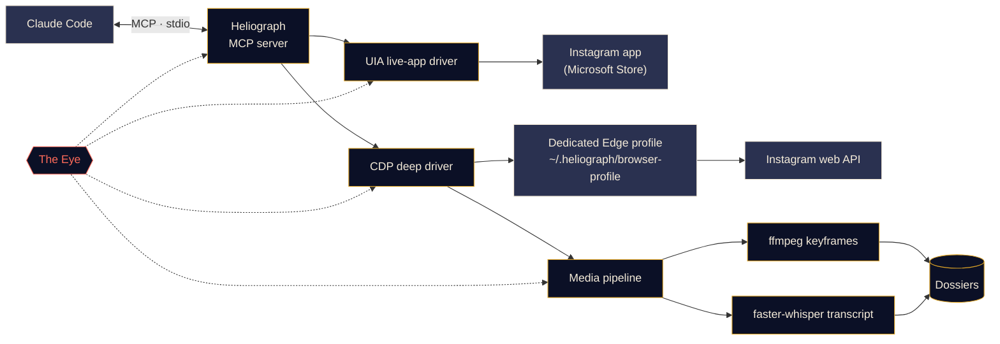

<p align="center">
  
</p>

<p align="center">
  <a href="#quick-start"></a>
  <a href="../../LICENSE"></a>
  <a href="#platform-support"></a>
  <a href="#how-it-works"></a>
  <a href="../../CONTRIBUTING.md#tests"></a>
</p>

<p align="center">
  <a href="../../README.md">English</a> ·
  <a href="README.es.md">Español</a> ·
  <a href="README.fr.md">Français</a> ·
  <a href="README.de.md">Deutsch</a> ·
  <b>Português (BR)</b> ·
  <a href="README.it.md">Italiano</a> ·
  <a href="README.ru.md">Русский</a> ·
  <a href="README.tr.md">Türkçe</a> ·
  <a href="README.ar.md">العربية</a> ·
  <a href="README.hi.md">हिन्दी</a> ·
  <a href="README.zh-CN.md">简体中文</a> ·
  <a href="README.ja.md">日本語</a> ·
  <a href="README.ko.md">한국어</a>
</p>

> Esta é uma tradução. O [README em inglês](../../README.md) é a fonte oficial; em caso de divergência, vale a versão em inglês.

---

**Heliograph** conecta o Claude (via [Claude Code](https://docs.anthropic.com/en/docs/claude-code) e um servidor MCP) ao **seu próprio Instagram, no seu próprio dispositivo**. O Claude pode ler o que você vê, percorrer suas coleções salvas e transformar reels em dossiês estruturados e pesquisáveis — tudo localmente, com você no controle de cada ação de escrita.

> **Por que "Heliograph"?** A primeira fotografia da história foi uma *heliografia* (Niépce, década de 1820). Um heliógrafo também é um aparelho de sinalização que, com um espelho, envia lampejos de luz solar a distância. Uma câmera e uma ponte — exatamente o que este projeto é.

> [!NOTE]
> **Status: desenvolvimento inicial (v0.1.0).** A arquitetura está definida e os módulos principais estão sendo construídos. Cada recurso abaixo está marcado como **Disponível**, **Em andamento** ou **Planejado** — nada aqui é uma promessa sem código por trás.

## O que ele faz

- **Permite que o Claude veja e use o Instagram como você** — no app instalado de verdade, com a sua sessão de verdade.
- **Obtém dados estruturados** (coleções salvas, metadados de reels, legendas, mídia) por meio de um perfil de navegador dedicado e separado, no qual você faz login uma única vez.
- **Transforma reels em dossiês** — vídeo, quadros-chave, uma transcrição com marcações de tempo e metadados em uma pasta que o Claude pode ler e analisar.
- **Monitora a si mesmo** — *o Olho* registra localmente cada chamada de ferramenta, ação dos drivers e subprocesso, para que falhas possam ser explicadas, por você ou pelo Claude.

## Recursos

<table>
  <tr>
    <td width="33%" valign="top">
      <h3>Driver do app ao vivo</h3>
      Controla o app do Instagram da Microsoft Store via Windows UI Automation: ler a tela, navegar, curtir, salvar, seguir, capturar a tela. Sem nenhuma etapa de login.<br><br><sub><b>Em andamento</b></sub>
    </td>
    <td width="33%" valign="top">
      <h3>Driver profundo</h3>
      Um perfil dedicado do Edge/Chrome controlado pelo Chrome DevTools Protocol, que lê a própria API web do Instagram de dentro da página para obter JSON limpo, URLs de vídeo e processamento em lote.<br><br><sub><b>Em andamento</b></sub>
    </td>
    <td width="33%" valign="top">
      <h3>Dossiês de reels</h3>
      Quadros-chave por mudança de cena com ffmpeg e deduplicação perceptual, além de uma transcrição com faster-whisper, reunidos em um dossiê Markdown por reel.<br><br><sub><b>Em andamento</b></sub>
    </td>
  </tr>
  <tr>
    <td width="33%" valign="top">
      <h3>Servidor MCP</h3>
      Um servidor FastMCP que se registra automaticamente no Claude Code via <code>.mcp.json</code> quando você abre a pasta.<br><br><sub><b>Em andamento</b></sub>
    </td>
    <td width="33%" valign="top">
      <h3>O Olho</h3>
      Rastreamento local em primeiro lugar: spans, IDs de rastreamento, ocultação de segredos, snapshots de falhas, visualização ao vivo no terminal e um relatório que o Claude consegue ler.<br><br><sub><b>Disponível (inicial)</b></sub>
    </td>
    <td width="33%" valign="top">
      <h3>Proteções</h3>
      Ações de escrita exigem confirmação explícita, tudo tem limite de taxa, os downloads são restritos à CDN do Instagram e nenhuma senha jamais passa pelo Heliograph.<br><br><sub><b>Em andamento</b></sub>
    </td>
  </tr>
</table>

<a id="quick-start"></a>
## Início rápido

**Você precisa de:** Python 3.11+ (3.12 recomendado), [uv](https://docs.astral.sh/uv/), [ffmpeg](https://ffmpeg.org/), Microsoft Edge ou Google Chrome, [Claude Code](https://docs.anthropic.com/en/docs/claude-code) e, para o driver do app ao vivo no Windows, o app do Instagram da Microsoft Store.

```bash
# 1. Clone
git clone https://github.com/DeanT-04/instagram-bridge-with-claude.git heliograph
cd heliograph

# 2. Run the one-command setup
./scripts/setup.ps1        # Windows (PowerShell)
./scripts/setup.sh         # macOS / Linux

# 3. Open Claude Code in the folder
claude
```

O Claude Code encontra o servidor MCP do Heliograph em `.mcp.json` e pede sua aprovação na primeira vez. Depois é só perguntar, por exemplo: *"O que tem na minha coleção salva chamada Trading?"*

> [!IMPORTANT]
> Os scripts de instalação, o `.mcp.json` e o `heliograph login` estão **em andamento**. Até lá, você pode preparar o ambiente manualmente:
>
> ```bash
> uv sync
> uv run heliograph doctor
> ```
>
> O `doctor` verifica o app do Instagram, Edge/Chrome, ffmpeg e seu sistema operacional, e informa o que está faltando.

<a id="how-it-works"></a>
## Como funciona



<details>
<summary><b>Por que dois drivers?</b></summary>

<br>

O app do Instagram da Microsoft Store é um web app do Edge que roda no seu perfil normal do Edge. Versões recentes do Edge se recusam a abrir uma porta de DevTools no perfil padrão, então o app instalado **não pode** ser automatizado via DevTools. Ele **pode**, porém, ser totalmente lido e controlado via Windows UI Automation.

| Driver | Alvo | Ponto forte | Usado para |
|---|---|---|---|
| `uia` | A janela do app instalado da Store | Seu app e sessão reais, sem login | Navegar, ler o que está na tela, curtir / salvar / seguir, capturas de tela |
| `cdp` | Um perfil dedicado do Edge/Chrome aberto como janela de app, DevTools vinculado a `127.0.0.1` | JSON estruturado da API web do Instagram, URLs de vídeo, captura de rede | Coleções salvas, metadados de reels, downloads, extração em massa |

Ambos implementam uma única interface `InstagramDriver` onde se sobrepõem. Veja [docs/ARCHITECTURE.md](../ARCHITECTURE.md) para o design completo.

</details>

<a id="platform-support"></a>
<details>
<summary><b>Plataformas suportadas</b></summary>

<br>

| | Windows 10/11 | macOS | Linux |
|---|---|---|---|
| Driver profundo (CDP) | Em andamento | Em andamento | Em andamento |
| Pipeline de mídia e dossiês | Em andamento | Em andamento | Em andamento |
| O Olho | Disponível | Disponível | Disponível |
| Driver do app ao vivo | Em andamento (UI Automation) | Planejado | Não se aplica |

</details>

## Extração de reels de trading

Um fluxo de demonstração: você salva reels de trading em uma coleção do Instagram e o Claude os transforma em anotações que você realmente pode estudar.

1. Você pede ao Claude: *"Extraia as estratégias da minha coleção salva 'Trading'."*
2. O Heliograph lista a coleção pelo driver profundo e baixa cada reel da CDN do Instagram.
3. O pipeline de mídia extrai quadros-chave por mudança de cena (gráficos, setups, anotações) e uma transcrição com marcações de tempo.
4. Cada reel vira um dossiê; o Claude os lê e escreve as regras de entrada, as saídas, o gerenciamento de risco e as afirmações que não conseguiu verificar.

```text
dossiers/<reel-id>/
├── meta.json          # author, caption, date, URL, metrics
├── video.mp4
├── transcript.json    # timestamped segments
├── transcript.md
├── frames/*.jpg       # de-duplicated keyframes
└── dossier.md         # everything above, stitched for Claude
```

**Status:** gerador de dossiês **em andamento**; a skill do Claude Code `extract-trading-strategies` está **planejada**.

> [!CAUTION]
> O Heliograph organiza o que os criadores dizem; ele não julga se estão certos. Nada do que ele produz é recomendação financeira.

## O Olho

*O Olho* é a observabilidade embutida do Heliograph, local em primeiro lugar. Nenhum serviço externo é necessário.

- Cada chamada de ferramenta MCP, ação de driver, requisição HTTP e subprocesso de ffmpeg/whisper é registrado como um **span** com um `trace_id` compartilhado, para que uma única solicitação do Claude possa ser acompanhada de ponta a ponta.
- Os eventos vão para `~/.heliograph/eye/events.jsonl` (com rotação), com um índice SQLite para consultas.
- **Segredos são ocultados antes da gravação** — cookies, `sessionid`, `csrftoken`, cabeçalhos de autenticação e strings com cara de token.
- Quando uma etapa da interface ou do navegador falha, uma captura de tela e um snapshot de acessibilidade/DOM são salvos e vinculados ao evento *(em andamento)*.
- `heliograph eye` mostra um acompanhamento ao vivo, colorido, com a saúde em tempo real: taxa de erros, latência p95, operações que mais falham.
- `heliograph eye report` — e a ferramenta MCP `eye_report` *(em andamento)* — resume os erros recentes, para que o Claude possa diagnosticar problemas sozinho.
- Exportação opcional para o Langfuse quando `LANGFUSE_PUBLIC_KEY` / `LANGFUSE_SECRET_KEY` estão definidas (desativada por padrão).

## Segurança e privacidade

- **Login manual, uma única vez.** Você mesmo faz login no perfil de navegador dedicado, uma vez. O Heliograph nunca digita, armazena ou registra uma senha.
- **O driver do app ao vivo não precisa de login** — ele usa o app do Instagram em que você já está conectado.
- **Ações de escrita exigem confirmação.** Curtir, seguir, comentar, enviar DM, publicar e remover dos salvos exigem um `confirm=True` explícito na camada MCP, então o Claude precisa perguntar a você primeiro.
- **Limites de taxa com variação aleatória** em escritas *e* leituras, para manter um ritmo humano.
- **Dados apenas locais.** Dossiês, logs e o perfil do navegador ficam em `~/.heliograph` na sua máquina. A porta do DevTools é vinculada a `127.0.0.1`, em uma porta livre aleatória.
- **Downloads em lista de permissões** — somente HTTPS a partir dos hosts da CDN do Instagram.

Veja [docs/SECURITY.md](../SECURITY.md) para o modelo de ameaças e como relatar uma vulnerabilidade.

## Referência da CLI

> Esta é a **interface planejada**. A coluna Status mostra o que funciona hoje.

| Comando | O que faz | Status |
|---|---|---|
| `heliograph setup` | Instala dependências, verifica o ambiente e registra o servidor MCP | Planejado (esboço) |
| `heliograph doctor` | Detecta o app do Instagram, Edge/Chrome, ffmpeg, sistema operacional e estado do login | Disponível |
| `heliograph login` | Abre o perfil de navegador dedicado para você fazer login uma vez, manualmente | Planejado (esboço) |
| `heliograph mcp` | Executa o servidor MCP via stdio (o Claude Code o inicia para você) | Planejado (esboço) |
| `heliograph extract <url>` | Gera um dossiê para um reel ou post | Planejado (esboço) |
| `heliograph eye` | Acompanhamento ao vivo do Olho com indicadores de saúde | Disponível |
| `heliograph eye report` | Resumo de erros e anomalias recentes | Disponível |

<details>
<summary><b>Estrutura do projeto</b></summary>

<br>

```text
src/heliograph/
├── cli.py              # Typer CLI
├── config.py           # settings (env prefix HELIOGRAPH_), paths under ~/.heliograph
├── errors.py           # HeliographError hierarchy
├── detect/             # environment detection: Store app, browsers, ffmpeg, OS
├── drivers/
│   ├── base.py         # InstagramDriver protocol + shared dataclasses
│   ├── uia/            # Windows UI Automation live-app driver
│   └── cdp/            # browser launcher, CDP session, web-API client
├── instagram/          # models + high-level service
├── media/              # allow-listed download, ffmpeg frames, faster-whisper
├── extract/            # reel -> dossier
├── eye/                # the Eye: spans, sinks, redaction, live view, reports
└── mcp/                # FastMCP server (in progress)
tests/                  # pytest; live tests marked @pytest.mark.live
docs/                   # architecture, security, translations, brand assets
scripts/                # setup.ps1 / setup.sh (in progress)
.claude/skills/         # Claude Code skills (planned)
.mcp.json               # MCP registration for Claude Code (in progress)
```

</details>

## Roadmap

- [ ] Instalação com um único comando, registro via `.mcp.json` e `heliograph login`
- [ ] Servidor MCP com ferramentas de leitura e, depois, ferramentas de escrita com confirmação
- [ ] Skill `extract-trading-strategies`
- [ ] Suporte a **várias contas** (perfis e estado separados por conta)
- [ ] **Android** via `adb`
- [ ] Driver do app ao vivo para **macOS** (API de Acessibilidade)

## Contribuindo

Contribuições são bem-vindas — veja [CONTRIBUTING.md](../../CONTRIBUTING.md) e o [Código de Conduta](../../CODE_OF_CONDUCT.md).

## Aviso legal

O Heliograph é um projeto de código aberto independente. Ele **não é afiliado, endossado nem patrocinado pelo Instagram ou pela Meta Platforms, Inc.** "Instagram" é uma marca do seu respectivo dono, usada aqui apenas para descrever com o que o software funciona. Use o Heliograph **somente na sua própria conta**, mantenha o uso pessoal e em ritmo humano e respeite os [Termos de Uso do Instagram](https://help.instagram.com/581066165581870). Você é responsável pela forma como o utiliza.

## Licença

[MIT](../../LICENSE) © 2026 DeanT-04
