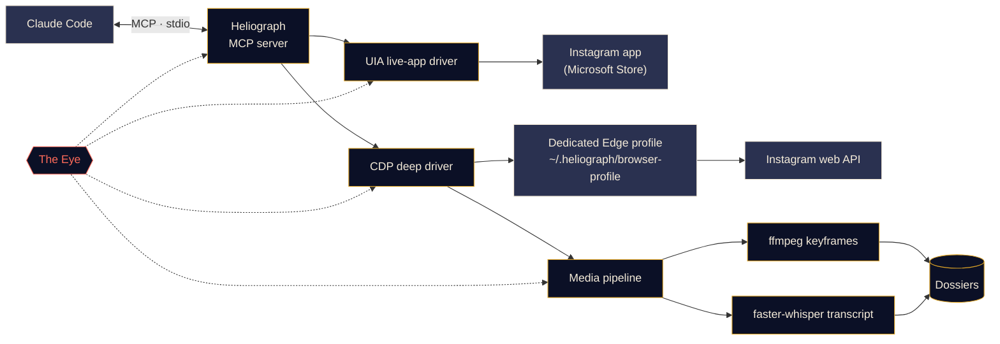

<p align="center">
  
</p>

<p align="center">
  <a href="#quick-start"></a>
  <a href="../../LICENSE"></a>
  <a href="#platform-support"></a>
  <a href="#mcp-tools"></a>
  <a href="../../CONTRIBUTING.md#tests"></a>
</p>

<p align="center">
  <a href="../../README.md">English</a> ·
  <a href="README.es.md">Español</a> ·
  <a href="README.fr.md">Français</a> ·
  <a href="README.de.md">Deutsch</a> ·
  <a href="README.pt-BR.md">Português (BR)</a> ·
  <a href="README.it.md">Italiano</a> ·
  <b>Русский</b> ·
  <a href="README.tr.md">Türkçe</a> ·
  <a href="README.ar.md">العربية</a> ·
  <a href="README.hi.md">हिन्दी</a> ·
  <a href="README.zh-CN.md">简体中文</a> ·
  <a href="README.ja.md">日本語</a> ·
  <a href="README.ko.md">한국어</a>
</p>

> Это перевод. Основным источником является [README на английском](../../README.md); при расхождениях действует английская версия.

---

**Heliograph** связывает Claude (через [Claude Code](https://docs.anthropic.com/en/docs/claude-code) и MCP-сервер) с **вашим собственным Instagram на вашем собственном устройстве**. Claude может читать то, что видите вы, разбирать ваши сохранённые подборки и превращать reels в структурированные досье с поиском — всё локально, и каждое действие записи остаётся под вашим контролем.

> **Почему «Heliograph»?** Первая в истории фотография была *гелиографией* (Ньепс, 1820-е). Гелиограф — это ещё и сигнальный прибор, который с помощью зеркала передаёт вспышки солнечного света на расстояние. Камера и мост — именно этим и является проект.

> [!NOTE]
> **Статус: v0.1.0 — ранняя, но рабочая версия.** Установка, CLI, MCP-сервер (41 инструмент), оба драйвера и конвейер досье выпущены. Чтение проверено вживую на реальном аккаунте в Windows 11 (текущий аккаунт, подборки, публикации подборки, поиск, значки приложения, статус). **Действия записи** (лайк, сохранение, подписка, комментарий, личные сообщения…) реализованы и проверены в режиме пробного запуска, но **ещё не проверены на реальном аккаунте**.

## Что он делает

- **Позволяет Claude видеть и использовать Instagram так же, как вы** — в настоящем установленном приложении, с вашей настоящей сессией.
- **Получает структурированные данные** (сохранённые подборки, метаданные reels, подписи, личные сообщения, медиа) через выделенный профиль браузера, в который вы входите один раз.
- **Превращает reels в досье** — видео, ключевые кадры, контактный лист, расшифровка с таймкодами и метаданные в одной папке, которую Claude может прочитать *и рассмотреть*.
- **Наблюдает за собой** — *Око* локально записывает каждый вызов инструмента, действие драйвера и подпроцесс, чтобы сбои можно было объяснить — вам или Claude.

## Возможности

<table>
  <tr>
    <td width="33%" valign="top">
      <h3>Драйвер живого приложения</h3>
      Управляет приложением Instagram из Microsoft Store через Windows UI Automation: чтение экрана, навигация, прокрутка, скриншоты, нажатия и ввод текста (с вашим подтверждением). Никакого входа в аккаунт.<br><br><sub><b>Доступно · Windows</b></sub>
    </td>
    <td width="33%" valign="top">
      <h3>Глубокий драйвер</h3>
      Выделенный профиль Edge/Chrome, управляемый через Chrome DevTools Protocol, который читает веб-API самого Instagram изнутри страницы: чистый JSON, ссылки на видео и пакетная обработка.<br><br><sub><b>Доступно</b></sub>
    </td>
    <td width="33%" valign="top">
      <h3>Досье reels</h3>
      Ключевые кадры по смене сцен через ffmpeg с перцептивной дедупликацией, контактный лист и расшифровка faster-whisper, собранные в Markdown-досье для каждого reel.<br><br><sub><b>Доступно</b></sub>
    </td>
  </tr>
  <tr>
    <td width="33%" valign="top">
      <h3>MCP-сервер</h3>
      41 инструмент, который автоматически регистрируется в Claude Code через <code>.mcp.json</code> при открытии папки, плюс два навыка проекта.<br><br><sub><b>Доступно</b></sub>
    </td>
    <td width="33%" valign="top">
      <h3>Око</h3>
      Локальная трассировка: спаны, ID трассировки, скрытие секретов, скриншоты и DOM-снимки сбоев, живой просмотр в терминале и отчёты, которые может прочитать Claude.<br><br><sub><b>Доступно</b></sub>
    </td>
    <td width="33%" valign="top">
      <h3>Защитные механизмы</h3>
      Без подтверждения действия записи выполняются только как пробный запуск, всё ограничено по частоте, URL и загрузки проходят по белому списку, и ни один пароль не проходит через Heliograph.<br><br><sub><b>Доступно · запись ещё не проверена вживую</b></sub>
    </td>
  </tr>
</table>

<a id="quick-start"></a>
## Быстрый старт

**Понадобится:** Python 3.11+ (рекомендуется 3.12), [ffmpeg](https://ffmpeg.org/), Microsoft Edge или Google Chrome, [Claude Code](https://docs.anthropic.com/en/docs/claude-code) и — для драйвера живого приложения в Windows — приложение Instagram из Microsoft Store. Скрипт установки сам поставит [uv](https://docs.astral.sh/uv/), если его нет (предварительно спросив).

```bash
# 1. Clone
git clone https://github.com/DeanT-04/instagram-bridge-with-claude.git heliograph
cd heliograph

# 2. Run the one-command setup
./scripts/setup.ps1        # Windows (PowerShell)
./scripts/setup.sh         # macOS / Linux

# 3. Sign in to Instagram once, yourself, in Heliograph's own browser window
uv run heliograph login

# 4. Open Claude Code in the folder
claude
```

Claude Code находит MCP-сервер Heliograph в `.mcp.json` и при первом запуске просит его одобрить. Установку можно безопасно повторять; добавьте `--yes`, чтобы пропустить вопросы, или `--with-whisper`, чтобы заранее скачать речевую модель (~500 МБ). Если что-то не так, запустите `uv run heliograph doctor`.

## Работа с Claude

Просто разговаривайте с Claude в папке проекта. Например:

- *«Извлеки все стратегии из моей подборки "Trading strats"».* — выполняет навык `extract-trading-strategies` от начала до конца.
- *«Что нового в моих личных сообщениях и уведомлениях? Кратко, не отвечай».*
- *«Открой приложение Instagram, перейди в Reels и расскажи, что на экране».*
- *«Найди пять последних публикаций @some_creator и набросай комментарий к самой новой».* — Claude сначала показывает пробный запуск; ничего не публикуется, пока вы не скажете «да».

`CLAUDE.md` даёт Claude инструкцию по работе (правила безопасности, семейства инструментов, диагностика), а навык [`instagram-control`](../../.claude/skills/instagram-control/SKILL.md) учит его выбирать нужный инструмент.

<a id="how-it-works"></a>
## Как это работает



<details>
<summary><b>Зачем два драйвера?</b></summary>

<br>

Приложение Instagram из Microsoft Store — это веб-приложение Edge, работающее в вашем обычном профиле Edge. Новые версии Edge отказываются открывать порт DevTools для профиля по умолчанию, поэтому установленное приложение **нельзя** автоматизировать через DevTools. Зато его **можно** полностью читать и управлять им через Windows UI Automation.

| Драйвер | Цель | Сильная сторона | Применение |
|---|---|---|---|
| `uia` | Окно установленного приложения из Store | Ваше настоящее приложение и сессия, без входа | Навигация, чтение экрана, скриншоты, подтверждённые нажатия |
| `cdp` | Выделенный профиль Edge/Chrome в режиме окна приложения, DevTools привязан к `127.0.0.1` | Структурированный JSON из веб-API Instagram, ссылки на видео, перехват сети | Сохранённые подборки, ленты, личные сообщения, метаданные reels, загрузки, массовое извлечение |

Полное описание — в [docs/ARCHITECTURE.md](../ARCHITECTURE.md).

</details>

<a id="platform-support"></a>
<details>
<summary><b>Поддержка платформ</b></summary>

<br>

| | Windows 10/11 | macOS | Linux |
|---|---|---|---|
| Скрипт установки | Проверено | Доступно (не тестировалось) | Доступно (не тестировалось) |
| Глубокий драйвер (CDP) и MCP-сервер | Проверено | Доступно (не тестировалось) | Доступно (не тестировалось) |
| Медиаконвейер и досье | Доступно | Доступно (не тестировалось) | Доступно (не тестировалось) |
| Око | Доступно | Доступно | Доступно |
| Драйвер живого приложения (инструменты `app_*`) | Проверено | Запланировано | Неприменимо |

</details>

<a id="mcp-tools"></a>
## Инструменты MCP

41 инструмент в семи семействах. Инструменты списков принимают `limit` и `cursor`; передайте `next_cursor` обратно, чтобы получить следующую страницу.

<details open>
<summary><b>Справочник инструментов</b></summary>

<br>

| Семейство | Инструмент | Назначение |
|---|---|---|
| **Статус** | `heliograph_status` | Состояние: ОС, приложение из Store, браузеры, ffmpeg, вход в аккаунт |
| | `heliograph_setup_check` | Что ещё нужно сделать, чтобы работали все инструменты |
| **Чтение** | `ig_whoami` | Аккаунт, выполнивший вход в профиль браузера Heliograph |
| | `ig_get_user` | Публичный профиль аккаунта по имени пользователя |
| | `ig_user_posts` | Недавние публикации и reels аккаунта |
| | `ig_get_media` | Полные сведения о публикации/reel, включая подпись и ссылки на медиа |
| | `ig_comments` | Комментарии верхнего уровня к публикации/reel |
| | `ig_search` | Поиск: пользователи, хештеги и места |
| | `ig_timeline` | Ваша главная лента |
| | `ig_reels_feed` | Лента рекомендаций Reels |
| | `ig_explore` | Публикации из сетки «Интересное» |
| | `ig_inbox` | Переписки с превью последнего сообщения |
| | `ig_thread` | Сообщения одной переписки |
| | `ig_activity` | Недавние уведомления: лайки, подписки, комментарии, упоминания |
| **Подборки** | `ig_list_collections` | Ваши сохранённые подборки |
| | `ig_collection_posts` | Публикации одной подборки по имени или id |
| | `ig_saved_posts` | Все сохранённые публикации, сначала новые |
| **Извлечение** | `ig_extract_media` | Создаёт (или переиспользует) досье для публикации/reel |
| | `ig_extract_collection` | Создаёт досье для подборки пакетами |
| | `ig_read_dossier` | Читает Markdown, расшифровку и метаданные досье |
| | `ig_view_frames` | Возвращает контактный лист или кадры как изображения, которые видит Claude |
| **Живое приложение** *(Windows)* | `app_open` | Подключается к окну приложения Instagram |
| | `app_snapshot` | Текстовая структура экрана (дерево доступности) |
| | `app_screenshot` | Скриншот окна приложения, даже если оно перекрыто |
| | `app_navigate` | Открывает раздел: главная, поиск, интересное, reels, сообщения… |
| | `app_click` | Нажимает элемент по ref или имени (запись требует вашего подтверждения) |
| | `app_scroll` | Прокручивает по экранам (один reel на страницу в просмотрщике Reels) |
| | `app_type` | Вводит текст в поле (отправка требует вашего подтверждения) |
| | `app_visible_posts` | Публикации/reels на экране вместе с их кнопками |
| | `app_badges` | Счётчики непрочитанных сообщений и уведомлений |
| **Запись** *(с подтверждением)* | `ig_like` / `ig_unlike` | Поставить или убрать лайк |
| | `ig_save` / `ig_unsave` | Сохранить или убрать из сохранённого, при желании в подборке |
| | `ig_follow` / `ig_unfollow` | Подписаться на аккаунт или отписаться |
| | `ig_comment` | Опубликовать комментарий с точно одобренным вами текстом |
| | `ig_send_dm` | Отправить личное сообщение пользователю или в переписку |
| **Око** | `eye_report` | Сводка состояния: доля ошибок, медленные и сбойные операции |
| | `eye_trace` | Каждый шаг одного вызова с трассировками и артефактами |
| | `eye_recent` | Последние события, при желании только ошибки |

</details>

## Извлечение трейдинговых reels

Демонстрационный сценарий: вы сохраняете reels о трейдинге в подборку Instagram, а Claude превращает их в заметки, по которым действительно можно учиться.

1. Вы просите Claude: *«Извлеки все стратегии из моей подборки "Trading strats"».*
2. Heliograph получает список подборки через глубокий драйвер и скачивает каждый reel с CDN Instagram.
3. Медиаконвейер извлекает ключевые кадры по смене сцен (графики, сетапы, пометки), контактный лист и расшифровку с таймкодами.
4. Claude читает каждое досье, **смотрит кадры** через `ig_view_frames` и пишет заметку по каждому reel — правила входа, выходы, управление рисками, настройки индикаторов и утверждения, которые он не смог проверить, — а также указатель.

```text
~/.heliograph/dossiers/<creator>/<code>/
├── meta.json          # author, caption, date, URL, metrics
├── caption.md
├── video.mp4          # or images/NN.jpg for photo posts
├── transcript.json    # timestamped segments + language
├── transcript.md
├── frames/*.jpg       # de-duplicated keyframes (+ frames.json)
├── contact_sheet.jpg  # every keyframe on one image
└── dossier.md         # everything above, stitched for Claude
```

Заметки сохраняются в `strategies/` в папке проекта; git её игнорирует, потому что это личные данные. Досье можно собрать и без Claude: `uv run heliograph extract --collection "Trading strats"`.

> [!CAUTION]
> Heliograph упорядочивает то, что говорят авторы, но не оценивает их правоту. Ничто из созданного им не является финансовой рекомендацией.

## Око

*Око* — встроенная в Heliograph локальная система наблюдаемости. Внешние сервисы не нужны.

- Каждый вызов MCP-инструмента, действие драйвера, HTTP-запрос и подпроцесс ffmpeg/whisper записывается как **спан** с общим `trace_id`, так что один запрос Claude можно проследить от начала до конца.
- События пишутся в `~/.heliograph/eye/events.jsonl` (с ротацией) вместе с индексом SQLite для запросов.
- **Секреты скрываются до записи** — cookies, `sessionid`, `csrftoken`, заголовки авторизации и строки, похожие на токены.
- Если шаг в интерфейсе или браузере завершается ошибкой, сохраняются скриншот и снимок дерева доступности/DOM, связанные с событием.
- Каждая ошибка инструмента возвращает **подсказку** и **ID трассировки**; Claude может вызвать с ним `eye_trace` и увидеть, что именно пошло не так.
- `heliograph eye` показывает цветной поток событий в реальном времени со скользящими показателями: доля ошибок, задержка p95, самые сбойные операции. `heliograph eye report` сводит недавние ошибки.
- Необязательный экспорт в Langfuse при заданных `LANGFUSE_PUBLIC_KEY` / `LANGFUSE_SECRET_KEY` (по умолчанию выключен).

## Безопасность и конфиденциальность

- **Однократный ручной вход.** Вы сами входите в выделенный профиль браузера, один раз (`heliograph login`). Heliograph никогда не вводит, не хранит и не записывает пароли.
- **Драйверу живого приложения вход не нужен** — он использует приложение Instagram, в котором вы уже авторизованы.
- **Действия записи по умолчанию — пробный запуск.** Лайк, подписка, комментарий, личное сообщение, сохранение и обратные действия возвращают описание того, что *произошло бы*; выполняются они только при повторном вызове с `confirm=true` после вашего «да» в чате. То же касается нажатий на кнопки действий и отправки текста в живом приложении.
- **Ограничение частоты со случайным разбросом** и для записи, *и* для чтения — чтобы темп оставался человеческим.
- **Только локальные данные.** Досье, журналы и профиль браузера хранятся в `~/.heliograph` на вашем компьютере с закрытыми правами доступа. Порт DevTools привязан к `127.0.0.1` на случайном свободном порту.
- **Строгие белые списки** — принимаются только URL Instagram, а загрузки идут только по HTTPS с хостов CDN Instagram. Защита от обхода путей (path traversal) охватывает API-клиент и папки досье.

Модель угроз и порядок сообщения об уязвимостях — в [docs/SECURITY.md](../SECURITY.md).

## Справочник CLI

| Команда | Назначение | Статус |
|---|---|---|
| `heliograph setup` | Проверяет окружение, предлагает исправления (Chromium, приложение из Store), по желанию скачивает Whisper, показывает следующие шаги | Доступно |
| `heliograph doctor` | Определяет приложение Instagram, Edge/Chrome, ffmpeg, ОС и состояние входа (`--json` — сырой вывод) | Доступно |
| `heliograph login` | Открывает выделенный профиль браузера, чтобы вы один раз вошли вручную | Доступно |
| `heliograph mcp` | Запускает MCP-сервер через stdio (Claude Code делает это за вас) | Доступно |
| `heliograph extract <url>` | Создаёт досье для reel/публикации или, с `--collection "<имя>"`, для целой подборки | Доступно |
| `heliograph eye` | Поток событий Ока в реальном времени с показателями состояния | Доступно |
| `heliograph eye report` | Сводка недавних ошибок и аномалий | Доступно |

Большинство команд принимают `--account <ключ>`, чтобы использовать отдельный профиль браузера.

<details>
<summary><b>Структура проекта</b></summary>

<br>

```text
src/heliograph/
├── cli.py              # Typer CLI entry point
├── commands/           # setup, doctor, login, extract
├── config.py           # settings (env prefix HELIOGRAPH_), paths under ~/.heliograph
├── errors.py           # HeliographError hierarchy
├── detect/             # environment detection: Store app, browsers, ffmpeg, OS
├── drivers/
│   ├── base.py         # InstagramDriver protocol + shared dataclasses
│   ├── uia/            # Windows UI Automation live-app driver
│   └── cdp/            # browser launcher, CDP session, web-API client, rate limits
├── instagram/          # models, service, collections, write actions
├── media/              # allow-listed download, ffmpeg frames, faster-whisper
├── extract/            # reel -> dossier
├── eye/                # the Eye: spans, sinks, redaction, live view, reports
└── mcp/                # FastMCP server, tools_*.py per family, runtime, common
tests/                  # pytest; live tests marked @pytest.mark.live
docs/                   # architecture, security, translations, brand assets
scripts/                # setup.ps1 / setup.sh
.claude/skills/         # extract-trading-strategies, instagram-control
.mcp.json               # registers the MCP server with Claude Code
CLAUDE.md               # operating manual for Claude
```

</details>

## Дорожная карта

- [x] Установка одной командой, регистрация через `.mcp.json` и `heliograph login`
- [x] MCP-сервер с инструментами чтения, подборок, извлечения, живого приложения, записи и Ока
- [x] Навыки `extract-trading-strategies` и `instagram-control`
- [ ] Живая проверка каждого действия записи
- [ ] CI на Windows, macOS и Linux
- [ ] Поддержка **нескольких аккаунтов** в сессиях Claude (отдельные профили уже работают через `--account`)
- [ ] **Android** через `adb`
- [ ] Драйвер живого приложения для **macOS** (Accessibility API)

## Участие в разработке

Мы рады вкладу — см. [CONTRIBUTING.md](../../CONTRIBUTING.md) и [Кодекс поведения](../../CODE_OF_CONDUCT.md).

## Отказ от ответственности

Heliograph — независимый проект с открытым исходным кодом. Он **не связан с Instagram или Meta Platforms, Inc., не одобрен и не спонсируется ими.** «Instagram» — товарный знак его владельца и используется здесь только для описания того, с чем работает программа. Используйте Heliograph **только со своим аккаунтом**, в личных целях и в человеческом темпе, и соблюдайте [Условия использования Instagram](https://help.instagram.com/581066165581870). Вы несёте ответственность за то, как его используете.

## Лицензия

[MIT](../../LICENSE) © 2026 DeanT-04
