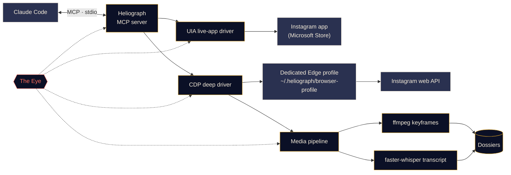

<p align="center">
  
</p>

<p align="center">
  <a href="#quick-start"></a>
  <a href="../../LICENSE"></a>
  <a href="#platform-support"></a>
  <a href="#how-it-works"></a>
  <a href="../../CONTRIBUTING.md#tests"></a>
</p>

<p align="center">
  <a href="../../README.md">English</a> ·
  <a href="README.es.md">Español</a> ·
  <a href="README.fr.md">Français</a> ·
  <a href="README.de.md">Deutsch</a> ·
  <a href="README.pt-BR.md">Português (BR)</a> ·
  <a href="README.it.md">Italiano</a> ·
  <b>Русский</b> ·
  <a href="README.tr.md">Türkçe</a> ·
  <a href="README.ar.md">العربية</a> ·
  <a href="README.hi.md">हिन्दी</a> ·
  <a href="README.zh-CN.md">简体中文</a> ·
  <a href="README.ja.md">日本語</a> ·
  <a href="README.ko.md">한국어</a>
</p>

> Это перевод. Основным источником является [README на английском](../../README.md); при расхождениях действует английская версия.

---

**Heliograph** связывает Claude (через [Claude Code](https://docs.anthropic.com/en/docs/claude-code) и MCP-сервер) с **вашим собственным Instagram на вашем собственном устройстве**. Claude может читать то, что видите вы, разбирать ваши сохранённые подборки и превращать reels в структурированные досье с поиском — всё локально, и каждое действие записи остаётся под вашим контролем.

> **Почему «Heliograph»?** Первая в истории фотография была *гелиографией* (Ньепс, 1820-е). Гелиограф — это ещё и сигнальный прибор, который с помощью зеркала передаёт вспышки солнечного света на расстояние. Камера и мост — именно этим и является проект.

> [!NOTE]
> **Статус: ранняя разработка (v0.1.0).** Архитектура определена, основные модули создаются. Каждая функция ниже помечена как **Доступно**, **В работе** или **Запланировано** — здесь нет обещаний, за которыми не стоит код.

## Что он делает

- **Позволяет Claude видеть и использовать Instagram так же, как вы** — в настоящем установленном приложении, с вашей настоящей сессией.
- **Получает структурированные данные** (сохранённые подборки, метаданные reels, подписи, медиа) через отдельный выделенный профиль браузера, в который вы входите один раз.
- **Превращает reels в досье** — видео, ключевые кадры, расшифровка с таймкодами и метаданные в одной папке, которую Claude может прочитать и проанализировать.
- **Наблюдает за собой** — *Око* локально записывает каждый вызов инструмента, действие драйвера и подпроцесс, чтобы сбои можно было объяснить — вам или Claude.

## Возможности

<table>
  <tr>
    <td width="33%" valign="top">
      <h3>Драйвер живого приложения</h3>
      Управляет приложением Instagram из Microsoft Store через Windows UI Automation: чтение экрана, навигация, лайки, сохранение, подписка, скриншоты. Никакого входа в аккаунт.<br><br><sub><b>В работе</b></sub>
    </td>
    <td width="33%" valign="top">
      <h3>Глубокий драйвер</h3>
      Выделенный профиль Edge/Chrome, управляемый через Chrome DevTools Protocol, который читает веб-API самого Instagram изнутри страницы: чистый JSON, ссылки на видео и пакетная обработка.<br><br><sub><b>В работе</b></sub>
    </td>
    <td width="33%" valign="top">
      <h3>Досье reels</h3>
      Ключевые кадры по смене сцен через ffmpeg с перцептивной дедупликацией плюс расшифровка faster-whisper, собранные в Markdown-досье для каждого reel.<br><br><sub><b>В работе</b></sub>
    </td>
  </tr>
  <tr>
    <td width="33%" valign="top">
      <h3>MCP-сервер</h3>
      Сервер FastMCP, который автоматически регистрируется в Claude Code через <code>.mcp.json</code>, когда вы открываете папку.<br><br><sub><b>В работе</b></sub>
    </td>
    <td width="33%" valign="top">
      <h3>Око</h3>
      Локальная трассировка: спаны, ID трассировки, скрытие секретов, снимки сбоев, живой просмотр в терминале и отчёт, который может прочитать Claude.<br><br><sub><b>Доступно (ранняя версия)</b></sub>
    </td>
    <td width="33%" valign="top">
      <h3>Защитные механизмы</h3>
      Действия записи требуют явного подтверждения, всё ограничено по частоте, загрузки разрешены только с CDN Instagram, и ни один пароль никогда не проходит через Heliograph.<br><br><sub><b>В работе</b></sub>
    </td>
  </tr>
</table>

<a id="quick-start"></a>
## Быстрый старт

**Понадобится:** Python 3.11+ (рекомендуется 3.12), [uv](https://docs.astral.sh/uv/), [ffmpeg](https://ffmpeg.org/), Microsoft Edge или Google Chrome, [Claude Code](https://docs.anthropic.com/en/docs/claude-code) и — для драйвера живого приложения в Windows — приложение Instagram из Microsoft Store.

```bash
# 1. Clone
git clone https://github.com/DeanT-04/instagram-bridge-with-claude.git heliograph
cd heliograph

# 2. Run the one-command setup
./scripts/setup.ps1        # Windows (PowerShell)
./scripts/setup.sh         # macOS / Linux

# 3. Open Claude Code in the folder
claude
```

Claude Code находит MCP-сервер Heliograph в `.mcp.json` и при первом запуске просит его одобрить. Дальше просто спрашивайте, например: *«Что в моей сохранённой подборке Trading?»*

> [!IMPORTANT]
> Скрипты установки, `.mcp.json` и `heliograph login` находятся **в работе**. Пока их нет, окружение можно подготовить вручную:
>
> ```bash
> uv sync
> uv run heliograph doctor
> ```
>
> `doctor` проверяет наличие приложения Instagram, Edge/Chrome, ffmpeg и вашу ОС и сообщает, чего не хватает.

<a id="how-it-works"></a>
## Как это работает



<details>
<summary><b>Зачем два драйвера?</b></summary>

<br>

Приложение Instagram из Microsoft Store — это веб-приложение Edge, работающее в вашем обычном профиле Edge. Новые версии Edge отказываются открывать порт DevTools для профиля по умолчанию, поэтому установленное приложение **нельзя** автоматизировать через DevTools. Зато его **можно** полностью читать и управлять им через Windows UI Automation.

| Драйвер | Цель | Сильная сторона | Применение |
|---|---|---|---|
| `uia` | Окно установленного приложения из Store | Ваше настоящее приложение и сессия, без входа | Навигация, чтение экрана, лайк / сохранить / подписаться, скриншоты |
| `cdp` | Выделенный профиль Edge/Chrome в режиме окна приложения, DevTools привязан к `127.0.0.1` | Структурированный JSON из веб-API Instagram, ссылки на видео, перехват сети | Сохранённые подборки, метаданные reels, загрузки, массовое извлечение |

Там, где их возможности пересекаются, оба реализуют единый интерфейс `InstagramDriver`. Полное описание — в [docs/ARCHITECTURE.md](../ARCHITECTURE.md).

</details>

<a id="platform-support"></a>
<details>
<summary><b>Поддержка платформ</b></summary>

<br>

| | Windows 10/11 | macOS | Linux |
|---|---|---|---|
| Глубокий драйвер (CDP) | В работе | В работе | В работе |
| Медиаконвейер и досье | В работе | В работе | В работе |
| Око | Доступно | Доступно | Доступно |
| Драйвер живого приложения | В работе (UI Automation) | Запланировано | Неприменимо |

</details>

## Извлечение трейдинговых reels

Демонстрационный сценарий: вы сохраняете reels о трейдинге в подборку Instagram, а Claude превращает их в заметки, по которым действительно можно учиться.

1. Вы просите Claude: *«Извлеки стратегии из моей сохранённой подборки "Trading"».*
2. Heliograph получает список подборки через глубокий драйвер и скачивает каждый reel с CDN Instagram.
3. Медиаконвейер извлекает ключевые кадры по смене сцен (графики, сетапы, пометки) и расшифровку с таймкодами.
4. Каждый reel становится досье; Claude читает их и описывает правила входа, выходы, управление рисками и утверждения, которые он не смог проверить.

```text
dossiers/<reel-id>/
├── meta.json          # author, caption, date, URL, metrics
├── video.mp4
├── transcript.json    # timestamped segments
├── transcript.md
├── frames/*.jpg       # de-duplicated keyframes
└── dossier.md         # everything above, stitched for Claude
```

**Статус:** сборщик досье — **в работе**; навык Claude Code `extract-trading-strategies` — **запланирован**.

> [!CAUTION]
> Heliograph упорядочивает то, что говорят авторы, но не оценивает их правоту. Ничто из созданного им не является финансовой рекомендацией.

## Око

*Око* — встроенная в Heliograph локальная система наблюдаемости. Внешние сервисы не нужны.

- Каждый вызов MCP-инструмента, действие драйвера, HTTP-запрос и подпроцесс ffmpeg/whisper записывается как **спан** с общим `trace_id`, так что один запрос Claude можно проследить от начала до конца.
- События пишутся в `~/.heliograph/eye/events.jsonl` (с ротацией) вместе с индексом SQLite для запросов.
- **Секреты скрываются до записи** — cookies, `sessionid`, `csrftoken`, заголовки авторизации и строки, похожие на токены.
- Если шаг в интерфейсе или браузере завершается ошибкой, сохраняются скриншот и снимок дерева доступности/DOM, связанные с событием *(в работе)*.
- `heliograph eye` показывает цветной поток событий в реальном времени со скользящими показателями: доля ошибок, задержка p95, самые сбойные операции.
- `heliograph eye report` — и MCP-инструмент `eye_report` *(в работе)* — сводит недавние ошибки, чтобы Claude мог сам диагностировать проблемы.
- Необязательный экспорт в Langfuse при заданных `LANGFUSE_PUBLIC_KEY` / `LANGFUSE_SECRET_KEY` (по умолчанию выключен).

## Безопасность и конфиденциальность

- **Однократный ручной вход.** Вы сами входите в выделенный профиль браузера, один раз. Heliograph никогда не вводит, не хранит и не записывает пароли.
- **Драйверу живого приложения вход не нужен** — он использует приложение Instagram, в котором вы уже авторизованы.
- **Действия записи требуют подтверждения.** Лайк, подписка, комментарий, личное сообщение, публикация и удаление из сохранённого требуют явного `confirm=True` на уровне MCP, поэтому Claude должен сначала спросить вас.
- **Ограничение частоты со случайным разбросом** и для записи, *и* для чтения — чтобы темп оставался человеческим.
- **Только локальные данные.** Досье, журналы и профиль браузера хранятся в `~/.heliograph` на вашем компьютере. Порт DevTools привязан к `127.0.0.1` на случайном свободном порту.
- **Загрузки по белому списку** — только HTTPS с хостов CDN Instagram.

Модель угроз и порядок сообщения об уязвимостях — в [docs/SECURITY.md](../SECURITY.md).

## Справочник CLI

> Это **запланированный интерфейс**. Столбец «Статус» показывает, что работает уже сейчас.

| Команда | Назначение | Статус |
|---|---|---|
| `heliograph setup` | Устанавливает зависимости, проверяет окружение и регистрирует MCP-сервер | Запланировано (заглушка) |
| `heliograph doctor` | Определяет приложение Instagram, Edge/Chrome, ffmpeg, ОС и состояние входа | Доступно |
| `heliograph login` | Открывает выделенный профиль браузера, чтобы вы один раз вошли вручную | Запланировано (заглушка) |
| `heliograph mcp` | Запускает MCP-сервер через stdio (Claude Code делает это за вас) | Запланировано (заглушка) |
| `heliograph extract <url>` | Создаёт досье для одного reel или поста | Запланировано (заглушка) |
| `heliograph eye` | Поток событий Ока в реальном времени с показателями состояния | Доступно |
| `heliograph eye report` | Сводка недавних ошибок и аномалий | Доступно |

<details>
<summary><b>Структура проекта</b></summary>

<br>

```text
src/heliograph/
├── cli.py              # Typer CLI
├── config.py           # settings (env prefix HELIOGRAPH_), paths under ~/.heliograph
├── errors.py           # HeliographError hierarchy
├── detect/             # environment detection: Store app, browsers, ffmpeg, OS
├── drivers/
│   ├── base.py         # InstagramDriver protocol + shared dataclasses
│   ├── uia/            # Windows UI Automation live-app driver
│   └── cdp/            # browser launcher, CDP session, web-API client
├── instagram/          # models + high-level service
├── media/              # allow-listed download, ffmpeg frames, faster-whisper
├── extract/            # reel -> dossier
├── eye/                # the Eye: spans, sinks, redaction, live view, reports
└── mcp/                # FastMCP server (in progress)
tests/                  # pytest; live tests marked @pytest.mark.live
docs/                   # architecture, security, translations, brand assets
scripts/                # setup.ps1 / setup.sh (in progress)
.claude/skills/         # Claude Code skills (planned)
.mcp.json               # MCP registration for Claude Code (in progress)
```

</details>

## Дорожная карта

- [ ] Установка одной командой, регистрация через `.mcp.json` и `heliograph login`
- [ ] MCP-сервер с инструментами чтения, затем — инструменты записи с подтверждением
- [ ] Навык `extract-trading-strategies`
- [ ] Поддержка **нескольких аккаунтов** (отдельные профили и состояние для каждого)
- [ ] **Android** через `adb`
- [ ] Драйвер живого приложения для **macOS** (Accessibility API)

## Участие в разработке

Мы рады вкладу — см. [CONTRIBUTING.md](../../CONTRIBUTING.md) и [Кодекс поведения](../../CODE_OF_CONDUCT.md).

## Отказ от ответственности

Heliograph — независимый проект с открытым исходным кодом. Он **не связан с Instagram или Meta Platforms, Inc., не одобрен и не спонсируется ими.** «Instagram» — товарный знак его владельца и используется здесь только для описания того, с чем работает программа. Используйте Heliograph **только со своим аккаунтом**, в личных целях и в человеческом темпе, и соблюдайте [Условия использования Instagram](https://help.instagram.com/581066165581870). Вы несёте ответственность за то, как его используете.

## Лицензия

[MIT](../../LICENSE) © 2026 DeanT-04
