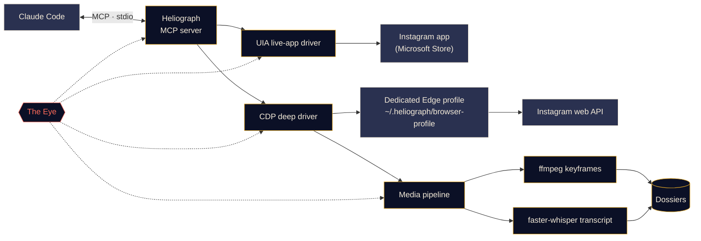

<p align="center">
  
</p>

<p align="center">
  <a href="#quick-start"></a>
  <a href="../../LICENSE"></a>
  <a href="#platform-support"></a>
  <a href="#how-it-works"></a>
  <a href="../../CONTRIBUTING.md#tests"></a>
</p>

<p align="center">
  <a href="../../README.md">English</a> ·
  <a href="README.es.md">Español</a> ·
  <a href="README.fr.md">Français</a> ·
  <a href="README.de.md">Deutsch</a> ·
  <a href="README.pt-BR.md">Português (BR)</a> ·
  <a href="README.it.md">Italiano</a> ·
  <a href="README.ru.md">Русский</a> ·
  <b>Türkçe</b> ·
  <a href="README.ar.md">العربية</a> ·
  <a href="README.hi.md">हिन्दी</a> ·
  <a href="README.zh-CN.md">简体中文</a> ·
  <a href="README.ja.md">日本語</a> ·
  <a href="README.ko.md">한국어</a>
</p>

> Bu bir çeviridir. Esas kaynak [İngilizce README](../../README.md) dosyasıdır; bir farklılık olursa İngilizce sürüm geçerlidir.

---

**Heliograph**, Claude'u ([Claude Code](https://docs.anthropic.com/en/docs/claude-code) ve bir MCP sunucusu aracılığıyla) **kendi cihazınızdaki kendi Instagram hesabınıza** bağlar. Claude sizin gördüğünüzü okuyabilir, kaydedilmiş koleksiyonlarınızı inceleyebilir ve reels videolarını yapılandırılmış, aranabilir dosyalara dönüştürebilir — hepsi yerel olarak ve her yazma işleminin kontrolü sizde.

> **Neden "Heliograph"?** Tarihteki ilk fotoğraf bir *heliografi* idi (Niépce, 1820'ler). Heliograf aynı zamanda bir aynayla güneş ışığını uzaklara yansıtarak sinyal veren bir cihazdır. Bir fotoğraf makinesi ve bir köprü — bu proje tam olarak bu.

> [!NOTE]
> **Durum: erken geliştirme (v0.1.0).** Mimari netleşti ve çekirdek modüller geliştiriliyor. Aşağıdaki her özellik **Kullanılabilir**, **Geliştiriliyor** veya **Planlandı** olarak etiketlenmiştir — burada henüz yazılmamış hiçbir şey vaat edilmiyor.

## Ne yapar

- **Claude'un Instagram'ı sizin gibi görmesini ve kullanmasını sağlar** — gerçek yüklü uygulamada, gerçek oturumunuzla.
- **Yapılandırılmış veri çeker** (kaydedilmiş koleksiyonlar, reels meta verileri, açıklamalar, medya); bunu yalnızca bir kez giriş yaptığınız ayrı, özel bir tarayıcı profili üzerinden yapar.
- **Reels'leri dosyalara dönüştürür** — video, anahtar kareler, zaman damgalı bir döküm ve meta veriler; Claude'un okuyup üzerinde düşünebileceği tek bir klasörde.
- **Kendini izler** — *Göz*, her araç çağrısını, sürücü eylemini ve alt süreci yerel olarak kaydeder; böylece hatalar sizin veya Claude tarafından açıklanabilir.

## Özellikler

<table>
  <tr>
    <td width="33%" valign="top">
      <h3>Canlı uygulama sürücüsü</h3>
      Microsoft Store'daki Instagram uygulamasını Windows UI Automation ile kontrol eder: ekranı okuma, gezinme, beğenme, kaydetme, takip etme, ekran görüntüsü alma. Hiçbir giriş adımı yok.<br><br><sub><b>Geliştiriliyor</b></sub>
    </td>
    <td width="33%" valign="top">
      <h3>Derin sürücü</h3>
      Chrome DevTools Protocol ile yönetilen özel bir Edge/Chrome profili; temiz JSON, video URL'leri ve toplu işler için Instagram'ın kendi web API'sini sayfanın içinden okur.<br><br><sub><b>Geliştiriliyor</b></sub>
    </td>
    <td width="33%" valign="top">
      <h3>Reels dosyaları</h3>
      Algısal tekilleştirmeli ffmpeg sahne değişimi anahtar kareleri ve faster-whisper dökümü; her reel için bir Markdown dosyasında toplanır.<br><br><sub><b>Geliştiriliyor</b></sub>
    </td>
  </tr>
  <tr>
    <td width="33%" valign="top">
      <h3>MCP sunucusu</h3>
      Klasörü açtığınızda <code>.mcp.json</code> aracılığıyla Claude Code'a kendini otomatik kaydeden bir FastMCP sunucusu.<br><br><sub><b>Geliştiriliyor</b></sub>
    </td>
    <td width="33%" valign="top">
      <h3>Göz</h3>
      Önce yerel izleme: span'ler, iz kimlikleri, gizli bilgi maskeleme, hata anlık görüntüleri, terminalde canlı görünüm ve Claude'un okuyabileceği bir rapor.<br><br><sub><b>Kullanılabilir (erken)</b></sub>
    </td>
    <td width="33%" valign="top">
      <h3>Güvenlik önlemleri</h3>
      Yazma işlemleri açık onay gerektirir, her şey hız sınırlıdır, indirmeler Instagram CDN'i ile sınırlıdır ve hiçbir parola Heliograph'tan geçmez.<br><br><sub><b>Geliştiriliyor</b></sub>
    </td>
  </tr>
</table>

<a id="quick-start"></a>
## Hızlı başlangıç

**Gerekenler:** Python 3.11+ (3.12 önerilir), [uv](https://docs.astral.sh/uv/), [ffmpeg](https://ffmpeg.org/), Microsoft Edge veya Google Chrome, [Claude Code](https://docs.anthropic.com/en/docs/claude-code) ve Windows'ta canlı uygulama sürücüsü için Microsoft Store'dan Instagram uygulaması.

```bash
# 1. Clone
git clone https://github.com/DeanT-04/instagram-bridge-with-claude.git heliograph
cd heliograph

# 2. Run the one-command setup
./scripts/setup.ps1        # Windows (PowerShell)
./scripts/setup.sh         # macOS / Linux

# 3. Open Claude Code in the folder
claude
```

Claude Code, Heliograph MCP sunucusunu `.mcp.json` üzerinden bulur ve ilk seferde onayınızı ister. Sonra sadece sorun, örneğin: *"Trading adlı kaydedilmiş koleksiyonumda ne var?"*

> [!IMPORTANT]
> Kurulum betikleri, `.mcp.json` ve `heliograph login` **geliştiriliyor**. Hazır olana kadar ortamı elle kurabilirsiniz:
>
> ```bash
> uv sync
> uv run heliograph doctor
> ```
>
> `doctor`; Instagram uygulamasını, Edge/Chrome'u, ffmpeg'i ve işletim sisteminizi kontrol eder ve neyin eksik olduğunu söyler.

<a id="how-it-works"></a>
## Nasıl çalışır



<details>
<summary><b>Neden iki sürücü?</b></summary>

<br>

Microsoft Store'daki Instagram uygulaması, normal Edge profilinizde çalışan bir Edge web uygulamasıdır. Güncel Edge sürümleri varsayılan profilde DevTools bağlantı noktası açmayı reddeder; bu yüzden yüklü uygulama DevTools ile **otomatikleştirilemez**. Ancak Windows UI Automation ile tamamen **okunabilir ve yönetilebilir**.

| Sürücü | Hedef | Güçlü yanı | Kullanım alanı |
|---|---|---|---|
| `uia` | Yüklü Store uygulamasının penceresi | Gerçek uygulamanız ve oturumunuz, giriş gerekmez | Gezinme, ekrandakini okuma, beğen / kaydet / takip et, ekran görüntüleri |
| `cdp` | Uygulama penceresi olarak açılan özel bir Edge/Chrome profili, DevTools `127.0.0.1` adresine bağlı | Instagram web API'sinden yapılandırılmış JSON, video URL'leri, ağ yakalama | Kaydedilmiş koleksiyonlar, reels meta verileri, indirmeler, toplu çıkarma |

İkisi de örtüştükleri yerde tek bir `InstagramDriver` arayüzünü uygular. Tasarımın tamamı için [docs/ARCHITECTURE.md](../ARCHITECTURE.md) dosyasına bakın.

</details>

<a id="platform-support"></a>
<details>
<summary><b>Platform desteği</b></summary>

<br>

| | Windows 10/11 | macOS | Linux |
|---|---|---|---|
| Derin sürücü (CDP) | Geliştiriliyor | Geliştiriliyor | Geliştiriliyor |
| Medya hattı ve dosyalar | Geliştiriliyor | Geliştiriliyor | Geliştiriliyor |
| Göz | Kullanılabilir | Kullanılabilir | Kullanılabilir |
| Canlı uygulama sürücüsü | Geliştiriliyor (UI Automation) | Planlandı | Uygulanamaz |

</details>

## Trading reels çıkarımı

Örnek bir iş akışı: Trading reels'lerini bir Instagram koleksiyonuna kaydedersiniz, Claude da bunları gerçekten üzerinde çalışabileceğiniz notlara dönüştürür.

1. Claude'a şunu sorarsınız: *"Kaydedilmiş 'Trading' koleksiyonumdaki stratejileri çıkar."*
2. Heliograph, koleksiyonu derin sürücü üzerinden listeler ve her reel'i Instagram CDN'inden indirir.
3. Medya hattı, sahne değişimi anahtar karelerini (grafikler, kurulumlar, notlar) ve zaman damgalı bir döküm çıkarır.
4. Her reel bir dosyaya dönüşür; Claude bunları okuyup giriş kurallarını, çıkışları, risk yönetimini ve doğrulayamadığı iddiaları yazar.

```text
dossiers/<reel-id>/
├── meta.json          # author, caption, date, URL, metrics
├── video.mp4
├── transcript.json    # timestamped segments
├── transcript.md
├── frames/*.jpg       # de-duplicated keyframes
└── dossier.md         # everything above, stitched for Claude
```

**Durum:** dosya oluşturucu **geliştiriliyor**; `extract-trading-strategies` Claude Code becerisi **planlandı**.

> [!CAUTION]
> Heliograph içerik üreticilerinin söylediklerini düzenler; haklı olup olmadıklarını değerlendirmez. Ürettiği hiçbir şey yatırım tavsiyesi değildir.

## Göz

*Göz*, Heliograph'ın yerleşik, önce yerel çalışan gözlemlenebilirlik sistemidir. Harici bir hizmete gerek yoktur.

- Her MCP araç çağrısı, sürücü eylemi, HTTP isteği ve ffmpeg/whisper alt süreci ortak bir `trace_id` ile bir **span** olarak kaydedilir; böylece Claude'dan gelen tek bir istek baştan sona izlenebilir.
- Olaylar, sorgulama için bir SQLite dizini ile birlikte `~/.heliograph/eye/events.jsonl` dosyasına (döngüsel) yazılır.
- **Gizli bilgiler yazılmadan önce maskelenir** — çerezler, `sessionid`, `csrftoken`, kimlik doğrulama başlıkları ve token'a benzeyen dizeler.
- Bir arayüz veya tarayıcı adımı başarısız olduğunda, bir ekran görüntüsü ve erişilebilirlik/DOM anlık görüntüsü kaydedilip olaya bağlanır *(geliştiriliyor)*.
- `heliograph eye`, kayan sağlık göstergeleriyle renkli, canlı bir akış gösterir: hata oranı, p95 gecikmesi, en çok başarısız olan işlemler.
- `heliograph eye report` — ve MCP aracı `eye_report` *(geliştiriliyor)* — son hataları özetler; böylece Claude sorunları kendisi teşhis edebilir.
- `LANGFUSE_PUBLIC_KEY` / `LANGFUSE_SECRET_KEY` tanımlıysa isteğe bağlı olarak Langfuse'a aktarım (varsayılan olarak kapalı).

## Güvenlik ve gizlilik

- **Tek seferlik elle giriş.** Özel tarayıcı profiline bir kez, kendiniz giriş yaparsınız. Heliograph hiçbir zaman parola yazmaz, saklamaz veya kaydetmez.
- **Canlı uygulama sürücüsü giriş gerektirmez** — zaten oturum açmış olduğunuz Instagram uygulamasını kullanır.
- **Yazma işlemleri onay gerektirir.** Beğenme, takip etme, yorum yapma, DM gönderme, paylaşma ve kaydedilenlerden çıkarma, MCP katmanında açık bir `confirm=True` gerektirir; yani Claude önce size sormak zorundadır.
- **Rastgele sapmalı hız sınırları** hem yazmalarda *hem de* okumalarda uygulanır; kullanım insan temposunda kalır.
- **Yalnızca yerel veri.** Dosyalar, günlükler ve tarayıcı profili bilgisayarınızda `~/.heliograph` altında kalır. DevTools bağlantı noktası rastgele boş bir portta `127.0.0.1` adresine bağlanır.
- **İzin listeli indirmeler** — yalnızca Instagram CDN sunucularından HTTPS ile.

Tehdit modeli ve güvenlik açığı bildirme yolu için [docs/SECURITY.md](../SECURITY.md) dosyasına bakın.

## CLI başvurusu

> Bu **planlanan arayüzdür**. Durum sütunu bugün neyin çalıştığını gösterir.

| Komut | Ne yapar | Durum |
|---|---|---|
| `heliograph setup` | Bağımlılıkları kurar, ortamı denetler ve MCP sunucusunu kaydeder | Planlandı (iskelet) |
| `heliograph doctor` | Instagram uygulamasını, Edge/Chrome'u, ffmpeg'i, işletim sistemini ve oturum durumunu algılar | Kullanılabilir |
| `heliograph login` | Bir kez elle giriş yapmanız için özel tarayıcı profilini açar | Planlandı (iskelet) |
| `heliograph mcp` | MCP sunucusunu stdio üzerinden çalıştırır (Claude Code bunu sizin için başlatır) | Planlandı (iskelet) |
| `heliograph extract <url>` | Tek bir reel veya gönderi için dosya oluşturur | Planlandı (iskelet) |
| `heliograph eye` | Göz'ün sağlık göstergeli canlı akışı | Kullanılabilir |
| `heliograph eye report` | Son hataların ve anormalliklerin özeti | Kullanılabilir |

<details>
<summary><b>Proje yapısı</b></summary>

<br>

```text
src/heliograph/
├── cli.py              # Typer CLI
├── config.py           # settings (env prefix HELIOGRAPH_), paths under ~/.heliograph
├── errors.py           # HeliographError hierarchy
├── detect/             # environment detection: Store app, browsers, ffmpeg, OS
├── drivers/
│   ├── base.py         # InstagramDriver protocol + shared dataclasses
│   ├── uia/            # Windows UI Automation live-app driver
│   └── cdp/            # browser launcher, CDP session, web-API client
├── instagram/          # models + high-level service
├── media/              # allow-listed download, ffmpeg frames, faster-whisper
├── extract/            # reel -> dossier
├── eye/                # the Eye: spans, sinks, redaction, live view, reports
└── mcp/                # FastMCP server (in progress)
tests/                  # pytest; live tests marked @pytest.mark.live
docs/                   # architecture, security, translations, brand assets
scripts/                # setup.ps1 / setup.sh (in progress)
.claude/skills/         # Claude Code skills (planned)
.mcp.json               # MCP registration for Claude Code (in progress)
```

</details>

## Yol haritası

- [ ] Tek komutla kurulum, `.mcp.json` kaydı ve `heliograph login`
- [ ] Önce okuma araçları, ardından onaylı yazma araçları olan MCP sunucusu
- [ ] `extract-trading-strategies` becerisi
- [ ] **Çoklu hesap** desteği (her hesap için ayrı profil ve durum)
- [ ] `adb` ile **Android**
- [ ] **macOS** canlı uygulama sürücüsü (Erişilebilirlik API'si)

## Katkıda bulunma

Katkılarınızı bekliyoruz — [CONTRIBUTING.md](../../CONTRIBUTING.md) ve [Davranış Kuralları](../../CODE_OF_CONDUCT.md) dosyalarına bakın.

## Sorumluluk reddi

Heliograph bağımsız bir açık kaynak projesidir. **Instagram veya Meta Platforms, Inc. ile bağlantılı değildir; onlar tarafından onaylanmamış veya desteklenmemiştir.** "Instagram" sahibinin ticari markasıdır ve burada yalnızca yazılımın neyle çalıştığını belirtmek için kullanılır. Heliograph'ı **yalnızca kendi hesabınızda** kullanın, kullanımı kişisel ve insan temposunda tutun ve [Instagram Kullanım Koşulları](https://help.instagram.com/581066165581870)'na uyun. Kullanımınızdan siz sorumlusunuz.

## Lisans

[MIT](../../LICENSE) © 2026 DeanT-04
