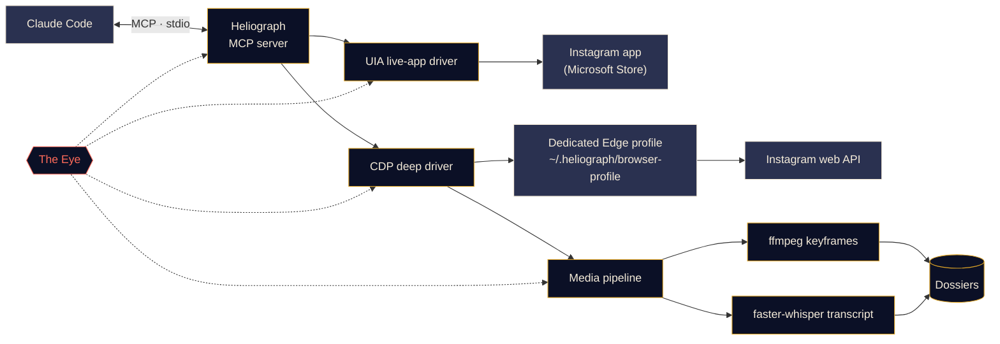

<p align="center">
  
</p>

<p align="center">
  <a href="#quick-start"></a>
  <a href="../../LICENSE"></a>
  <a href="#platform-support"></a>
  <a href="#mcp-tools"></a>
  <a href="https://github.com/DeanT-04/instagram-bridge-with-claude/actions/workflows/ci.yml"></a>
</p>

<p align="center">
  <a href="../../README.md">English</a> ·
  <a href="README.es.md">Español</a> ·
  <a href="README.fr.md">Français</a> ·
  <a href="README.de.md">Deutsch</a> ·
  <a href="README.pt-BR.md">Português (BR)</a> ·
  <a href="README.it.md">Italiano</a> ·
  <a href="README.ru.md">Русский</a> ·
  <b>Türkçe</b> ·
  <a href="README.ar.md">العربية</a> ·
  <a href="README.hi.md">हिन्दी</a> ·
  <a href="README.zh-CN.md">简体中文</a> ·
  <a href="README.ja.md">日本語</a> ·
  <a href="README.ko.md">한국어</a>
</p>

> Bu bir çeviridir. Esas kaynak [İngilizce README](../../README.md) dosyasıdır; bir farklılık olursa İngilizce sürüm geçerlidir.

---

**Heliograph**, Claude'u ([Claude Code](https://docs.anthropic.com/en/docs/claude-code) ve bir MCP sunucusu aracılığıyla) **kendi cihazınızdaki kendi Instagram hesabınıza** bağlar. Claude sizin gördüğünüzü okuyabilir, kaydedilmiş koleksiyonlarınızı inceleyebilir ve reels videolarını yapılandırılmış, aranabilir dosyalara dönüştürebilir — hepsi yerel olarak ve her yazma işleminin kontrolü sizde.

> **Neden "Heliograph"?** Tarihteki ilk fotoğraf bir *heliografi* idi (Niépce, 1820'ler). Heliograf aynı zamanda bir aynayla güneş ışığını uzaklara yansıtarak sinyal veren bir cihazdır. Bir fotoğraf makinesi ve bir köprü — bu proje tam olarak bu.

> [!NOTE]
> **Durum: v0.1.0 — erken ama çalışıyor.** Kurulum, CLI, MCP sunucusu (41 araç), iki sürücü ve dosya hattı yayında. Okuma işlemleri Windows 11'de gerçek bir hesapla canlı doğrulandı (oturumdaki hesap, koleksiyonlar, koleksiyon gönderileri, arama, uygulama rozetleri, durum). **Yazma işlemleri** (beğenme, kaydetme, takip, yorum, DM…) uygulandı ve deneme modunda test edildi, ancak **henüz gerçek bir hesapla doğrulanmadı**.

## Ne yapar

- **Claude'un Instagram'ı sizin gibi görmesini ve kullanmasını sağlar** — gerçek yüklü uygulamada, gerçek oturumunuzla.
- **Yapılandırılmış veri çeker** (kaydedilmiş koleksiyonlar, reels meta verileri, açıklamalar, DM'ler, medya); bunu yalnızca bir kez giriş yaptığınız özel bir tarayıcı profili üzerinden yapar.
- **Reels'leri dosyalara dönüştürür** — video, anahtar kareler, bir kontak baskı, zaman damgalı bir döküm ve meta veriler; Claude'un okuyabileceği *ve bakabileceği* tek bir klasörde.
- **Kendini izler** — *Göz*, her araç çağrısını, sürücü eylemini ve alt süreci yerel olarak kaydeder; böylece hatalar sizin veya Claude tarafından açıklanabilir.

## Özellikler

<table>
  <tr>
    <td width="33%" valign="top">
      <h3>Canlı uygulama sürücüsü</h3>
      Microsoft Store'daki Instagram uygulamasını Windows UI Automation ile kontrol eder: ekranı okuma, gezinme, kaydırma, ekran görüntüsü, tıklama veya yazma (onayınızla). Hiçbir giriş adımı yok.<br><br><sub><b>Kullanılabilir · Windows</b></sub>
    </td>
    <td width="33%" valign="top">
      <h3>Derin sürücü</h3>
      Chrome DevTools Protocol ile yönetilen özel bir Edge/Chrome profili; temiz JSON, video URL'leri ve toplu işler için Instagram'ın kendi web API'sini sayfanın içinden okur.<br><br><sub><b>Kullanılabilir</b></sub>
    </td>
    <td width="33%" valign="top">
      <h3>Reels dosyaları</h3>
      Algısal tekilleştirmeli ffmpeg sahne değişimi anahtar kareleri, bir kontak baskı ve faster-whisper dökümü; her reel için bir Markdown dosyasında toplanır. Ekrandaki metin OCR ile okunur, İngilizce olmayan konuşmaya ayrıca İngilizce çeviri eklenir ve grafiklerdeki küçük etiketler kırpılıp büyütülebilir.<br><br><sub><b>Kullanılabilir</b></sub>
    </td>
  </tr>
  <tr>
    <td width="33%" valign="top">
      <h3>MCP sunucusu</h3>
      Klasörü açtığınızda <code>.mcp.json</code> ile Claude Code'a otomatik kaydolan 41 araç ve iki proje becerisi.<br><br><sub><b>Kullanılabilir</b></sub>
    </td>
    <td width="33%" valign="top">
      <h3>Göz</h3>
      Önce yerel izleme: span'ler, iz kimlikleri, gizli bilgi maskeleme, hata ekran görüntüleri ve DOM anlık görüntüleri, terminalde canlı görünüm ve Claude'un okuyabileceği raporlar.<br><br><sub><b>Kullanılabilir</b></sub>
    </td>
    <td width="33%" valign="top">
      <h3>Güvenlik önlemleri</h3>
      Yazma işlemleri onay olmadan yalnızca deneme olarak çalışır, her şey hız sınırlıdır, URL'ler ve indirmeler izin listesindedir ve hiçbir parola Heliograph'tan geçmez.<br><br><sub><b>Kullanılabilir · yazmalar henüz canlı doğrulanmadı</b></sub>
    </td>
  </tr>
</table>

<a id="quick-start"></a>
## Hızlı başlangıç

**Gerekenler:** Python 3.11+ (3.12 önerilir), [ffmpeg](https://ffmpeg.org/), Microsoft Edge veya Google Chrome, [Claude Code](https://docs.anthropic.com/en/docs/claude-code) ve Windows'ta canlı uygulama sürücüsü için Microsoft Store'dan Instagram uygulaması. Kurulum betiği, eksikse [uv](https://docs.astral.sh/uv/) aracını (size sorduktan sonra) kurar.

```bash
# 1. Clone
git clone https://github.com/DeanT-04/instagram-bridge-with-claude.git heliograph
cd heliograph

# 2. Run the one-command setup
powershell -ExecutionPolicy Bypass -File scripts\setup.ps1   # Windows
bash scripts/setup.sh                                        # macOS / Linux

# 3. Sign in to Instagram once, yourself, in Heliograph's own browser window
uv run heliograph login

# 4. Open Claude Code in the folder
claude
```

Claude Code, Heliograph MCP sunucusunu `.mcp.json` üzerinden bulur ve ilk seferde onayını ister. Varsayılan Windows betikleri engeller (yürütme ilkesi *Restricted*); bu yüzden kurulumu gösterildiği gibi `powershell -ExecutionPolicy Bypass -File scripts\setup.ps1` ile başlatın: istisna yalnızca o çalıştırma için geçerlidir ve hiçbir ayarı değiştirmez. Kurulum güvenle yeniden çalıştırılabilir. **Windows** seçenekleri: `-Yes` (soru sormaz), `-NoInput` (asla sormaz, hayır yanıtını verir; CI için), `-WithWhisper` (konuşma modelini önceden indirir, ~500 MB). **macOS / Linux**: `--yes`, `--no-input`, `--with-whisper`. uv yoksa betik, size sorduktan sonra uv 0.12.1'i sürümü sabitlenmiş resmi yükleyiciyle kurar. Bir sorun görünüyorsa `uv run heliograph doctor` çalıştırın.

## Claude ile kullanım

Proje klasöründe Claude ile konuşmanız yeterli. Örneğin:

- *"'Trading strats' koleksiyonumdaki tüm stratejileri çıkar."* — `extract-trading-strategies` becerisini baştan sona çalıştırır.
- *"DM'lerimde ve bildirimlerimde yeni ne var? Özetle, yanıt verme."*
- *"Instagram uygulamasını aç, Reels'e git ve ekranda ne olduğunu söyle."*
- *"@some_creator hesabının son beş gönderisini bul ve en yenisine bir yorum taslağı yaz."* — Claude önce size bir deneme gösterir; siz evet diyene kadar hiçbir şey paylaşılmaz.

`CLAUDE.md`, Claude'a çalışma kılavuzunu (güvenlik kuralları, araç aileleri, sorun giderme) verir; [`instagram-control`](../../.claude/skills/instagram-control/SKILL.md) becerisi de hangi aracı kullanacağını öğretir.

<a id="how-it-works"></a>
## Nasıl çalışır



<details>
<summary><b>Neden iki sürücü?</b></summary>

<br>

Microsoft Store'daki Instagram uygulaması, normal Edge profilinizde çalışan bir Edge web uygulamasıdır. Güncel Edge sürümleri varsayılan profilde DevTools bağlantı noktası açmayı reddeder; bu yüzden yüklü uygulama DevTools ile **otomatikleştirilemez**. Ancak Windows UI Automation ile tamamen **okunabilir ve yönetilebilir**.

| Sürücü | Hedef | Güçlü yanı | Kullanım alanı |
|---|---|---|---|
| `uia` | Yüklü Store uygulamasının penceresi | Gerçek uygulamanız ve oturumunuz, giriş gerekmez | Gezinme, ekrandakini okuma, ekran görüntüleri, onaylı tıklamalar |
| `cdp` | Uygulama penceresi olarak açılan özel bir Edge/Chrome profili, DevTools `127.0.0.1` adresine bağlı | Instagram web API'sinden yapılandırılmış JSON, video URL'leri, ağ yakalama | Kaydedilmiş koleksiyonlar, akışlar, DM'ler, reels meta verileri, indirmeler, toplu çıkarma |

Tasarımın tamamı için [docs/ARCHITECTURE.md](../ARCHITECTURE.md) dosyasına bakın.

</details>

<a id="platform-support"></a>
<details>
<summary><b>Platform desteği</b></summary>

<br>

| | Windows 10/11 | macOS | Linux |
|---|---|---|---|
| Kurulum betiği | Doğrulandı | Kullanılabilir (test edilmedi) | Kullanılabilir (test edilmedi) |
| Derin sürücü (CDP) ve MCP sunucusu | Doğrulandı | Kullanılabilir (test edilmedi) | Kullanılabilir (test edilmedi) |
| Medya hattı ve dosyalar | Kullanılabilir | Kullanılabilir (test edilmedi) | Kullanılabilir (test edilmedi) |
| Göz | Kullanılabilir | Kullanılabilir | Kullanılabilir |
| Canlı uygulama sürücüsü (`app_*` araçları) | Doğrulandı | Planlandı | Uygulanamaz |

</details>

<a id="mcp-tools"></a>
## MCP araçları

Yedi ailede 41 araç. Listeleme araçları `limit` ve `cursor` alır; sonraki sayfa için `next_cursor` değerini geri verin.

<details open>
<summary><b>Araç başvurusu</b></summary>

<br>

| Aile | Araç | Ne yapar |
|---|---|---|
| **Durum** | `heliograph_status` | Sağlık: işletim sistemi, Store uygulaması, tarayıcılar, ffmpeg, oturum durumu |
| | `heliograph_setup_check` | Tüm araçların çalışması için hâlâ yapmanız gerekenler |
| **Okuma** | `ig_whoami` | Heliograph tarayıcı profilinde oturum açmış hesap |
| | `ig_get_user` | Kullanıcı adına göre bir hesabın herkese açık profili |
| | `ig_user_posts` | Bir hesabın son gönderileri ve reels'leri |
| | `ig_get_media` | Bir gönderinin/reel'in tüm ayrıntıları, açıklama ve medya URL'leri dahil |
| | `ig_comments` | Bir gönderideki/reel'deki üst düzey yorumlar |
| | `ig_search` | Genel arama: kullanıcılar, hashtag'ler ve yerler |
| | `ig_timeline` | Ana sayfa akışınız |
| | `ig_reels_feed` | Reels keşif akışı |
| | `ig_explore` | Keşfet ızgarasındaki gönderiler |
| | `ig_inbox` | Son mesaj önizlemesiyle DM konuşmaları |
| | `ig_thread` | Bir DM konuşmasının mesajları |
| | `ig_activity` | Son bildirimler: beğeniler, takipler, yorumlar, bahsetmeler |
| **Koleksiyonlar** | `ig_list_collections` | Kaydedilmiş koleksiyonlarınız |
| | `ig_collection_posts` | Ad veya kimliğe göre bir koleksiyondaki gönderiler |
| | `ig_saved_posts` | Tüm kaydedilmiş gönderiler, en yeniler önce |
| **Çıkarma** | `ig_extract_media` | Bir gönderi/reel için dosya oluşturur (veya yeniden kullanır) |
| | `ig_extract_collection` | Bir koleksiyon için gruplar hâlinde dosya oluşturur |
| | `ig_read_dossier` | Bir dosyanın Markdown'ını, dökümünü ve meta verilerini okur |
| | `ig_view_frames` | Kontak baskıyı veya kareleri Claude'un görebileceği görseller olarak döndürür |
| **Canlı uygulama** *(Windows)* | `app_open` | Instagram uygulama penceresine bağlanır |
| | `app_snapshot` | Ekrandakilerin metin taslağı (erişilebilirlik ağacı) |
| | `app_screenshot` | Uygulama penceresinin ekran görüntüsü, arkada kalsa bile |
| | `app_navigate` | Bir bölüm açar: ana sayfa, arama, keşfet, reels, mesajlar… |
| | `app_click` | Ref veya ada göre bir öğeye tıklar (yazma işlemleri onayınızı gerektirir) |
| | `app_scroll` | Ekran ekran kaydırır (Reels görüntüleyicide sayfa başına bir reel) |
| | `app_type` | Bir alana yazar (gönderme onayınızı gerektirir) |
| | `app_visible_posts` | Ekrandaki gönderiler/reels ve düğmeleri |
| | `app_badges` | Mesajlar ve bildirimler için okunmamış sayıları |
| **Yazma** *(onaylı)* | `ig_like` / `ig_unlike` | Bir gönderiyi/reel'i beğenir veya beğeniyi kaldırır |
| | `ig_save` / `ig_unsave` | Kaydeder veya kaldırır, isteğe bağlı olarak bir koleksiyonda |
| | `ig_follow` / `ig_unfollow` | Bir hesabı takip eder veya takibi bırakır |
| | `ig_comment` | Onayladığınız metnin aynısıyla yorum paylaşır |
| | `ig_send_dm` | Bir kullanıcıya veya mevcut bir konuşmaya DM gönderir |
| **Göz** | `eye_report` | Sağlık özeti: hata oranı, yavaş ve başarısız işlemler |
| | `eye_trace` | Bir araç çağrısının her adımı, hata izleri ve yapıtlarla |
| | `eye_recent` | En son olaylar, isteğe bağlı olarak yalnızca hatalar |

</details>

## Trading reels çıkarımı

Örnek bir iş akışı: Trading reels'lerini bir Instagram koleksiyonuna kaydedersiniz, Claude da bunları gerçekten üzerinde çalışabileceğiniz notlara dönüştürür.

1. Claude'a şunu sorarsınız: *"'Trading strats' koleksiyonumdaki tüm stratejileri çıkar."*
2. Heliograph, koleksiyonu derin sürücü üzerinden listeler ve her reel'i Instagram CDN'inden indirir.
3. Medya hattı, sahne değişimi anahtar karelerini (grafikler, kurulumlar, notlar), bir kontak baskıyı ve zaman damgalı bir dökümü çıkarır. Her anahtar karedeki ekran metni OCR ile okunur ve İngilizce olmayan konuşmaya İngilizce çeviri eklenir.
4. Claude her dosyayı okur, `ig_view_frames` ile **karelere bakar** ve her reel için bir not yazar — giriş kuralları, çıkışlar, risk yönetimi, gösterge ayarları ve doğrulayamadığı iddialar — ayrıca bir dizin oluşturur. Grafiklerdeki küçük etiketler ve gösterge ayarları kırpılıp büyütülür (`ig_view_frames(..., crop=...)`) ve söylenenlerle karşılaştırılır.

```text
~/.heliograph/dossiers/<creator>/<code>/
├── meta.json          # author, caption, date, URL, metrics
├── caption.md
├── video.mp4          # or images/NN.jpg for photo posts
├── transcript.json    # timestamped segments + language (+ English translation)
├── transcript.md
├── frames/*.jpg       # de-duplicated keyframes (+ frames.json)
├── ocr.json           # on-screen text of every keyframe (OCR)
├── crops/             # zoomed regions of small chart text
├── contact_sheet.jpg  # every keyframe on one image
└── dossier.md         # everything above, stitched for Claude
```

Notlar proje klasöründeki `strategies/` dizinine yazılır; kişisel veri olduğu için git tarafından yok sayılır. Dosyaları Claude olmadan da oluşturabilirsiniz: `uv run heliograph extract --collection "Trading strats"`.

> [!CAUTION]
> Heliograph içerik üreticilerinin söylediklerini düzenler; haklı olup olmadıklarını değerlendirmez. Ürettiği hiçbir şey yatırım tavsiyesi değildir.

## Göz

*Göz*, Heliograph'ın yerleşik, önce yerel çalışan gözlemlenebilirlik sistemidir. Harici bir hizmete gerek yoktur.

- Her MCP araç çağrısı, sürücü eylemi, HTTP isteği ve ffmpeg/whisper alt süreci ortak bir `trace_id` ile bir **span** olarak kaydedilir; böylece Claude'dan gelen tek bir istek baştan sona izlenebilir.
- Olaylar, sorgulama için bir SQLite dizini ile birlikte `~/.heliograph/eye/events.jsonl` dosyasına (döngüsel) yazılır.
- **Gizli bilgiler yazılmadan önce maskelenir** — çerezler, `sessionid`, `csrftoken`, kimlik doğrulama başlıkları ve token'a benzeyen dizeler.
- Bir arayüz veya tarayıcı adımı başarısız olduğunda, bir ekran görüntüsü ve erişilebilirlik/DOM anlık görüntüsü kaydedilip olaya bağlanır.
- Her araç hatası bir **ipucu** ve bir **iz kimliği** döndürür; Claude bununla `eye_trace` çağırıp tam olarak neyin ters gittiğini görebilir.
- `heliograph eye`, kayan sağlık göstergeleriyle renkli, canlı bir akış gösterir: hata oranı, p95 gecikmesi, en çok başarısız olan işlemler. `heliograph eye report` son hataları özetler.
- `LANGFUSE_PUBLIC_KEY` / `LANGFUSE_SECRET_KEY` tanımlıysa isteğe bağlı olarak Langfuse'a aktarım (varsayılan olarak kapalı).

## Güvenlik ve gizlilik

- **Tek seferlik elle giriş.** Özel tarayıcı profiline bir kez, kendiniz giriş yaparsınız (`heliograph login`). Heliograph hiçbir zaman parola yazmaz, saklamaz veya kaydetmez.
- **Canlı uygulama sürücüsü giriş gerektirmez** — zaten oturum açmış olduğunuz Instagram uygulamasını kullanır.
- **Yazma işlemleri varsayılan olarak denemedir.** Beğenme, takip, yorum, DM, kaydetme ve bunların tersleri yalnızca ne *olacağını* açıklar; sohbette evet dedikten sonra `confirm=true` ile yeniden çağrıldıklarında gerçekleşir. Aynısı canlı uygulamada eylem düğmelerine tıklamak veya metin göndermek için de geçerlidir.
- **Rastgele sapmalı hız sınırları** hem yazmalarda *hem de* okumalarda uygulanır; kullanım insan temposunda kalır.
- **Yalnızca yerel veri.** Dosyalar, günlükler ve tarayıcı profili bilgisayarınızda `~/.heliograph` altında, özel dosya izinleriyle kalır. DevTools bağlantı noktası rastgele boş bir portta `127.0.0.1` adresine bağlanır.
- **Sıkı izin listeleri** — yalnızca Instagram URL'leri kabul edilir ve indirmeler yalnızca Instagram CDN sunucularından HTTPS ile gelir. Dizin geçişi (path traversal) korumaları API istemcisini ve dosya klasörlerini kapsar.

Tehdit modeli ve güvenlik açığı bildirme yolu için [docs/SECURITY.md](../SECURITY.md) dosyasına bakın.

## CLI başvurusu

| Komut | Ne yapar | Durum |
|---|---|---|
| `heliograph setup` | Ortamı denetler, çözümler önerir (Chromium, Store uygulaması), isteğe bağlı Whisper'ı önceden indirir, sonraki adımları gösterir | Kullanılabilir |
| `heliograph setup --no-input` | Aynı kontroller, hiç soru sormadan (hayır yanıtını verir); betikler ve CI için | Kullanılabilir |
| `heliograph doctor` | Instagram uygulamasını, Edge/Chrome'u, ffmpeg'i, işletim sistemini ve oturum durumunu algılar (ham çıktı için `--json`) | Kullanılabilir |
| `heliograph login` | Bir kez elle giriş yapmanız için özel tarayıcı profilini açar | Kullanılabilir |
| `heliograph mcp` | MCP sunucusunu stdio üzerinden çalıştırır (Claude Code bunu sizin için başlatır) | Kullanılabilir |
| `heliograph extract <url>` | Bir reel/gönderi için dosya oluşturur ya da `--collection "<ad>"` ile tüm koleksiyon için | Kullanılabilir |
| `heliograph dossier show <code>` | Oluşturulmuş bir dosyayı gösterir: açıklama, bulunan terimler, konuşma/kare/OCR zaman çizelgesi (`--transcript` dökümü de ekler) | Kullanılabilir |
| `heliograph dossier frames <code>` | Anahtar kareleri zaman damgası ve ekran metniyle listeler ya da büyütülmüş kırpıntılar kaydeder (`--crop`, isteğe bağlı `--ocr`) | Kullanılabilir |
| `heliograph eye` | Göz'ün sağlık göstergeli canlı akışı | Kullanılabilir |
| `heliograph eye report` | Son hataların ve anormalliklerin özeti | Kullanılabilir |
| `heliograph version` | Heliograph sürümünü yazdırır | Kullanılabilir |

Her komutu proje klasöründe `uv run heliograph <komut>` olarak çalıştırın. `login`, `mcp` ve `extract`, ayrı bir tarayıcı profili kullanmak için `--account <anahtar>` kabul eder.

<details>
<summary><b>Proje yapısı</b></summary>

<br>

```text
src/heliograph/
├── cli.py              # Typer CLI entry point
├── commands/           # setup, doctor, login, extract, dossier.py (show / frames)
├── config.py           # settings (env prefix HELIOGRAPH_), paths under ~/.heliograph
├── errors.py           # HeliographError hierarchy
├── writelimit.py       # write rate limit shared by every process (lock file + state)
├── detect/             # environment detection: Store app, browsers, ffmpeg, OS
├── drivers/
│   ├── base.py         # InstagramDriver protocol + shared dataclasses
│   ├── uia/            # Windows UI Automation live-app driver
│   └── cdp/            # browser launcher, CDP session, web-API client, rate limits
├── instagram/          # models, service, collections, write actions
├── media/              # allow-listed download, ffmpeg frames, faster-whisper,
│                       #   ocr.py (on-screen text), dedupe.py (near-duplicate frames)
├── extract/            # reel -> dossier; render.py, signals.py (terms, mismatch),
│                       #   zoom.py (crop + zoom small chart text)
├── eye/                # the Eye: spans, sinks, redaction, live view, reports
└── mcp/                # FastMCP server, tools_*.py per family, runtime, common
tests/                  # pytest; live tests marked @pytest.mark.live
docs/                   # architecture, security, translations, brand assets
scripts/                # setup.ps1 / setup.sh
.github/workflows/ci.yml # lint, strict types and tests on Windows, macOS and Linux
.claude/skills/         # extract-trading-strategies, instagram-control
.mcp.json               # registers the MCP server with Claude Code
CLAUDE.md               # operating manual for Claude
```

</details>

## Yol haritası

- [x] Tek komutla kurulum, `.mcp.json` kaydı ve `heliograph login`
- [x] Okuma, koleksiyon, çıkarma, canlı uygulama, yazma ve Göz araçlarıyla MCP sunucusu
- [x] `extract-trading-strategies` ve `instagram-control` becerileri
- [ ] Her yazma işleminin canlı doğrulanması
- [x] Windows, macOS ve Linux'ta CI
- [ ] Claude oturumlarında **çoklu hesap** desteği (ayrı profiller `--account` ile zaten çalışıyor)
- [ ] `adb` ile **Android**
- [ ] **macOS** canlı uygulama sürücüsü (Erişilebilirlik API'si)

## Katkıda bulunma

Katkılarınızı bekliyoruz — [CONTRIBUTING.md](../../CONTRIBUTING.md) ve [Davranış Kuralları](../../CODE_OF_CONDUCT.md) dosyalarına bakın.

## Sorumluluk reddi

Heliograph bağımsız bir açık kaynak projesidir. **Instagram veya Meta Platforms, Inc. ile bağlantılı değildir; onlar tarafından onaylanmamış veya desteklenmemiştir.** "Instagram" sahibinin ticari markasıdır ve burada yalnızca yazılımın neyle çalıştığını belirtmek için kullanılır. Heliograph'ı **yalnızca kendi hesabınızda** kullanın, kullanımı kişisel ve insan temposunda tutun ve [Instagram Kullanım Koşulları](https://help.instagram.com/581066165581870)'na uyun. Kullanımınızdan siz sorumlusunuz.

## Lisans

[MIT](../../LICENSE) © 2026 DeanT-04
