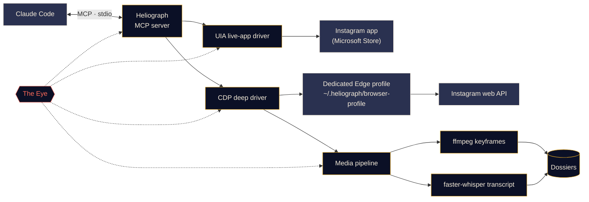

<p align="center">
  
</p>

<p align="center">
  <a href="#quick-start"></a>
  <a href="../../LICENSE"></a>
  <a href="#platform-support"></a>
  <a href="#how-it-works"></a>
  <a href="../../CONTRIBUTING.md#tests"></a>
</p>

<p align="center">
  <a href="../../README.md">English</a> ·
  <a href="README.es.md">Español</a> ·
  <a href="README.fr.md">Français</a> ·
  <a href="README.de.md">Deutsch</a> ·
  <a href="README.pt-BR.md">Português (BR)</a> ·
  <a href="README.it.md">Italiano</a> ·
  <a href="README.ru.md">Русский</a> ·
  <a href="README.tr.md">Türkçe</a> ·
  <a href="README.ar.md">العربية</a> ·
  <a href="README.hi.md">हिन्दी</a> ·
  <b>简体中文</b> ·
  <a href="README.ja.md">日本語</a> ·
  <a href="README.ko.md">한국어</a>
</p>

> 本文为译文，以 [英文 README](../../README.md) 为准；如有出入，请以英文版为准。

---

**Heliograph** 通过 [Claude Code](https://docs.anthropic.com/en/docs/claude-code) 和一个 MCP 服务器，把 Claude 连接到**你自己设备上的你自己的 Instagram**。Claude 可以读取你所看到的内容、浏览你的收藏夹，并把 Reels 转换成结构化、可检索的档案——一切都在本地完成，每一个写操作都由你掌控。

> **为什么叫"Heliograph"？** 人类历史上的第一张照片就是一张*日光蚀刻照片*（heliograph，涅普斯，19 世纪 20 年代）。Heliograph 也是一种日光信号器：用镜子把阳光闪烁着传向远方。既是相机，也是桥梁——这正是本项目的写照。

> [!NOTE]
> **状态：早期开发（v0.1.0）。** 架构已经确定，核心模块正在构建中。下面的每项功能都标注了**可用**、**进行中**或**计划中**——这里没有任何尚未落地为代码的空头承诺。

## 它能做什么

- **让 Claude 像你一样查看和使用 Instagram**——在真实安装的应用中，使用你真实的会话。
- **提取结构化数据**（收藏夹、Reels 元数据、文案、媒体），通过一个独立的专用浏览器配置文件完成，你只需登录一次。
- **把 Reels 变成档案**——视频、关键帧、带时间戳的转写文本和元数据都放在一个文件夹里，供 Claude 阅读和分析。
- **自我观测**——*天眼（The Eye）* 在本地记录每一次工具调用、驱动操作和子进程，出了问题，你或 Claude 都能说清原因。

## 功能

<table>
  <tr>
    <td width="33%" valign="top">
      <h3>实时应用驱动</h3>
      通过 Windows UI Automation 操作 Microsoft Store 版 Instagram 应用：读取屏幕、导航、点赞、收藏、关注、截图。完全无需登录步骤。<br><br><sub><b>进行中</b></sub>
    </td>
    <td width="33%" valign="top">
      <h3>深度驱动</h3>
      通过 Chrome DevTools Protocol 驱动一个专用的 Edge/Chrome 配置文件，在页面内部调用 Instagram 自己的 Web API，获取干净的 JSON、视频链接，并支持批量处理。<br><br><sub><b>进行中</b></sub>
    </td>
    <td width="33%" valign="top">
      <h3>Reels 档案</h3>
      使用 ffmpeg 按场景切换提取关键帧并做感知去重，再加上 faster-whisper 转写，每个 Reel 打包成一份 Markdown 档案。<br><br><sub><b>进行中</b></sub>
    </td>
  </tr>
  <tr>
    <td width="33%" valign="top">
      <h3>MCP 服务器</h3>
      一个 FastMCP 服务器，打开文件夹时通过 <code>.mcp.json</code> 自动注册到 Claude Code。<br><br><sub><b>进行中</b></sub>
    </td>
    <td width="33%" valign="top">
      <h3>天眼</h3>
      本地优先的追踪：span、trace ID、敏感信息脱敏、失败快照、终端实时视图，以及 Claude 可以读取的报告。<br><br><sub><b>可用（早期）</b></sub>
    </td>
    <td width="33%" valign="top">
      <h3>安全护栏</h3>
      写操作需要明确确认，所有操作均有限速，下载仅限 Instagram 的 CDN，任何密码都不会经过 Heliograph。<br><br><sub><b>进行中</b></sub>
    </td>
  </tr>
</table>

<a id="quick-start"></a>
## 快速开始

**你需要：** Python 3.11+（推荐 3.12）、[uv](https://docs.astral.sh/uv/)、[ffmpeg](https://ffmpeg.org/)、Microsoft Edge 或 Google Chrome、[Claude Code](https://docs.anthropic.com/en/docs/claude-code)；如需在 Windows 上使用实时应用驱动，还需要 Microsoft Store 版 Instagram 应用。

```bash
# 1. Clone
git clone https://github.com/DeanT-04/instagram-bridge-with-claude.git heliograph
cd heliograph

# 2. Run the one-command setup
./scripts/setup.ps1        # Windows (PowerShell)
./scripts/setup.sh         # macOS / Linux

# 3. Open Claude Code in the folder
claude
```

Claude Code 会从 `.mcp.json` 发现 Heliograph MCP 服务器，并在第一次使用时请你批准。之后直接提问即可，例如：*"我那个叫 Trading 的收藏夹里有什么？"*

> [!IMPORTANT]
> 安装脚本、`.mcp.json` 和 `heliograph login` 仍在**进行中**。在它们完成之前，你可以手动初始化：
>
> ```bash
> uv sync
> uv run heliograph doctor
> ```
>
> `doctor` 会检查 Instagram 应用、Edge/Chrome、ffmpeg 和操作系统，并告诉你缺少什么。

<a id="how-it-works"></a>
## 工作原理



<details>
<summary><b>为什么要两个驱动？</b></summary>

<br>

Microsoft Store 版 Instagram 应用是一个运行在你日常 Edge 配置文件中的 Edge Web 应用。新版 Edge 拒绝在默认配置文件上开放 DevTools 端口，因此已安装的应用**无法**通过 DevTools 自动化。但它**可以**通过 Windows UI Automation 被完整读取和操作。

| 驱动 | 目标 | 优势 | 用途 |
|---|---|---|---|
| `uia` | 已安装的 Store 应用窗口 | 你真实的应用和会话，无需登录 | 导航、读取屏幕内容、点赞 / 收藏 / 关注、截图 |
| `cdp` | 以应用窗口方式启动的专用 Edge/Chrome 配置文件，DevTools 绑定到 `127.0.0.1` | 来自 Instagram Web API 的结构化 JSON、视频链接、网络抓取 | 收藏夹、Reels 元数据、下载、批量提取 |

在功能重叠的部分，两者实现同一个 `InstagramDriver` 接口。完整设计见 [docs/ARCHITECTURE.md](../ARCHITECTURE.md)。

</details>

<a id="platform-support"></a>
<details>
<summary><b>平台支持</b></summary>

<br>

| | Windows 10/11 | macOS | Linux |
|---|---|---|---|
| 深度驱动（CDP） | 进行中 | 进行中 | 进行中 |
| 媒体流水线与档案 | 进行中 | 进行中 | 进行中 |
| 天眼 | 可用 | 可用 | 可用 |
| 实时应用驱动 | 进行中（UI Automation） | 计划中 | 不适用 |

</details>

## 交易类 Reels 提取

一个示范流程：你把交易相关的 Reels 收藏到一个 Instagram 收藏夹里，Claude 把它们整理成真正可以研读的笔记。

1. 你对 Claude 说：*"从我的收藏夹 'Trading' 里提取交易策略。"*
2. Heliograph 通过深度驱动列出收藏夹内容，并从 Instagram 的 CDN 下载每个 Reel。
3. 媒体流水线按场景切换提取关键帧（图表、交易设置、标注），并生成带时间戳的转写文本。
4. 每个 Reel 生成一份档案；Claude 阅读后整理出入场规则、出场规则、风险管理，以及它无法核实的说法。

```text
dossiers/<reel-id>/
├── meta.json          # author, caption, date, URL, metrics
├── video.mp4
├── transcript.json    # timestamped segments
├── transcript.md
├── frames/*.jpg       # de-duplicated keyframes
└── dossier.md         # everything above, stitched for Claude
```

**状态：** 档案生成器**进行中**；Claude Code 技能 `extract-trading-strategies` **计划中**。

> [!CAUTION]
> Heliograph 只整理创作者说了什么，不判断他们说得对不对。它产出的任何内容都不构成投资建议。

## 天眼

*天眼* 是 Heliograph 内置的、本地优先的可观测性系统，无需任何外部服务。

- 每一次 MCP 工具调用、驱动操作、HTTP 请求以及 ffmpeg/whisper 子进程都会被记录为一个带共享 `trace_id` 的 **span**，因此 Claude 的一次请求可以被端到端追踪。
- 事件写入 `~/.heliograph/eye/events.jsonl`（自动轮转），并配有用于查询的 SQLite 索引。
- **写入前先脱敏**——cookies、`sessionid`、`csrftoken`、认证请求头以及任何类似令牌的字符串。
- 当界面或浏览器步骤失败时，会保存截图以及无障碍树/DOM 快照，并关联到该事件*（进行中）*。
- `heliograph eye` 以彩色实时滚动显示事件，并给出滚动健康指标：错误率、p95 延迟、失败最多的操作。
- `heliograph eye report`——以及 MCP 工具 `eye_report`*（进行中）*——汇总最近的错误，让 Claude 能够自行诊断问题。
- 设置 `LANGFUSE_PUBLIC_KEY` / `LANGFUSE_SECRET_KEY` 后可选择导出到 Langfuse（默认关闭）。

## 安全与隐私

- **一次性手动登录。** 你自己在专用浏览器配置文件中登录一次。Heliograph 从不输入、存储或记录任何密码。
- **实时应用驱动无需登录**——它使用你已经登录的 Instagram 应用。
- **写操作需要确认。** 点赞、关注、评论、私信、发帖和取消收藏都需要在 MCP 层显式传入 `confirm=True`，因此 Claude 必须先征得你的同意。
- **带随机抖动的限速**同时作用于写操作*和*读操作，使使用节奏接近真人。
- **数据仅存本地。** 档案、日志和浏览器配置文件都保存在你电脑的 `~/.heliograph` 下。DevTools 端口绑定到 `127.0.0.1` 上一个随机空闲端口。
- **下载白名单**——仅允许通过 HTTPS 从 Instagram 的 CDN 主机下载。

威胁模型及漏洞报告方式请见 [docs/SECURITY.md](../SECURITY.md)。

## 命令行参考

> 以下是**计划中的接口**。"状态"一列表示目前实际可用的部分。

| 命令 | 作用 | 状态 |
|---|---|---|
| `heliograph setup` | 安装依赖、检查环境并注册 MCP 服务器 | 计划中（占位） |
| `heliograph doctor` | 检测 Instagram 应用、Edge/Chrome、ffmpeg、操作系统和登录状态 | 可用 |
| `heliograph login` | 打开专用浏览器配置文件，供你手动登录一次 | 计划中（占位） |
| `heliograph mcp` | 通过 stdio 运行 MCP 服务器（Claude Code 会替你启动） | 计划中（占位） |
| `heliograph extract <url>` | 为单个 Reel 或帖子生成档案 | 计划中（占位） |
| `heliograph eye` | 天眼实时事件流及健康指标 | 可用 |
| `heliograph eye report` | 近期错误与异常摘要 | 可用 |

<details>
<summary><b>项目结构</b></summary>

<br>

```text
src/heliograph/
├── cli.py              # Typer CLI
├── config.py           # settings (env prefix HELIOGRAPH_), paths under ~/.heliograph
├── errors.py           # HeliographError hierarchy
├── detect/             # environment detection: Store app, browsers, ffmpeg, OS
├── drivers/
│   ├── base.py         # InstagramDriver protocol + shared dataclasses
│   ├── uia/            # Windows UI Automation live-app driver
│   └── cdp/            # browser launcher, CDP session, web-API client
├── instagram/          # models + high-level service
├── media/              # allow-listed download, ffmpeg frames, faster-whisper
├── extract/            # reel -> dossier
├── eye/                # the Eye: spans, sinks, redaction, live view, reports
└── mcp/                # FastMCP server (in progress)
tests/                  # pytest; live tests marked @pytest.mark.live
docs/                   # architecture, security, translations, brand assets
scripts/                # setup.ps1 / setup.sh (in progress)
.claude/skills/         # Claude Code skills (planned)
.mcp.json               # MCP registration for Claude Code (in progress)
```

</details>

## 路线图

- [ ] 一条命令完成安装、通过 `.mcp.json` 注册，以及 `heliograph login`
- [ ] 先提供读取类工具的 MCP 服务器，随后加入需确认的写入类工具
- [ ] `extract-trading-strategies` 技能
- [ ] **多账号**支持（每个账号独立的配置文件与状态）
- [ ] 通过 `adb` 支持 **Android**
- [ ] **macOS** 实时应用驱动（辅助功能 API）

## 参与贡献

欢迎贡献——请参阅 [CONTRIBUTING.md](../../CONTRIBUTING.md) 和[行为准则](../../CODE_OF_CONDUCT.md)。

## 免责声明

Heliograph 是一个独立的开源项目，**与 Instagram 或 Meta Platforms, Inc. 无任何关联，也未获得其认可或赞助。**"Instagram"是其所有者的商标，此处仅用于说明本软件所适配的对象。请**只在你自己的账号上**使用 Heliograph，保持个人用途和接近真人的使用节奏，并遵守 [Instagram 使用条款](https://help.instagram.com/581066165581870)。你需要对自己的使用方式负责。

## 许可证

[MIT](../../LICENSE) © 2026 DeanT-04
