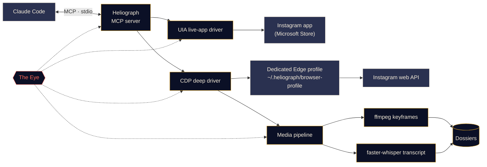

<p align="center">
  
</p>

<p align="center">
  <a href="#quick-start"></a>
  <a href="../../LICENSE"></a>
  <a href="#platform-support"></a>
  <a href="#mcp-tools"></a>
  <a href="../../CONTRIBUTING.md#tests"></a>
</p>

<p align="center">
  <a href="../../README.md">English</a> ·
  <a href="README.es.md">Español</a> ·
  <a href="README.fr.md">Français</a> ·
  <a href="README.de.md">Deutsch</a> ·
  <a href="README.pt-BR.md">Português (BR)</a> ·
  <a href="README.it.md">Italiano</a> ·
  <a href="README.ru.md">Русский</a> ·
  <a href="README.tr.md">Türkçe</a> ·
  <a href="README.ar.md">العربية</a> ·
  <a href="README.hi.md">हिन्दी</a> ·
  <b>简体中文</b> ·
  <a href="README.ja.md">日本語</a> ·
  <a href="README.ko.md">한국어</a>
</p>

> 本文为译文，以 [英文 README](../../README.md) 为准；如有出入，请以英文版为准。

---

**Heliograph** 通过 [Claude Code](https://docs.anthropic.com/en/docs/claude-code) 和一个 MCP 服务器，把 Claude 连接到**你自己设备上的你自己的 Instagram**。Claude 可以读取你所看到的内容、浏览你的收藏夹，并把 Reels 转换成结构化、可检索的档案——一切都在本地完成，每一个写操作都由你掌控。

> **为什么叫"Heliograph"？** 人类历史上的第一张照片就是一张*日光蚀刻照片*（heliograph，涅普斯，19 世纪 20 年代）。Heliograph 也是一种日光信号器：用镜子把阳光闪烁着传向远方。既是相机，也是桥梁——这正是本项目的写照。

> [!NOTE]
> **状态：v0.1.0——尚处早期，但已可用。** 安装脚本、命令行、MCP 服务器（41 个工具）、两个驱动和档案流水线均已发布。读取操作已在 Windows 11 上用真实账号实测通过（当前账号、收藏夹列表、收藏夹内容、搜索、应用角标、状态）。**写操作**（点赞、收藏、关注、评论、私信……）已实现并通过试运行（dry-run）测试，但**尚未在真实账号上验证**。

## 它能做什么

- **让 Claude 像你一样查看和使用 Instagram**——在真实安装的应用中，使用你真实的会话。
- **提取结构化数据**（收藏夹、Reels 元数据、文案、私信、媒体），通过一个专用浏览器配置文件完成，你只需登录一次。
- **把 Reels 变成档案**——视频、关键帧、缩略图总览（contact sheet）、带时间戳的转写文本和元数据都放在一个文件夹里，Claude 既能读，*也能看*。
- **自我观测**——*天眼（The Eye）* 在本地记录每一次工具调用、驱动操作和子进程，出了问题，你或 Claude 都能说清原因。

## 功能

<table>
  <tr>
    <td width="33%" valign="top">
      <h3>实时应用驱动</h3>
      通过 Windows UI Automation 操作 Microsoft Store 版 Instagram 应用：读取屏幕、导航、滚动、截图，以及点击或输入（需你确认）。完全无需登录步骤。<br><br><sub><b>可用 · Windows</b></sub>
    </td>
    <td width="33%" valign="top">
      <h3>深度驱动</h3>
      通过 Chrome DevTools Protocol 驱动一个专用的 Edge/Chrome 配置文件，在页面内部调用 Instagram 自己的 Web API，获取干净的 JSON、视频链接，并支持批量处理。<br><br><sub><b>可用</b></sub>
    </td>
    <td width="33%" valign="top">
      <h3>Reels 档案</h3>
      使用 ffmpeg 按场景切换提取关键帧并做感知去重，生成缩略图总览，再加上 faster-whisper 转写，每个 Reel 打包成一份 Markdown 档案。<br><br><sub><b>可用</b></sub>
    </td>
  </tr>
  <tr>
    <td width="33%" valign="top">
      <h3>MCP 服务器</h3>
      41 个工具，打开文件夹时通过 <code>.mcp.json</code> 自动注册到 Claude Code，另附两个项目技能。<br><br><sub><b>可用</b></sub>
    </td>
    <td width="33%" valign="top">
      <h3>天眼</h3>
      本地优先的追踪：span、trace ID、敏感信息脱敏、失败时的截图与 DOM 快照、终端实时视图，以及 Claude 可以读取的报告。<br><br><sub><b>可用</b></sub>
    </td>
    <td width="33%" valign="top">
      <h3>安全护栏</h3>
      未经确认的写操作只做试运行，所有操作均有限速，URL 和下载都有白名单，任何密码都不会经过 Heliograph。<br><br><sub><b>可用 · 写操作尚未实测</b></sub>
    </td>
  </tr>
</table>

<a id="quick-start"></a>
## 快速开始

**你需要：** Python 3.11+（推荐 3.12）、[ffmpeg](https://ffmpeg.org/)、Microsoft Edge 或 Google Chrome、[Claude Code](https://docs.anthropic.com/en/docs/claude-code)；如需在 Windows 上使用实时应用驱动，还需要 Microsoft Store 版 Instagram 应用。如果没有 [uv](https://docs.astral.sh/uv/)，安装脚本会先询问你，然后替你安装。

```bash
# 1. Clone
git clone https://github.com/DeanT-04/instagram-bridge-with-claude.git heliograph
cd heliograph

# 2. Run the one-command setup
./scripts/setup.ps1        # Windows (PowerShell)
./scripts/setup.sh         # macOS / Linux

# 3. Sign in to Instagram once, yourself, in Heliograph's own browser window
uv run heliograph login

# 4. Open Claude Code in the folder
claude
```

Claude Code 会从 `.mcp.json` 发现 Heliograph MCP 服务器，并在第一次使用时请你批准。安装脚本可以放心重复运行；加 `--yes` 跳过提问，加 `--with-whisper` 预先下载语音模型（约 500 MB）。如有异常，运行 `uv run heliograph doctor`。

## 与 Claude 一起使用

在项目文件夹里直接和 Claude 对话即可。例如：

- *"把我 'Trading strats' 收藏夹里的每个策略都提取出来。"*——端到端运行 `extract-trading-strategies` 技能。
- *"我的私信和通知里有什么新动态？总结一下，不要回复。"*
- *"打开 Instagram 应用，进入 Reels，告诉我屏幕上有什么。"*
- *"找出 @some_creator 最近的五条帖子，并给最新那条起草一条评论。"*——Claude 会先给你看试运行结果；在你同意之前什么都不会发出。

`CLAUDE.md` 是 Claude 的操作手册（安全规则、工具分类、故障排查），[`instagram-control`](../../.claude/skills/instagram-control/SKILL.md) 技能则教它该用哪个工具。

<a id="how-it-works"></a>
## 工作原理



<details>
<summary><b>为什么要两个驱动？</b></summary>

<br>

Microsoft Store 版 Instagram 应用是一个运行在你日常 Edge 配置文件中的 Edge Web 应用。新版 Edge 拒绝在默认配置文件上开放 DevTools 端口，因此已安装的应用**无法**通过 DevTools 自动化。但它**可以**通过 Windows UI Automation 被完整读取和操作。

| 驱动 | 目标 | 优势 | 用途 |
|---|---|---|---|
| `uia` | 已安装的 Store 应用窗口 | 你真实的应用和会话，无需登录 | 导航、读取屏幕内容、截图、经确认的点击 |
| `cdp` | 以应用窗口方式启动的专用 Edge/Chrome 配置文件，DevTools 绑定到 `127.0.0.1` | 来自 Instagram Web API 的结构化 JSON、视频链接、网络抓取 | 收藏夹、信息流、私信、Reels 元数据、下载、批量提取 |

完整设计见 [docs/ARCHITECTURE.md](../ARCHITECTURE.md)。

</details>

<a id="platform-support"></a>
<details>
<summary><b>平台支持</b></summary>

<br>

| | Windows 10/11 | macOS | Linux |
|---|---|---|---|
| 安装脚本 | 已验证 | 可用（未测试） | 可用（未测试） |
| 深度驱动（CDP）与 MCP 服务器 | 已验证 | 可用（未测试） | 可用（未测试） |
| 媒体流水线与档案 | 可用 | 可用（未测试） | 可用（未测试） |
| 天眼 | 可用 | 可用 | 可用 |
| 实时应用驱动（`app_*` 工具） | 已验证 | 计划中 | 不适用 |

</details>

<a id="mcp-tools"></a>
## MCP 工具

共 41 个工具，分为七类。列表类工具接受 `limit` 和 `cursor`；把返回的 `next_cursor` 传回即可翻页。

<details open>
<summary><b>工具参考</b></summary>

<br>

| 类别 | 工具 | 作用 |
|---|---|---|
| **状态** | `heliograph_status` | 健康状况：操作系统、Store 应用、浏览器、ffmpeg、登录状态 |
| | `heliograph_setup_check` | 要让所有工具可用，你还需要做什么 |
| **读取** | `ig_whoami` | 登录在 Heliograph 浏览器配置文件中的账号 |
| | `ig_get_user` | 按用户名获取账号的公开资料 |
| | `ig_user_posts` | 某账号最近的帖子和 Reels |
| | `ig_get_media` | 单条帖子/Reel 的完整详情，含文案和媒体链接 |
| | `ig_comments` | 帖子/Reel 的一级评论 |
| | `ig_search` | 综合搜索：用户、话题标签和地点 |
| | `ig_timeline` | 你的首页信息流 |
| | `ig_reels_feed` | Reels 发现信息流 |
| | `ig_explore` | "发现"网格中的帖子 |
| | `ig_inbox` | 私信会话及最新消息预览 |
| | `ig_thread` | 单个私信会话的消息 |
| | `ig_activity` | 最近通知：点赞、关注、评论、提及 |
| **收藏夹** | `ig_list_collections` | 你的收藏夹列表 |
| | `ig_collection_posts` | 某个收藏夹中的帖子（按名称或 id） |
| | `ig_saved_posts` | 全部已收藏帖子，最新的在前 |
| **提取** | `ig_extract_media` | 为一条帖子/Reel 生成（或复用）档案 |
| | `ig_extract_collection` | 分批为整个收藏夹生成档案 |
| | `ig_read_dossier` | 读取档案的 Markdown、转写文本和元数据 |
| | `ig_view_frames` | 以 Claude 能看到的图片形式返回缩略图总览或关键帧 |
| **实时应用** *（Windows）* | `app_open` | 连接到 Instagram 应用窗口 |
| | `app_snapshot` | 屏幕内容的文本大纲（无障碍树） |
| | `app_screenshot` | 应用窗口截图，即使被其他窗口遮挡 |
| | `app_navigate` | 打开某个版块：首页、搜索、发现、Reels、消息…… |
| | `app_click` | 按 ref 或名称点击元素（写操作需你确认） |
| | `app_scroll` | 按屏滚动（在 Reels 查看器中每页一条 Reel） |
| | `app_type` | 在输入框中输入文字（提交需你确认） |
| | `app_visible_posts` | 当前屏幕上的帖子/Reels 及其按钮 |
| | `app_badges` | 消息和通知的未读数 |
| **写入** *（需确认）* | `ig_like` / `ig_unlike` | 点赞或取消点赞 |
| | `ig_save` / `ig_unsave` | 收藏或取消收藏，可指定收藏夹 |
| | `ig_follow` / `ig_unfollow` | 关注或取消关注某账号 |
| | `ig_comment` | 用你批准的原文发表评论 |
| | `ig_send_dm` | 向某用户或已有会话发送私信 |
| **天眼** | `eye_report` | 健康摘要：错误率、慢操作和失败操作 |
| | `eye_trace` | 一次工具调用的每一步，含回溯信息和产物 |
| | `eye_recent` | 最新事件，可只看错误 |

</details>

## 交易类 Reels 提取

一个示范流程：你把交易相关的 Reels 收藏到一个 Instagram 收藏夹里，Claude 把它们整理成真正可以研读的笔记。

1. 你对 Claude 说：*"把我 'Trading strats' 收藏夹里的每个策略都提取出来。"*
2. Heliograph 通过深度驱动列出收藏夹内容，并从 Instagram 的 CDN 下载每个 Reel。
3. 媒体流水线按场景切换提取关键帧（图表、交易设置、标注），生成缩略图总览和带时间戳的转写文本。
4. Claude 阅读每份档案，用 `ig_view_frames` **查看画面**，为每个 Reel 写一篇笔记——入场规则、出场规则、风险管理、指标参数，以及它无法核实的说法——并附上一个索引。

```text
~/.heliograph/dossiers/<creator>/<code>/
├── meta.json          # author, caption, date, URL, metrics
├── caption.md
├── video.mp4          # or images/NN.jpg for photo posts
├── transcript.json    # timestamped segments + language
├── transcript.md
├── frames/*.jpg       # de-duplicated keyframes (+ frames.json)
├── contact_sheet.jpg  # every keyframe on one image
└── dossier.md         # everything above, stitched for Claude
```

笔记写入项目文件夹中的 `strategies/`，由于属于个人数据，它已被 git 忽略。你也可以不用 Claude 直接生成档案：`uv run heliograph extract --collection "Trading strats"`。

> [!CAUTION]
> Heliograph 只整理创作者说了什么，不判断他们说得对不对。它产出的任何内容都不构成投资建议。

## 天眼

*天眼* 是 Heliograph 内置的、本地优先的可观测性系统，无需任何外部服务。

- 每一次 MCP 工具调用、驱动操作、HTTP 请求以及 ffmpeg/whisper 子进程都会被记录为一个带共享 `trace_id` 的 **span**，因此 Claude 的一次请求可以被端到端追踪。
- 事件写入 `~/.heliograph/eye/events.jsonl`（自动轮转），并配有用于查询的 SQLite 索引。
- **写入前先脱敏**——cookies、`sessionid`、`csrftoken`、认证请求头以及任何类似令牌的字符串。
- 当界面或浏览器步骤失败时，会保存截图以及无障碍树/DOM 快照，并关联到该事件。
- 每个工具错误都会返回一条**提示**和一个 **trace id**；Claude 可以用它调用 `eye_trace`，准确看到哪里出了问题。
- `heliograph eye` 以彩色实时滚动显示事件，并给出滚动健康指标：错误率、p95 延迟、失败最多的操作。`heliograph eye report` 汇总最近的错误。
- 设置 `LANGFUSE_PUBLIC_KEY` / `LANGFUSE_SECRET_KEY` 后可选择导出到 Langfuse（默认关闭）。

## 安全与隐私

- **一次性手动登录。** 你自己在专用浏览器配置文件中登录一次（`heliograph login`）。Heliograph 从不输入、存储或记录任何密码。
- **实时应用驱动无需登录**——它使用你已经登录的 Instagram 应用。
- **写操作默认只试运行。** 点赞、关注、评论、私信、收藏及其反向操作只返回"*将会*发生什么"的描述；只有在你于对话中同意后、以 `confirm=true` 再次调用时才会真正执行。在实时应用中点击操作按钮或提交文字也同样如此。
- **带随机抖动的限速**同时作用于写操作*和*读操作，使使用节奏接近真人。
- **数据仅存本地。** 档案、日志和浏览器配置文件都保存在你电脑的 `~/.heliograph` 下，并使用私有文件权限。DevTools 端口绑定到 `127.0.0.1` 上一个随机空闲端口。
- **严格白名单**——只接受 Instagram 的 URL，下载只允许通过 HTTPS 从 Instagram 的 CDN 主机获取。路径穿越防护覆盖 API 客户端和档案文件夹。

威胁模型及漏洞报告方式请见 [docs/SECURITY.md](../SECURITY.md)。

## 命令行参考

| 命令 | 作用 | 状态 |
|---|---|---|
| `heliograph setup` | 检查环境，提供修复建议（Chromium、Store 应用），可选预下载 Whisper，并提示后续步骤 | 可用 |
| `heliograph doctor` | 检测 Instagram 应用、Edge/Chrome、ffmpeg、操作系统和登录状态（`--json` 输出原始数据） | 可用 |
| `heliograph login` | 打开专用浏览器配置文件，供你手动登录一次 | 可用 |
| `heliograph mcp` | 通过 stdio 运行 MCP 服务器（Claude Code 会替你启动） | 可用 |
| `heliograph extract <url>` | 为单个 Reel/帖子生成档案，或用 `--collection "<名称>"` 处理整个收藏夹 | 可用 |
| `heliograph eye` | 天眼实时事件流及健康指标 | 可用 |
| `heliograph eye report` | 近期错误与异常摘要 | 可用 |

大多数命令支持 `--account <key>`，以使用独立的浏览器配置文件。

<details>
<summary><b>项目结构</b></summary>

<br>

```text
src/heliograph/
├── cli.py              # Typer CLI entry point
├── commands/           # setup, doctor, login, extract
├── config.py           # settings (env prefix HELIOGRAPH_), paths under ~/.heliograph
├── errors.py           # HeliographError hierarchy
├── detect/             # environment detection: Store app, browsers, ffmpeg, OS
├── drivers/
│   ├── base.py         # InstagramDriver protocol + shared dataclasses
│   ├── uia/            # Windows UI Automation live-app driver
│   └── cdp/            # browser launcher, CDP session, web-API client, rate limits
├── instagram/          # models, service, collections, write actions
├── media/              # allow-listed download, ffmpeg frames, faster-whisper
├── extract/            # reel -> dossier
├── eye/                # the Eye: spans, sinks, redaction, live view, reports
└── mcp/                # FastMCP server, tools_*.py per family, runtime, common
tests/                  # pytest; live tests marked @pytest.mark.live
docs/                   # architecture, security, translations, brand assets
scripts/                # setup.ps1 / setup.sh
.claude/skills/         # extract-trading-strategies, instagram-control
.mcp.json               # registers the MCP server with Claude Code
CLAUDE.md               # operating manual for Claude
```

</details>

## 路线图

- [x] 一条命令完成安装、通过 `.mcp.json` 注册，以及 `heliograph login`
- [x] 提供读取、收藏夹、提取、实时应用、写入和天眼工具的 MCP 服务器
- [x] `extract-trading-strategies` 与 `instagram-control` 技能
- [ ] 逐一实测每个写操作
- [ ] Windows、macOS 和 Linux 上的 CI
- [ ] 在 Claude 会话中支持**多账号**（独立配置文件已可通过 `--account` 使用）
- [ ] 通过 `adb` 支持 **Android**
- [ ] **macOS** 实时应用驱动（辅助功能 API）

## 参与贡献

欢迎贡献——请参阅 [CONTRIBUTING.md](../../CONTRIBUTING.md) 和[行为准则](../../CODE_OF_CONDUCT.md)。

## 免责声明

Heliograph 是一个独立的开源项目，**与 Instagram 或 Meta Platforms, Inc. 无任何关联，也未获得其认可或赞助。**"Instagram"是其所有者的商标，此处仅用于说明本软件所适配的对象。请**只在你自己的账号上**使用 Heliograph，保持个人用途和接近真人的使用节奏，并遵守 [Instagram 使用条款](https://help.instagram.com/581066165581870)。你需要对自己的使用方式负责。

## 许可证

[MIT](../../LICENSE) © 2026 DeanT-04
